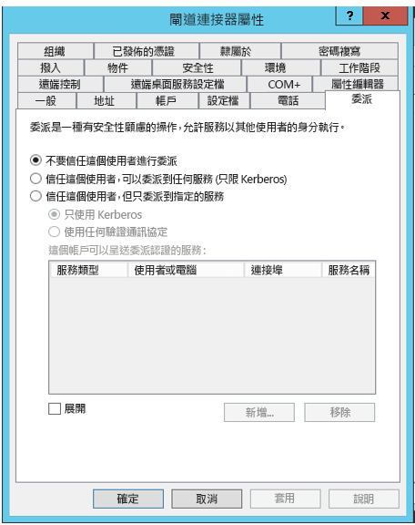
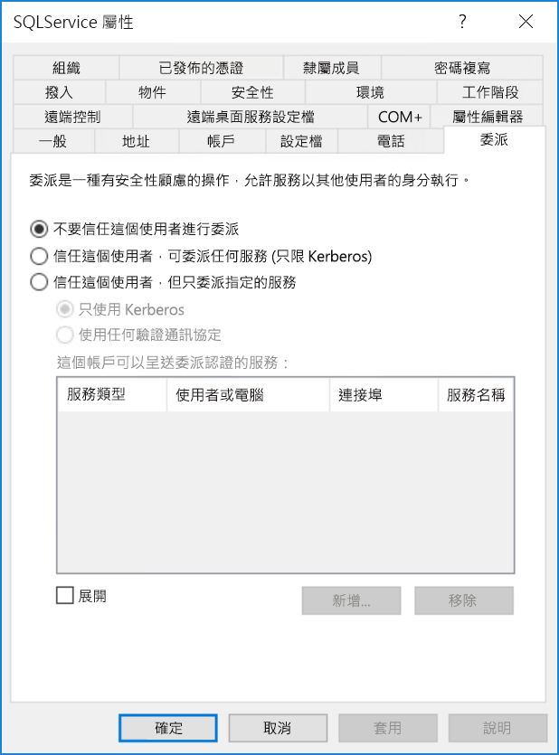
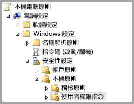
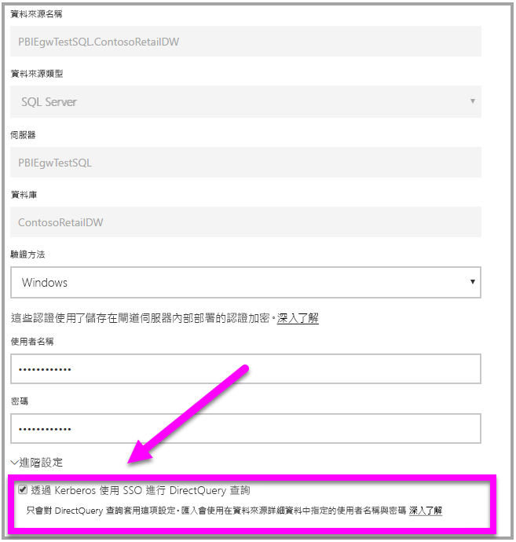

# <a name="use-resource-based-kerberos-for-single-sign-on-sso-from-power-bi-to-on-premises-data-sources"></a>針對從 Power BI 到內部部署資料來源的單一登入 (SSO) 使用以資源為基礎的 Kerberos

使用[以資源為基礎的 Kerberos 限制委派](/windows-server/security/kerberos/kerberos-constrained-delegation-overview)來針對 Windows Server 2012 和更新版本提供單一登入連線能力，允許前端和後端服務位於不同的網域中。 若要達成此目的，後端服務網域必須信任前端服務網域。

## <a name="preparing-for-resource-based-kerberos-constrained-delegation"></a>準備以資源為基礎的 Kerberos 限制委派

必須設定數個項目，Kerberos 限制委派才能正常運作，包括服務帳戶上的「服務主體名稱」  (SPN) 和委派設定。

### <a name="prerequisite-1-operating-system-requirements"></a>必要條件 1：作業系統需求

以資源為基礎的限制委派只能在執行 Windows Server 2012 R2 或 Windows Server 2012 或更高版本的網域控制站上設定。

### <a name="prerequisite-2-install-and-configure-the-on-premises-data-gateway"></a>必要條件 2：安裝及設定內部部署資料閘道

內部部署資料閘道支援就地升級，以及對現有閘道的「設定接管」  功能。

### <a name="prerequisite-3-run-the-gateway-windows-service-as-a-domain-account"></a>必要條件 3：以網域帳戶身分執行閘道 Windows 服務

在標準安裝中，閘道是以電腦本機服務帳戶執行 (具體而言是 NT Service\PBIEgwService  )，例如下圖顯示的內容：


若要啟用 **Kerberos 限制委派，閘道必須以網域帳戶執行，除非 Azure AD 已與本機 Active Directory 進行同步處理 (使用 Azure AD DirSync/Connect)。 如果您需要將帳戶切換為網域帳戶，請參閱[變更閘道服務帳戶](/data-integration/gateway/service-gateway-service-account)。

若已設定 Azure AD DirSync / Connect，且已同步使用者帳戶，閘道服務並不需要在執行階段執行本機 AD 查閱。 您可以針對閘道服務使用本機服務 SID (而不需要網域帳戶)。 這篇文章中概述的 Kerberos 限制委派設定步驟與該設定都相同 (它們只會套用至 Active Directory 中的閘道電腦物件，而不會套用至網域帳戶)。

### <a name="prerequisite-4-have-domain-admin-rights-to-configure-spns-setspn-and-kerberos-constrained-delegation-settings"></a>必要條件 4：具備網域系統管理員權限以設定 SPN (SetSPN) 與 Kerberos 限制委派設定

雖然技術上而言網域系統管理員可以暫時或永久允許其他人有權設定 SPN 和 Kerberos 委派，而不需要網域系統管理員權限，但這不是建議的方法。 在下一節中，我們會詳細說明**必要條件 3** 所需的設定步驟。

## <a name="configuring-kerberos-constrained-delegation-for-the-gateway-and-data-source"></a>針對閘道和資料來源設定 Kerberos 限制委派

若要正確地設定系統，我們需要設定或驗證下列兩個項目：

* 如有需要，請設定閘道服務網域帳戶的 SPN。

* 在閘道服務網域帳戶上設定委派設定。

請注意，您必須是網域系統管理員才能執行這兩個設定步驟。

下列各節會輪番說明這些步驟。

### <a name="configure-an-spn-for-the-gateway-service-account"></a>設定閘道服務帳戶的 SPN

首先，請遵循下列步驟，判斷是否已經為作為閘道服務帳戶使用的網域帳戶建立 SPN：

1. 以網域系統管理員身分啟動 **Active Directory 使用者和電腦**。

1. 以滑鼠右鍵按一下網域，選取 [尋找]  ，然後鍵入閘道服務帳戶的帳戶名稱。

1. 在搜尋結果中，以滑鼠右鍵按一下閘道服務帳戶，然後選取 [屬性]  。

1. 如果 [委派]  索引標籤顯示在 [屬性]  對話方塊中，則表示 SPN 已建立，且您可以往前跳至有關[設定委派設定](#configure-delegation-settings)的下一小節。

    如果 [屬性]  對話方塊上沒有 [委派]  索引標籤，您可以在該帳戶上手動建立 SPN ，這樣會新增 [委派]  索引標籤 (這是設定委派設定最簡單的方式)。 建立 SPN 可以藉由使用隨附於 Windows 的 [setspn 工具](https://technet.microsoft.com/library/cc731241.aspx)來完成 (您需要網域系統管理員權限才能建立 SPN)。

    例如，假設閘道服務帳戶是 “PBIEgwTest\GatewaySvc”，且執行閘道服務的電腦名稱是 **Machine1**。 若要為這個範例中電腦的閘道服務帳戶設定 SPN，您可以執行下列命令：

      

    完成該步驟之後，我們可以繼續設定委派設定。

### <a name="configure-delegation-settings"></a>設定委派設定

在下列步驟中，我們假設內部部署環境具有位於不同網域的兩個機器：閘道電腦和執行 SQL Server 的資料庫伺服器。 基於此範例用途，我們也將假設下列設定和名稱：

* 閘道電腦名稱：**PBIEgwTestGW**
* 閘道服務帳戶：**PBIEgwTestFrontEnd\GatewaySvc** (帳戶顯示名稱：閘道連接器)
* SQL Server 資料來源電腦名稱：**PBIEgwTestSQL**
* SQL Server 資料來源服務帳戶：**PBIEgwTestBackEnd\SQLService**

針對那些範例名稱和設定，請使用下列設定步驟：

1. 使用 **Active Directory 使用者及電腦** (其為 Microsoft Management Console (MMC) 嵌入式管理單元)，在 **PBIEgwTestFront-end** 網域的網域控制站上，確保沒有對閘道服務帳戶套用任何委派設定。

    

1. 使用 **Active Directory 使用者及電腦**，在 **PBIEgwTestBack-end** 網域的網域控制站上，確保沒有對後端服務帳戶套用任何委派設定。 除此之外，確保此帳戶的 "msDS-AllowedToActOnBehalfOfOtherIdentity" 屬性也未設定。 您可以在 [屬性編輯器] 中找到此屬性，如下圖所示：

    

1. 在 **Active Directory 使用者及電腦**中，於 **PBIEgwTestBack-end** 網域的網域控制站上建立群組。 將閘道服務帳戶新增到此群組中，如下圖所示。 該影像顯示名為 _ResourceDelGroup_ 的新群組，而閘道服務帳戶 **GatewaySvc** 已被新增到此群組中。

    

1. 開啟命令提示字元，並在 **PBIEgwTestBack-end** 網域之網域控制站中執行下列命令來更新後端服務帳戶的 msDS-AllowedToActOnBehalfOfOtherIdentity 屬性：

    ```powershell
    $c = Get-ADGroup ResourceDelGroup
    Set-ADUser SQLService -PrincipalsAllowedToDelegateToAccount $c
    ```

1. 您可以在 **Active Directory 使用者及電腦**中，確認更新已反映在後端服務帳戶屬性的 [屬性編輯器] 索引標籤中。

最後，在執行閘道服務的電腦上 (在我們的範例中是 **PBIEgwTestGW**)，閘道服務帳戶必須被授與本機原則「在驗證後模擬用戶端」。 您可以使用群組原則編輯器 (**gpedit**) 來執行/驗證。

1. 在閘道電腦上執行：_gpedit.msc_。

1. 瀏覽至 [本機電腦原則 > 電腦設定 > Windows 設定 > 安全性設定 > 本機原則 > 使用者權限指派]  ，如下圖所示。

    

1. 從 [使用者權限指派]  底下的原則清單中，選取 [在驗證後模擬用戶端]  。

    

1. 以滑鼠右鍵按一下並開啟 [在驗證後模擬用戶端]  的 [屬性]  ，然後檢查帳戶的清單。 它必須包含閘道服務帳戶 (**PBIEgwTestFront-end** **\GatewaySvc**)。

1. 從 [使用者權限指派]  底下的原則清單中，選取 [當成作業系統的一部分 (SeTcbPrivilege)]  。 請確定閘道服務帳戶也包含在帳戶清單中。

1. 重新啟動**內部部署資料閘道**服務處理程序。

## <a name="running-a-power-bi-report"></a>執行 Power BI 報表

完成本文稍早所述的所有設定步驟之後，您可以在 Power BI 中使用 [管理閘道]  頁 面來設定資料來源。 然後在其 [進階設定]  下方啟用 SSO，並將報表和資料集繫結發佈到該資料來源。



此設定在大部分情況下都能運作。 不過，使用 Kerberos 會有不同的設定，根據您的環境而異。 如果仍然無法載入報表，您必須連絡網域系統管理員，以便進一步調查。

## <a name="next-steps"></a>後續步驟

如需**內部部署資料閘道**和 **DirectQuery** 的詳細資訊，請參閱下列資源：

* [什麼是內部部署的資料閘道？](/data-integration/gateway/service-gateway-onprem)
* [Power BI 中的 DirectQuery](desktop-directquery-about.md)
* [DirectQuery 支援的資料來源](desktop-directquery-data-sources.md)
* [DirectQuery 和 SAP BW](desktop-directquery-sap-bw.md)
* [DirectQuery 和 SAP HANA](desktop-directquery-sap-hana.md)
