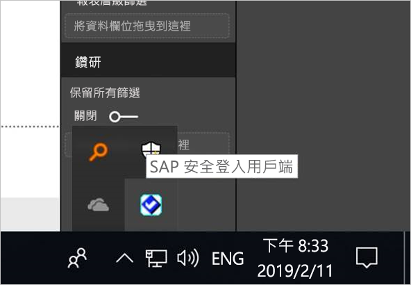
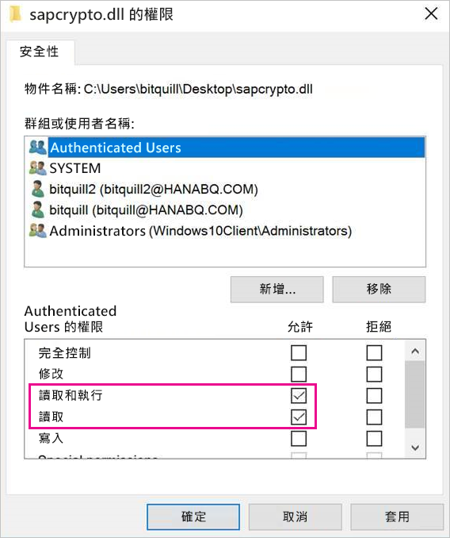
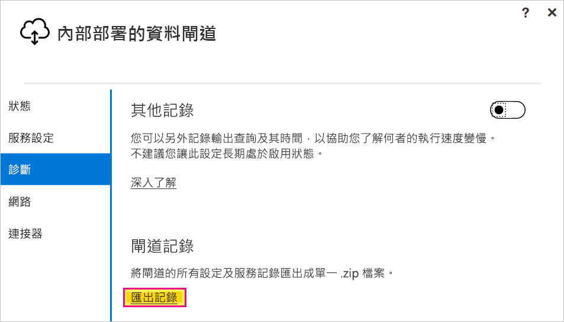

# <a name="use-kerberos-single-sign-on-for-sso-to-sap-bw-using-commoncryptolib-sapcryptodll"></a>使用 CommonCryptoLib (sapcrypto.dll) 將 Kerberos 單一登入用於 SAP BW 的 SSO

本文描述如何使用 CommonCryptoLib (sapcrypto.dll) 設定 SAP BW 資料來源，以從 Power BI 服務啟用 SSO。

> [!NOTE]
> 在嘗試重新整理使用 Kerberos SSO 的 SAP BW 架構報表之前，請先完成本文中的步驟，以及[設定 Kerberos SSO](service-gateway-sso-kerberos.md) 中的步驟。 使用 CommonCryptoLib 作為您的 SNC 程式庫，可讓 SSO 連線到 SAP BW 應用程式伺服器和 SAP BW 訊息伺服器。

## <a name="configure-sap-bw-to-enable-sso-using-commoncryptolib"></a>使用 CommonCryptoLib 來設定 SAP BW 以啟用 SSO

> [!NOTE]
> 內部部署資料閘道是 64 位元軟體，因此需要 64 位元版本的 CommonCryptoLib (sapcrypto.dll) 來執行 BW SSO。 如果您打算在透過閘道嘗試 SSO 連線之前，於 SAP GUI 中測試 SAP BW 伺服器的 SSO 連線 (建議)，則也需要 32 位元版本的 CommonCryptoLib，因為 SAP GUI 是 32 位元軟體。

1. 請確定您的 BW 伺服器已使用 CommonCryptoLib 針對 Kerberos SSO 正確設定。 如果已正確設定，則可透過 SAP GUI 之類已設定為使用 CommonCryptoLib 的 SAP 工具，使用 SSO 來存取 BW 伺服器 (直接或透過 SAP BW 訊息伺服器)。 

   如需設定步驟的詳細資訊，請參閱 [SAP Single Sign-On:Authenticate with Kerberos/SPNEGO](https://blogs.sap.com/2017/07/27/sap-single-sign-on-authenticate-with-kerberosspnego/) (SAP 單一登入：使用 Kerberos/SPNEGO 進行驗證)。 您的 BW 伺服器應該使用 CommonCryptoLib 作為其 SNC 程式庫，並具有以 *CN=* 開頭的 SNC 名稱，例如 *CN=BW1*。 如需 SNC 名稱需求 (具體來說，是 snc/identity/as 參數) 的詳細資訊，請參閱 [Kerberos 設定的 SNC 參數](https://help.sap.com/viewer/df185fd53bb645b1bd99284ee4e4a750/3.0/360534094511490d91b9589d20abb49a.html)。

1. 如果您尚未這麼做，請在已安裝閘道的電腦上安裝 [SAP .NET 連接器](https://support.sap.com/en/product/connectors/msnet.html)的 x64 版本。 
   
   您可以透過嘗試在 Power BI Desktop 中從閘道電腦連線到 BW 伺服器，檢查元件是否已安裝。 如果您無法使用 2.0 實作進行連線，則表示未安裝 .NET 連接器，或該連接器尚未安裝到 GAC。

1. 請確定在安裝閘道的電腦上未執行 SAP 安全登入用戶端 (SLC)。 

   SLC 快取 Kerberos 票證時，可能會干擾閘道能否使用 Kerberos 進行 SSO。 

1. 如果已安裝 SLC，請將其解除安裝，或確定您已結束 SAP 安全登入用戶端。 以滑鼠右鍵按一下系統匣中的圖示，然後依序選取 [登出]  和 [結束]  ，再使用閘道嘗試 SSO 連線。 

   Windows Server 電腦不支援使用 SLC。 如需詳細資訊，請參閱 [SAP Note 2780475](https://launchpad.support.sap.com/#/notes/2780475) (需要 s 使用者)。

   

1. 如果您解除安裝 SLC 或依序選取 [登出]  和 [結束]  ，請開啟 cmd 視窗並輸入 `klist purge` 以清除任何快取的 Kerberos 票證，然後嘗試透過閘道進行 SSO 連線。

1. 從 SAP Launchpad 下載 64 位元的 CommonCryptoLib (sapcrypto.dll) *8.5.25 版或更新版本*，並將它複製到閘道電腦上的資料夾。 在您複製 sapcrypto.dll 的相同目錄中，建立名為 sapcrypto.ini 的檔案，其中包含下列內容：

    ```
    ccl/snc/enable_kerberos_in_client_role = 1
    ```

    .Ini 檔案包含 CommonCryptoLib 在閘道案例中啟用 SSO 所需的設定資訊。

    > [!NOTE]
    > 這些檔案必須儲存在相同的位置；換句話說， _/path/to/sapcrypto/_ 應該同時包含 sapcrypto.ini 和 sapcrypto.dll。

    閘道服務使用者和服務使用者模擬的 Active Directory (AD) 使用者，都需要這兩個檔案的讀取和執行權限。 我們建議將 .ini 和 .dll 檔案的權限授與 [已驗證的使用者] 群組。 基於測試目的，您也可以將這些權限明確授與給閘道服務使用者和您用於測試的 Active Directory 使用者。 在下列螢幕擷取畫面中，我們已將 sapcrypto.dll 的**讀取和執行**權限授與 [已驗證的使用者] 群組：

    

1. 如果您還沒有與您想要 SSO 連線之閘道建立關聯的 SAP BW 資料來源，請在 Power BI 服務的 [管理閘道]  頁面上新增一個。 如果您已經有這類資料來源，請加以編輯： 
    - 如果您想要建立 BW 應用程式伺服器的 SSO 連線，請選擇 [SAP Business Warehouse]  作為 [資料來源類型]  。 
    - 如果您想要建立 BW 訊息伺服器的 SSO 連線，請選取 [SAP Business Warehouse 訊息伺服器]  。

1. 針對 [SNC 程式庫]  ，選取 **SNC\_LIB** 或 **SNC\_LIB\_64** 環境變數，或選取 [自訂]  。 

   - 如果您選取 **SNC\_LIB**，則必須將閘道電腦上 **SNC\_LIB\_64** 環境變數值設定為閘道電腦上 sapcrypto.dll 64 位元複本的絕對路徑。 例如，*C:\Users\Test\Desktop\sapcrypto.dll*。

   - 如果您選擇 [自訂]  ，請將 *sapcrypto.dll* 絕對路徑貼入 [管理閘道]  頁面上出現的 [自訂 SNC 程式庫路徑] 欄位。 

1. 針對 [SNC 合作夥伴名稱]  ，輸入 BW 伺服器的 SNC 名稱。 在 [進階設定]  底下，確定已核取 [透過 Kerberos 使用 SSO 進行 DirectQuery 查詢]  。 如同從 PBI Desktop 建立 Windows 驗證連線一樣，請填入其他欄位。

1. 建立 **CCL\_PROFILE** 系統環境變數，並將其值設定為 sapcrypto.ini 的路徑。

    

    sapcrypto .dll 和 .ini 檔案必須存在於相同的位置。 在上述範例中，sapcrypto.ini 和 sapcrypto.dll 都位於桌上型電腦上。

1. 重新啟動閘道服務。

    

1. [執行 Power BI 報表](service-gateway-sso-kerberos.md#run-a-power-bi-report)

## <a name="troubleshooting"></a>疑難排解

如果無法在 Power BI 服務中重新整理報表，則您可以使用閘道追蹤、CPIC 追蹤和 CommonCryptoLib 追蹤來診斷問題。 由於 CPIC 追蹤和 CommonCryptoLib 是 SAP 產品，因此 Microsoft 無法為其提供支援。

### <a name="gateway-logs"></a>閘道記錄

1. 重現問題。

2. 開啟[閘道應用程式](https://docs.microsoft.com/data-integration/gateway/service-gateway-app)，然後從 [診斷]  索引標籤中選取 [匯出記錄]  。

      

### <a name="cpic-tracing"></a>CPIC 追蹤

1. 若要啟用 CPIC 追蹤，請設定兩個環境變數：**CPIC\_TRACE** 和 **CPIC\_TRACE\_DIR**. 

   第一個變數會設定追蹤層級，第二個變數則會設定追蹤檔案目錄。 此目錄必須是 [已驗證的使用者] 群組成員可以寫入的位置。 
 
2. 將 **CPIC\_TRACE** 設為 *3*，並將 **CPIC\_TRACE\_DIR** 設為您想要寫入追蹤檔案的任何目錄。 例如：

   

3. 重現問題，並確定 **CPIC\_TRACE\_DIR** 包含追蹤檔案。
 
    CPIC 追蹤可以診斷較高層級的問題，例如，載入 sapcrypto.dll 程式庫失敗。 例如，以下程式碼片段是來自 CPIC 追蹤檔案，其中發生 .dll 載入錯誤：

    ```
    [Thr 7228] *** ERROR => DlLoadLib()==DLENOACCESS - LoadLibrary("C:\Users\test\Desktop\sapcrypto.dll")
    Error 5 = "Access is denied." [dlnt.c       255]
    ```

    如果您遇到此類失敗，但您已依照[上一節](#configure-sap-bw-to-enable-sso-using-commoncryptolib)所述設定 sapcrypto.dll 與 sapcrypto.ini 的讀取與執行權限，請嘗試在包含檔案的資料夾設定相同的讀取與執行權限。

    如果您仍然無法載入 .dll，請嘗試開啟[檔案的稽核](/windows/security/threat-protection/auditing/apply-a-basic-audit-policy-on-a-file-or-folder)。 在 Windows 事件檢視器中檢查產生的稽核記錄，可能有助於判斷載入檔案失敗的原因。 尋找由模擬 Active Directory 使用者起始的失敗項目。 例如，針對模擬使用者 `MYDOMAIN\mytestuser`，稽核記錄中的失敗看起來會像這樣：

    ```
    A handle to an object was requested.

    Subject:
        Security ID:        MYDOMAIN\mytestuser
        Account Name:       mytestuser
        Account Domain:     MYDOMAIN
        Logon ID:       0xCF23A8

    Object:
        Object Server:      Security
        Object Type:        File
        Object Name:        <path information>\sapcrypto.dll
        Handle ID:      0x0
        Resource Attributes:    -

    Process Information:
        Process ID:     0x2b4c
        Process Name:       C:\Program Files\On-premises data gateway\Microsoft.Mashup.Container.NetFX45.exe

    Access Request Information:
        Transaction ID:     {00000000-0000-0000-0000-000000000000}
        Accesses:       ReadAttributes
                
    Access Reasons:     ReadAttributes: Not granted
                
    Access Mask:        0x80
    Privileges Used for Access Check:   -
    Restricted SID Count:   0
    ```

### <a name="commoncryptolib-tracing"></a>CommonCryptoLib 追蹤 

1. 將這幾行新增至您稍早建立的 sapcrypto.ini 檔案，以開啟 CommonCryptoLib 追蹤：

    ```
    ccl/trace/level=5
    ccl/trace/directory=<drive>:\logs\sectrace
    ```

2. 將 `ccl/trace/directory` 選項變更為 [已驗證的使用者] 群組成員可以寫入的位置。 

3. 或者，建立新的 .ini 檔案來變更此行為。 在與 sapcrypto.ini 和 sapcrypto.dll 相同的目錄中，建立名為 sectrace.ini 的檔案，其中包含下列內容。 將 `DIRECTORY` 選項取代為您電腦上 [已驗證的使用者] 群組成員可以寫入的位置：

    ```
    LEVEL = 5
    DIRECTORY = <drive>:\logs\sectrace
    ```

4. 重現問題，並確認 **DIRECTORY** 所指向的位置包含追蹤檔案。 

5. 當您完成時，請關閉 CPIC 和 CCL 追蹤。

    如需 CommonCryptoLib 追蹤的詳細資訊，請參閱 [SAP Note 2491573](https://launchpad.support.sap.com/#/notes/2491573) (需要 SAP S 使用者)。

## <a name="next-steps"></a>後續步驟

如需內部部署資料閘道和 DirectQuery 的詳細資訊，請參閱下列資源：

* [什麼是內部部署的資料閘道？](/data-integration/gateway/service-gateway-onprem)
* [Power BI 中的 DirectQuery](desktop-directquery-about.md)
* [DirectQuery 支援的資料來源](desktop-directquery-data-sources.md)
* [DirectQuery 和 SAP BW](desktop-directquery-sap-bw.md)
* [DirectQuery 和 SAP HANA](desktop-directquery-sap-hana.md)
