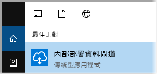
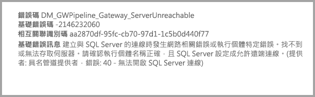

# <a name="use-kerberos-for-single-sign-on-sso-from-power-bi-to-on-premises-data-sources"></a>針對從 Power BI 到內部部署資料來源的單一登入 (SSO) 使用 Kerberos

使用 [Kerberos 限制委派](/windows-server/security/kerberos/kerberos-constrained-delegation-overview)來啟用無縫單一登入 (SSO) 連線。 啟用 SSO 可讓 Power BI 報表和儀表板輕鬆重新整理來自內部部署來源的資料。

## <a name="supported-data-sources"></a>支援的資料來源

我們目前支援下列資料來源︰

* SQL Server
* SAP HANA
* SAP BW
* Teradata
* Spark
* Impala

我們也透過[安全性聲明標記語言 (SAML)](service-gateway-sso-saml.md) 支援 SAP HANA。

### <a name="sap-hana"></a>SAP HANA

若要為 SAP HANA 啟用 SSO，請先遵循下列步驟：

* 請確定 SAP HANA 伺服器執行的是所需最低版本，這取決於 SAP HANA 伺服器的平台層級：
  * [HANA 2 SPS 01 Rev 012.03](https://launchpad.support.sap.com/#/notes/2557386)
  * [HANA 2 SPS 02 Rev 22](https://launchpad.support.sap.com/#/notes/2547324)
  * [HANA 1 SP 12 Rev 122.13](https://launchpad.support.sap.com/#/notes/2528439)
* 在閘道電腦上安裝最新的 SAP HANA ODBC 驅動程式。  最低版本為 2017 年 8 月的 HANA ODBC 2.00.020.00 版。

如需使用 Kerberos 為 SAP HANA 設定 SSO 的詳細資訊，請參閱 "SAP HANA Security Guide" 中的 "[Single Sign-on Using Kerberos](https://help.sap.com/viewer/b3ee5778bc2e4a089d3299b82ec762a7/2.0.03/1885fad82df943c2a1974f5da0eed66d.html)"。 另請參閱該頁面中的連結，尤其是 SAP Note 1837331 – 如何使用 HANA DBSSO Kerberos/Active Directory。

## <a name="prepare-for-kerberos-constrained-delegation"></a>準備 Kerberos 限制委派

您必須設定數個項目，Kerberos 限制委派才能正常運作，包括服務帳戶上的「服務主體名稱」  (SPN) 和委派設定。

### <a name="prerequisite-1-install-and-configure-the-microsoft-on-premises-data-gateway"></a>必要條件 1：安裝及設定 Microsoft 內部部署資料閘道

這個內部部署資料閘道版本支援就地升級，以及承接現有閘道的設定。

### <a name="prerequisite-2-run-the-gateway-windows-service-as-a-domain-account"></a>必要條件 2：以網域帳戶身分執行閘道 Windows 服務

在標準安裝中，閘道是以電腦本機服務帳戶執行 (具體而言是 *NT Service\PBIEgwService*)。


若要啟用 Kerberos 限制委派，閘道必須以網域帳戶執行，除非 Azure Active Directory (Azure AD) 已與本機 Active Directory 執行個體進行同步處理 (使用 Azure AD DirSync/Connect)。 若要切換為網域帳戶，請參閱本文稍後所述的[將閘道切換為網域帳戶](#switch-the-gateway-to-a-domain-account)。

> [!NOTE]
> 若已設定 Azure AD Connect，且已同步使用者帳戶，閘道服務並不需要在執行階段執行本機 Azure AD 查閱。 您可以針對閘道服務使用本機服務 SID (而不需要網域帳戶)。 本文中概述的 Kerberos 限制委派設定步驟與該設定相同。 它們只會套用至 Azure AD 中閘道的電腦物件，而不是網域帳戶。

### <a name="prerequisite-3-have-domain-admin-rights-to-configure-spns-setspn-and-kerberos-constrained-delegation-settings"></a>必要條件 3：具備網域系統管理員權限以設定 SPN (SetSPN) 與 Kerberos 限制委派設定

不建議網域系統管理員暫時或永久允許其他人有權設定 SPN 和 Kerberos 委派，而不需要網域系統管理員權限。 在下一節中，我們會更詳細地說明建議的設定步驟。

## <a name="configure-kerberos-constrained-delegation-for-the-gateway-and-data-source"></a>針對閘道和資料來源設定 Kerberos 限制委派

身為網域系統管理員，請設定閘道服務網域帳戶的 SPN，並在閘道服務網域帳戶上設定委派設定。

### <a name="configure-an-spn-for-the-gateway-service-account"></a>設定閘道服務帳戶的 SPN

首先，判斷 SPN 是否已針對作為閘道服務帳戶使用的網域帳戶建立：

1. 以網域系統管理員身分開啟 [Active Directory 使用者及電腦]  。

2. 以滑鼠右鍵按一下網域，並選取 [尋找]  ，然後輸入閘道服務帳戶的帳戶名稱。

3. 在搜尋結果中，以滑鼠右鍵按一下閘道服務帳戶，然後選取 [屬性]  。

4. 如果 [屬性]  對話方塊中顯示 [委派]  索引標籤，則表示 SPN 已建立。 您可以往前跳至設定委派設定。

    如果 [屬性]  對話方塊中沒有任何 [委派]  索引標籤，您可以在該帳戶上手動建立 SPN。 這會新增 [委派]  索引標籤。使用隨附於 Windows 的 [setspn 工具](https://technet.microsoft.com/library/cc731241.aspx)來完成 (您需要網域系統管理員權限才能建立 SPN)。

    例如，假設閘道服務帳戶是 “PBIEgwTest\GatewaySvc”，執行閘道服務的電腦名稱是 **Machine1**。 若要為這個範例中該電腦的閘道服務帳戶設定 SPN，請執行下列命令：

    

    完成該步驟之後，我們可以繼續設定委派設定。

### <a name="configure-delegation-settings-on-the-gateway-service-account"></a>在閘道服務帳戶上進行委派設定

第二個設定需求是閘道服務帳戶上的委派設定。 您可以使用多個工具來執行這些步驟。 在這裡，我們將使用 [Active Directory 使用者及電腦]，這是 Microsoft Management Console (MMC) 嵌入式管理單元，可用來管理及發佈目錄中的資訊。 根據預設可用於網域控制站。 您也可以透過其他電腦上的 [Windows 功能] 設定來加以啟用。

我們必須使用通訊協定傳輸來設定 Kerberos 限制委派。 使用限制委派，您必須明確指出要委派哪些服務。 例如，只有 SQL Server 或您的 SAP HANA 伺服器會接受來自閘道服務帳戶的委派呼叫。

本節假設您已經為基礎資料來源 (例如，SQL Server、SAP HANA、Teradata 和 Spark) 設定 SPN。 若要了解如何設定這些資料來源伺服器 SPN，請參閱個別資料庫伺服器的技術文件。 您也可以查看 [What SPN does your app require?](https://blogs.msdn.microsoft.com/psssql/2010/06/23/my-kerberos-checklist/) (您的應用程式需要何種 SPN？) 部落格文章。

在下列步驟中，我們假設具有兩個機器的內部部署環境：閘道電腦和執行 SQL Server 的資料庫伺服器。 基於此範例用途，我們也將假設下列設定和名稱：

* 閘道電腦名稱：**PBIEgwTestGW**
* 閘道服務帳戶：**PBIEgwTest\GatewaySvc** (帳戶顯示名稱：閘道連接器)
* SQL Server 資料來源電腦名稱：**PBIEgwTestSQL**
* SQL Server 資料來源服務帳戶：**PBIEgwTest\SQLService**

以下是設定委派設定的方式：

1. 使用網域系統管理員權限，開啟 [Active Directory 使用者及電腦]  。

2. 以滑鼠右鍵按一下閘道服務帳戶 (**PBIEgwTest\GatewaySvc**)，然後選取 [屬性]  。

3. 選取 [委派]  索引標籤。

4. 選取 [Trust this computer for delegation to specified services only] \(信任這部電腦，但只委派指定的服務\)   > [Use any authentication protocol] \(使用任何驗證通訊協定\)  。

6. 在 [Services to which this account can present delegated credentials] \(這個帳戶可以呈送委派認證的服務\)  下方，選取 [新增]  。

7. 在新的對話方塊中，選取 [使用者或電腦]  。

8. 輸入 SQL Server 資料來源的服務帳戶 (**PBIEgwTest\SQLService**)，然後選取 [確定]  。

9. 選取您為資料庫伺服器建立的 SPN。 在我們的範例中，SPN 會以 **MSSQLSvc** 開頭。 如果您為資料庫服務新增了 FQDN 與 NetBIOS SPN，請同時選取兩者。 您可能只會看到一個。

10. 選取 [確定]  。 您現在應該會在清單中看到 SPN。

    或者，您可以選取 [展開]  來顯示 FQDN 和 NetBIOS SPN。 如果選取 [展開]  ，對話方塊將如下所示。 選取 [確定]  。

    ![[Gateway Connector Properties] \( 閘道連接器屬性\) 對話方塊的螢幕擷取畫面](media/service-gateway-sso-kerberos/gateway-connector-properties.png)

最後，在執行閘道服務的電腦上 (在我們的範例中是 **PBIEgwTestGW**)，您必須將本機原則 [Impersonate a client after authentication] \(在驗證後模擬用戶端\)  授與閘道服務帳戶。 您可以使用本機群組原則編輯器 (**gpedit**) 來執行並進行驗證。

1. 在閘道電腦上執行：*gpedit.msc*。

1. 移至 [本機電腦原則]   > [電腦設定]   > [Windows 設定]   > [安全性設定]   > [本機原則]   > [使用者權限指派]  。

    ![[本機電腦原則] 資料夾結構的螢幕擷取畫面](media/service-gateway-sso-kerberos/user-rights-assignment.png)

1. 從 [使用者權限指派]  底下的原則清單中，選取 [Impersonate a client after authentication] \(在驗證後模擬用戶端\)  。

    

    按一下滑鼠右鍵，然後開啟 [屬性]  。 請檢查帳戶的清單。 它必須包含閘道服務帳戶 (**PBIEgwTest\GatewaySvc**)。

1. 從 [使用者權限指派]  底下的原則清單中，選取 [Act as part of the operating system (SeTcbPrivilege)] \(當成作業系統的一部分 (SeTcbPrivilege)\)  。 請確定閘道服務帳戶也包含在帳戶清單中。

1. 重新啟動**內部部署資料閘道**服務處理程序。

如果您使用 SAP HANA，我們建議您遵循這些額外的步驟，可稍微提升效能。

1. 在閘道安裝目錄中尋找並開啟這個設定檔：*Microsoft.PowerBI.DataMovement.Pipeline.GatewayCore.dll.config*。

1. 尋找 *FullDomainResolutionEnabled* 屬性，將其值變更為 *True*。

    ```xml
    <setting name=" FullDomainResolutionEnabled " serializeAs="String">
          <value>True</value>
    </setting>
    ```

## <a name="run-a-power-bi-report"></a>執行 Power BI 報表

完成所有設定步驟之後，您可以在 Power BI 中使用 [Manage Gateway] \(管理閘道\)  頁面來設定資料來源。 然後在 [進階設定]  下方啟用 SSO，並將報表和資料集繫結發佈到該資料來源。

![[進階設定] 選項的螢幕擷取畫面](media/service-gateway-sso-kerberos/advanced-settings.png)

此設定在大部分情況下都能運作。 不過，使用 Kerberos 會有不同的設定，根據您的環境而異。 如果仍然無法載入報表，請連絡網域系統管理員，以便進一步調查。

## <a name="switch-the-gateway-to-a-domain-account"></a>將閘道切換為網域帳戶

如有必要，您可以使用 [內部部署的資料閘道]  使用者介面，將閘道從本機服務帳戶切換為以網域帳戶執行。 其做法如下：

1. 開啟 [內部部署的資料閘道]  設定工具。

   

2. 在主要分頁上選取 [登入]  按鈕，並使用您的 Power BI 帳戶登入。

3. 登入完成之後，選取 [服務設定]  索引標籤。

4. 選取 [變更帳戶]  以啟動引導式逐步解說。

   ![[內部部署的資料閘道] 傳統型應用程式的螢幕擷取畫面，其中已醒目提示 [變更帳戶] 選項](media/service-gateway-sso-kerberos/change-account.png)

## <a name="configure-sap-bw-for-sso"></a>針對 SSO 設定 SAP BW

現在您已了解 Kerberos 如何與閘道搭配使用，您可以針對 SAP Business Warehouse (SAP BW) 設定 SSO。 下列步驟假設您已經[準備好進行 Kerberos 限制委派](#prepare-for-kerberos-constrained-delegation)，如本文稍早所述。

本指南會嘗試儘可能提供廣泛資訊。 如果您已經完成這些步驟的其中一部分，則可以略過它們。 例如，您已為 SAP BW 伺服器建立服務使用者並將 SPN 與其對應，或是已安裝 `gsskrb5` 程式庫。

### <a name="set-up-gsskrb5-on-client-machines-and-the-sap-bw-server"></a>設定用戶端電腦和 SAP BW 伺服器上的 gsskrb5

> [!NOTE]
> SAP 已不再主動支援 `gsskrb5`。 如需詳細資訊，請參閱 [SAP Note 352295](https://launchpad.support.sap.com/#/notes/352295) (SAP 附註 352295)。 另請注意，`gsskrb5` 不允許透過 SSO 從資料閘道連線到 SAP BW 訊息伺服器， 而是只能連線到 SAP BW 應用程式伺服器。 用戶端和伺服器都必須使用 `gsskrb5` 才能透過閘道完成 SSO 連線。 我們現在支援適用於 SAP BW 的 Common Crypto Library (sapcrypto)。

1. 從 [SAP Note 2115486](https://launchpad.support.sap.com/) 下載 `gsskrb5` - `gx64krb5` (需要 SAP 使用者)。 請確定您有至少 1.0.11.x 以上版本的 gsskrb5.dll 和 gx64krb5.dll。

1. 將程式庫放在閘道電腦上可透過閘道執行個體存取的位置中 (如果要使用 SAP 登入測試 SSO 連線，也可以透過 SAP GUI)。

1. 將另一個複本放在 SAP BW 伺服器電腦上可供 SAP BW 伺服器存取的位置中。

1. 在用戶端和伺服器電腦上，將 `SNC\_LIB` 和 `SNC\_LIB\_64` 環境變數分別設定為指向 gsskrb5.dll 和 gx64krb5.dll 的位置。

### <a name="create-a-sap-bw-service-user-and-enable-snc-communication"></a>建立 SAP BW 服務使用者並啟用 SNC 通訊

除了您已完成的閘道設定，還有一些額外的 SAP BW 特定步驟。 文件中的[在閘道服務帳戶上設定委派設定](#configure-delegation-settings-on-the-gateway-service-account)一節，假設您已經為基礎資料來源設定 SPN。 針對 SAP BW 完成此設定：

1. 在 Active Directory 網域控制站伺服器上，為 Active Directory 環境中的 SAP BW 應用程式伺服器建立服務使用者 (一開始只是一般的 Active Directory 使用者)。 然後為其指派 SPN。

    SAP 建議以 `SAP/` 作為 SPN 開頭，但它應該也可以使用其他前置詞，例如 `HTTP/`。 `SAP/` 之後要接什麼取決於您；選項之一是使用 SAP BW 伺服器服務使用者的使用者名稱。 例如，若建立 `BWServiceUser@\<DOMAIN\>` 作為服務使用者，您可以使用 SPN `SAP/BWServiceUser`。 設定 SPN 對應的方法之一是 setspn 命令。 例如，若要在我們剛剛建立的服務使用者上設定 SPN，您將從網域控制站電腦上的命令視窗執行下列命令：`setspn -s SAP/ BWServiceUser DOMAIN\ BWServiceUser`。 如需詳細資訊，請參閱 SAP BW 文件。

1. 授與服務使用者對 SAP BW 應用程式伺服器的存取權：

    1. 在 SAP BW 伺服器電腦上，將服務使用者新增至 SAP BW 伺服器的本機系統管理員群組。 開啟 [電腦管理] 程式，然後按兩下您伺服器的本機系統管理員群組。

        ![[電腦管理] 程式的螢幕擷取畫面](media/service-gateway-sso-kerberos/computer-management.png)

    1. 按兩下本機系統管理員群組，然後選取 [新增]  將您的服務使用者新增至該群組。 請選取 [檢查名稱]  來確保已正確輸入名稱。 選取 [確定]  。

1. 將 SAP BW 伺服器的服務使用者，設定為在 SAP BW 伺服器電腦上啟動 SAP BW 伺服器服務的使用者。

    1. 開啟 [執行]  ，並輸入 "Services.msc"。 尋找與 SAP BW 應用程式伺服器執行個體對應的服務。 以滑鼠右鍵按一下該服務，然後選取 [屬性]  。

        ![服務的螢幕擷取畫面，其中已醒目提示 [屬性]](media/service-gateway-sso-kerberos/server-properties.png)

    1. 切換至 [登入]  索引標籤，然後將使用者變更為您的 SAP BW 服務使用者。 輸入使用者的密碼，然後選取 [確定]  。

1. 在 SAP 登入中登入您的伺服器，並使用 RZ10 交易來設定下列設定檔參數：

    1. 將 snc/identity/as 設定檔參數設定為 p:\<您剛剛建立的 SAP BW 服務使用者\>，例如 p:BWServiceUser@MYDOMAIN.COM。 請注意位於服務使用者 UPN 之前的 p:。 它不是像使用 Common Crypto Lib 作為 SNC 程式庫時的 p:CN=。

    1. 將 snc/gssapi\_lib 設定檔參數設定為 \<伺服器電腦上 gsskrb5.dll/gx64krb5.dll 的路徑 (您將使用的程式庫取決於作業系統位元)\>。 請務必將程式庫放在 SAP BW 應用程式伺服器可以存取的位置。

    1. 另請設定下列其他設定檔參數，根據您的需要來變更值。 請注意，最後五個選項可讓用戶端無需設定 SNC 即可使用 SAP 登入連線至 SAP BW 伺服器。

        | **設定** | **值** |
        | --- | --- |
        | snc/data\_protection/max | 3 |
        | snc/data\_protection/min | 1 |
        | snc/data\_protection/use | 9 |
        | snc/accept\_insecure\_cpic | 1 |
        | snc/accept\_insecure\_gui | 1 |
        | snc/accept\_insecure\_r3int\_rfc | 1 |
        | snc/accept\_insecure\_rfc | 1 |
        | snc/permit\_insecure\_start | 1 |

    1. 將 snc/enable 設定為 1。

1. 設定這些設定檔參數之後，請在伺服器電腦上開啟 SAP 管理主控台並重新啟動 SAP BW 執行個體。 如果伺服器無法啟動，請確認設定檔參數已正確設定。 如需設定檔參數設定的詳細資訊，請參閱 [SAP documentation](https://help.sap.com/saphelp_nw70ehp1/helpdata/en/e6/56f466e99a11d1a5b00000e835363f/frameset.htm) (SAP 文件)。 如果遇到問題，您也可以參考本節稍後的疑難排解資訊。

### <a name="map-a-sap-bw-user-to-an-active-directory-user"></a>將 SAP BW 使用者對應至 Active Directory 使用者

將 Active Directory 使用者對應至 SAP BW 應用程式伺服器使用者，並在 SAP 登入中測試 SSO 連線。

1. 使用 SAP 登入來登入您的 SAP BW 伺服器。 執行交易 SU01。

1. 針對 [使用者]  ，輸入您想要啟用 SSO 連線的 SAP BW 使用者 (在上一個螢幕擷取畫面中我們設定了 BIUSER 的權限)。 選取 SAP 登入視窗左上角附近的**編輯**圖示 (畫筆的影像)。

    ![SAP BW [使用者維護] 畫面的螢幕擷取畫面](media/service-gateway-sso-kerberos/user-maintenance.png)

1. 選取 [SNC]  索引標籤。在 SNC 名稱輸入方塊中，輸入 p:\<您的 Active Directory 使用者\>@\<您的網域\>。 請注意，Active Directory 使用者 UPN 前面必須加上強制的 p:。 您指定的 Active Directory 使用者，應屬於要為其啟用 SAP BW 應用程式伺服器 SSO 存取權的人員或組織。 例如，如果您希望為使用者 [testuser@TESTDOMAIN.COM](mailto:testuser@TESTDOMAIN.COM) 啟用 SSO 存取權，請輸入 p:testuser@TESTDOMAIN.COM。

    ![SAP BW [維護使用者] 畫面的螢幕擷取畫面](media/service-gateway-sso-kerberos/maintain-users.png)

1. 選取畫面左上角附近的**儲存**圖示 (磁碟片的影像)。

### <a name="test-sign-in-by-using-sso"></a>使用 SSO 測試登入

請確認您可以登入伺服器。 以您剛為其啟用 SSO 存取權的 Active Directory 使用者身分，透過 SSO 使用 SAP 登入。

1. 以您剛為其啟用 SSO 存取權的 Active Directory 使用者身分，登入已安裝 SAP 登入的電腦。 啟動 SAP 登入，並建立新的連線。

1. 在 [Create New System Entry] \(建立新的系統項目\)  畫面中，選取 [User Specified System] \(使用者指定的系統\)   > [下一步]  。

    ![[Create New System Entry] \(建立新的系統項目\) 畫面的螢幕擷取畫面](media/service-gateway-sso-kerberos/new-system-entry.png)

1. 在下一個畫面填入適當的詳細資料，包括應用程式伺服器、執行個體數目以及系統識別碼。 然後選取 [完成]  。

1. 以滑鼠右鍵按一下新連線，然後選取 [屬性]  。 切換至 [網路]  索引標籤。在 [SNC Name] \(SNC 名稱\)  文字方塊中輸入 p:\<SAP BW 服務使用者的 UPN\>，例如 p:BWServiceUser@MYDOMAIN.COM。 然後選取 [確定]  。

    ![[System Entry Properties] \(系統項目屬性\)畫面的螢幕擷取畫面](media/service-gateway-sso-kerberos/system-entry-properties.png)

1. 按兩下您剛才建立的連線，以嘗試與 SAP BW 伺服器建立 SSO 連線。 如果連線成功，請繼續下一個步驟。 如果未成功，請檢閱此文件中先前的步驟，確定這些步驟已正確完成，或檢閱以下的疑難排解一節。 請注意，如果您在此內容中無法透過 SSO 連線至 SAP BW 伺服器，則無法在閘道內容中使用 SSO 連線至 SAP BW 伺服器。

### <a name="troubleshoot-installation-and-connections"></a>針對安裝與連線進行疑難排解

如果您遇到任何問題，請遵循下列步驟針對 SAP 登入中的 gsskrb5 安裝和 SSO 連線進行疑難排解。

- 檢視伺服器記錄檔 (伺服器電腦上的 …work\dev\_w0) 可協助您針對在完成 gsskrb5 安裝步驟時遇到的任何錯誤進行疑難排解。 特別是在設定檔參數變更後無法啟動 SAP BW 伺服器時。

- 如果由於登入失敗而無法啟動 SAP BW 服務，則在設定 SAP BW「啟動為」使用者時可能提供了錯誤的密碼。 以 SAP BW 服務使用者身分登入 Active Directory 環境中的電腦來驗證密碼。

- 如果您收到導致伺服器無法啟動的 SQL 認證相關錯誤，請確認您已授與服務使用者對 SAP BW 資料庫的存取權。

- 您可能會收到下列訊息：「(GSS-API) 指定的目標未知或無法存取」。 這通常表示您指定了錯誤的 SNC 名稱。 請務必在用戶端應用程式中只使用 "p:"，而非 "p:CN =" 或其他任何項目 (除了服務使用者的 UPN 以外)。

- 您可能會收到下列訊息：「(GSS-API) 提供了無效的名稱」。 請確認 "p:" 位於伺服器 SNC 身分識別設定檔參數的值中。

- 您可能會收到下列訊息：「(SNC 錯誤) 無法找到指定的模組」。 這通常是由於 `gsskrb5.dll/gx64krb5.dll` 需要提高權限 (系統管理員權限) 才能存取。

### <a name="add-registry-entries-to-the-gateway-machine"></a>新增登錄項目至閘道電腦

將所需的登錄項目，新增至已安裝閘道的電腦登錄中。 以下是要執行的命令：

1. REG ADD HKLM\SOFTWARE\Wow6432Node\SAP\gsskrb5 /v ForceIniCredOK /t REG\_DWORD /d 1 /f

1. REG ADD HKLM\SOFTWARE\SAP\gsskrb5 /v ForceIniCredOK /t REG\_DWORD /d 1 /f

### <a name="set-configuration-parameters-on-the-gateway-machine"></a>在閘道電腦上設定組態參數

有兩個選項可為設定參數進行設定，其取決於您是否已設定 Azure AD Connect 讓使用者能夠以 Azure AD 使用者身分登入 Power BI 服務。

如果您已設定 Azure AD Connect，請遵循下列步驟。

1. 開啟主要閘道設定檔 `Microsoft.PowerBI.DataMovement.Pipeline.GatewayCore.dll`。 根據預設，這個檔案儲存於 C:\Program Files\On-premises data gateway。

1. 請確定 **FullDomainResolutionEnabled** 屬性設定為 **True**，**SapHanaSsoRemoveDomainEnabled** 設為 **False**。

1. 儲存設定檔。

1. 從 [工作管理員] 的 [服務]  索引標籤中，以滑鼠右鍵按一下該閘道服務，然後選取 [重新啟動]  。

    ![[工作管理員] 之 [服務] 索引標籤的螢幕擷取畫面](media/service-gateway-sso-kerberos/restart-gateway.png)

如果您沒有設定 Azure AD Connect，請針對您想要對應至 Azure AD 使用者的每個 Power BI 服務使用者遵循下列步驟。 下列步驟會以手動方式將 Power BI 服務使用者連結到具備 SAP BW 登入權限的 Active Directory 使用者。

1. 開啟主要閘道設定檔 `Microsoft.PowerBI.DataMovement.Pipeline.GatewayCore.dll`。 根據預設，這個檔案儲存於 C:\Program Files\On-premises data gateway。

1. 將 **ADUserNameLookupProperty** 設定為 `msDS-cloudExtensionAttribute1`，並將 **ADUserNameReplacementProperty** 設定為 `SAMAccountName`。 儲存設定檔。

1. 從 [工作管理員] 的 [服務]  索引標籤中，以滑鼠右鍵按一下該閘道服務，然後選取 [重新啟動]  。

    ![[工作管理員] 之 [服務] 索引標籤的螢幕擷取畫面](media/service-gateway-sso-kerberos/restart-gateway.png)

1. 設定 Active Directory 使用者的 `msDS-cloudExtensionAttribute1` 屬性。 這是您已對應至 SAP BW 使用者的使用者。 將屬性設定為您要為其啟用 Kerberos SSO 的 Power BI 服務使用者。 設定 `msDS-cloudExtensionAttribute1` 屬性的方法之一是使用 [Active Directory Users and Computers] \(Active Directory 使用者及電腦\) MMC 嵌入式管理單元。 (您也可以使用其他方法)。

    1. 以系統管理員使用者身分登入網域控制站電腦。

    1. 在嵌入式管理單元視窗中開啟 [使用者]  資料夾，然後按兩下對應至 SAP BW 使用者的 Active Directory 使用者。

    1. 選取 [屬性編輯器]  索引標籤。

        如果您沒有看到此索引標籤，則需要搜尋如何予以啟用的指引，或使用其他方法來設定該屬性。 選取其中一個屬性並按下 M 鍵，以移至字母 m 開頭的 Active Directory 屬性。 找出 `msDS-cloudExtensionAttribute1` 屬性，然後按兩下該屬性。 以 YourUser@YourDomain 格式，將值設為您用來登入 Power BI 服務的使用者名稱。

    1. 選取 [確定]  。

        ![[字串屬性編輯器] 對話方塊的螢幕擷取畫面](media/service-gateway-sso-kerberos/edit-attribute.png)

    1. 選取 [ **套用**]。 確認已在 [值]  資料行中設定正確的值。

### <a name="add-a-new-sap-bw-application-server-data-source-to-the-power-bi-service"></a>將新的 SAP BW 應用程式伺服器資料來源新增至 Power BI 服務

將 SAP BW 資料來源新增至您的閘道，方法是遵循本文中稍早關於[執行報表](#run-a-power-bi-report)的指示。

1. 在資料來源設定視窗中，輸入應用程式伺服器的 [主機名稱]  、[系統編號]  和 [用戶端識別碼]  ，如同您用來從 Power BI Desktop 登入 SAP BW 伺服器的資訊。 針對 [驗證方法]  ，選取 [Windows]  。

1. 在 [SNC Partner Name] \(SNC 合作夥伴名稱\)  欄位中，輸入 p: \<您對應至 SAP BW 服務使用者的 SPN\>。 例如，如果 SPN 為 SAP/BWServiceUser@MYDOMAIN.COM，您應該在 [SNC 合作夥伴名稱]  欄位中輸入 p:SAP/BWServiceUser@MYDOMAIN.COM。

1. 針對 SNC 程式庫，選取 **SNC\_LIB** 或 **SNC\_LIB\_64**。

1. [使用者名稱]  和 [密碼]  中使用者名稱和密碼應該是具備使用 SSO 登入 SAP BW 伺服器權限的 Active Directory 使用者。 換句話說，這些應該屬於已透過 SU01 交易對應至 SAP BW 使用者的 Active Directory 使用者。 只有在未核取 [Use SSO via Kerberos for DirectQuery queries] \(透過 Kerberos 使用 SSO 進行 DirectQuery 查詢\)  方塊時，才會使用這些認證。

1. 選取 [Use SSO via Kerberos for DirectQuery queries] \(透過 Kerberos 使用 SSO 進行 DirectQuery 查詢)  方塊，然後選取 [套用]  。 如果測試連線不成功，請確認已正確完成先前的安裝和設定步驟。

    閘道一律會使用鍵入認證方式建立與伺服器的測試連線，並執行匯入式報表的排程重新整理。 如果選取 [透過 Kerberos 使用 SSO 進行 DirectQuery 查詢]  ，閘道只會嘗試建立 SSO 連線，而且使用者會存取以直接查詢為基礎的報表或資料集。

### <a name="test-your-setup"></a>測試您的設定

若要測試您的設定，請將 DirectQuery 報表從 Power BI Desktop 發佈到 Power BI 服務。 請確定您已經以 Azure AD 使用者身分，或對應至 Azure AD 使用者 `msDS-cloudExtensionAttribute1` 屬性的使用者身分來登入 Power BI 服務。 如果設定已成功完成，您應該能夠從 Power BI 服務中發佈的資料集建立報表。 您也應該能夠透過報表中的視覺效果提取資料。

### <a name="troubleshoot-gateway-connectivity-issues"></a>針對閘道連線問題進行疑難排解

1. 檢查閘道記錄。 開啟閘道設定應用程式，然後選取 [診斷]   > [匯出記錄]  。 最新錯誤會位在您檢查的任何記錄檔底部。

    ![[內部部署的資料閘道] 應用程式的螢幕擷取畫面，其中已醒目提示 [診斷]](media/service-gateway-sso-kerberos/gateway-diagnostics.png)

1. 開啟 SAP BW 追蹤，並檢閱產生的記錄檔。 有許多不同類型的 SAP BW 追蹤可供使用。 如需詳細資訊，請參閱 SAP 文件。

## <a name="errors-from-an-insufficient-kerberos-configuration"></a>Kerberos 設定不完整的錯誤

如果基礎資料庫伺服器和閘道未針對 Kerberos 限制委派正確設定，您可能會收到下列無法載入資料的錯誤訊息：


與錯誤訊息 (DM_GWPipeline_Gateway_ServerUnreachable) 建立關聯的技術詳細資料看起來可能類似如下：



結果是閘道無法正確模擬來源使用者，且資料庫連線嘗試失敗。

## <a name="next-steps"></a>後續步驟

如需**內部部署資料閘道**和 **DirectQuery** 的詳細資訊，請參閱下列資源：

* [On-premises data gateway (內部部署資料閘道)](service-gateway-onprem.md)
* [Power BI 中的 DirectQuery](desktop-directquery-about.md)
* [DirectQuery 支援的資料來源](desktop-directquery-data-sources.md)
* [DirectQuery 和 SAP BW](desktop-directquery-sap-bw.md)
* [DirectQuery 和 SAP HANA](desktop-directquery-sap-hana.md)
