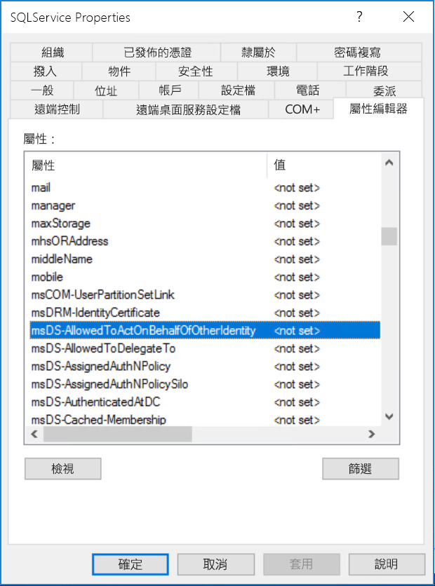

# <a name="configure-kerberos-based-sso-from-power-bi-service-to-on-premises-data-sources"></a>設定從 Power BI 服務到內部部署資料來源的 Kerberos 架構 SSO

使用 [Kerberos 限制委派](/windows-server/security/kerberos/kerberos-constrained-delegation-overview)來啟用無縫 SSO 連線。 啟用 SSO 可讓 Power BI 報表和儀表板輕鬆重新整理來自內部部署來源的資料，同時遵守在這些來源上設定的使用者層級權限。

必須設定數個項目，Kerberos 限制委派才能正常運作，包括服務帳戶上的「服務主體名稱」  (SPN) 和委派設定。

### <a name="prerequisite-1-install-and-configure-the-microsoft-on-premises-data-gateway"></a>必要條件 1：安裝及設定 Microsoft 內部部署資料閘道

內部部署資料閘道支援就地升級，以及對現有閘道的「設定接管」  功能。

### <a name="prerequisite-2-run-the-gateway-windows-service-as-a-domain-account"></a>必要條件 2：以網域帳戶身分執行閘道 Windows 服務

在標準安裝中，閘道是以電腦本機服務帳戶執行 (具體而言是 _NT Service\PBIEgwService_)，如下圖所示：


若要啟用 Kerberos 限制委派，閘道必須以網域帳戶執行，除非 Azure Active Directory (Azure AD) 已與本機 Active Directory 執行個體進行同步處理 (使用 Azure AD DirSync/Connect)。 若要切換為網域帳戶，請參閱[變更閘道服務帳戶](/data-integration/gateway/service-gateway-service-account)。

> [!NOTE]
> 若已設定 Azure AD Connect，且已同步使用者帳戶，則閘道服務並不需要在執行階段執行本機 Azure AD 查閱。 相反地，您可以直接使用閘道服務的本機服務 SID 來完成 Azure Active Directory 中所有必要設定。 本文中概述的 Kerberos 限制委派設定步驟，與 Azure Active Directory 內容中所需的設定步驟相同。 它們只會套用至 Azure AD 中的閘道電腦物件 (以本機服務 SID 識別)，而不是網域帳戶。

### <a name="prerequisite-3-have-domain-admin-rights-to-configure-spns-setspn-and-kerberos-constrained-delegation-settings"></a>必要條件 3：具備網域系統管理員權限以設定 SPN (SetSPN) 與 Kerberos 限制委派設定

我們不建議網域系統管理員暫時或永久將 SPN 和 Kerberos 委派設定的設定權限授與其他人，而不需要該人員具備網域系統管理員權限。 在下一節中，我們會更詳細地說明建議的設定步驟。

## <a name="configure-kerberos-constrained-delegation-for-the-gateway-and-data-source"></a>針對閘道和資料來源設定 Kerberos 限制委派

身為網域系統管理員，請設定閘道服務網域帳戶的 SPN (如有需要)，並在閘道服務網域帳戶上設定委派設定。

### <a name="configure-an-spn-for-the-gateway-service-account"></a>設定閘道服務帳戶的 SPN

首先，判斷 SPN 是否已針對作為閘道服務帳戶使用的網域帳戶建立：

1. 以網域系統管理員身分啟動 **Active Directory 使用者和電腦**。

2. 以滑鼠右鍵按一下網域，並選取 [尋找]  ，然後輸入閘道服務帳戶的帳戶名稱。

3. 在搜尋結果中，以滑鼠右鍵按一下閘道服務帳戶，然後選取 [屬性]  。

4. 如果 [委派]  索引標籤顯示在 [屬性]  對話方塊中，則表示 SPN 已建立，且您可以跳至[決定以資源為基礎或標準的 Kerberos 委派設定](#decide-on-resource-based-or-standard-kerberos-constrained-delegation)。

    如果 [屬性]  對話方塊中沒有任何 [委派]  索引標籤，則您可以在該帳戶上手動建立 SPN 來加以啟用。 使用隨附於 Windows 的 [setspn 工具](https://technet.microsoft.com/library/cc731241.aspx)來完成 (您需要網域系統管理員權限才能建立 SPN)。

    例如，假設閘道服務帳戶是 **Contoso\GatewaySvc**)，且執行閘道服務的電腦名稱是 **MyGatewayMachine**。 若要為閘道服務帳戶設定 SPN，您可以執行下列命令：

    

    您也可以使用 [Active Directory 使用者和電腦] MMC (Microsoft Management Console) 嵌入式管理單元來設定 SPN。

### <a name="decide-on-resource-based-or-standard-kerberos-constrained-delegation"></a>決定以資源為基礎或標準的 Kerberos 限制委派

您可以針對  以資源為基礎的限制 Kerberos 委派或標準的 Kerberos 限制委派來設定委派設定。 如果資料來源屬於與閘道不同的網域，請使用以資源為基礎的委派；但請注意，這種方法需要 Windows Server 2012 或更新版本。 如需這兩個委派方法之間差異的詳細資訊，請參閱[限制 Kerberos 委派概觀頁面](/windows-server/security/kerberos/kerberos-constrained-delegation-overview)。

 一旦決定要使用的方法之後，請繼續進行＜[設定閘道服務帳戶進行標準的 Kerberos 限制委派](#configure-the-gateway-service-account-for-standard-kerberos-constrained-delegation)＞  或＜[設定閘道服務帳戶進行以資源為基礎的 Kerberos 限制委派](#configure-the-gateway-service-account-for-resource-based-kerberos-constrained-delegation)＞  一節。 請勿同時完成這兩個小節。

## <a name="configure-the-gateway-service-account-for-standard-kerberos-constrained-delegation"></a>設定閘道服務帳戶進行標準的 Kerberos 限制委派

> [!NOTE]
> 如果您想要啟用標準的 Kerberos 限制委派，請完成本節中的步驟。 如果您想要啟用以資源為基礎的 Kerberos 限制委派，請完成[＜設定閘道服務帳戶進行以資源為基礎的 Kerberos 限制委派＞](#configure-the-gateway-service-account-for-resource-based-kerberos-constrained-delegation)小節中的步驟。

現在，我們將設定閘道服務帳戶的委派設定。 您可以使用多個工具來執行這些步驟。 在這裡，我們將使用 [Active Directory 使用者及電腦]，這是 Microsoft Management Console (MMC) 嵌入式管理單元，可用來管理及發佈目錄中的資訊。 預設會在網域控制站上提供，但您也可以透過其他電腦上的 [Windows 功能] 設定來加以啟用。

我們必須使用通訊協定傳輸來設定 Kerberos 限制委派。 使用限制委派，您必須明確指出您要允許閘道向其呈現委派認證的服務。 例如，只有 SQL Server 或您的 SAP HANA 伺服器會接受來自閘道服務帳戶的委派呼叫。

本節假設您已經為基礎資料來源 (例如，SQL Server、SAP HANA、SAP BW、Teradata 或 Spark) 設定 SPN。 若要了解如何設定這些資料來源伺服器 SPN，請參閱個別資料庫伺服器的技術文件。 您也可以參閱 [My Kerberos Checklist](https://techcommunity.microsoft.com/t5/SQL-Server-Support/My-Kerberos-Checklist-8230/ba-p/316160) (我的 Kerberos 檢查清單) 部落格文章的 *What SPN does your app require?* (您的應用程式需要何種 SPN？) 標題。

在下列步驟中，我們假設內部部署環境具有位於相同網域的兩部電腦：閘道電腦和執行 SQL Server 且已針對 Kerberos 架構 SSO 設定的資料庫伺服器。 只要已針對 Kerberos 架構單一登入設定資料來源，就可以針對其中一個支援的其他資料來源採用這些步驟。 基於此範例用途，我們也將假設下列設定和名稱：

* Active Directory 網域 (Netbios)：**Contoso**
* 閘道電腦名稱：**MyGatewayMachine**
* 閘道服務帳戶：**Contoso\GatewaySvc**
* SQL Server 資料來源電腦名稱：**TestSQLServer**
* SQL Server 資料來源服務帳戶：**Contoso\SQLService**

以下是設定委派設定的方式：

1. 使用網域系統管理員權限，開啟 [Active Directory 使用者及電腦]  。

2. 以滑鼠右鍵按一下閘道服務帳戶 (**Contoso\GatewaySvc**)，然後選取 [屬性]  。

3. 選取 [委派]  索引標籤。

4. 選取 [Trust this computer for delegation to specified services only] \(信任這部電腦，但只委派指定的服務\)   > [Use any authentication protocol] \(使用任何驗證通訊協定\)  。

5. 在 [Services to which this account can present delegated credentials] \(這個帳戶可以呈送委派認證的服務\)  下方，選取 [新增]  。

6. 在新的對話方塊中，選取 [使用者或電腦]  。

7. 輸入資料來源的服務帳戶，例如，SQL Server 資料來源可能會有類似 **Contoso\SQLService** 的服務帳戶。 此帳戶應該已經設定適當的資料來源 SPN。 新增帳戶之後，請選取 [確定]  。

8. 選取您為資料庫伺服器建立的 SPN。 在我們的範例中，SPN 會以 **MSSQLSvc** 開頭。 如果您為資料庫服務新增了 FQDN 與 NetBIOS SPN，請同時選取兩者。 您可能只會看到一個。

9. 選取 [確定]  。 您現在應該會在閘道服務帳戶可以顯示委派認證的服務清單中看到 SPN。

    ![[Gateway Connector Properties] \( 閘道連接器屬性\) 對話方塊的螢幕擷取畫面](media/service-gateway-sso-kerberos/gateway-connector-properties.png)

現在，請跳至[＜在閘道電腦上授與閘道服務帳戶本機原則權限＞](#grant-the-gateway-service-account-local-policy-rights-on-the-gateway-machine)，以繼續進行設定處理程序。

## <a name="configure-the-gateway-service-account-for-resource-based-kerberos-constrained-delegation"></a>設定閘道服務帳戶進行以資源為基礎的 Kerberos 限制委派

> [!NOTE]
> 如果您想要啟用以資源為基礎的 Kerberos 限制委派，請完成本節中的步驟。 如果您想要啟用標準的 Kerberos 限制委派，請完成[＜設定閘道服務帳戶進行標準的 Kerberos 限制委派＞](#configure-the-gateway-service-account-for-standard-kerberos-constrained-delegation)小節中的步驟。

使用[以資源為基礎的 Kerberos 限制委派](/windows-server/security/kerberos/kerberos-constrained-delegation-overview)來針對 Windows Server 2012 和更新版本提供單一登入連線能力，允許前端和後端服務位於不同的網域中。 若要達成此目的，後端服務網域必須信任前端服務網域。

在下列步驟中，我們假設內部部署環境具有位於不同網域的兩部電腦：閘道電腦和執行 SQL Server 且已針對 Kerberos 架構 SSO 設定的資料庫伺服器。 只要已針對 Kerberos 架構單一登入設定資料來源，就可以針對其中一個支援的其他資料來源採用這些步驟。 基於此範例用途，我們也將假設下列設定和名稱：

* Active Directory 前端網域 (Netbios)：**ContosoFrontEnd**
* Active Directory 後端網域 (Netbios)：**ContosoBackEnd**
* 閘道電腦名稱：**MyGatewayMachine**
* 閘道服務帳戶：**ContosoFrontEnd\GatewaySvc**
* SQL Server 資料來源電腦名稱：**TestSQLServer**
* SQL Server 資料來源服務帳戶：**ContosoBackEnd\SQLService**

針對那些範例名稱和設定，請完成下列設定步驟：

1. 使用 **Active Directory 使用者和電腦** (這是 Microsoft Management Console (MMC) 嵌入式管理單元)，在 **ContosoFrontEnd** 網域的網域控制站上，確保沒有對閘道服務帳戶套用任何委派設定。

    

2. 使用 **Active Directory 使用者和電腦**，在 **ContosoBackEnd** 網域的網域控制站上，確保沒有對後端服務帳戶套用任何委派設定。

    

3. 除此之外，請確保此帳戶的 **msDS-AllowedToActOnBehalfOfOtherIdentity** 屬性也未設定。 您可以在 [屬性編輯器]  中找到此屬性，如下圖所示：

    

4. 在 [Active Directory 使用者和電腦]  中，於 **ContosoBackEnd** 網域的網域控制站上建立群組。 將閘道服務帳戶新增到此群組中，如下圖所示。 該影像顯示稱為 _ResourceDelGroup_ 的新群組，而閘道服務帳戶 **GatewaySvc** 已新增到此群組中。

    

5. 開啟命令提示字元，並在 **ContosoBackEnd** 網域的網域控制站中執行下列命令，來更新後端服務帳戶的 **msDS-AllowedToActOnBehalfOfOtherIdentity** 屬性：

    ```powershell
    $c = Get-ADGroup ResourceDelGroup
    Set-ADUser SQLService -PrincipalsAllowedToDelegateToAccount $c
    ```

6. 您可以在 **Active Directory 使用者及電腦**中，確認更新已反映在後端服務帳戶屬性的 [屬性編輯器] 索引標籤中。 **msDS-AllowedToActOnBehalfOfOtherIdentity** 現在應已設定。

## <a name="grant-the-gateway-service-account-local-policy-rights-on-the-gateway-machine"></a>在閘道電腦上授與閘道服務帳戶本機原則權限

最後，在執行閘道服務的電腦上 (在我們的範例中是 **MyGatewayMachine**)，您必須將本機原則 [在驗證後模擬用戶端]  和 [當成作業系統的一部分 (SeTcbPrivilege)]  授與閘道服務帳戶。 您可以使用本機群組原則編輯器 (**gpedit**) 來執行並驗證此設定。

1. 在閘道電腦上執行：*gpedit.msc*。

2. 前往 [本機電腦原則]  &gt;[電腦設定]  &gt;[Windows 設定]  &gt;[安全性設定]  &gt;[本機原則]  &gt;[使用者權限指派]  ，如下圖所示。

    ![[本機電腦原則] 資料夾結構的螢幕擷取畫面](media/service-gateway-sso-kerberos/user-rights-assignment.png)

3. 從 [使用者權限指派]  底下的原則清單中，選取 [Impersonate a client after authentication] \(在驗證後模擬用戶端\)  。

    

    按一下滑鼠右鍵，然後開啟 [屬性]  。 請檢查帳戶的清單。 它必須包含閘道服務帳戶 (**Contoso\GatewaySvc** 或 **ContosoFrontEnd\GatewaySvc**，視限制委派的類型而定)。

4. 從 [使用者權限指派]  底下的原則清單中，選取 [Act as part of the operating system (SeTcbPrivilege)] \(當成作業系統的一部分 (SeTcbPrivilege)\)  。 請確定閘道服務帳戶也包含在帳戶清單中。

5. 重新啟動**內部部署資料閘道**服務處理程序。

### <a name="set-user-mapping-configuration-parameters-on-the-gateway-machine-if-required"></a>視需要在閘道電腦上設定使用者對應設定參數

如果您沒有設定 Azure AD Connect，請遵循下列步驟，將 Power BI 服務使用者對應至本機 Azure AD 使用者。 以這種方式對應的每個 Active Directory 使用者，都必須具有資料來源的 SSO 權限。 如需詳細資訊，請觀看這個 [Guy in a Cube 影片](https://www.youtube.com/watch?v=NG05PG9aiRw)。

1. 開啟主要閘道設定檔 `Microsoft.PowerBI.DataMovement.Pipeline.GatewayCore.dll`。 根據預設，這個檔案儲存於 C:\Program Files\On-premises data gateway。

1. 將 **ADUserNameLookupProperty** 設定為未使用的 Active Directory 屬性。 我們假設在接下來的步驟中會使用 `msDS-cloudExtensionAttribute1`，但此屬性只適用於 Windows Server 2012 和更新版本。 將 **ADUserNameReplacementProperty** 設定為 `SAMAccountName`。 儲存設定檔。

1. 從 [工作管理員] 的 [服務]  索引標籤中，以滑鼠右鍵按一下該閘道服務，然後選取 [重新啟動]  。

    ![[工作管理員] 之 [服務] 索引標籤的螢幕擷取畫面](media/service-gateway-sso-kerberos/restart-gateway.png)

1. 針對您想要為其啟用 Kerberos SSO 的每個 Power BI 服務使用者，將本機 Active Directory 使用者 (具有資料來源的 SSO 權限) 的 `msDS-cloudExtensionAttribute1` 屬性設定為 Power BI 服務使用者的完整使用者名稱 (例如 UPN)。 例如，若您以 `test@contoso.com` 的身分登入 Power BI 服務，且想要將此使用者對應至具有 SSO 權限的本機 Active Directory 使用者 (例如 `test@LOCALDOMAIN.COM`)，請將 `test@LOCALDOMAIN.COM` 的 `msDS-cloudExtensionAttribute1` 屬性設定為 `test@contoso.com`。

    您可以使用 [Active Directory 使用者和電腦] Microsoft Management Console (MMC) 嵌入式管理單元來設定 `msDS-cloudExtensionAttribute1`：
    
    1. 以網域系統管理員身分啟動 Active Directory 使用者和電腦。
    
    1. 以滑鼠右鍵按一下網域，選取 [尋找]，然後鍵入您要對應至的本機 Active Directory 使用者帳戶名稱。
    
    1. 選取 [屬性編輯器]  索引標籤。
    
        找出 `msDS-cloudExtensionAttribute1` 屬性，然後按兩下該屬性。 將值設為您用來登入 Power BI 服務的使用者完整使用者名稱 (例如 UPN)。
    
    1. 選取 [確定]  。
    
        ![[字串屬性編輯器] 對話方塊的螢幕擷取畫面](media/service-gateway-sso-kerberos/edit-attribute.png)
    
    1. 選取 [ **套用**]。 確認已在 [值]  資料行中設定正確的值。

## <a name="complete-data-source-specific-configuration-steps"></a>完成資料來源特定的設定步驟

SAP HANA 和 SAP BW 在您可以透過閘道建立這些資料來源的 SSO 連線之前，有其他需要符合的資料來源特定設定需求和必要條件。 如需詳細資料，請參閱 [SAP HANA 設定頁面](service-gateway-sso-kerberos-sap-hana.md)和 [SAP BW - CommonCryptoLib (sapcrypto.dll) 設定頁面](service-gateway-sso-kerberos-sap-bw-commoncryptolib.md)。 您也可以[使用 gx64krb5 SNC 程式庫設定 SAP BW 以供使用](service-gateway-sso-kerberos-sap-bw-gx64krb.md)，但 Microsoft 不建議您使用此程式庫，因為 SAP 已不再支援該程式庫。 您應該使用 CommonCryptoLib 或  gx64krb5 作為 SNC 程式庫。 請勿同時完成這兩個程式庫的設定步驟。

> [!NOTE]
> 其他 SNC 程式庫也適用於 BW SSO，但 Microsoft 並未正式支援這些程式庫。

## <a name="run-a-power-bi-report"></a>執行 Power BI 報表

完成所有設定步驟之後，就可以在 Power BI 中使用 [管理閘道]  頁面來設定您將用於 SSO 的資料來源。 如果您有多個閘道，請務必選取為 Kerberos SSO 設定的閘道。 然後，在資料來源的 [進階設定]  底下，確定已選取 [透過 Kerberos 使用 SSO 進行 DirectQuery 查詢]  。

![[進階設定] 選項的螢幕擷取畫面](media/service-gateway-sso-kerberos/advanced-settings.png)

 從 Power BI Desktop 發佈**以 DirectQuery 為基礎**的報表。 此報表必須使用可供使用者存取的資料，此使用者已對應到登入 Power BI 服務的 (Azure) Active Directory 使用者。 因為重新整理的運作方式，所以您必須使用 DirectQuery 而不是匯入。 重新整理以匯入為基礎的報表時，閘道會使用您建立資料來源時，在 [使用者名稱]  和 [密碼]  欄位輸入的認證。 換句話說，**不會**使用 Kerberos SSO。 此外，在發佈時，如果您有多個閘道，請務必選取為 SSO 設定的閘道。 在 Power BI 服務中，您現在應該可以重新整理報表，或根據已發佈的資料集建立新報表。

此設定在大部分情況下都能運作。 不過，使用 Kerberos 會有不同的設定，根據您的環境而異。 如果仍然無法載入報表，請連絡網域系統管理員，以便進一步調查。 如果您的資料來源是 SAP BW，視選擇的 SNC 程式庫而定，您也可以參閱適用於 [CommonCryptoLib](service-gateway-sso-kerberos-sap-bw-commoncryptolib.md#troubleshooting) 和 [gx64krb5/gsskrb5](service-gateway-sso-kerberos-sap-bw-gx64krb.md#troubleshooting) 之資料來源特定設定頁面的疑難排解章節。

## <a name="next-steps"></a>後續步驟

如需**內部部署資料閘道**和 **DirectQuery** 的詳細資訊，請參閱下列資源：

* [什麼是內部部署的資料閘道？](/data-integration/gateway/service-gateway-onprem)
* [Power BI 中的 DirectQuery](desktop-directquery-about.md)
* [DirectQuery 支援的資料來源](desktop-directquery-data-sources.md)
* [DirectQuery 和 SAP BW](desktop-directquery-sap-bw.md)
* [DirectQuery 和 SAP HANA](desktop-directquery-sap-hana.md)
