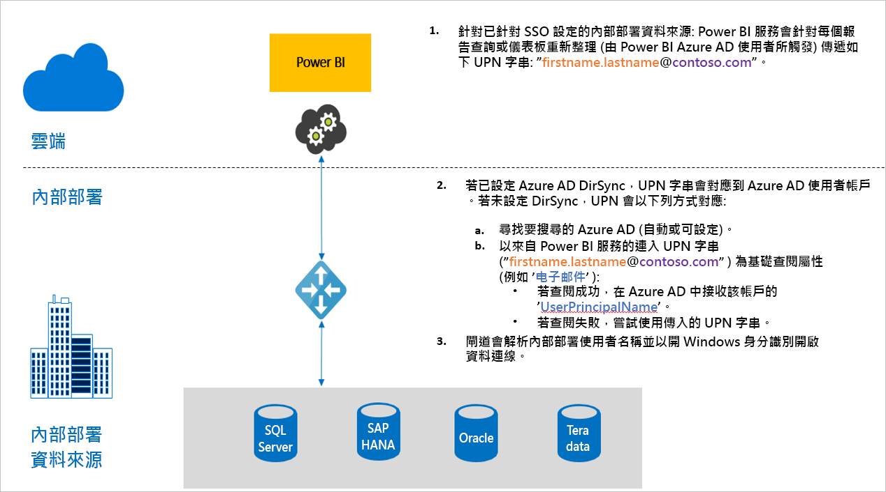

# Power BI 中閘道的單一登入 (SSO) 概觀

您可以藉由設定內部部署資料閘道，以取得順暢的單一登入連線，讓 Power BI 報表和儀表板能夠從內部部署資料進行即時更新。 您可以選擇使用 [Kerberos](service-gateway-sso-kerberos.md) 限制委派或安全性聲明標記語言 ([SAML](service-gateway-sso-saml.md)) 來設定閘道。 內部部署資料閘道會使用可連線到內部部署資料來源的 [DirectQuery](desktop-directquery-about.md) 或重新整理，以支援 SSO。 

Power BI 支援下列資料來源：

* SQL Server (Kerberos)
* SAP HANA (Kerberos 和 SAML)
* SAP BW 應用程式伺服器 (Kerberos)
* SAP BW 訊息伺服器 (Kerberos) - 公開預覽
* Oracle (Kerberos) - 公開預覽
* Teradata (Kerberos)
* Spark (Kerberos)
* Impala (Kerberos)

我們目前不支援 [M-extensions](https://github.com/microsoft/DataConnectors/blob/master/docs/m-extensions.md) 的 SSO。

當使用者與 Power BI 服務中的 DirectQuery 報表互動時，每個交叉篩選、配量、排序和報表編輯作業都可能會導致查詢針對基礎內部部署資料來源即時執行。 當您針對資料來源設定 SSO 時，查詢會在使用者用來與 Power BI 互動的身分識別下執行 (亦即，透過 Web 體驗或 Power BI 行動裝置應用程式)。 因此，每位使用者都能明確看到其在基礎資料來源中具有權限的資料。 

您也可以設定報表 (其在 Power BI 服務中設定為重新整理)，以使用 SSO。 當您為此資料來源設定 SSO 時，查詢會在 Power BI 內資料集擁有者的身分識別下執行。 因此，會根據資料集擁有者在基礎資料來源上的權限進行重新整理。 使用 SSO 進行重新整理目前僅適用於使用 [Kerberos](service-gateway-sso-kerberos.md) 限制委派的資料來源 

## 執行 SSO 時的查詢步驟

使用 SSO 執行的查詢包含三個步驟，如下圖所示。

以下是關於每個步驟的其他詳細資料：

1. Power BI 服務在傳送查詢要求到設定的閘道時，會針對每個查詢包含「使用者主體名稱」  (UPN)，這是使用者目前登入 Power BI 服務的完整使用者名稱。

2. 閘道必須將 Azure Active Directory UPN 對應至本機 Active Directory 身分識別：

   a. 如果已設定 Azure AD DirSync (也稱為「Azure AD Connect」  )，則閘道中的對應功能會自動運作。

   b.  否則，閘道可以對本機 Active Directory 網域執行查閱，以查閱 Azure AD UPN 並將其對應至本機 AD 使用者。

3. 閘道服務處理序會模擬對應的本機使用者，開啟與基礎資料庫的連線，然後傳送查詢。 您不需要在與資料庫相同的電腦上安裝閘道。

## 後續步驟

現在您已了解透過閘道啟用 SSO 的基本概念，請參閱 Kerberos 和 SAML 的詳細資訊：

* [單一登入 (SSO) - Kerberos](service-gateway-sso-kerberos.md)
* [單一登入 (SSO) - SAML](service-gateway-sso-saml.md)
