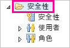
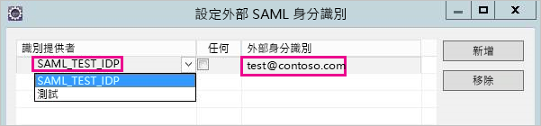
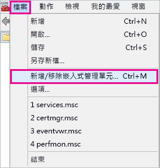

# <a name="use-security-assertion-markup-language-saml-for-single-sign-on-sso-from-power-bi-to-on-premises-data-sources"></a>針對從 Power BI 到內部部署資料來源的單一登入 (SSO)，使用安全性聲明標記語言 (SAML)

使用[安全性聲明標記語言 (SAML)](https://www.onelogin.com/pages/saml) 啟用無縫單一登入連線。 啟用 SSO 可讓 Power BI 報表和儀表板輕鬆重新整理來自內部部署來源的資料。

## <a name="supported-data-sources"></a>支援的資料來源

我們目前支援使用 SAML 的 SAP HANA。 如需使用 SAML 來安裝和設定單一登入 SAP HANA 的詳細資訊，請參閱 SAP HANA 文件中的[從 BI 平台到 HANA 的 SAML SSO](https://wiki.scn.sap.com/wiki/display/SAPHANA/SAML+SSO+for+BI+Platform+to+HANA) 主題。

我們使用 [Kerberos ](service-gateway-sso-kerberos.md) 支援其他資料來源。

請注意，針對 HANA，我們**高度**建議您先啟用加密，再建立 SAML SSO 連線 (即應該設定 HANA 伺服器接受加密的連線，並設定閘道與您的 HANA 伺服器通訊時使用加密)。 根據預設，HANA ODBC 驅動程式**不能**加密 SAML 判斷提示，而未開啟加密之已簽署 SAML 判斷提示會從閘道傳送到「沒有問題」的 HANA 伺服器，很容易被第三方攔截和重複使用。

## <a name="configuring-the-gateway-and-data-source"></a>設定閘道和資料來源

若要使用 SAML，您必須在要啟用 SSO 的 HANA 伺服器和閘道之間建立信任關係，在本案例中作為 SAML 識別提供者 (IdP)。 建立此關係的方式很多，例如將閘道 IdP 的 x509 憑證匯入 HANA 伺服器信任存放區，或讓 HANA 伺服器所信任根憑證授權單位 (CA) 簽署閘道的 X509 憑證。 本指南會在後文中說明第二種方法，但如有更方便的方法，您也可以使用其他方法。

另請注意，雖然本指南使用 OpenSSL 作為 HANA 伺服器的密碼編譯提供者，但 SAP 建議使用 SAP 密碼編譯程式庫 (也稱為 CommonCryptoLib 或 sapcrypto) 而不是 OpenSSL 來完成建立信任關係的設定步驟。 請參閱官方 SAP 文件以取得進一步的資訊。

下列步驟描述如何使用 HANA 伺服器所信任根 CA 簽署閘道 IdP 的 X509 憑證來建立 HANA 伺服器和閘道 IdP 之間信任關係。

1. 建立根 CA 的 X509 憑證和私密金鑰。 例如，以 .pem 格式建立根 CA 的 X509 憑證和私密金鑰：

   ```
   openssl req -new -x509 -newkey rsa:2048 -days 3650 -sha256 -keyout CA_Key.pem -out CA_Cert.pem -extensions v3_ca
   ```
  請確定根 CA 的憑證已適當地受到保護，因為若協力廠商取得了此憑證，便可能會使用它來取得 HANA 伺服器的未經授權存取權限。 

  將憑證 (例如，CA_Cert.pem) 新增至 HANA 伺服器的信任存放區，HANA 伺服器才會信任由您剛才建立之根 CA 所簽署的任何憑證。 檢查 **ssltruststore** 組態設定即可找到您 HANA 伺服器的信任存放區位置。 如已遵循如何設定 OpenSSL 之 SAP 文件的內容執行作業，HANA 伺服器可能已信任您可重複使用的根 CA。 如需詳細資料，請參閱 [How to Configure Open SSL for SAP HANA Studio to SAP HANA Server](https://archive.sap.com/documents/docs/DOC-39571) (如何設定 SAP HANA 伺服器的 Open SSL for SAP HANA Studio)。 如有多部 HANA 伺服器想要啟用 SAML SSO，請確定每部伺服器都信任此根 CA。

1. 建立閘道 IdP 的 X509 憑證。 例如，若要建立憑證簽署要求 (IdP_Req.pem) 和有效期為一年的私用金鑰 (IdP_Key.pem)，請執行下列命令：

   ```
   openssl req -newkey rsa:2048 -days 365 -sha256 -keyout IdP_Key.pem -out IdP_Req.pem -nodes
   ```

   使用已設定 HANA 伺服器信任的根 CA，簽署憑證簽署要求。 例如，若要使用 CA_Cert.pem 和 CA_Key.pem (根 CA 的憑證和金鑰) 簽署 IdP_Req.pem，請執行下列命令：

   ```
   openssl x509 -req -days 365 -in IdP_Req.pem -sha256 -extensions usr_cert -CA CA_Cert.pem -CAkey CA_Key.pem -CAcreateserial -out IdP_Cert.pem
   ```

產生的 IdP 憑證有效期為一年 (請見 -days 選項)。 現在，匯入 HANA Studio 中的 IdP 憑證，建立新的 SAML 識別提供者。

1. 在 SAP HANA Studio 中，請以滑鼠右鍵按一下您的 SAP HANA 伺服器，然後巡覽至 [安全性]   > [開啟安全性主控台]   > [SAML 識別提供者]   > [OpenSSL 密碼編譯程式庫]  。

    

1. 選取 [匯入]  ，巡覽至 IdP_Cert.pem 並匯入它。

1. 在 SAP HANA Studio 中，選取 [安全性]  資料夾。

    

1. 展開 [使用者]  然後選取要對應 Power BI 使用者的目標使用者。

1. 選取 [SAML]  、[設定]  。

    

1. 選取您在步驟 2 中建立的識別提供者。 針對 [外部身分識別]  ，輸入 Power BI 使用者的 UPN (通常是使用者用來登入 Power BI 的電子郵件地址)，然後選取 [新增]  。 請記得，若您設定閘道使用 *ADUserNameReplacementProperty* 設定選項，則您應輸入將取代 Power BI 使用者原始 UPN 的值。 例如，若您將 *ADUserNameReplacementProperty* 設為 **SAMAccountName**，則您應輸入使用者的 **SAMAccountName**。

    

現在您已設定閘道的憑證和身分識別，接下來便可以將憑證轉換為 pfx 格式並將閘道電腦設定為使用憑證。

1. 請執行下列命令來將憑證轉換成 pfx 格式。 請注意，此命令會將 "root" 設為 pfx 檔案的密碼。

    ```
    openssl pkcs12 -export -out samltest.pfx -in IdP_Cert.pem -inkey IdP_Key.pem -passin pass:root -passout pass:root
    ```

1. 將 pfx 檔案複製到閘道電腦：

    1. 按兩下 samltest.pfx，然後選取 [本機電腦]   > [下一步]  。

    1. 輸入密碼，然後選取 [下一步]  。

    1. 依序選取 [將所有憑證放在下列存放區]  、[瀏覽]   > [個人]   > [確定]  。

    1. 選取 [下一步]  ，然後選取 [完成]  。

    

1. 將閘道服務帳戶存取權授與該憑證的私密金鑰：

    1. 在閘道電腦上執行 Microsoft Management Console (MMC)。

        

    1. 在 [檔案]  下方選取 [新增/移除嵌入式管理單元]  。

        

    1. 選取 [憑證]   > [新增]  ，然後選取 [電腦帳戶]   > [下一步]  。

    1. 選取 [本機電腦]   > [完成]   > [確定]  。

    1. 依序展開 [憑證]   > [個人]   > [憑證]  ，並尋找憑證。

    1. 以滑鼠右鍵按一下憑證，並巡覽至 [所有工作]   > [管理私用金鑰]  。

        

    1. 將閘道服務帳戶新增至清單。 根據預設，此帳戶是 **NT SERVICE\PBIEgwService。** 您可以藉由執行  並尋找**內部部署資料閘道服務**，來了解哪個帳戶正在執行閘道服務。

        

最後，請遵循下列步驟來將憑證指紋新增至閘道設定。

1. 執行下列 PowerShell 命令來列出您電腦上的憑證。

    ```powershell
    Get-ChildItem -path cert:\LocalMachine\My
    ```
1. 複製您所建立憑證的指紋。

1. 巡覽至閘道目錄，其預設為 C:\Program Files\On-premises data gateway。

1. 開啟 PowerBI.DataMovement.Pipeline.GatewayCore.dll.config，並尋找 \* SapHanaSAMLCertThumbprint\* 區段。 貼上您複製的憑證指紋。

1. 重新啟動閘道服務。

## <a name="running-a-power-bi-report"></a>執行 Power BI 報表

現在您可以使用 Power BI 中的 [管理閘道]  頁面來設定資料來源，並在其下方的 [進階設定]  啟用 SSO。 然後您可以發佈繫結至該資料來源的報表和資料集。


## <a name="troubleshooting"></a>疑難排解

設定 SSO 後，您可能會在 Power BI 入口網站中看到以下錯誤：「提供的認證無法用於 SapHana 來源。」 此錯誤表示 SAP Hana 拒絕了該 SAML 認證。

伺服器端驗證會追蹤提供的詳細資訊，以針對 SAP HANA 上的認證問題進行疑難排解。 請遵循以下步驟來為您的 SAP Hana 伺服器設定追蹤。

1. 在 SAP Hana 伺服器上，透過執行下列查詢來開啟驗證追蹤。

    ```
    ALTER SYSTEM ALTER CONFIGURATION ('indexserver.ini', 'SYSTEM') set ('trace', 'authentication') = 'debug' with reconfigure 
    ```

1. 重現您遇到的問題。

1. 在 HANA Studio 中，開啟管理主控台，接著前往 [診斷檔案]  索引標籤。

1. 開啟最近的 indexserver 追蹤，然後搜尋 SAMLAuthenticator.cpp。

    您應該就會看到指出根本原因的詳細錯誤訊息，如以下範例所示。

    ```
    [3957]{-1}[-1/-1] 2018-09-11 21:40:23.815797 d Authentication   SAMLAuthenticator.cpp(00091) : Element '{urn:oasis:names:tc:SAML:2.0:assertion}Assertion', attribute 'ID': '123123123123123' is not a valid value of the atomic type 'xs:ID'.
    [3957]{-1}[-1/-1] 2018-09-11 21:40:23.815914 i Authentication   SAMLAuthenticator.cpp(00403) : No valid SAML Assertion or SAML Protocol detected
    ```

1. 完成疑難排解後，透過執行下列查詢來關閉驗證追蹤。

    ```
    ALTER SYSTEM ALTER CONFIGURATION ('indexserver.ini', 'SYSTEM') UNSET ('trace', 'authentication');
    ```

## <a name="next-steps"></a>後續步驟

如需**內部部署資料閘道**和 **DirectQuery** 的詳細資訊，請參閱下列資源：

* [什麼是內部部署的資料閘道？](/data-integration/gateway/service-gateway-onprem)
* [Power BI 中的 DirectQuery](desktop-directquery-about.md)
* [DirectQuery 支援的資料來源](desktop-directquery-data-sources.md)
* [DirectQuery 和 SAP BW](desktop-directquery-sap-bw.md)
* [DirectQuery 和 SAP HANA](desktop-directquery-sap-hana.md)
