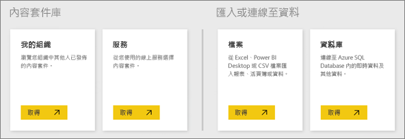

# Power BI 服務的資料來源
資料是 Power BI 的核心。 每當您瀏覽資料、建立圖表與儀表板、利用問與答提出問題時，您看到的所有視覺效果與答案其實都是從資料集取得其基礎資料。 但是，該資料集又來自何處？ 來自資料來源。

在本文中，我們將逐一探討您可以從 Power BI 服務連接的不同資料來源類型。 請記住，您還可以從許多其他資料來源類型取得資料。 但這些類型可能需要先使用 Power BI Desktop 或 Excel 的進階資料查詢與模型化功能。 我們稍後會討論更多有關這方面的資訊。 現在，讓我們看看您可以直接從 Power BI 服務網站連線的不同資料來源類型。

您可以從 Power BI 中的任何資料來源取得資料，方法是按一下 **我的工作區** > **取得資料**.

## 檔案

**Excel** (.xlsx、xlxm) Excel 的獨特之處，在於活頁簿不但可以有您自行輸入工作表的資料，您也可以使用 Power Query (Excel 2016 的 [取得和轉換]) 或 Power Pivot，從外部資料來源查詢及載入資料。 您可以匯入工作表中的資料表中的資料 (資料「必須」在資料表中)，或匯入已載入到資料模型的資料。 如需深入了解，請參閱[從 Excel 取得資料](service-get-data-from-files.md)。

**Power BI Desktop** (.pbix) - 您可以使用 Power BI Desktop，從外部資料來源查詢及載入資料、以量值與關聯性擴充您的資料模型，以及建立報表。 您可以將 Power BI Desktop 檔案匯入 Power BI 網站。 Power BI Desktop 最適合充分了解其資料來源、資料查詢與轉換以及資料模型化概念的更進階使用者。 如需深入了解，請參閱[連接至 Power BI Desktop 中的資料](desktop-connect-to-data.md)。

**逗點分隔值** (.csv) - 檔案是內含多列資料的簡單文字檔。 每個資料列可包含一或多個值，並以逗號分隔每個值。 例如，含有名稱與地址資料的 .csv 可以有多個資料列，其中每個資料列各有名字、姓氏、街道地址、城市、州等值。 您無法將資料匯入 .csv 檔案，但 Excel 等許多應用程式可以將簡單的表格資料另存為 .csv 檔案。

針對 XML 表格 (.xml) 或文字檔 (.txt) 等其他檔案類型，您可以使用 [取得與轉換]，先查詢資料並將該資料轉換及載入 Excel 或 Power BI Desktop 檔案。 然後再將 Excel 或 Power BI Desktop 檔案匯入 Power BI。

您儲存檔案的位置也會形成很大的差異。 商務用 OneDrive 提供最大的彈性以及與 Power BI 的整合。 您也可以將檔案保留在本機磁碟機上，不過如果需要重新整理資料，則涉及一些額外的步驟。 連結文章中將提供更多詳細資料。

## 內容套件

內容套件包含您需要的所有現有資料與報表。 在 Power BI 中，有兩種內容套件類型：來自 Google Analytics (分析)、Marketo 或 Salesforce 等服務的內容套件，以及由您組織中其他使用者所建立及共用的內容套件。

**服務** - 實際上有數十種服務提供 Power BI 內容套件，而且還不斷增加中。 大部分服務都要求您具有帳戶。 如需深入了解，請參閱[連接至服務](service-connect-to-services.md)。

**組織** - 如果您與組織中的其他使用者具有 Power BI Pro 帳戶，則可以建立、共用及使用內容套件。 如需深入了解，請參閱[組織內容套件](service-organizational-content-pack-introduction.md)。

## 資料庫

**雲端資料庫** - 您可以從 Power BI 服務，使用 DirectQuery 即時連接到 Azure SQL Database、Azure SQL 資料倉儲、Azure HD Insight 上的 Spark 及 SQL Server Analysis Services。 從 Power BI 連線到這些資料庫是即時的，換句話說，當您連接到 Azure SQL Database 時，即可開始在 Power BI 中建立報表來探索其資料，每當您分割資料或將其他欄位新增至視覺效果中，就會直接查詢資料庫。 如需深入了解，請參閱 [Azure 和 Power BI](service-azure-and-power-bi.md)。

**內部部署資料庫** - 您可以從 Power BI 服務，直接連接到 SQL Server Analysis Services 表格式模型資料庫。 需要有 Power BI Enterprise Gateway。 如果您不確定如何連接到組織的表格式模型資料庫，請洽詢您的系統管理員或 IT 部門。 如需深入了解，請參閱 [Power BI 中的 SQL Server Analysis 表格式資料](sql-server-analysis-services-tabular-data.md)。

針對您組織中的其他資料庫類型，您必須先使用 Power BI Desktop 或 Excel 來連接及查詢資料，並將該資料載入資料模型。 然後再將您的檔案匯入資料集建立所在的 Power BI。 如果您設定排程重新整理，Power BI 會使用檔案中的連接資訊及您設定的重新整理設定，直接連接到資料來源並查詢更新。 然後再將這些更新載入 Power BI 中的資料集。 如需深入了解，請參閱[連接至 Power BI Desktop 中的資料](desktop-connect-to-data.md)。

## 如果我的資料來自不同的來源，該怎麼辦？
實際上有數百種不同的資料來源可搭配 Power BI 使用。 不過無論您取得資料的來源為何，資料的格式都必須能夠讓 Power BI 用來建立報表與儀表板、利用問與答回答問題及執行其他作業。

有些資料來源的資料是 Power BI 服務現有可用的格式，例如來自 Google Analytics (分析) 與 Twilio 等服務提供者的內容套件。 SQL Server Analysis Services 表格式模型資料庫也是現有的格式。 此外，您可以即時連接到雲端資料庫，例如 Azure SQL Database 與 HDInsight 上的 Spark。

在其他情況下，您可能必須查詢所需的資料並將該資料載入檔案。 例如，假設您在組織伺服器上的資料倉儲資料庫中有物流資料。 在 Power BI 服務中，您無法直接連接到該資料庫並開始瀏覽其資料 (除非是表格式模型資料庫)。 不過，您可以使用 Power BI Desktop 或 Excel 查詢物流資料並將該資料載入資料模型，再儲存為檔案。 然後將該檔案匯入資料集建立所在的 Power BI。

您可能會問：「但是，該資料庫上的物流資料每天在變。 我該如何確定我在 Power BI 中的資料集會重新整理？」Power BI Desktop or Excel 檔案中的連接資訊會連同資料一起匯入資料集。 如果您設定排程重新整理或手動重新整理資料集，Power BI 會使用資料集中的連接資訊以及其他一些設定，直接連接到資料庫、查詢更新並將這些更新載入資料集。 可能需要有 Power BI Gateway 來保護內部部署伺服器與 Power BI 之間的任何資料傳輸。 報表與儀表板中的任何視覺效果都會自動重新整理。

您會發現，雖然您無法直接從 Power BI 服務連接到資料來源，但並不表示您無法將該資料匯入 Power BI。 只需要一些額外步驟及 IT 部門的一些協助，就能辦到。 如需深入了解，請參閱 [Power BI Desktop 中的資料來源](desktop-data-sources.md)。

## 其他一些詳細資料
Power BI 中經常使用資料集與資料來源等詞彙。 這兩個詞彙通常會用來表示相同意義，但實際上卻是兩個相關的不同項目。

「資料集」會在您使用 [取得資料] 連接及匯入來自內容套件、檔案的資料，或連接至即時資料來源時，自動在 Power BI 中建立。 資料集包含資料來源的相關資訊、資料來源認證，並在許多情況下也包含從資料來源複製的資料子集。 在大多數情況下，當您在報表與儀表板中建立視覺效果時，您看到的資料便是來自資料集。

「資料來源」是指資料集內之資料的實際來源處。 例如，Google Analytics (分析) 或 QuickBooks 等線上服務、Azure SQL Database 等雲端資料庫，或您組織中本機電腦或伺服器上的資料庫或檔案。

### 資料重新整理
如果您將檔案儲存在本機磁碟機或組織中某處的磁碟機上，可能需要有 Power BI Gateway 才能重新整理 Power BI 中的資料集。 此外，重新整理時，檔案儲存所在的電腦也必須啟動。 您也可以重新匯入檔案，或使用 [從 Excel 發行] 或 [從 Power BI Desktop 發行]，但這些不是自動化程序。

如果您將檔案儲存在商務用 OneDrive 或 SharePoint - 小組網站，然後將其連接或匯入到 Power BI，您的資料集、報表與儀表板會一律保持在最新狀態。 因為 OneDrive 與 Power BI 都在雲端上，所以 Power BI 可以直接連接到已儲存的檔案，並且約每小時檢查更新一次。 如果發現任何更新，資料集與任何視覺效果都會自動重新整理。

來自服務的內容套件會自動更新。 在大部分情況下會一天更新一次。 您可以手動重新整理，但是否會看到更新的資料則取決於服務提供者。 來自您組織中其他人的內容套件則取決於所使用的資料來源，以及人員建立內容套件設定重新整理的方式。

Azure SQL Database、Azure SQL 資料倉儲與 Azure HDInsight 上的 Spark 是雲端上的資料來源，因此很獨特。 因為 Power BI 服務也是在雲端中，所以 Power BI 可以使用 DirectQuery 即時連接到這些資料來源。 您在 Power BI 中看到的內容一律會同步處理，而不需要設定重新整理。

SQL Server Analysis Services 的獨特之處，在於當您從 Power BI 連接到此服務時，會是類似 Azure 雲端資料庫的即時連線，但資料庫本身則是在您組織的伺服器上。 這種連線需要 Power BI Gateway，通常會由 IT 部門進行設定。

資料重新整理是 Power BI 很重要的一部分，不是本文所能深入探討。 如果您想要徹底了解，請務必查看 [Power BI 的資料重新整理](refresh-data.md)。

## 考量與限制
下列考量和限制適用於 Power BI 服務中使用的所有資料來源。 特定功能有其他適用限制，但下列清單僅適用於整體的 Power BI 服務︰

* **資料集大小限制**：Power BI 服務中每個資料集的限制為 1 GB。
* **資料列限制**：資料集 (不使用 DirectQuery 時) 的資料列數目上限為 20 億，保留三個資料列 (因此可用上限為 1999999997 個資料列)；使用 DirectQuery 時的資料列數目上限是 1 百萬。
* **資料行限制**：資料集允許的資料行數目上限，資料集中所有資料表加起來是 16,000 個資料行。 這適用於 Power BI 服務以及 Power BI Desktop 使用的資料集。 Power BI 在資料集的每份資料表上都使用內部的資料列號碼資料行，這表示資料集所用每份資料表的資料行數目上限是 16,000 減一。

