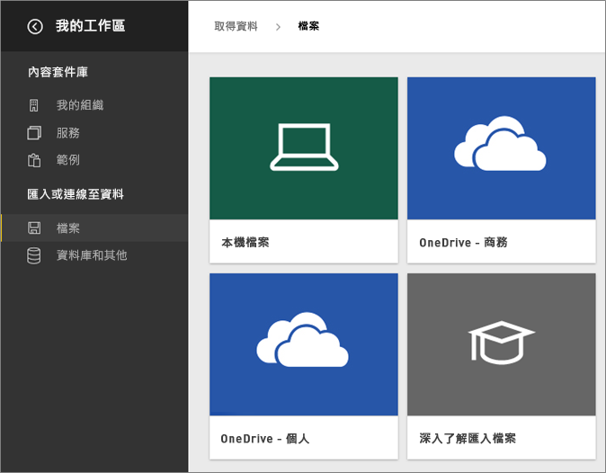
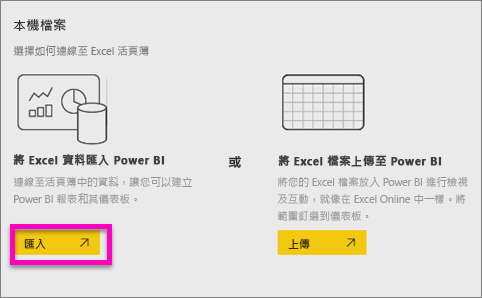
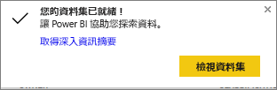
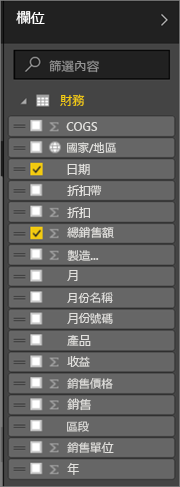
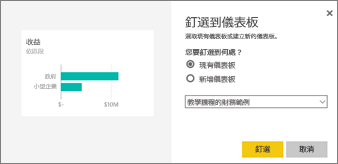

# 開始使用 Power BI 服務
本教學課程可協助您開始使用 ***Power BI 服務***。 若要了解 Power BI 服務如何與其他 Power BI 供應項目相配合，強烈建議您先閱讀[什麼是 Power BI](guided-learning/gettingstarted.yml#step-1)。

Power BI 服務有免費版本和專業版本。 無論您使用哪個版本，請開啟瀏覽器並輸入 www.powerbi.com 以便開始使用。 如果您已註冊，請選取右上角中所看到的 [登入] 連結。 如果您尚未註冊 Power BI 服務，請改為選取 [免費註冊] 連結。

如果您需要 Power BI Desktop 的協助，請參閱[開始使用 Desktop](desktop-getting-started.md). 如果您想要尋求 Power BI Mobile 的協助，請參閱[行動裝置的 Power BI 應用程式](mobile-apps-for-mobile-devices.md)。

> [!TIP]
> 偏好免費自修訓練課程？ [註冊在 EdX 上的資料分析與視覺化課程](http://aka.ms/edxpbi)。

請瀏覽我們在 [YouTube 上的播放清單](https://www.youtube.com/playlist?list=PL1N57mwBHtN0JFoKSR0n-tBkUJHeMP2cP)。 從「Power BI 服務簡介」影片開始是很好的選擇：
> 
> <iframe width="560" height="315" src="https://www.youtube.com/embed/B2vd4MQrz4M" frameborder="0" allowfullscreen></iframe>
> 
> 
> 

Microsoft Power BI 協助您掌握關切資訊的最新狀態。  使用 Power BI 服務，***儀表板***能助您掌握商務脈動。  儀表板顯示的***磚***，可讓您按一下以開啟「報表」來進一步探索。  連接到多個***資料集***，讓所有相關資料集中到一處。 您想要了解構成 Power BI 的建置組塊嗎？  請參閱 [Power BI - 基本概念](service-basic-concepts.md)。

如果 Excel 或 CSV 檔案中有重要的資料，您可以建立 Power BI 儀表板在任何位置掌握其動態，並與他人交流意見。  您訂閱了 Salesforce 之類的 SaaS 應用程式嗎？  預先[連接到 Salesforce](service-connect-to-salesforce.md) 以自動從該資料建立儀表板，或[查看您可以連接的所有其他 SaaS 應用程式](service-get-data.md)。 如果您是組織的一員，請查看是否曾為您發佈過任何的[應用程式](service-create-distribute-apps.md)。

閱讀[取得 Power BI 的資料](service-get-data.md)的所有其他方式.

## 步驟 1：取得資料
本例從 CSV 檔案取得資料。 想遵循本教學課程嗎？ [下載此範例 CSV 檔案](http://go.microsoft.com/fwlink/?LinkID=521962).

1. [登入 Power BI](http://www.powerbi.com/)。 沒有帳戶嗎？ 別擔心，您可以免費註冊。
2. Power BI 會在您的瀏覽器中開啟。 選取左側瀏覽窗格底部的 [取得資料]  。
   
   
3. 選取 [檔案] 。 
   
   
4. 選取 [本機檔案] ，然後瀏覽至電腦上的檔案並選擇 [開啟] 。
   
   
5. 在本教學課程中，我們將選取 [匯入] 以將 Excel 檔案新增為資料集，接著使用該資料集來建立報表和儀表板。  
   
   > [!NOTE]
   > 如果您選取 [上傳]，整個 Excel 活頁簿會上傳至 Power BI，在其中，您可以在 Excel Online 中進行開啟和編輯。
   > 
   > 
   
   
6. 您的資料集就緒時，請選取 [檢視資料集] 以在報表編輯器中進行開啟。 .
   
   > [!TIP]
   > 熟悉報表編輯器的一項好方法為[進行導覽](service-the-report-editor-take-a-tour.md)
   > 
   > 

## 步驟 2：開始探索資料集
現在已經連接到資料，開始深入探索吧。  發現了想要監視的物件時，您可以建立隨時異動更新的儀表板。

1. 選取儀表板上的資料集影像以探索剛剛連接的資料，或在 [資料集] 標題下，選取資料集名稱加以開啟。 這會以空白報表開啟資料集。
   
   
   
   > [!NOTE]
> 探索資料的另一種方式是 **快速深入了解**。  如需詳細資訊，請參閱[深入資訊摘要簡介](service-insights.md)
   > 
   > 
2. 在頁面右側的 [欄位]  清單中，選取要建立視覺效果的欄位。  選取 [總銷售額] 旁的核取方塊，然後按一下 [日期]。
   
   
3. Power BI 分析資料並建立視覺效果。  如果先選取 [日期]  就會看到資料表。  如果先選取 [總銷售額]  就會看到圖表。 切換不同的資料顯示方式。 請選取折線圖選項，嘗試變更成折線圖。
   
   
4. 當您確定了儀表板的視覺效果，請將滑鼠停留在視覺效果上並選取 [釘選] 圖示。  釘選這個視覺效果時，它會儲存到儀表板，讓您一眼就能追蹤最新的值。
   
   
5. 因為這是一份新的報表，您需要先儲存該報表，才可將其視覺效果釘選到儀表板。 為報表命名 (例如「銷售歷史數據」 ) 並選取 [儲存並繼續] 。 
   
   
   
   新的報表會隨即出現在瀏覽窗格的 [報表]  標題下。
6. 將磚釘選至現有的儀表板或新的儀表板上。 
   
   
   
   * **現有儀表板**：從下拉式清單中選取儀表板的名稱。
   * **新儀表板**：輸入新儀表板的名稱。
7. 選取 [釘選] 。
   
   靠近右上角的成功訊息讓您知道，視覺效果已當成磚加入儀表板。
   
   
8. 選取 [移至儀表板] 以查看具有釘選磚的新儀表板。 折線圖會以磚的形式釘選至儀表板。 用[重新命名、調整大小、連結和調整磚位置](service-dashboard-edit-tile.md)來完善您的儀表板.
   
   
   
   選取儀表板上新的磚，即可隨時返回報表。

## 步驟 3：使用問與答繼續探索 (自然語言查詢)
1. 如要快速瀏覽資料，請試著在問與答方塊中提問。 問與答問題方塊位於儀表板頂端。 例如，試試看輸入**營收最高的部門**。
   
   
2. 選取釘選圖示  以在儀表板上顯示此視覺效果。
3. 將視覺效果釘選到財務範例儀表板。
   
    
4. 選取 [Exit Q&A] \(結束問與答) 的上一頁箭號 返回儀表板，在這裡會看到新的磚。

## 後續步驟
準備試試其他的嗎？  這裡有一些很棒的方法可以發掘更多的 Power BI。

* [連接至另一個資料集](service-get-data.md).
* 與同事[共用您的儀表板](service-share-dashboards.md)。
* 閱讀[設計儀表板的秘訣](service-dashboards-design-tips.md).
* 使用[行動裝置上的 Power BI 應用程式](mobile-apps-for-mobile-devices.md)檢視儀表板

想要再等等？ 請從這些主題開始，它們會幫助您熟悉適應 Power BI。

* [了解報表、資料集、儀表板和磚如何相互搭配](service-basic-concepts.md)
* [Power BI 影片](videos.md)
* [查看我們供您使用的範例](sample-datasets.md)

### 掌握 Power BI 的最新動態
* 在 Twitter 上關注 [@MSPowerBI](https://twitter.com/mspowerbi)
* 訂閱我們的 [YouTube 影片頻道](https://www.youtube.com/channel/UCy--PYvwBwAeuYaR8JLmrfg)
* 點播觀賞 [Power BI 使用者入門網路研討會](webinars.md)
* 不確定如何尋求協助？ 請參閱我們的 [10 個祕訣協助您取得說明](service-tips-for-finding-help.md)頁面

有其他問題嗎？ [嘗試在 Power BI 社群提問](http://community.powerbi.com/)

