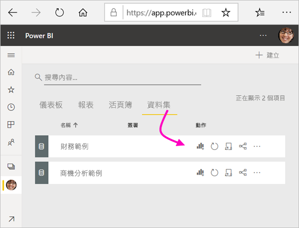
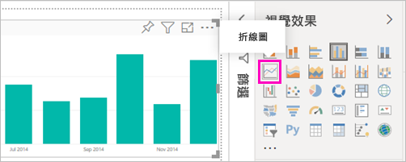
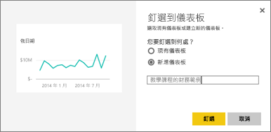
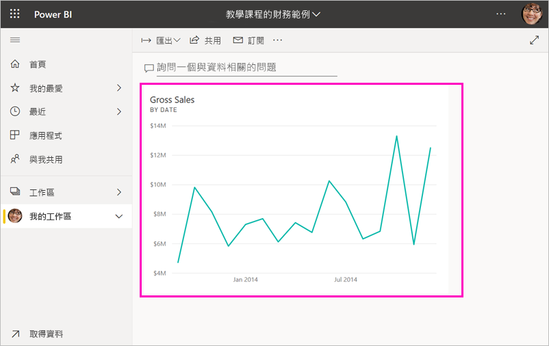
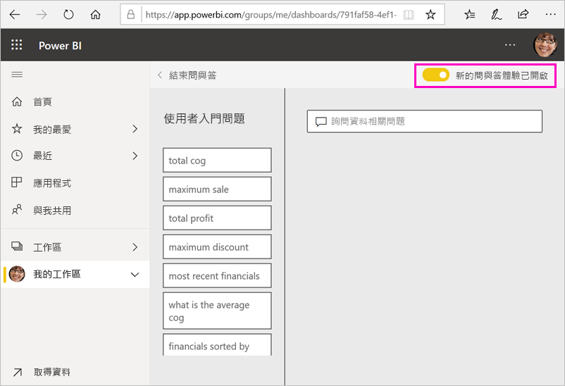
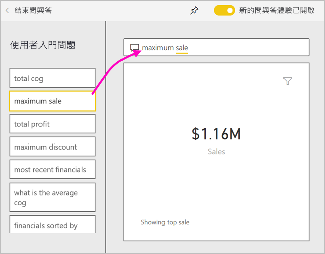
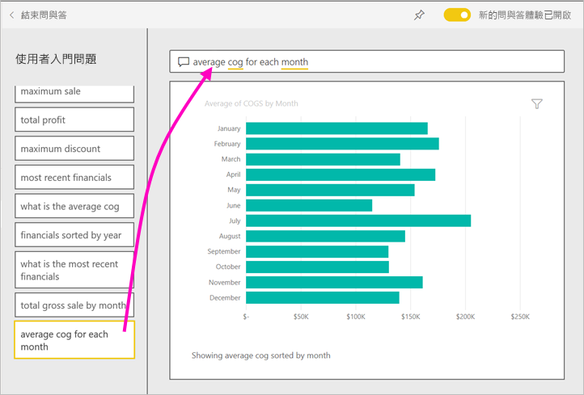
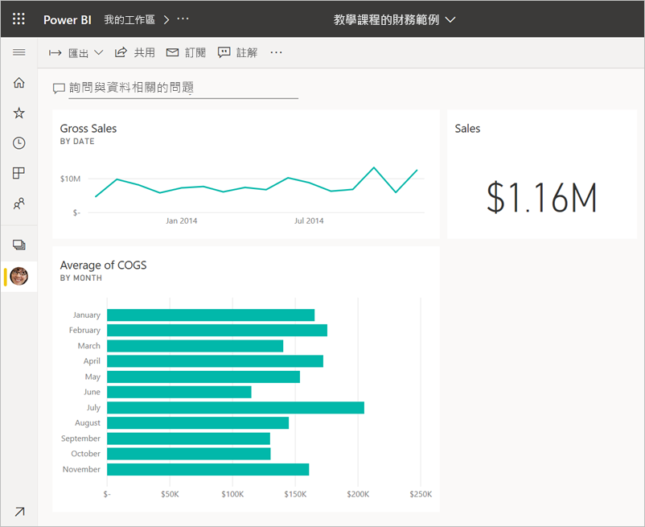

# 教學課程：開始使用 Power BI 服務
本教學課程是 *Power BI 服務*的部分功能簡介。 您會在本課程中連接資料、建立報表和儀表板，並詢問資料的相關問題。 您可以在 Power BI 服務中執行更多動作；本教學課程僅為了提高您的興趣。 若要了解 Power BI 服務如何與其他 Power BI 供應項目相配合，建議您參閱[什麼是 Power BI](fundamentals/power-bi-overview.md)。

在本教學課程中，您完成下列步驟：

> [!div class="checklist"]
> * 登入 Power BI 線上帳戶或註冊 (若您還沒有帳戶的話)。
> * 開啟 Power BI 服務。
> * 取得一些資料，並在報表檢視中予以開啟。
> * 使用該資料建立視覺效果，並將它另存為報表。
> * 釘選來自報表的磚來建立儀表板。
> * 使用問與答自然語言工具將其他視覺效果新增至儀表板。
> * 調整大小、重新排列，並與儀表板上的磚互動。
> * 刪除資料集、報表和儀表板來清除資源。

> [!TIP]
> 偏好免費自修訓練課程？ [註冊在 EdX 上的資料分析與視覺化課程](https://aka.ms/edxpbi)。

## 註冊 Power BI 服務
如果您沒有 Power BI 帳戶，請先[註冊免費 Power BI Pro 試用](https://app.powerbi.com/signupredirect?pbi_source=web)，再開始進行。

擁有帳戶之後，即可在瀏覽器中輸入 *app.powerbi.com* 以開啟 Power BI 服務。 

## 步驟 1：取得資料

一般來說，當您想要建立 Power BI 報表時，您會從 Power BI Desktop 開始。 這一次，我們將從頭開始在 Power BI 服務中建立報表。

在本教學課程中，我們會從 CSV 檔案取得資料。 想要跟著做嗎？ [下載財務範例 CSV 檔案](https://go.microsoft.com/fwlink/?LinkID=521962)。

1. [登入 Power BI](https://www.powerbi.com/)。 沒有帳戶嗎？ 別擔心，您可以註冊免費試用。
2. Power BI 會在您的瀏覽器中開啟。 選取導覽窗格底部的 [取得資料]  。

    [取得資料]  頁面隨即開啟。   

3. 在 [建立新內容]  區段下，選取 [檔案]  。 
   
   
4.  選取 [本機檔案]  。
   
    ![[取得資料] > [檔案] 畫面](media/service-get-started/power-bi-service-get-data-local-file.png)

5. 瀏覽至電腦上的檔案，然後選擇 [開啟]  。

5. 在本教學課程中，我們會選取 [匯入]  以將 Excel 檔案新增為資料集，然後使用該資料集建立報表和儀表板。 如果您選取 [上傳]  ，整個 Excel 活頁簿會上傳至 Power BI，在其中，您可以在 Excel Online 中進行開啟和編輯。
   
   ![選擇 [匯入]](media/service-get-started/power-bi-import.png)
6. 當您的資料集準備好時，請選取 [資料集]  ，然後選取 [財務範例]  資料集旁的 [建立報表]  來開啟報表編輯器。 

    

    報表畫布是空白的。 我們會在右側看到 [篩選]  、[視覺效果]  與 [欄位]  窗格。

    

7. 請注意，上方導覽窗格有 [閱讀檢視]  的選項。 由於您有此選項，這表示您目前處於 [編輯檢視] 中。 熟悉報表編輯器的一項好方法為[進行導覽](create-reports/service-the-report-editor-take-a-tour.md)。

    ![[閱讀檢視] 選項](media/service-get-started/power-bi-service-reading-view.png)

    在 [編輯檢視] 中，您可以建立和修改報表，因為您是報表的「擁有者」  。 換句話說，您是「建立者」  。 當您與同事共用報表時，他們只能夠在 [閱讀檢視] 中與報表互動；您的同事是「取用者」  。 深入了解[閱讀檢視和編輯檢視](consumer/end-user-reading-view.md)。

## 步驟 2：在報表中建立圖表
現在您已連線到資料，請開始進行探索。  當您發現感興趣的物件時，您可以建立儀表板來監視該物件，以及查看其變更情況。 讓我們來看看它的運作方式。
    
1. 在報表編輯器中，我們會使用頁面右側的 [欄位]  窗格來建立視覺效果。 選取 [總銷售額]  和 [日期]  核取方塊。
   
   ![[欄位] 清單](media/service-get-started/power-bi-service-fields-pane-selected.png)

    Power BI 會分析資料並建立視覺效果。 如果先選取 [日期]  就會看到資料表。 如果您先選取 [總銷售額]  ，就會看到直條圖。 

2. 切換不同的資料顯示方式。 讓我們以折線圖形式查看此資料。 從 [視覺效果]  窗格選取折線圖圖示。
   
   

3. 這張圖表看起來很有趣，讓我們將它「釘選」  到儀表板。 將滑鼠停留在視覺效果上，並選取釘選圖示。 釘選這個視覺效果時，它會儲存在儀表板上並保持最新狀態，讓您一眼就能追蹤最新的值。
   
   

4. 因為這是一份新報表，系統會提示您先儲存該報表，才可將視覺效果釘選到儀表板。 為報表命名 (例如「銷售歷史數據」  )，然後選取 [儲存]  。 

5. 選取 [新增儀表板]  ，並將它命名為「教學課程的財務範例」  。 
   
   
   
6. 選取 [釘選]  。
   
    靠近右上角的成功訊息可讓您知道，視覺效果已新增至儀表板，成為儀表板上的磚。
   
    ![[已釘選到儀表板] 對話方塊](media/service-get-started/power-bi-pin-success.png)

7. 選取 [移至儀表板]  ，即可查看新儀表板，以及您釘選為儀表板磚的折線圖。 
   
   
   
8. 選取儀表板上新的磚，即可返回報表。 Power BI 會讓您回到 [閱讀檢視] 中的報表。 

1. 若要切換回 [編輯檢視]，請選取上方導覽窗格中的 [更多選項]  (...) > [編輯]  。 回到 [編輯檢視] 時，您即可繼續探索及釘選磚。

    ![選取 [編輯] 以編輯報表](media/service-get-started/power-bi-service-edit-report.png)

## 步驟 3：使用問與答進行探索

如要快速探索資料，請試著在問與答的問題方塊中提問。 問與答會建立與資料相關的自然語言查詢。 在儀表板中，問與答方塊位於最上方 ([詢問與資料相關的問題]  )。 在報表中，該方塊位於頂端導覽窗格 ([詢問問題]  )。

1. 若要返回儀表板，請在黑色 **Power BI** 列中選取 [我的工作區]  。

    ![回到 [我的工作區]](media/service-get-started/power-bi-service-go-my-workspace.png)

1. 在 [儀表板]  索引標籤上，選取您的儀表板。

    

1. 選取 [詢問資料相關問題]  。 問與答會自動提供一些建議。

    

    > [!NOTE]
    > 如果您沒有看到建議，請開啟 [新的問與答體驗]  。

2. 某些建議會傳回單一值。 例如，選取 [maximum sale] \(最大銷售額\)  。

    問與答會搜尋答案，並以「卡片」  視覺效果的形式呈現。

    

3. 選取釘選圖示  以在 [教學課程的財務範例] 儀表板上顯示此視覺效果。

1. 向下捲動至**使用者入門問題**清單，並選取 [average cog for each month]\(每個月的平均 COG\)  。 

    

1. 亦請將橫條圖釘選到 [教學課程的財務範例]  儀表板。

1. 將游標放在問與答方塊中的「依月份」  後面，然後鍵入「折線圖」  。 選取 [折線圖] (視覺效果類型)  。 

    

4. 選取 [結束問與答]  返回儀表板時，您即會看到剛建立的新磚。 

   

   您會發現即使您將圖表變更為折線圖，磚仍維持橫條圖不變，因為這就是您釘選當時的結果。 

## 步驟 4：重新置放磚

儀表板很寬。 我們可以重新排列磚，以更充分利用儀表板的空間。

1. 將「總銷售額」  折線圖磚的右下角往上拖曳，直到它與 [銷售量] 磚位於相同的高度，然後放開。

    

    現在，這兩個磚具有相同的高度。

    

1. 拖曳「COGS 的平均」  橫條圖磚，直到它符合「總銷售額」  折線圖的下方位置。

    這樣看起來更美觀。

    

## 步驟 5：與磚互動

在您開始建立自己的儀表板和報表之前，還有最後一個互動有待觀察。 選取不同的磚時，會提供不同的結果。 

1. 首先，請選取您從報表釘選的「總銷售額」  折線圖磚。 

    Power BI 會在 [閱讀檢視] 中開啟報表。 

2. 選取瀏覽器的 [上一頁] 按鈕。 

1. 現在，選取您在問與答中所建立「COGS 的平均」  橫條圖磚。 

    Power BI 不會開啟報表。 反而，系統會開啟問與答，因為您是在該處建立此圖表。

## 清除資源
既然您已經完成本教學課程，就可以刪除資料集、報表和儀表板。 

1. 在導覽窗格中，確定您處於 [我的工作區]  。
2. 選取 [資料集]  索引標籤，並找到您針對本教學課程匯入的資料集。  
3. 選取 [更多選項]  (...) > [刪除]  。

    

    當您刪除資料集時，系統會顯示一則警告說明**所有包含此資料集資料的報表與儀表板磚也會一併刪除**。

4. 選取 [刪除]  。

## 後續步驟

新增更多視覺效果磚，並[重新命名、調整大小、連結和重新置放磚](create-reports/service-dashboard-edit-tile.md)，讓您的儀表板更美觀。
