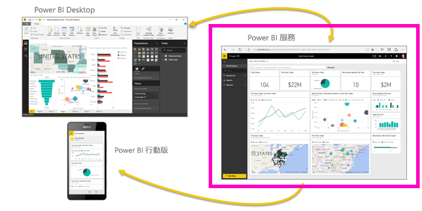
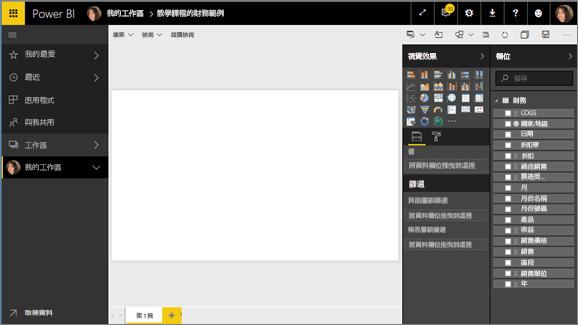
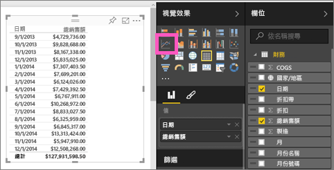
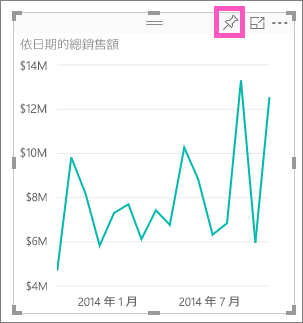
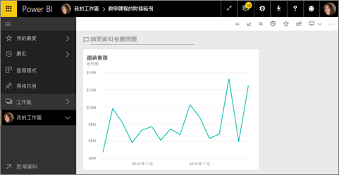
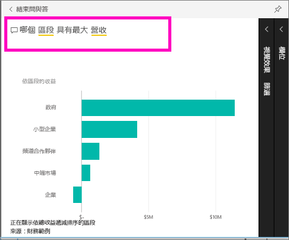
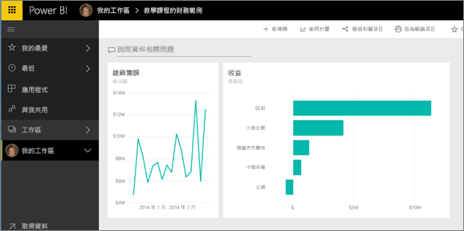
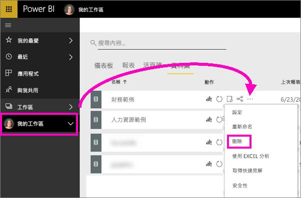

# 教學課程：開始使用 Power BI 服務 (app.powerbi.com)
本教學課程可協助您開始使用 Power BI 服務  。 若要了解 Power BI 服務如何與其他 Power BI 供應項目相配合，建議您先參閱[什麼是 Power BI](power-bi-overview.md)。

在本教學課程中，您完成下列步驟：

> [!div class="checklist"]
> * 尋找 Power BI 服務的入門內容。
> * 登入 Power BI 線上帳戶，或在還沒有 Power BI 線上帳戶時註冊帳戶。
> * 開啟 Power BI 服務。
> * 取得一些資料，並在報表檢視中予以開啟。
> * 使用該資料建立視覺效果，並將它另存為報表。
> * 釘選來自報表的磚來建立儀表板。
> * 使用問與答自然語言工具將另一個視覺效果新增至儀表板。
> * 刪除資料集、報表和儀表板來清除資源。

## 註冊 Power BI 服務
如果您沒有 Power BI 帳戶，請先[註冊免費 Power BI Pro 試用](https://app.powerbi.com/signupredirect?pbi_source=web)，再開始進行。

擁有帳戶之後，即可在瀏覽器中輸入 *app.powerbi.com* 以開啟 Power BI 服務。 

如果您要尋找 Power BI Desktop 的協助，請參閱[開始使用 Power BI Desktop](desktop-getting-started.md)。 如果您想要尋求 Power BI Mobile 的協助，請參閱[行動裝置的 Power BI 應用程式](consumer/mobile/mobile-apps-for-mobile-devices.md)。

> [!TIP]
> 偏好免費自修訓練課程？ [註冊在 EdX 上的資料分析與視覺化課程](http://aka.ms/edxpbi)。

請瀏覽我們在 [YouTube 上的播放清單](https://www.youtube.com/playlist?list=PL1N57mwBHtN0JFoKSR0n-tBkUJHeMP2cP)。 「Power BI 服務簡介」  是不錯的入門影片：
> 
> <iframe width="560" height="315" src="https://www.youtube.com/embed/B2vd4MQrz4M" frameborder="0" allowfullscreen></iframe>
> 

## 什麼是 Power BI 服務？
Microsoft Power BI 服務有時稱為 Power BI 線上或 app.powerbi.com。 Power BI 可協助您掌握最新的重要資訊。 使用 Power BI 服務，「儀表板」  能助您掌握商務脈動。 您可以選取儀表板所顯示的「磚」  來開啟「報表」，以  進一步探索。 連接到多個*資料集*，讓所有相關資料集中到一處。 需要協助以了解構成 Power BI 的建置組塊嗎？ 請參閱 [Power BI 服務中的設計工具基本概念](service-basic-concepts.md)。

如果 Excel 或 CSV 檔案中有重要的資料，您可以建立 Power BI 儀表板在任何位置掌握其動態，並與他人交流意見。  您訂閱了 Salesforce 之類的 SaaS 應用程式嗎？  預先連線到 Salesforce 以自動從該資料建立儀表板，或[查看您可以連線的所有其他 SaaS 應用程式](service-get-data.md)。 如果您是組織的一員，請查看是否曾為您發佈過任何的[應用程式](service-create-distribute-apps.md)。

閱讀[取得 Power BI 的資料](service-get-data.md)的所有其他方式.

## 步驟 1：取得資料
本例從 CSV 檔案取得資料。 想遵循本教學課程嗎？ [下載財務範例 CSV 檔案](http://go.microsoft.com/fwlink/?LinkID=521962)。

1. [登入 Power BI](http://www.powerbi.com/)。 沒有帳戶嗎？ 別擔心，您可以註冊免費試用。
2. Power BI 會在您的瀏覽器中開啟。 選取左導覽列底部的 [取得資料]  。

    [取得資料]  頁面隨即開啟。   

3. 在 [建立新內容]  區段下，選取 [檔案]  。 
   
   
4.  選取 [本機檔案]  。
   
     ![[取得資料] > [檔案] 畫面](media/service-get-started/gs2.png)

5. 瀏覽至電腦上的檔案，然後選擇 [開啟]  。

5. 在本教學課程中，我們將選取 [匯入]  以將 Excel 檔案新增為資料集，然後使用該資料集建立報表和儀表板。 如果您選取 [上傳]  ，整個 Excel 活頁簿會上傳至 Power BI，在其中，您可以在 Excel Online 中進行開啟和編輯。
   
   ![選擇 [匯入]](media/service-get-started/power-bi-import.png)
6. 您的資料集就緒時，請選取 [檢視資料集]  以在報表編輯器中進行開啟。 

    ![[您的資料集已就緒] 對話方塊](media/service-get-started/power-bi-gs.png)

    由於我們尚未建立任何視覺效果，所以報告畫布為空白。

    

7. 請注意，上方導覽列有 [閱讀檢視]  的選項。 由於您有此選項，這表示您目前處於 [編輯檢視] 中。 

    ![[閱讀檢視] 選項](media/service-get-started/power-bi-editing-view.png)

    在 [編輯檢視] 中，您可以建立和修改報表，因為您是報表的「擁有者」  。 換句話說，您是「建立者」  。 當您與同事共用報表時，他們只能夠在 [閱讀檢視] 中與報表互動；您的同事是「取用者」  。 深入了解[閱讀檢視和編輯檢視](consumer/end-user-reading-view.md)。
    
    熟悉報表編輯器的一項好方法為[進行導覽](service-the-report-editor-take-a-tour.md)。
 

## 步驟 2：開始探索資料集
現在您已連線到資料，請開始進行探索。  當您發現感興趣的物件時，您可以建立儀表板來監視該物件，以及查看其變更情況。 讓我們來看看它的運作方式。
    
1. 在報告編輯器中，我們會使用頁面右側的 [欄位]  窗格來建立視覺效果。 選取 [總銷售額]  和 [日期]  核取方塊。
   
   ![[欄位] 清單](media/service-get-started/fields.png)

    Power BI 會分析資料並建立視覺效果。 如果先選取 [日期]  就會看到資料表。 如果先選取 [總銷售額]  就會看到圖表。 

2. 切換不同的資料顯示方式。 讓我們以折線圖形式查看此資料。 從 [視覺效果]  窗格選取折線圖圖示。
   
   

3. 這張圖表看起來很有趣，讓我們將它「釘選」  到儀表板。 將滑鼠停留在視覺效果上，並選取釘選圖示。 釘選這個視覺效果時，它會儲存在儀表板上並保持最新狀態，讓您一眼就能追蹤最新的值。
   
   

4. 因為這是一份新報表，系統會提示您先儲存該報表，才可將視覺效果釘選到儀表板。 為報表命名 (例如「銷售歷史數據」  )，然後選取 [儲存並繼續]  。 
   
   
   
5. 將折線圖釘選到新的儀表板，並將它命名為「教學課程的財務範例」  。 
   
   
   
6. 選取 [釘選]  。
   
    靠近右上角的成功訊息可讓您知道，視覺效果已新增至儀表板，成為儀表板上的磚。
   
    ![[已釘選到儀表板] 對話方塊](media/service-get-started/power-bi-pin-success.png)

7. 選取 [移至儀表板]  將您所釘選折線圖視為新儀表板的磚。 藉由新增更多視覺效果磚，以及[重新命名、調整大小、連結和調整磚位置](service-dashboard-edit-tile.md)，讓您的儀表板更完善。
   
   
   
8. 選取儀表板上新的磚，即可返回報表。 Power BI 會讓您回到 [閱讀檢視] 中的報告編輯器。 若要切換回 [編輯檢視]，請選取上方導覽列中的 [編輯報表]  。 回到 [編輯檢視] 之後，您可以繼續探索及釘選磚。 

## 步驟 3：使用 [問與答] 繼續探索 (自然語言查詢)
1. 如要快速探索資料，請在 [問與答] 方塊中提問。 [問與答] 問題方塊位於儀表板頂端 (**詢問一個與資料相關的問題**) 以及報表上方的導覽列中 (**詢問問題**)。 例如，在 [問與答] 方塊中鍵入「營收最高的部門」  。
   
   

2. [問與答] 會搜尋答案，並以視覺效果的形式呈現。 選取釘選圖示  在儀表板上顯示此視覺效果。
3. 將視覺效果釘選到 [教學課程的財務範例]  儀表板。
   
    ![[釘選到儀表板] 對話方塊](media/service-get-started/power-bi-pin2.png)

4. 返回儀表板，您會在這裡看到新的磚。

   

## 清除資源
既然您已經完成本教學課程，就可以刪除資料集、報表和儀表板。 

1. 在左側導覽列中，選取 [我的工作區]  。
2. 選取 [資料集]  索引標籤，並找到您針對本教學課程匯入的資料集。  
3. 選取省略符號 (...) > [刪除]  。

    

    當您刪除資料集時，Power BI 也會刪除報表和儀表板。 

## 後續步驟

> [!div class="nextstepaction"]
> [使用 Power BI 連接到所用的線上服務](service-connect-to-services.md)

