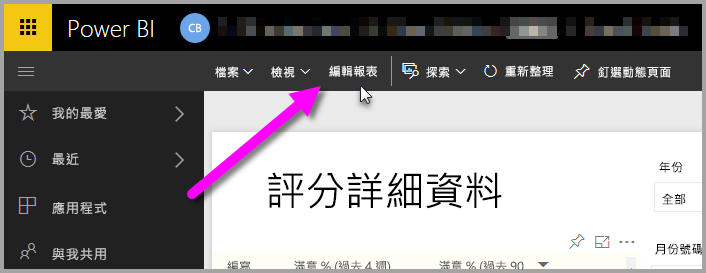
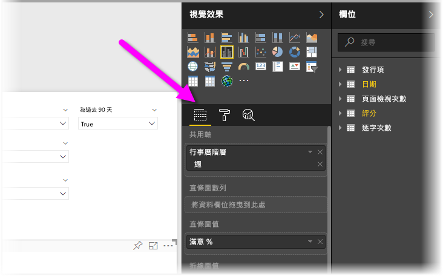
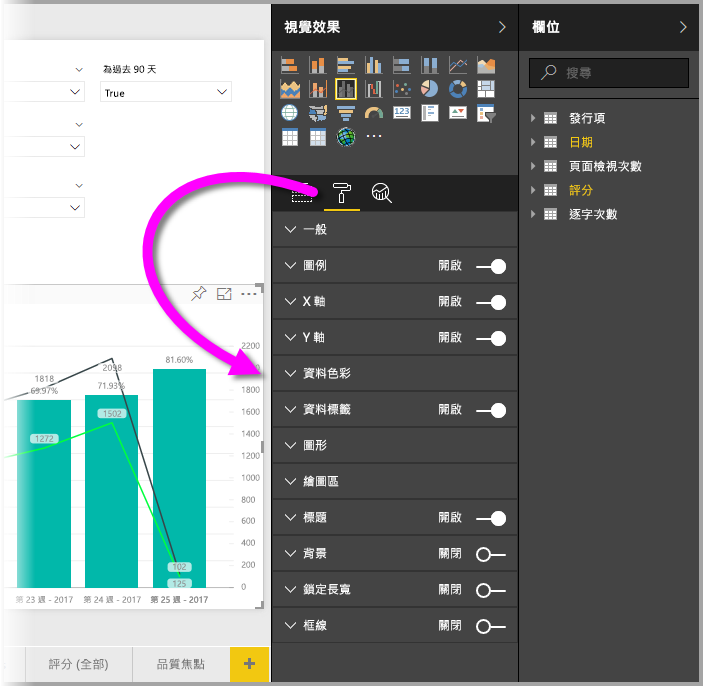
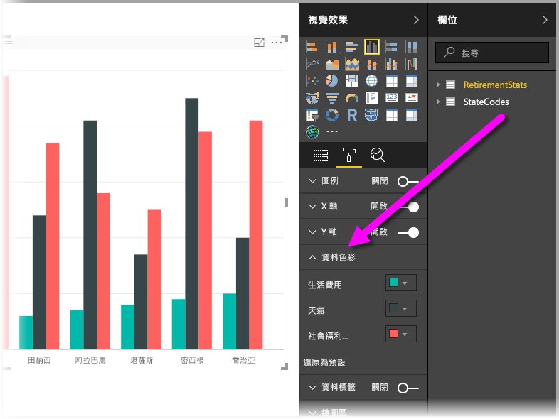

# 開始使用色彩格式和軸屬性
在 **Power BI** 中，您可以變更資料數列、資料點、甚至視覺效果背景的色彩。 您也可以變更 x 軸和 y 軸的顯示方式，讓您完全掌控儀表板和報表的顯示方式。

若要開始，請從 [我的工作區]  窗格選取 [報表]  。 然後從上方的功能表區域選取 [編輯報表] 。  

當您編輯報表並選取了視覺效果時，[視覺效果] 窗格會隨即出現，讓您新增或變更視覺效果。 可用視覺效果的正下方有三個圖示：**欄位**圖示 (堆疊的橫條)、**格式**圖示 (滾筒筆刷) 和**分析**圖示 (放大鏡)。 在下圖中，選取了**欄位**圖示 (圖示下方黃色列所指出)。

當您選取 [格式] 時，圖示下的區域會顯示目前所選視覺效果可用的色彩及軸自訂內容。  

您可以自訂每個視覺效果的許多項目：

* 圖例
* X 軸
* Y 軸
* 資料色彩
* 資料標籤
* 圖形
* 繪圖區
* 標題
* 背景
* 鎖定長寬
* 框線

> [!NOTE]
>  
> 您看不到每個視覺效果類型的所有這些項目。 您選取的視覺效果會影響可用的自訂，例如，如果選取圓形圖就不會看到 X 軸，因為圓形圖沒有 X 軸。
> 
> 

另請注意，如果未選取任何視覺效果，圖示的位置上就會出現 [篩選]，讓您將篩選套用至頁面上的所有視覺效果。

讓我們看看一些範例：一個使用色彩，另一個變更軸屬性。 從這裡開始，您應該有準備一整天要自訂色彩、軸和標籤。

## 使用色彩
讓我們一步步完成自訂圖表色彩的必要步驟。

1. 我從報表畫布中選擇了 [群組直條圖]  。
2. 接下來，我選擇 **格式** 圖示來顯示可用的自訂項目。
3. 然後選取 [資料色彩]  自訂左邊的小型向下箭號。 這會顯示我自訂 [資料色彩] 的方式，以及我選取的視覺效果的特定選項。
4. 向下展開 [資料色彩] 會顯示其可用的自訂項目。  
   

讓我們進行一些變更。 我可以選取色彩旁邊的向下箭號，變更每個可用的資料數列。 [Cost of living]\(生活花費) 我想用黃色，[Weather]\(天氣) 我想變橙色，而 [Community well-being]\(社區幸福感) 就用綠色。 下列畫面顯示我在最後一個步驟中變更 [生活花費] 。  

下圖顯示這些變更。 哇，多鮮亮的圖表啊。 以下是使用色彩時值得注意的幾個有用的項目。 接下來的畫面也會顯示下列清單中的數字，指出可以存取或變更這些有用項目的位置。

1. 不喜歡這些色彩嗎？ 沒問題，只要選取 [還原為預設值]  ，所有選項就會還原為預設的設定。 您可針對一種色彩或整個視覺效果這麼做。
2. 想要調色盤中沒有的色彩嗎？ 只要選取 [自訂色彩] ，然後從色譜中選擇即可。  
   

對剛才的變更不興奮激動？ 請使用 **CTRL+Z** 復原，就像您以前習慣的。

## 變更軸屬性
修改 X 軸或 Y 軸通常很有用。 其方法與處理色彩類似，您可以選取要變更的軸左邊的向下箭號圖示來修改座標軸，如下圖所示。  

如果想要摺疊 [X 軸]  選項，只要選取 [X 軸] 旁邊的向上箭號圖示即可。

您可以切換 [X 軸] 旁邊的選項按鈕，將 X 軸標籤整個移除。 也可以選取 [標題] 旁邊的選項按鈕，選擇開啟或關閉軸標題。  

有各種色彩可供選擇，還有更多自訂項目可以套用至您的 Power BI 報表和儀表板。

> [!NOTE]
>  
> 當選取**格式**圖示時，Power BI Desktop 也會提供這些可用的色彩、軸和相關的自訂項目。
> 
> 

## 下一個步驟
如需詳細資訊，請參閱下列文章：  

* [在 Power BI 中色彩格式設定的秘訣和訣竅](service-tips-and-tricks-for-color-formatting.md)  

