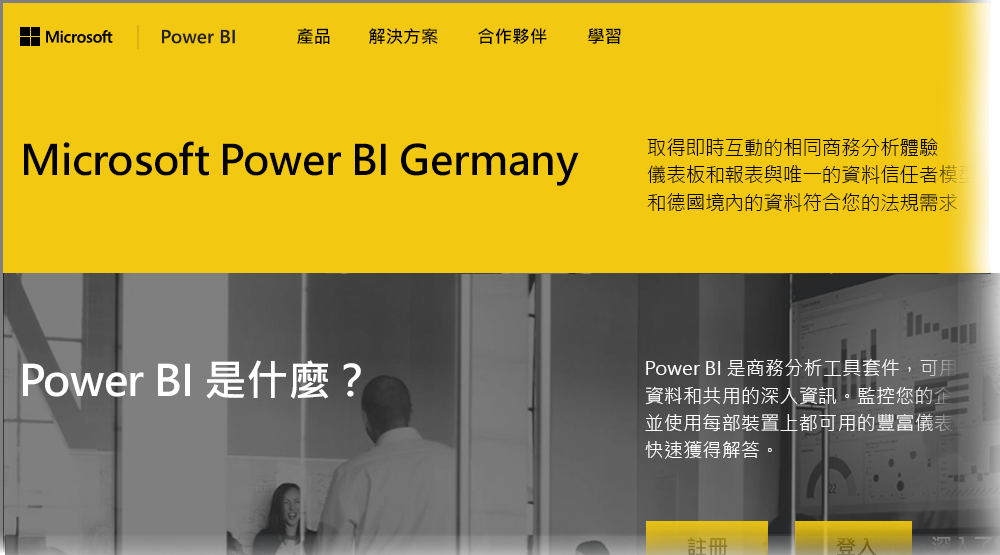

# 德國雲端客戶的 Power BI 常見問題集
**Power BI 服務**為歐盟/歐洲自由貿易協定 (EU/EFTA) 客戶提供一個版本，通常稱為 Microsoft Cloud Deutschland (MCD)。 本文所討論的 **Power BI 服務**版本為 EU/EFTA 客戶專屬，獨立且不同於商用版本的 **Power BI 服務**，或提供給政府客戶的 Power BI 服務。

下列問題與回答提供 Microsoft Cloud Deutschland (MCD) 中 Power BI Pro 服務的重要資訊，這是專為 EU/EFTA 客戶提供的 Power BI 服務雲端。

1. **什麼是適用於德國雲端的 Power BI 服務？**
   
   為 EU/EFTA 客戶提供的 Power BI 服務也稱作 Microsoft Cloud Deutschland (MCD)，這個 EU/EFTA 雲端符合傳遞自德國資料中心的 Power BI 服務規範。 在 EU/EFTA 雲端的 Power BI 服務中，所有客戶資料都會以待用狀態儲存在德國，由 T-Systems 擔任獨立的德國資料信任者，資料的實體和邏輯存取則受德國法律約束。 EU/EFTA 雲端的 Power BI 服務需要與商用版本 Power BI 服務不同的獨立帳戶。 前往[這裡](https://www.microsoft.com/trustcenter/cloudservices/nationalcloud)深入了解 Microsoft Cloud Deutschland。
2. **我可以在哪裡找到 Power BI 德國雲端的定價及註冊資訊？**
   
   您可以在 [Power BI 德國雲端首頁](https://powerbi.microsoft.com/power-bi-germany/)找到許多資訊，包括定價資訊。 在該頁面上，您也可以找到註冊含有 25 份使用者授權的 **Power BI Pro 服務** 30 天試用連結。 在註冊試用過程中，您可以依需求選擇購買或新增額外授權。 我們也提供 Enterprise 合約 (EA)、政府及非營利定價。 如需詳細資料，請連絡您的 Microsoft 客戶代表。
3. **我的 Azure Germany 及 (或) Office 365 Germany 訂閱有 Germany Cloud 租用戶。我可以使用現有租用戶註冊 Power BI Germany 嗎？**
   
   是。 在註冊程序中，您可以選擇使用現有 Germany Cloud 租用戶管理帳戶登入，並將 Power BI Pro 服務授權新增到您在 Germany Cloud 中的現有租用戶。 請注意，Germany Cloud 租用戶和使用者帳戶與德國雲端的 Power BI 服務不同。
4. **德國雲端的 Power BI 服務中有免費服務嗎？**
   
   否。 我們未在德國雲端的 Power BI 服務中提供免費授權版本。 不過，如果您的業務需求與 Power BI 免費供應項目相符，我們也鼓勵您註冊[公用雲端中的 Power BI 免費供應項目](https://powerbi.microsoft.com/get-started/)。
5. **我可以搭配德國雲端的 Power BI 服務，使用 Power BI Desktop、Power BI 行動版、內部部署資料閘道及 Publisher for Excel 嗎？**
   
   是。 我們更新了 Power BI 用戶端產品，以搭配德國雲端的 Power BI 服務順暢運作。 請使用您的德國雲端 Power BI 服務帳戶登入，開始使用與德國雲端 Power BI 服務相同的用戶端產品。 您可以從下列位置下載最新版本的用戶端產品：
   
   * [Power BI Desktop](https://powerbi.microsoft.com/desktop/)
   * [Power BI Mobile](https://powerbi.microsoft.com/mobile/)
   * [內部部署資料閘道](https://powerbi.microsoft.com/gateway/)
   * [Power BI Publisher for Excel](https://powerbi.microsoft.com/excel-dashboard-publisher/)
6. **德國雲端的 Power BI 服務有任何功能限制嗎？**
   
   下列服務功能目前無法在德國雲端的 Power BI 服務中使用：
   
   * 發佈至網路
   * Esri 提供的 ArcGIS
   * Power BI Embedded (個別計量的 ISV 授權，將於日後透過 [Microsoft Azure Germany](https://azure.microsoft.com/overview/clouds/germany/) 提供)
7. **我可以在哪裡找到德國雲端 Power BI 服務專屬的設定資訊，以在我的應用程式中使用及整合？**
   
   我們更新了 [SaaS 內嵌開發人員範例](https://github.com/Microsoft/PowerBI-Developer-Samples)，增加德國及其他 Power BI 雲端專屬的設定資訊。 請查看範例中的 **Cloud Configs** 資料夾，以取得雲端專屬設定端點。 下表列出德國雲端 Power BI 服務的不同設定端點 (及用於交互參照的公用雲端)。

| **端點名稱及 (或) 使用方式** | **適用於德國雲端的 Power BI 服務 URL** | **公用雲端中的對等 URL (用於交互參照)** |
| --- | --- | --- |
| 首頁，註冊及登入 |[https://powerbi.microsoft.com/power-bi-germany/](https://powerbi.microsoft.com/power-bi-germany/) |[https://powerbi.microsoft.com/](https://powerbi.microsoft.com/) |
| Power BI 服務直接登入 |[https://app.powerbi.de/?noSignUpCheck=1](https://app.powerbi.de/?noSignUpCheck=1) |[https://app.powerbi.com/?noSignUpCheck=1](https://app.powerbi.com/?noSignUpCheck=1) |
| 服務 API |[https://api.powerbi.de/](https://api.powerbi.de/) |[https://api.powerbi.com/](https://api.powerbi.com/) |
| Office 入口網站，供系統管理員進行使用者授權管理、服務健全狀態及支援要求 |[https://portal.office.de/](https://portal.office.de/) |[https://portal.office.com/](https://portal.office.com/) |
| AAD 授權單位 URI |[https://login.microsoftonline.de/common/oauth2/authorize/](https://login.microsoftonline.de/common/oauth2/authorize/) |[https://login.microsoftonline.com/common/oauth2/authorize/](https://login.microsoftonline.com/common/oauth2/authorize/) |
| Power BI 服務資源 URI |[https://analysis.cloudapi.de/powerbi/api](https://analysis.cloudapi.de/powerbi/api) |[https://analysis.windows.net/powerbi/api](https://analysis.windows.net/powerbi/api) |
| 自訂視覺效果資源庫 |[https://app.powerbi.de/visuals/](https://app.powerbi.de/visuals/) |[https://app.powerbi.com/visuals/](https://app.powerbi.com/visuals/) |
| 為 Power BI 註冊應用程式 (適用於 Embedded) |[https://app.powerbi.de/apps](https://app.powerbi.de/apps) |[https://app.powerbi.com/apps](https://app.powerbi.com/apps) |
| Azure 入口網站 (適用於 Embedded) |[https://portal.microsoftazure.de/](https://portal.microsoftazure.de/) |[https://portal.azure.com/](https://portal.azure.com/) |
| 社群 |[https://community.powerbi.com/](https://community.powerbi.com/) |[https://community.powerbi.com/](https://community.powerbi.com/) |

### 後續步驟
您可以使用 Power BI 執行各種作業。 如需詳細資訊和學習，包括說明如何註冊服務的文章，請參閱下列資源︰

* [引導式學習 Power BI](guided-learning/gettingstarted.yml#step-1)
* [開始使用 Power BI 服務](service-get-started.md)
* [開始使用 Power BI Desktop](desktop-getting-started.md)

