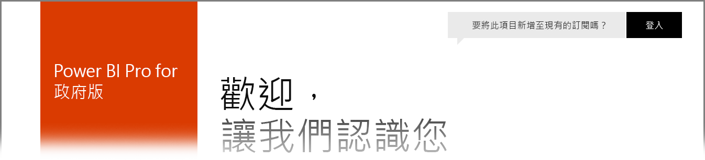

# 適用於美國政府客戶的 Power BI
**Power BI 服務**在 **Office 365 美國政府社群**訂閱中具有適用於美國政府客戶的版本。 本文所討論的 **Power BI 服務**版本專為美國政府客戶而設計，並且獨立且不同於商用版本的 **Power BI 服務**。

下列各節說明可用於美國政府版本 **Power BI 服務**的「功能」、釐清一些「限制」、列出常見問題集 (**FAQ**) 和回答 (包括如何註冊)，並提供詳細資訊的連結。

## 適用於美國政府的 Power BI 功能
請務必注意 [Power BI 美國政府] 只能作為 [Pro 授權]，而不能作為免費授權。 Power BI 服務的某些功能適用於服務的 **Power BI 美國政府**版本。

**Power BI 美國政府**客戶可以使用下列功能，因為它們套用至 **Pro** 授權功能︰

* 建立和檢視儀表板和報表
* [資料容量限制](service-admin-manage-your-data-storage-in-power-bi.md)
* [排程的資料重新整理](refresh-data.md)
* 可重新整理的小組儀表板
* 共用和管理存取控制的 Active Directory 群組
* 從 Excel、CSV 和 Power BI Desktop 檔案[匯入資料](service-get-data.md)和報表
* 資料管理閘道
* Power BI 的所有資料在 Azure SQL 和 Blob 儲存體中都已加密
* 使用[內容套件](service-connect-to-services.md)連接至服務

## 政府和公用 Azure 雲端服務之間的連線 

Azure 分散於多個雲端。 根據預設，會允許租用戶以開啟對雲端特定執行個體的防火牆規則，但跨雲端網路不同，且需要開啟特定的防火牆規則，以便在服務之間通訊。 如果您是 Power BI 客戶，而且在公用雲端中有需要存取的現有 SQL 執行個體，您必須在 SQL 中開啟對 Azure 政府雲端 IP 空間的特定防火牆規則，針對下列資料中心：

* USGov 愛荷華
* USGov 維吉尼亞
* USGov 德州
* USGov 亞歷桑那

公用雲端中的 IP 空間可供使用，但對於政府雲端，您必須開啟 Azure 支援票證以要求上述所列資料中心的 IP 範圍。 

## 適用於美國政府的 Power BI 限制
**Power BI 服務**商用版本中可用的部分功能「不」可用於美國政府客戶的 **Power BI 服務**。 Power BI 小組積極地將這些功能提供給美國政府客戶，並且會在這些功能可用時更新本文。

* **內嵌在 SharePoint Online 中** - 不可能使用 Power BI Web 組件將內容內嵌在 SharePoint Online 中。
* **Power BI 美國政府**只能作為 Pro 授權。 在系統管理入口網站中進行的任何 Power BI (免費) 授權參考 (或使用者身分) 都是在商用 Power BI 服務雲端中執行。
* **稽核** - 自 2018 年 6 月起，稽核現在可透過 Office 365 安全性與合規性入口網站取得。
* **Cortana 中的 Power BI 內容** - Power BI 結果不會顯示在 Cortana 搜尋結果中，其中包括適用於您的 Power BI 內容 (儀表板、報表、應用程式) 的結果，以及顯示特定關鍵字之 Cortana 最佳化報表頁面的結果。
* **外部使用者共用** - 共用只允許在 Power BI 租用戶內進行，不過自 2018 年 6 月起，就能與 Power BI 租用戶以外的使用者共用。
* **儀表板和報表的使用計量** - 使用計量不適用於儀表板和報表。 客戶可以使用稽核記錄資料，取得組織中內容的使用量資訊。

如果您已將 **Power BI** 免費授權指派給您的帳戶，則這些帳戶會在 **Power BI** 服務的商用版本中執行，而不是 **Power BI 美國政府**供應項目的一部分。 針對這些免費帳戶，您可能會遇到下列問題︰

* 無法驗證閘道、行動裝置和電腦
* 您無法存取 Azure 商業資料來源
* PBIX 檔案必須以手動方式從商用版本上傳
* 沒有 Power BI mobile apps

若要解決問題，請連絡您的客戶代表。

## 美國政府版本的 Power BI 服務常見問題集 (FAQ)
下列問題 (及回答) 可協助您快速取得所需的服務相關資訊。

**問︰** 如何移轉我的商用 **Power BI** 資料到美國政府的 **Power BI 服務**？

**答︰** 您的系統管理員必須在不同的美國政府特定訂閱中建立 **Power BI** 的新執行個體。 然後，您就可以在適用於美國政府的 **Power BI 服務**中複寫您的商用資料、移除您的商用授權，並將現有的網域與新的美國政府特定服務相關聯。

**問︰** 為什麼我無法連線到特定的內容套件？

**答︰** 您需要先確定您的訂閱已啟用，才能連線到該內容套件。

**問︰** 我要興趣為我的美國政府組織取得 **Power BI**。 如何開始使用？

**答︰** 註冊 (通常稱為「上架」) 可能會根據您現有的授權和訂閱而不同。 如需詳細資訊，請參閱[註冊適用於美國政府的 Power BI](service-govus-signup.md) 一文。

**問︰** 連接到美國政府 **Power BI** 的 URL，與商用 **Power BI** URL 不同嗎？

**答︰** 是的，URL 會不同。 下表顯示每個 URL：

| 商用版本 URL | 美國政府版本 URL |
| --- | --- |
| https://app.powerbi.com/ |[https://app.powerbigov.us](https://app.powerbigov.us) |

**問題：** 我的帳戶佈建在多個主權雲端中。 當使用 **Power BI Desktop** 時，如何選取要連線至哪一個雲端？

**回答：** 從 2018 年 7 月版本的 **Power BI Desktop** 開始，您可以在登入 **Power BI Desktop** 時選擇您想要使用哪一個雲端。

## 後續步驟
您可以使用 Power BI 執行各種作業。 如需詳細資訊和學習，包括說明如何註冊服務的文章，請參閱下列資源︰

* [針對美國政府註冊 Power BI](service-govus-signup.md)
* <a href="https://channel9.msdn.com/Blogs/Azure/Cognitive-Services-HDInsight-and-Power-BI-on-Azure-Government">Power BI 美國政府示範</a>
* [引導式學習 Power BI](guided-learning/gettingstarted.yml?tutorial-step=1)
* [開始使用 Power BI 服務](service-get-started.md)
* [Power BI Desktop 是什麼？](desktop-what-is-desktop.md)

