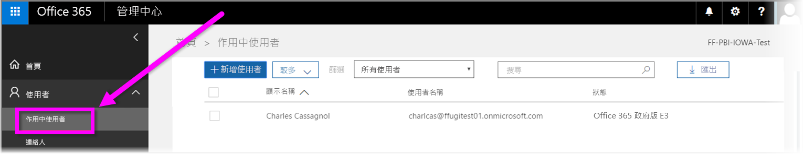

# 在 Power BI 服務中註冊美國政府組織
**Power BI 服務**在 **Office 365 美國政府社群**訂閱中具有適用於美國政府客戶的版本。 本文所討論的 **Power BI 服務**版本是為美國政府客戶而設計，獨立且不同於商用版本的 **Power BI 服務**。

如需適用於美國政府的 **Power BI 服務**詳細資訊，包括其功能與限制，請參閱[適用於美國政府客戶的 Power BI - 概觀](service-govus-overview.md)。

> [!NOTE]
> 本文旨在提供給有權為其美國政府組織註冊 Power BI 的系統管理員。 如果您是使用者，請連絡您的系統管理員，取得美國政府的 Power BI 訂閱。
> 
> 

## 選取美國政府組織的正確註冊程序
您的美國政府組織可能新接觸 **Office Government cloud**，或可能已經有訂閱。 下列各節將詳細說明根據您所在的 Government Cloud 的 Power BI 註冊步驟，且會根據您的現有訂閱而不同。

一旦您已註冊適用於美國政府的 Power BI，某些功能可能無法運作，直到您的業務或支援代表完成您的上架程序。 若要了解這些功能，請參閱[適用於美國政府客戶的 Power BI - 概觀](service-govus-overview.md)。 若要完成上架程序來啟用這些功能，請連絡您的業務或支援代表。

### 美國政府組織是新的 Office Cloud 客戶
如果您的組織是新的 **Office Government Cloud** 客戶，請遵循下列步驟︰

> [!NOTE]
> 應該由入口網站的系統管理員執行這些步驟。
>

1. 前往 [https://products.office.com/government/office-365-web-services-for-government](https://products.office.com/government/office-365-web-services-for-government)。

>[!NOTE]
>如果您目前不想註冊 Government Cloud，請連絡您的業務代表。
>

2. 選取 Office G3 並完成 Office 試用版的表單
3. 一旦您是 Office Cloud 客戶，請繼續執行下列「現有 Office Government Cloud 客戶」的步驟

### 現有 Office Government Cloud 客戶
如果您的組織是現有的 **Office Government Cloud** 客戶，但您沒有 **Power BI** 訂閱 (Free 或其他)，請遵循下列步驟︰

> [!NOTE]
> 應該由入口網站的系統管理員執行這些步驟。
> 
> 

1. 登入現有的 Office Government Cloud 帳戶並前往管理入口網站
2. 選取 [計費]  。
3. 選取 [購買服務]  。
4. 選取 [Power BI Pro 政府] 選項，然後選擇 [嘗試]  或 [立即購買] 
5. 完成訂單
6. 指派使用者給帳戶。
   
   
7. 在 [https://app.powerbigov.us](https://app.powerbigov.us) 登入適用於美國政府客戶的 **Power BI 服務**

## 其他的註冊資訊
以下是在不同授權移轉案例中註冊 **Power BI 美國政府**的詳細資訊。

### Power BI Trial 到 Pro 的直接客戶上架
* 按一下並跟隨 Billing > Purchase Service > PowerBI Pro Gov，然後選取購買且非為試用版
* 填寫必要資訊然後取得授權
* 移除 Power BI Pro 試用版或舊的授權，然後指派新的授權給使用者
* 登入 [https://app.powerbigov.us](https://app.powerbigov.us)

### Power BI Trial 到 Pro 的轉銷商客戶上架
移至 [計費] > [訂閱]  ，然後選取 [Power BI Pro for Government]  訂閱。 您會看到︰

* 高可用性
* 已指派
* 指派給使用者連結
* 如果您仍有指派的試用版︰
  * 按一下試用版訂閱下的 [已指派]  ，然後移除您想要新增至付費的使用者
  * 移至付費訂用帳戶，並指派這些使用者

### 設為允許清單指示
「設為允許清單」  是 Power BI 工程小組用來將客戶從商用雲端環境移至安全政府雲端環境的程序。 這可確保美國政府雲端中可用的功能如預期般運作。 第一次購買美國政府 **Power BI** 服務的所有現有 (或新的) 美國政府客戶，「必須」  起始下列允許清單處理。 處理必須在安裝或移轉至美國政府 **Power BI** 服務之前完成。 

若要將您的租用戶加入美國政府雲端的「允許名單」  ，請連絡 Microsoft 帳戶小組，協助您加入允許名單。 只有系統管理員能提出此要求。 「設為允許清單」  程序大約需要三週，在此期間，Power BI 工程小組會進行適當變更，確保租用戶在美國政府雲端正確操作。

從 Power BI **免費**授權移轉至 **Power BI 美國政府**的客戶 (而且，根據定義，如本文前面所述移轉至相關聯 **Pro** 授權功能)，將會遇到本文的下節中所述的問題，直到 Power BI 工程小組將其租用戶「設為允許清單」  。

### 在美國政府租用戶中混合使用免費和 Pro 授權
如果您的租用戶內同時具有免費和美國政府 Pro 授權，則免費和 (美國政府) Pro 授權仍然會存在，但其中一個或其他授權類型將無法正常運作。 如果您的租用戶成功通過「設為允許清單」  程序，則會發生下列情況：

* 任何免費授權使用者都無法再使用 **Power BI Desktop** 登入 Power BI，並且會有功能缺漏，如下節所述。
* 所有指派給美國政府 Pro 授權的用戶端都可以正常運作，包括使用閘道、Power BI Desktop 和行動裝置應用程式。

如果在美國政府租用戶中混合使用免費和 Pro 授權，並且通過「設為允許清單」  程序，則預期會發生下列情況：

**「設為允許清單」之前 ** ：

* 具有免費授權的使用者是在商用雲端中執行
* Pro 美國政府授權會顯示在入口網站中，而且系統管理員可以將這些授權指派給使用者。 在系統管理員指派美國政府 Pro 授權之後，Pro 美國政府使用者將不會遺失其免費授權的資料。 已指派的使用者可以存取美國政府客戶的 Power BI Pro 功能，但除非租用戶已成功「設為允許清單」  ，否則下列項目符號清單功能會有缺漏：
  
  * 無法驗證閘道、行動裝置和 Power BI Desktop
  * 您無法存取 Azure 商業資料來源
  * PBIX 檔案必須手動從商用 Power BI 服務進行上傳
  * 沒有 Power BI mobile apps

**「設為允許清單」之後 ** ：

* 商用 Power BI 服務中執行的免費使用者可以繼續執行，但會如預期般停止驗證。
* 在美國政府雲端中執行的 Pro 使用者，可以如預期使用**適用於美國政府客戶的 Power BI** 服務。

若要找出租用戶中執行 Power BI 免費授權的使用者，系統管理員可以執行授權報表，在此之後，免費授權使用者會顯示為 **Power BI 標準**。

## 後續步驟
您可以使用 Power BI 執行各種作業。 如需詳細資訊和學習，包括說明如何註冊服務的文章，請參閱下列資源︰

* [適用於美國政府的 Power BI 概觀](service-govus-overview.md)
* [引導式學習 Power BI](guided-learning/index.md)
* [開始使用 Power BI 服務](service-get-started.md)
* [Power BI Desktop 是什麼？](desktop-what-is-desktop.md)

