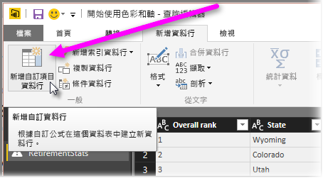

# 長條圖
在 Power BI 中建立長條圖的方式有幾種。 我們先從最簡單的方式開始，再繼續往下進行。

## 簡單的長條圖
一開始請決定哪個查詢具有您想要建立長條圖的欄位。  使用查詢的 [參考] 選項來建立新的查詢，並命名為 *FieldName Histogram* 。 使用 [轉換]  功能區中的 [群組依據]  選項，然後選取 [資料列計數]  彙總。 確定所產生之彙總資料行的資料類型為數值。 然後您可以在報表頁面上以視覺化方式呈現這項資料。 此方法建立過程快速且容易，但如果您有許多資料點且不允許跨多種視覺效果進行筆刷繪製，則不適用。

## 定義值區以建立長條圖
決定哪個查詢具有您想要建立長條圖的欄位。 使用查詢的 [參考] 選項來建立新的查詢，並命名為 *FieldName* 。  現在使用規則來定義值區。 使用 [加入資料行]  功能區上的 [加入自訂資料行]  選項，並建立自訂規則。

確定所產生之彙總資料行的資料類型為數值。 您現在可以使用本文稍早之＜簡單的長條圖＞  中所述的群組依據方法來取得長條圖。 這個選項會處理更多資料點，但仍無法解決筆刷繪製的問題。

## 定義支援筆刷繪製的長條圖
筆刷繪製是指將視覺效果連結在一起，以便使用者選取某個視覺效果中的資料點時，報表頁面上的其他視覺效果會醒目提示或篩選與所選資料點相關的資料點。  由於我們要在查詢期間操作資料，因此需要建立資料表之間的關聯性，並確保知道哪個詳細資料項目與長條圖中的值區相關，反之亦然。

在具有您想要建立長條圖之欄位的查詢上，使用 [參考] 選項開始進行這個程序。  將新的查詢命名為 *Buckets* 。  在本例中，我們將原始查詢稱為 *Details* 。  接著移除所有資料行，只留下要做為長條圖值區使用的資料行。  現在，在查詢中使用 [移除重複項目] 功能，如此留在資料行中的值便是唯一的值；您可以選取資料行，然後在快顯功能表中找到這項功能。 如果您有十進位數字，您可以先使用定義值區的秘訣來建立長條圖，以取得一組可管理的值區。  現在，檢查查詢預覽中顯示的資料。 如果您看到空白值或 Null，則必須先修正這些問題，再建立關聯性。 請參閱＜資料包含 Null 或空白值時建立關聯性＞。 使用這個方法時，由於需要排序，因此可能會造成問題。 若要讓值區正確排序，請參閱＜排列順序：以我想要的順序來顯示類別＞。 

> [!NOTE]
> 在建立任何視覺效果前先考慮排序次序會很有幫助。   
> 
> 

本程序中的下一個步驟是在值區資料行上，定義 *Buckets* 和 *Details* 查詢之間的關聯性。  在 *Power BI Desktop* 中，選取功能區中的 [管理關聯性]。  建立關聯性，其中 *Buckets* 位於左側資料表，而 *Details* 位於右側資料表，然後選取用於長條圖的欄位。 

最後一個步驟是建立長條圖。 從 *Buckets* 資料表拖曳 Bucket 欄位。 從產生的直條圖中移除預設欄位。  現在從 *Details* 資料表將長條圖欄位拖曳到同一個視覺效果上。 將欄位區中的預設彙總方式變更為 [計數]。 結果會產生長條圖。 如果您從 Details 資料表建立類似矩形式樹狀結構圖的另一個視覺效果，請選取矩形式樹狀結構圖中的某個資料點以查看長條圖的醒目提示，並顯示與整個資料集趨勢相關的所選資料點長條圖。

