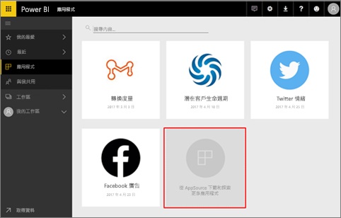
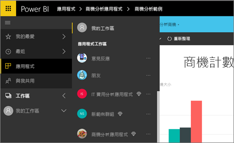
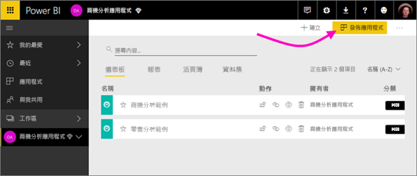

# 該如何在 Power BI 中進行共同作業和共用？

您已建立儀表板和報表。 或許您也透過它們與同事共同作業。 然後，您希望其他人可以存取它們。 散發它們的最佳方式為何？

在本文中，我們將比較 Power BI 內共同作業與共用的選項： 

* 與同事共同作業，以在「應用程式工作區」中建立有意義的報表和儀表板。
* 將這些儀表板和報告結合為「應用程式」，並將它們發佈給較大的群組或您的整個組織。
* 從服務或 Power BI 行動裝置應用程式，與一些人員共用儀表板或報表。
- 列印報表。
* 發佈至網路上的公用網站，讓世界上的任何人都可以看到並與其互動。

無論您選擇哪個選項，都必須具有 [Power BI Pro 授權](service-free-vs-pro.md)，或內容必須位於[進階容量](service-premium.md)中，才能共用儀表板。 根據您選擇的選項，檢視您儀表板的同事會有不同的授權需求。 下列各節組說明詳細資料。 

*Power BI 服務中的應用程式*

## 在應用程式工作區中與同事共同作業

當小組共同合作時，其需要存取相同的文件，讓他們可以快速地進行共同作業。 Power BI 中的應用程式工作區提供讓小組聚集在一起的地方，以便針對他們的重要儀表板、報表、資料集和活頁簿共用其擁有權和管理。 有時候 Power BI 使用者會根據組織的結構組織其工作區，其他時間則是針對特定專案建立工作區。 還是有其他組織使用數個工作區，來儲存他們所使用之不同版本的報表或儀表板。 

應用程式工作區提供的角色可決定您的同事具有哪些權限。 您可以使用這些角色來判斷可以管理整個工作區，或只是向其提供內容的人員。

有些使用者會自然地將內容放入 [我的工作區]，然後共用它。應用程式工作區在共同作業方面優於 [我的工作區]，因為它們提供內容的共同擁有權。 您和您的整個小組可以輕鬆地進行更新或授與其他人存取權。 [我的工作區] 最適合個人用於一次性或個人內容。

讓我們假設您有要與同事共用的已完成儀表板。 授與他們儀表板存取權的最佳方式為何？ 答案需視許多因素而定。 如果特定同事必須擁有儀表板並將它保持為最新狀態，或者需要存取應用程式工作區中的所有內容，最好是將它們新增至工作區中。 如果您的同事只需要查看該儀表板而不是工作區中的所有內容，您可以再次從一組替代項目中進行選擇。 如果儀表板是您必須散發給許多同事之更大內容集的一部分，則發佈應用程式可能是最佳選擇。 不過，如果同事只需要該儀表板，則共用儀表板可能是最佳前進途徑。 

深入了解[建立應用程式工作區](service-create-workspaces.md)。

**您知道嗎？** Power BI 正在預覽新的工作區體驗。 請閱讀[建立新的工作區 (預覽)](service-create-the-new-workspaces.md) 來查看工作區未來如何變更。 

## 建立應用程式來散發資料與見解

假設您想要將自己的儀表板散發給廣大的群眾。 您和同事已建立「應用程式工作區」，且接著在應用程式工作區中建立並調整儀表板、報表和資料集。 現在，您可以選取您想要的儀表板和報表，並將其以應用程式的形式發佈給群組或整個組織。 

在 Power BI 服務 ([https://powerbi.com](https://powerbi.com)) 中可輕鬆地找到及安裝應用程式。 您可以將應用程式的直接連結傳送給商務使用者，或者他們可以在 AppSource 中進行搜尋。 如果您的 Power BI 系統管理員賦予您權限，您可以在您同事的 Power BI 帳戶中自動安裝應用程式。 深入了解如何[發佈您的應用程式](consumer/end-user-create-apps.md)。 

當他們安裝應用程式之後，就可以在瀏覽器或行動裝置中檢視此應用程式。

若要讓使用者檢視您的應用程式，他們也必須有 Power BI Pro 授權，否則，應用程式必須儲存在 Power BI Premium 容量中。 如需詳細資訊，請參閱[什麼是 Power BI Premium？](service-premium.md)。

您也可以將應用程式發佈給組織外部的使用者。 他們可以檢視應用程式內容並與其互動，但不能與其他人共用應用程式內容。

## 共用儀表板和報表
假設您已在自己的 [我的工作區] 或在應用程式工作區中完成儀表板和報表，而且希望一些其他人可以存取此儀表板或報表。 其中一項存取方法是「共用」它。 

您和內容的共用對象都必須具有 Power BI Pro 授權，或內容必須位於 [Premium 容量](service-premium.md)的工作區中，才能共用內容。 當您共用儀表板或報表時，接受者可以檢視此儀表板或報表並與其互動，但是無法編輯此儀表板或報表。 除非資料列層級安全性 (RLS) 套用至基礎資料集，否則他們會看到您在儀表板和報表中看到的相同資料。 如果您允許的話，您與其共用的同事可以與他們的同事共用。 

您也可以與組織外部人員共用。 他們也可以檢視儀表板或報表並其互動，但不能共用儀表板或報表。 

深入了解從 Power BI 服務[共用儀表板和報表](service-share-dashboards.md)。 您也可以將篩選新增至連結並[共用已篩選的報表檢視](service-share-reports.md)。

## 從 Power BI 行動裝置應用程式標註並共用
在 iOS 和 Android 裝置的 Power BI 行動裝置應用程式中，您可以標註磚、報表或視覺效果，然後透過電子郵件與任何人共用它。 

您會共用磚、報表或視覺效果的快照集，而收件者會看到它與您送出郵件時完全相同的內容。 該郵件還包含儀表板或報告的連結。 如果收件者具有 Power BI Pro 授權，或內容位於[進階容量](service-premium.md)中，而且您已經與收件者共用物件，他們便可加以開啟。 您可以將磚的快照集傳送給任何人，而不只是同一電子郵件網域中的同事而已。

深入了解從 iOS 和 Android 的行動應用程式[標註並共用磚、報表和視覺效果](consumer/mobile/mobile-annotate-and-share-a-tile-from-the-mobile-apps.md)。

您也可以從 Windows 10 裝置的 Power BI 應用程式[共用磚的快照集](consumer/mobile/mobile-windows-10-phone-app-get-started.md)。

## 列印或儲存為 PDF 或其他靜態檔案
您可以從 Power BI 服務列印整份儀表板、儀表板磚、報表頁面或視覺效果，或將其儲存為 PDF (或其他靜態檔案格式)。 一次只能列印一頁報表 - 您無法一次列印整份報表。 深入了解[列印或儲存為靜態檔案](consumer/end-user-print.md)。

## 發行至網站

> [!WARNING]
> 僅使用 [發佈至網路] 來公開共用內容，而不是內部共用。

您可以將 Power BI 報表發行至整個網際網路，方法是在任何裝置上將互動式視覺效果內嵌到部落格文章、網站、社交媒體和其他線上通訊。 網際網路上的任何人都可以檢視您的報表，而且您無法控制誰可以查看您的發行內容。 他們不需要 Power BI 授權。 您只能在可編輯的報表中使用發行至網站。 如果報表是與您共用，或報表是在應用程式中，則您無法將報表發行至網站。 深入了解[發行至網站](service-publish-to-web.md).

## 後續步驟
* [與同事和其他人共用儀表板](service-share-dashboards.md)
* [在 Power BI 中建立和發佈應用程式](consumer/end-user-create-apps.md)
* 有任何意見嗎？ 請移駕 [Power BI 社群網站](https://community.powerbi.com/)提供您的建議。
* 有其他問題嗎？ [試試 Power BI 社群](http://community.powerbi.com/)。

