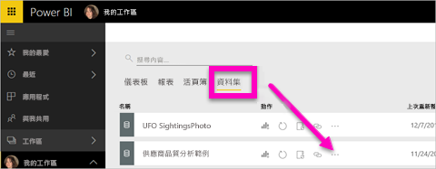
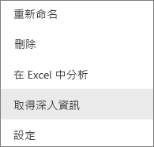
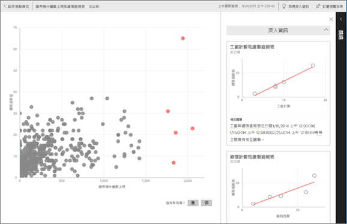
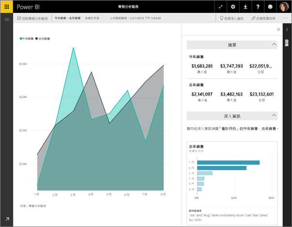

# 使用 Power BI 快速深入剖析
您有新資料集，但不太確定要從何處著手？  需要快速建置儀表板嗎？  想要快速尋找您可能錯失的深入剖析資訊嗎？

您可以執行快速深入剖析，根據您的資料產生相關的互動式視覺效果。 深入資訊摘要可以在整個資料集 (深入資訊摘要) 或特定的儀表板磚 (定義範圍的深入資訊) 上執行。 您甚至可以在深入剖析上執行深入資訊摘要！

> **注意**︰深入資訊摘要不適用於 DirectQuery，而僅適用於上傳至 Power BI 的資料。
> 
> 

快速深入剖析功能的基礎是建立於成長的[進階分析演算法組](service-insight-types.md)，此演算法組是與 Microsoft Research 合作開發的，我們會繼續使用它，讓更多人以新的、直覺式的方式在資料中尋找深入剖析。

## 對資料集執行快速深入剖析
觀看 Amanda 如何在資料集上執行深入資訊摘要、在焦點模式中開啟深入剖析、在儀表板中將其中一個深入資訊摘要釘選為磚，然後取得視覺效果的深入資訊摘要。

<iframe width="560" height="315" src="https://www.youtube.com/embed/et_MLSL2sA8" frameborder="0" allowfullscreen></iframe>

現在換您試試看。 使用[供應商品質分析範例](sample-supplier-quality.md)探索快速深入剖析。

1. 從 [資料集] 索引標籤中，選取省略符號 (...)，然後選擇 [取得深入資訊]。
   
    
   
    
2. Power BI 使用[各種演算法](service-insight-types.md)來搜尋資料集中的趨勢。
   
    
3. 您的深入剖析資訊會在幾秒內準備就緒。  選取 [檢視深入剖析資訊]  以顯示視覺效果。
   
    
   
   > **注意**︰某些資料集會因為資料不具統計顯著性，而無法產生深入資訊摘要。  若要深入了解，請參閱[將資料最佳化以進行快速深入剖析](service-insights-optimize.md)。
   > 
   > 
4. 視覺效果會在特殊的**深入資訊摘要**畫布中顯示，最多可包含 32 個不同的深入剖析卡片。 每張卡片會有一個圖表或圖形，並附上簡短的描述。
   
    

## 與深入資訊摘要卡片互動
  

1. 將滑鼠暫留在卡片上，然後選取釘選圖示，已將視覺效果新增至儀表板。
2. 將滑鼠暫留在卡片上，然後選取焦點模式圖示，以全螢幕顯示卡片。
   
    
3. 在焦點模式中，您可以︰
   
   * [篩選](service-interact-with-a-report-in-reading-view.md)視覺效果。  若要顯示篩選，請選取右上角的箭號來展開 [篩選] 窗格。
     
        
   * 選取釘選  圖示或 [釘選視覺效果]，以將深入資訊卡片釘選到儀表板。
   * 對深入資訊摘要卡片本身執行深入資訊摘要。 這就是**定義範圍快速深入剖析**。 在右上角，選取燈泡圖示  或 [取得資訊摘要]。
     
       
     
     深入資訊摘要會顯示於左側，只以該單一深入資訊摘要中資料為依據的新卡片則沿著右側顯示。
     
       
4. 若要返回原始的深入資訊摘要畫布，請選取左上角 [結束聚焦模式]。

## 在儀表板磚上執行快速深入剖析
不要搜尋針對整個資料集的深入剖析，而是縮小搜尋範圍到用來建立單一儀表板磚的資料。 這就是**定義範圍快速深入剖析**。

1. 開啟儀表板。
2. 選取磚，然後[以焦點模式開啟磚](service-focus-mode.md)。
3. 在右上角選取**取得深入剖析**。
   
    
4. Power BI 沿著磚的右側顯示資訊摘要卡片。
   
    
5. 一個深入剖析是否引起您的興趣？ 選取該資訊摘要卡片可挖掘更深入的資料。 選取的深入資訊摘要會顯示於左側，只以該單一深入資訊摘要中資料為依據的新資訊摘要卡片則沿著右側顯示。
6. 持續探索您的資料，然後當您發現有趣的深入資訊摘要，選取右上角的 [釘選視覺效果]，將視覺效果釘選在儀表板。 此外，您可以傳送意見反應，讓資料集擁有者知道特定的深入資訊摘要是否有幫助。
   
    

## 後續步驟
如果您擁有資料集，請[針對深入資訊摘要將它最佳化](service-insights-optimize.md)。

深入了解[可用深入資訊摘要類型](service-insight-types.md)

有其他問題嗎？ [試試 Power BI 社群](http://community.powerbi.com/)

