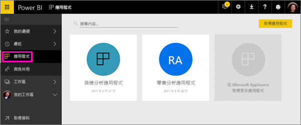
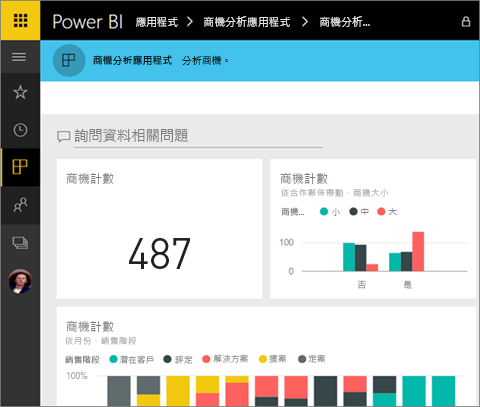
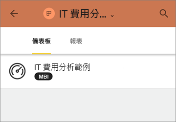
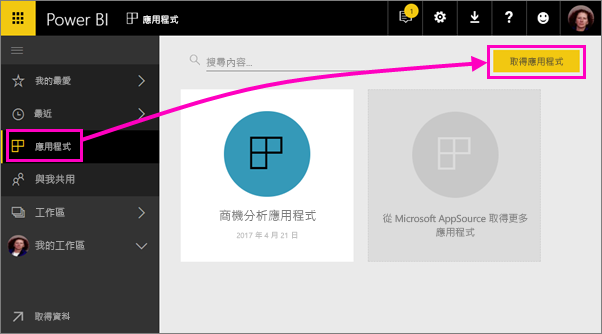

# 使用 Power BI 中的儀表板和報表安裝並使用應用程式
Power BI 的*應用程式*會將相關的儀表板和報表全都帶到同一處。 組織中的人員可使用關鍵的商務資訊來建立及發佈應用程式。 也許您已在使用 Google Analytics (分析) 和 Microsoft Dynamics CRM 這類[外部服務](service-connect-to-services.md)，而其中亦提供 Power BI 應用程式。 

在 Power BI 服務 ([https://powerbi.com](https://powerbi.com)) 和行動裝置中可以輕鬆找到並安裝應用程式。 安裝完應用程式之後，因為所有儀表板都會集中在應用程式、瀏覽器或在行動裝置中，所以您不必記住許多不同儀表板的名稱。

透過應用程式，每當應用程式作者發行更新時，您就會自動看到變更。 作者也會控制資料重新整理的排程頻率，因此您無須擔心如何將其保持在最新狀態。 

計劃撰寫應用程式嗎？ 如需詳細資訊，請參閱[在 Power BI 中建立和發佈應用程式](service-create-distribute-apps.md)。

## 取得新的應用程式
您可以透過一些不同的方式取得應用程式。 應用程式作者可以在您的 Power BI 帳戶中自動安裝應用程式，或將應用程式的直接連結傳送給您，或者您可以在 AppSource 中搜尋應用程式，而在 AppSource 中，您可以看到所有可存取的應用程式。 在行動裝置上的 Power BI 中，您只可從直接連結進行安裝，而不可從 AppSource。 如果應用程式作者自動安裝應用程式，您就會在您的應用程式清單中看到它。

### 透過直接連結安裝應用程式
自行安裝新應用程式的最簡單方式是向應用程式作者取得直接連結。 Power BI 會建立安裝連結，作者可傳送該連結給您。

**在您的電腦上** 

當您按一下電子郵件中的連結時，Power BI 服務 ([https://powerbi.com](https://powerbi.com)) 就會在瀏覽器中開啟。 您確認想要安裝應用程式，而且它會開啟到應用程式登陸頁面。

**在您的 iOS 或 Android 行動裝置上** 

當您在行動裝置上按一下電子郵件中的連結時，應用程式就會自動安裝並開啟應用程式內容清單。 

### 從 Microsoft AppSource 取得應用程式
您也可以從 Microsoft AppSource 尋找並安裝任何您可存取的應用程式。 

1. 選取 [應用程式]  > [取得應用程式]。 
   
     
2. 在 AppSource 的 [我的組織] 下方，您可以進行搜尋以縮小結果範圍，並尋找您要尋找的應用程式。
   
     ![在 AppSource 的 [我的組織] 下](media/service-install-use-apps/power-bi-appsource-my-org.png)
3. 選取 [Get it now]\(立即取得)，將它新增至 [應用程式] 頁面。 

## 與應用程式中的儀表板和報表互動
現在，您可以探索應用程式中儀表板和報表的資料。 您可以進行所有標準 Power BI 互動，例如篩選、反白顯示、排序和向下鑽研。 閱讀[與 Power BI 中的報表互動](service-reading-view-and-editing-view.md)。 

您無法儲存您進行的變更，但可以隨時從報表中的資料表或其他視覺效果[將資料匯出至 Excel](power-bi-visualization-export-data.md)。

## 後續步驟
* [在 Power BI 中建立和發佈應用程式](service-create-distribute-apps.md)
* [外部服務的 Power BI 應用程式](service-connect-to-services.md)
* 有問題嗎？ [嘗試在 Power BI 社群提問](http://community.powerbi.com/)

