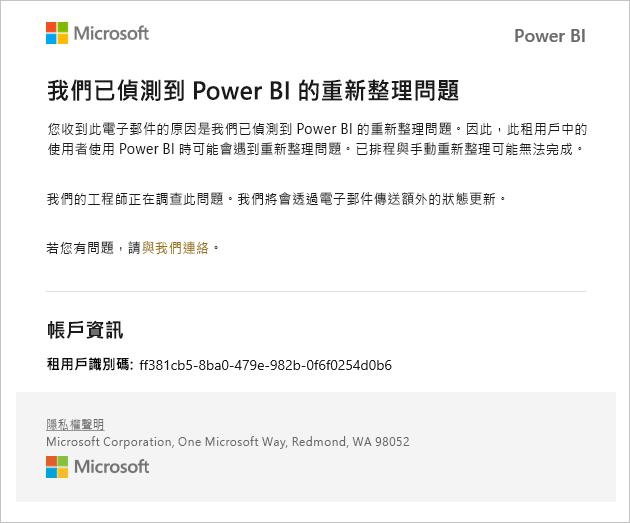

# 服務中斷通知

取得任務關鍵性商務應用程式的可用性見解相當重要。 Power BI 提供事件通知，因此您可以選擇是否要在服務中斷或效能降低時收到電子郵件。 雖然在 Power BI 的 99.9% 服務等級協定 (SLA) 保護下，這類情況很罕見，但我們仍想確保您隨時掌握情況。 下列螢幕擷取畫面顯示當您啟用通知時，可收到的電子郵件類型：

目前，我們會針對下列_可靠性案例_傳送電子郵件：

- 開啟報表可靠性
- 模型重新整理可靠性
- 查詢重新整理可靠性

在解決事件之後，您會收到後續的電子郵件。

> [!NOTE]
> 這項功能目前僅適用於 Power BI Premium 中的專用容量， 而不適用於共用容量。

## 啟用通知

Power BI 租用戶系統管理員可在管理入口網站中啟用通知：

1. 識別或建立應接收通知並已啟用電子郵件功能的安全性群組。

1. 在管理入口網站中，選取 [租用戶設定]  。 在 [說明及支援設定]  下方，展開 [Receive email notifications for service outages or incidents] \(接收服務中斷或事件的電子郵件通知\)  。

1. 啟用通知，輸入安全性群組，然後選取 [套用]  。

    

> [!NOTE]
> Power BI 會透過 no-reply-powerbi@microsoft.com 帳戶傳送通知。 請確認此帳戶已列入允許清單，以免通知被送入垃圾郵件或垃圾資料夾中。

## 後續步驟

[Power BI Pro 和 Power BI Premium 支援選項](service-support-options.md)

有其他問題嗎？ [試試 Power BI 社群](http://community.powerbi.com/)