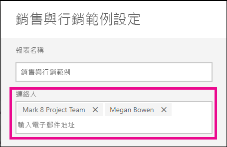

# 在 Power BI 服務中設定報表與儀表板的連絡人資訊
此文章說明如何在 Power BI 服務中為報表與儀表板設定連絡人資訊。

> [!NOTE]
> 您可以為傳統或新式工作區中的項目設定連絡人資訊。 您無法為 [我的工作區] 中的項目設定連絡人資訊。 當以[新外觀](service-new-look.md)檢視報表或儀表板時，會顯示此資訊卡片。

您可以將更多使用者或群組新增到項目的連絡人。 他們可以是：
* 個人
* Office 365 群組
* 已啟用電子郵件的安全性群組
* 通訊群組清單

根據預設，建立新報表或儀表板的人是它的連絡人。 若設定某值，它會覆寫預設值。 您當然可以將所有人或群組從連絡人清單移除。 當您這樣做時，針對傳統工作區，將會顯示該工作區的 Office 365 群組。 針對新工作區體驗工作區，將會使用[工作區連絡人清單](service-create-the-new-workspaces.md#workspace-contact-list)。 若未設定工作區連絡人清單，則會顯示工作區系統管理員。

連絡人資訊會顯示給檢視項目的人。 

 

當您按一下連絡人清單時，會建立電子郵件，以便您可以詢問問題或取得協助。 

 
 
連絡人清單資訊也會用於其他地方。 例如，它會顯示在錯誤對話方塊的一些錯誤案例中。 與項目相關的自動化電子郵件訊息 (如存取要求) 會傳送到連絡人清單。 

> [!NOTE]
> 發行應用程式時，個別項目上的連絡人資訊會設定為發行或更新應用程式的人。 您可以設定應用程式支援 URL，以便應用程式使用者可以在需要時取得協助。

## 為報表設定連絡人資訊
1. 在工作區中，選取 [報表]  索引標籤。
2. 找到想要的報表，然後選取 [設定]  圖示。
3. 找到 [連絡人]  輸入欄位並設定值。

     

## 設定儀表板的連絡人資訊
1. 在工作區中，選取 [儀表板]  索引標籤。
2. 找到想要的儀表板，然後選取 [設定]  圖示
3. 找到 [連絡人]  輸入欄位並設定值。

     

## 限制與考量
* 系統會為在 Power BI 服務中建立的新項目設定連絡人。 現有的項目將會顯示工作區預設值。
* 您可以在連絡人清單中設定任何使用者或群組，但系統不會自動為他們授與權限。 使用共用或透過角色賦予使用者存取工作區所需的權限。 
* 項目層級連絡人清單在發佈後不會推送至應用程式。 新的應用程式導覽體驗會提供您設定的支援 URL，以協助管理來自大量應用程式使用者的意見反應。

## 後續步驟

有其他問題嗎？ [試試 Power BI 社群](https://community.powerbi.com/)
