# Power BI 中的自動化機器學習 (預覽)

自動化 (AutoML) 適用於 machine learning 資料流程可讓商務分析師訓練、 驗證及叫用直接在 Power BI 中的機器學習模型。 它包含簡單的體驗，來建立新的 ML 模型，其中分析師可以使用其資料流程來指定輸入的資料來定型模型。 服務會自動擷取的最相關的功能，選取適當的演算法和微調並驗證 ML 模型。 在定型模型之後，Power BI 會自動產生報表，其中包含說明效能的驗證的結果和分析師的結果。 模型則可以對任何新的或更新的資料在資料流程內叫用。

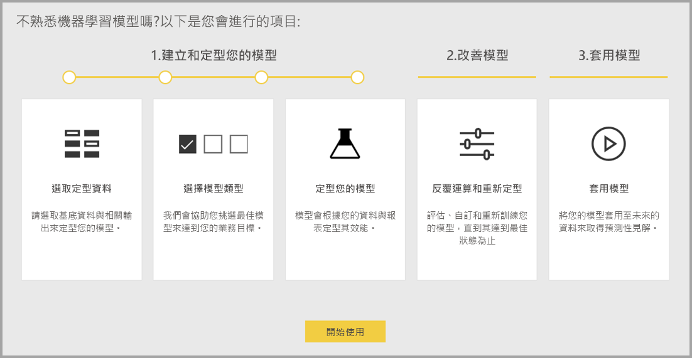

自動化的機器學習服務可供裝載於 Power BI Premium 和 Embedded 容量的資料流程。 在此預覽中，AutoML 可讓您定型的二元預測、 分類和迴歸模型的機器學習服務模型。

## 使用 AutoML

[Power BI 資料流程](service-dataflows-overview.md)提供適用於巨量資料的自助資料準備。 AutoML 可讓您運用您的資料準備工作，來建置機器學習服務模型，直接在 Power BI 中。

在 Power BI 中的 AutoML 可讓建置簡化的體驗，與機器學習服務模型中使用資料流程的資料分析師使用 Power BI 的技巧就。 大部分的 ML 模型建立的資料科學會由 Power BI 中，自動化，以確保所產生之模型有很好的品質和曝光機會，讓您用來建立您的 ML 模型的程序的完整深入 guardrails 使用。

AutoML 支援建立**二元預測**，**分類**，並**迴歸**資料流程的模型。 這些是受監督的機器學習模型，這表示他們了解從過去的觀察值，以預測其他的觀察值的結果，已知結果的類型。 定型 AutoML 模型的輸入資料集是一組記錄所**標示為**與已知的結果。

整合 Power BI 中的 AutoML[自動化 ML](https://docs.microsoft.com/azure/machine-learning/service/concept-automated-ml)從[Azure Machine Learning 服務](https://docs.microsoft.com/azure/machine-learning/service/overview-what-is-azure-ml)來建立您的 ML 模型。 不過，您不需要使用 AutoML Power BI 中的 Azure 訂用帳戶。 訓練和裝載 ML 模型的程序是完全由 Power BI 服務管理。

在定型的 ML 模型之後，AutoML 會自動產生說明可能的效能的 ML 模型的 Power BI 報表。 AutoML 強調 explainability，反白您影響您的模型傳回預測的輸入之間的關鍵影響因數。 此報表也包含重要計量給模型，根據 ML 模型類型而定。

所產生報告的其他頁面會顯示模型訓練詳細資料的統計摘要。 統計摘要是效能的想要看到的模型標準的資料科學量值的使用者感興趣。 訓練詳細資料摘要說明所有的反覆項目相關聯的模型參數以建立您的模型執行。 它也會描述每個輸入用來建立 ML 模型的方式。

您接著可以套用到您的資料進行評分的 ML 模型。 重新整理資料流程時，您的 ML 模型的預測會自動套用到您的資料。 Power BI 也包含個人化的 ML 模型會產生每個特定的預測分數的說明。

## 建立機器學習服務模型

本節說明如何建立 AutoML 學習模型。 

### 建立 ML 模型的資料準備

若要在 Power BI 中建立的機器學習模型，您必須先建立資料流程的資料與可用於定型的 ML 模型的歷程記錄的結果資訊。 如需有關設定至資料流程的詳細資訊，請參閱[在 Power BI 中的自助資料準備](service-dataflows-overview.md)。

在目前的版本中，Power BI 會使用來自單一實體的資料來定型的 ML 模型。 因此如果您的歷程記錄資料包含多個實體，您必須到單一資料流程實體以手動方式加入資料。 您也應該新增任何可能會嘗試預測結果的強式預測值的商務計量的導出資料行。

AutoML 有特定的資料來定型機器學習模型的需求。 這些需求各節所述，根據個別的模型型別。

### 設定 ML 模型輸入

若要建立 AutoML 模型，選取 ML 圖示**動作**資料行的歷程記錄資料，然後選取資料流程實體**新增機器學習服務模型**。

簡化的體驗就會啟動，其中包含一個精靈，引導您完成建立 ML 模型的程序。 此精靈包含下列簡單的步驟。

1. 選取歷程記錄的結果資料，與您想要預測的欄位實體
2. 選擇您想要看到的預測類型所根據的模型型別
3. 選取您想要做為預測的訊號模型的輸入
4. 命名您的模型，並儲存您的組態

[歷程記錄結果] 欄位會識別用於定型的 ML 模型，如下圖所示的標籤屬性。

當您指定 [歷程記錄結果] 欄位時，AutoML 分析來識別該資料可以訓練的 ML 模型類型的標籤資料，並建議最有可能的 ML 模型類型，可以進行訓練。 

> [!NOTE]
> 您已選取的資料時，可能不支援某些模型類型。

AutoML 也會分析選取的實體來建議可以用於定型的 ML 模型的輸入中的所有欄位。 此程序是一個約略值，並為基礎統計分析，因此您應該檢閱可用的輸入。 任何相依於歷程記錄的結果欄位 （或 [標籤] 欄位） 的輸入不應該用於定型的 ML 模型，因為它們會影響其效能。

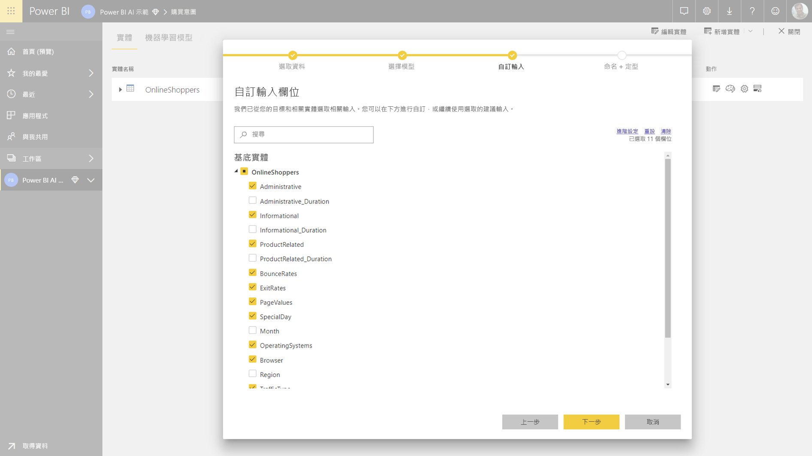

在最後一個步驟中，您可以將模型，並儲存其設定。

在這個階段，系統會提示您重新整理資料流程，開始 ML 模型訓練程序。

### ML 模型訓練

AutoML 模型的訓練是資料流程重新整理的一部分。 AutoML 先準備您的資料進行訓練。

AutoML 會分割成定型和測試資料集，您提供的歷程記錄資料。 測試資料集是用來驗證之後訓練的模型效能鑑效組集。 這些會實現成**定型集和測試**在資料流程中的實體。 AutoML 使用交叉驗證的模型驗證。

接下來，就會分析每個輸入的欄位，而且會套用插補，其中的替代值取代任何遺漏值。 AutoML 會使用幾個不同的插補的策略。 然後，任何必要的取樣和正規化會套用到您的資料。

AutoML 適用於數個轉換是每個選取的輸入的欄位，根據其資料類型和其統計屬性。 AutoML 會使用這些轉換，來擷取您的 ML 模型定型中使用的功能。

AutoML 模型定型程序是由使用不同的模型化演算法和超參數的設定，以找出效能最好的模型最多可到 50 個反覆項目所組成。 使用鑑效組測試資料集的驗證被評估每個這些模型的效能。 此訓練步驟期間，AutoML 會建立數條管線，適用於定型和驗證這些反覆項目。 評估模型效能的程序可能需要時間，任何位置從數分鐘到幾個小時，視您的資料集和可用的專用的容量資源的大小而定。

在某些情況下，產生的最終模型可以使用集團學習，其中有多個模型可用來提供更好預測的效能。

### AutoML 模型 explainability

在訓練模型之後，AutoML 會分析輸入的功能與模型輸出之間的關聯性。 它會評估的大小和方向的鑑效組測試資料集，每一個輸入功能的模型輸出的變更。 這就所謂*特徵重要性*。

### AutoML 模型報表

AutoML 產生摘要說明在驗證期間，以及通用的功能重要性的效能模型的 Power BI 報表。 報表摘要說明將 ML 模型套用至鑑效組測試資料，並比較已知的結果值與預測的結果。

您可以檢閱模型報表來了解其效能。 您也可以驗證模型的關鍵影響因數配合商務深入解析已知的結果。

圖表和量值，用來描述在報表中的模型效能取決於模型類型。 下列各節會說明這些效能圖表和量值。

在報表中的其他頁面可能需從資料科學觀點模型描述統計量值。 比方說，**二元預測**報表包括改善圖表和模型的 ROC 曲線。

報告中也包含**訓練細節**執行包含的模型定型，以及包含描述模型效能，透過每個反覆項目圖表描述的頁面。

在此頁面上的另一節會說明如何插補方法，用於填滿遺漏值的輸入欄位中，以及如何擷取模型中使用的功能已轉換的每個輸入的欄位。 它也包含最終的模型所使用的參數。

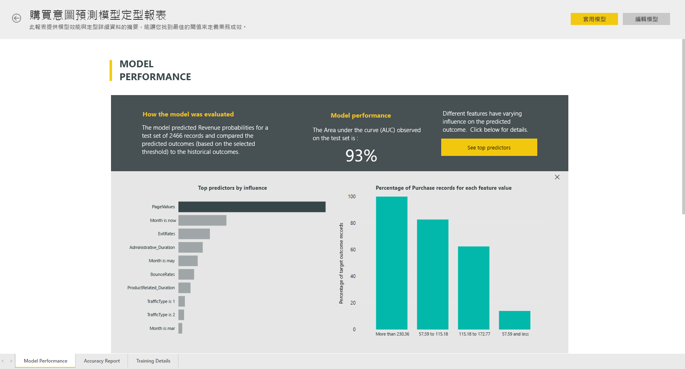

如果產生此模型使用集團學習，則**訓練細節**頁面也包含描述每個構成模型集團，以及其參數的加權的區段。

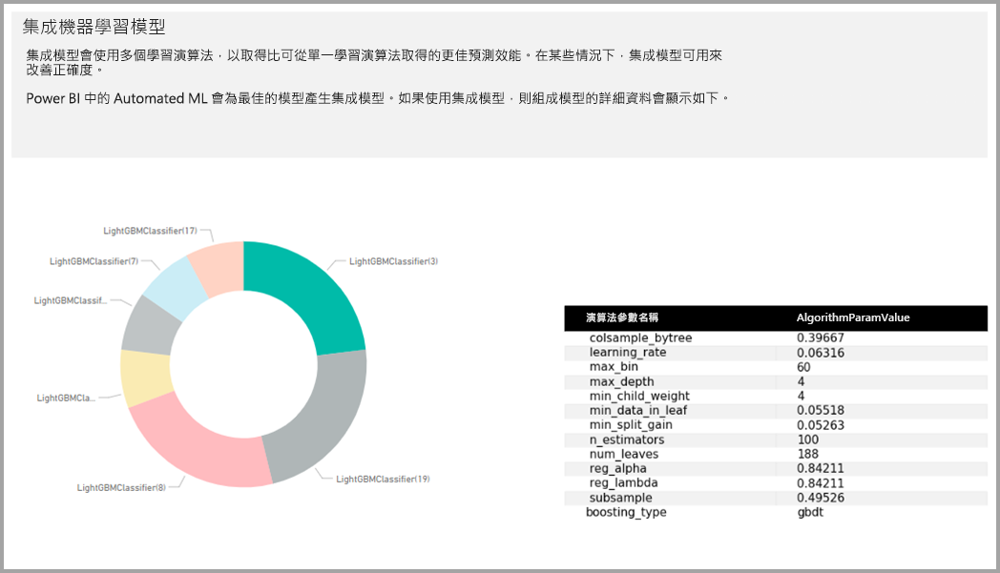

## 套用 AutoML 模型

如果您滿意所建立的 ML 模型的效能，您可以將它套用至新的或更新的資料重新整理您的資料流程時。 您可以從模型的報表中，選取**套用**右上角的按鈕。

若要套用的 ML 模型，您必須指定將會加入至模型輸出的這個實體的資料行必須套用它，實體和前置詞的名稱。 資料行名稱的預設前置詞是模型名稱。 *套用*函式可能包含模型類型特有的其他參數。

將 ML 模型套用後置詞建立新的資料流程實體**豐富 < model_name >** 。 比方說，如果您套用_PurchaseIntent_模型到_OnlineShoppers_實體，輸出將會產生**OnlineShoppers 豐富 PurchaseIntent**。

目前，輸出實體不能用於預覽中的 Power Query 編輯器 ML 模型的結果。 輸出資料行一定會顯示 null 做為結果。 若要檢視結果，第二個輸出後置詞的實體**豐富 < model_name > 預覽**套用模型時建立。

您必須重新整理預覽結果在 [查詢編輯器] 中的資料流程。

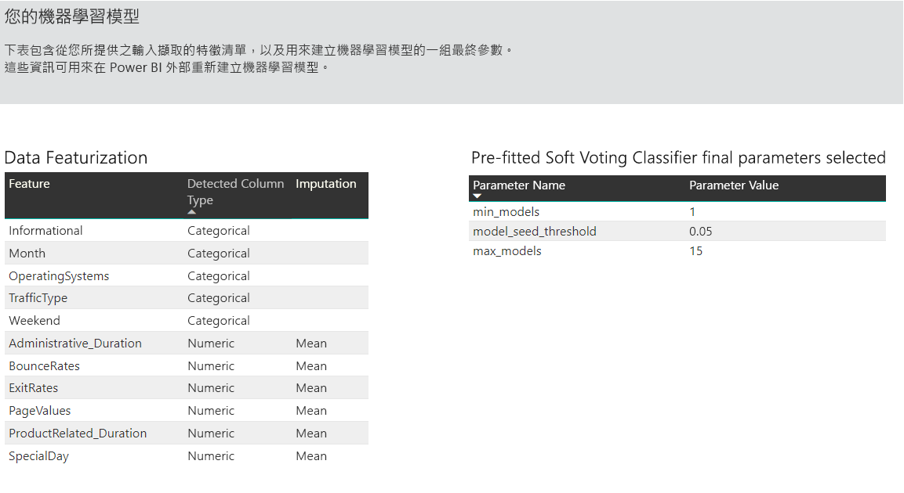

當您將模型套用 AutoML 一律會保留您預測最新重新整理資料流程時。

AutoML 也會包含輸出實體中的個人化的說明，每個資料列，其分數。

若要在 Power BI 報表中使用的深入解析及從 ML 模型的預測，您可以從連接到輸出實體使用 Power BI Desktop**資料流程**連接器。

## 二元預測模型

二進位的預測模型，稱為更正式的說法**二元分類模型**，可用來分類資料集分成兩個群組。 會使用它們來預測可以有二進位結果，例如是否會將轉換的銷售機會，不論帳戶將會流失，是否準時; 支付發票的事件交易是否詐騙，依此類推。

由於結果是二進位，Power BI 會預期二元預測模型必須為布林值，與已知結果被標示為標籤 **，則為 true**或是**false**。 比方說，在銷售良機轉換模型中，已贏得的銷售機會標示，則為 true，已遺失標示為 false，並已開啟的銷售商機標示 null。

二元預測模型的輸出是機率分數，用來識別對應到標籤值，則為 true 的結果將會達到的可能性。

### 定型的二元預測模型

若要建立二進位的預測模型，包含將訓練資料的輸入的實體必須的布林值欄位來識別過去的已知的結果的 [歷程記錄結果] 欄位。

必要條件：

* 必須為歷程記錄的結果欄位使用的布林值欄位
* 50 個歷程記錄資料列至少須具備結果的每個類別

一般情況下，如果過去的結果由不同的資料類型的欄位，您可以新增要轉換成布林值，使用 Power Query 的這些導出資料行。

建立的程序的二進位的預測模型會遵循相同步驟其他 AutoML 模型，一節所述**設定 ML 模型輸入**上方。

### 二進位預測模型的報表

二元預測模型產生做為輸出的記錄，以達到結果為 True 的布林值的標籤值所定義的機率。 此報表包含交叉分析篩選器的機率臨界值，會影響上方和下方的機率臨界值的分數的解譯方式。

報表描述的模型效能*真肯定*，*誤判*，*真否定*並*誤否定*. 真肯定和真否定是兩個類別中的結果資料的正確預測的結果。 誤肯定會有實際的布林值標籤的值為 False，但預測為 True 的結果。 相反地，誤否定是實際的布林值標籤值為 True，但預測為 False 的結果。

量值，例如精確度與回收，說明預測結果的機率臨界值的效果。 您可以使用機率臨界值交叉分析篩選器選取可達到精確度與回收之間取得折衷平衡臨界值。

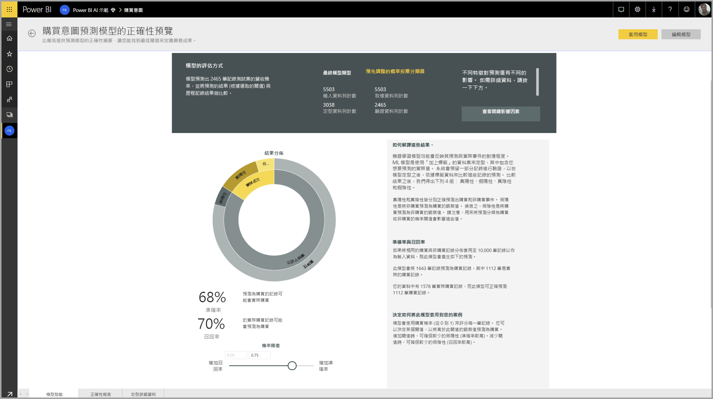

**精確度報表**模型報表的頁面包含*累計獲益*圖表和 ROC 曲線的模型。 這些是模型效能的統計量值。 報告包含圖表所示的描述。

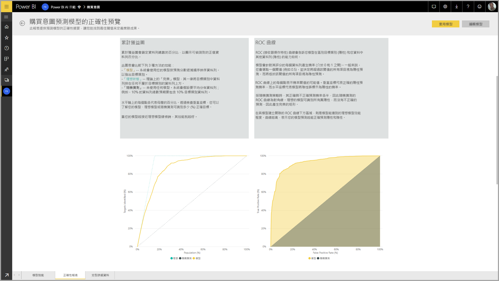

### 套用二元預測模型

若要套用的二元預測模型，您必須指定實體與您要套用的 ML 模型的預測的資料。 其他參數包含輸出資料行名稱前置詞和分類的預測的結果的機率臨界值。

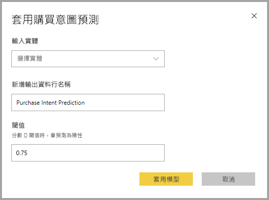

套用二元預測模型時，它會將三個輸出資料行加入至已充實的輸出實體中。 這些是**PredictionScore**， **PredictionOutcome**並**PredictionExplanation**。 在實體中的資料行名稱有時將模型套用指定的前置詞。

**PredictionOutcome**資料行包含預測的結果的標籤。 記錄超過臨界值的機率預測為可能達到的結果，並指低於 「 預測為可能無法達到的結果。

**PredictionExplanation**資料行包含與輸入的特徵有特定影響解釋**PredictionScore**。 這是 JSON 格式的集合加權為預測的輸入功能。

## 分類模型

若要將資料集分類成多個群組或類別會使用分類模型。  會使用它們來預測可以有多個可能的結果，例如客戶是否可能有極高、 高、 中或低的存留時間值; 其中的事件預設的風險是高、 中度、 低或極低;等等。

分類模型的輸出是機率分數，識別一筆記錄，以達到特定類別的準則的可能性。

### 定型分類模型

輸入包含您的分類模型的訓練資料的實體必須具有和歷程記錄的結果欄位中，用來識別過去的已知的結果的字串或數值的欄位。

必要條件：

* 50 個歷程記錄資料列至少須具備結果的每個類別

建立的程序的分類模型會遵循相同步驟，其他 AutoML 模型，一節所述**設定 ML 模型輸入**上方。

### 分類模型的報表

分類模型的報表會產生將 ML 模型套用至鑑效組測試資料和比較的一筆記錄的實際已知類別與預測的類別。

模型報告包含圖表，其中包含的每個已知類別的正確和錯誤分類記錄分解。

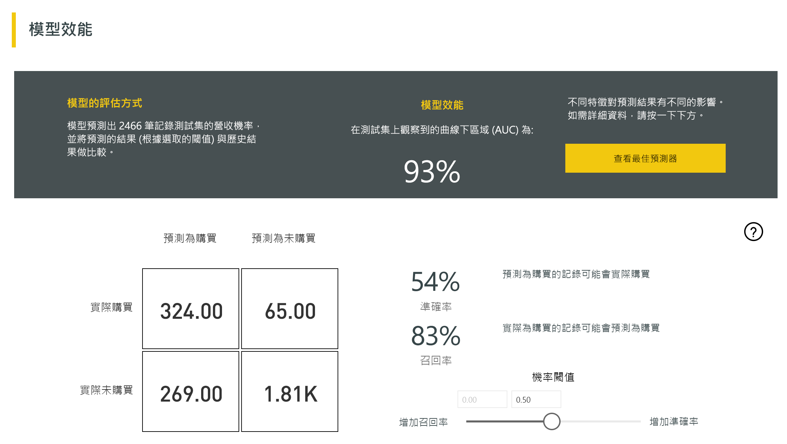

進一步特定類別的向下鑽研可讓分析如何散發已知類別的預測。 這包括其他類別中的已知類別的記錄是可能會被歸類。

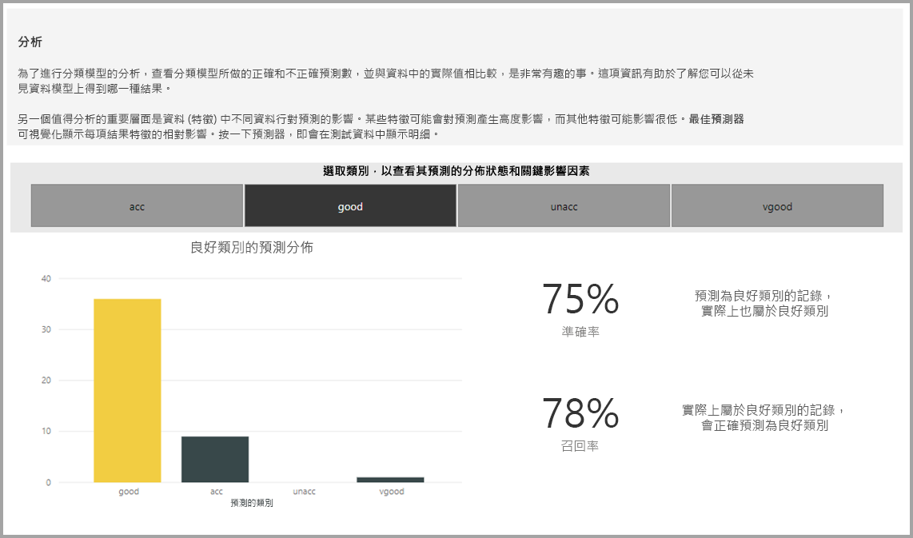

在報表中的模型說明也包含每個類別最上層的預測值。

分類模型的報表也包含訓練詳細資料 頁面類似於其他模型類型，如頁面一節中所述**AutoML 模型報表**稍早在這篇文章。

### 套用分類模型

若要套用的分類 ML 模型，您必須使用輸入的資料和輸出資料行名稱前置詞指定的實體。

套用分類模型時，它會新增三個輸出資料行加入豐富的輸出實體。 這些是**PredictionScore**， **PredictionClass**並**PredictionExplanation**。 在實體中的資料行名稱有時將模型套用指定的前置詞。

**PredictionClass**資料行包含資料錄的最有可能的預測類別。 **PredictionScore**資料行包含的每個可能的類別的記錄機率分數的清單。

**PredictionExplanation**資料行包含與輸入的特徵有特定影響解釋**PredictionScore**。 這是 JSON 格式的集合加權為預測的輸入功能。

## 迴歸模型

會使用迴歸模型來預測的值，例如可能會帶來什麼銷售交易的存留時間值的帳戶，應收帳款的發票可能要支付，可能會在其支付發票的日期數量的營收依此類推。

迴歸模型的輸出是預測的值。

### 定型的迴歸模型

輸入包含迴歸模型的定型資料的實體必須具有與歷程記錄的結果欄位中，用來識別過去的已知的結果值的數值欄位。

必要條件：

* 歷程記錄資料的 100 個資料列至少須具備迴歸模型

建立的程序的迴歸模型會遵循相同步驟，其他 AutoML 模型，一節所述**設定 ML 模型輸入**上方。

### 迴歸模型的報表

其他 AutoML 模型跟報表一樣，迴歸報表根據將模型套用的鑑效組測試資料的結果。

模型報表包含比較實際值的預測的值的圖表。 在此圖中，從對角線的距離會指示預測中的錯誤訊息。

剩餘的錯誤圖表會顯示在鑑效組測試資料集中的不同值的平均誤差百分比的分佈。 水平軸代表群組的實際值的平均值在該範圍內顯示的頻率或值計數的泡泡圖的大小。 垂直軸是平均的剩餘項目時發生錯誤。

迴歸模型的報表也包含其他模型類型，報表的訓練詳細資料頁面一節中所述**AutoML 模型報表**上方。

### 套用迴歸模型

若要套用的迴歸 ML 模型，您必須使用輸入的資料和輸出資料行名稱前置詞指定的實體。

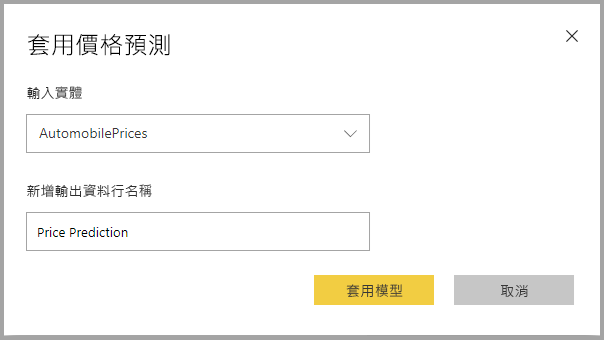

套用迴歸模型時，它會將兩個輸出資料行加入至已充實的輸出實體中。 這些是**PredictionValue**，並**PredictionExplanation**。 在實體中的資料行名稱有時將模型套用指定的前置詞。

**PredictionValue**資料行包含預測的值的輸入欄位為基礎之資料錄。 **PredictionExplanation**資料行包含與輸入的特徵有特定影響解釋**PredictionValue**。 這是 JSON 格式的輸入特徵權數的集合。

## 後續步驟

本文提供 Power BI 服務中的資料流程自動化機器學習服務的概觀。 下列文件也很有用。

* [教學課程：建立 Power BI （預覽） 中的機器學習服務模型](service-tutorial-build-machine-learning-model.md)
* [教學課程：在 Power BI 中使用認知服務](service-tutorial-use-cognitive-services.md)
* [教學課程：在 Power BI 中叫用 Machine Learning Studio 模型 (預覽)](service-tutorial-invoke-machine-learning-model.md)
* [Power BI 中的認知服務 (預覽)](service-cognitive-services.md)
* [Power BI 與 Azure Machine Learning 的整合 (預覽)](service-machine-learning-integration.md)

如需有關資料流程的詳細資訊，您可以閱讀下列文章：
* [在 Power BI 中建立及使用資料流程](service-dataflows-create-use.md)
* [使用 Power BI Premium 上的計算的實體](service-dataflows-computed-entities-premium.md)
* [使用內部部署資料來源的資料流程](service-dataflows-on-premises-gateways.md)
* [Power BI 資料流程的開發人員資源](service-dataflows-developer-resources.md)
* [資料流程與 Azure Data Lake 的整合 (預覽)](service-dataflows-azure-data-lake-integration.md)

