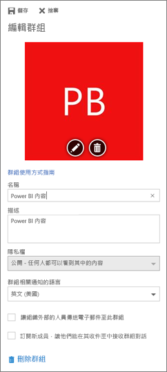

# 管理 Power BI 和 Office 365 中的應用程式工作區
[Power BI 或 Office 365 中應用程式工作區](service-install-use-apps.md)的建立者或管理員，有幾個管理 Power BI 中工作區的層面要管理。 您在 Office 365 中管理的其他層面。 

**在 Power BI** 中可：

* 新增或移除應用程式工作區成員，包括將工作區成員設為系統管理員。
* 編輯應用程式工作區名稱。
* 刪除應用程式工作區。

**在 Office 365 中** 可以：

* 新增或移除應用程式工作區的群組成員，包括將成員設為系統管理員。
* 編輯群組名稱、影像、描述和其他設定。
* 查看群組電子郵件地址。
* 刪除群組。

您需要 [Power BI Pro](service-free-vs-pro.md) 授權，才能成為應用程式工作區的系統管理員或成員。 除非您的應用程式工作區在 Power BI Premium 容量中，否則，您的應用程式使用者也需要 Power BI Pro 授權。 然後，商務使用者就可以改用 Power BI 免費授權來存取您的應用程式。 如需詳細資訊，請參閱[什麼是 Power BI Premium？](service-premium.md)。

## 編輯 Power BI 中的應用程式工作區
1. 在 Power BI 服務中，選取 [工作區] 旁邊的箭號 > 選取工作區名稱旁邊的省略符號 (**...**) > [編輯工作區]。 
   
   
   
   > [!NOTE]
   > 如果您是應用程式工作區系統管理員，只會看到 [編輯工作區]。
   > 
   > 
2. 您可在此重新命名、新增或移除成員，或刪除應用程式工作區。 
   
   
3. 選取 [儲存]  或 [取消] 。

## 編輯 Office 365 中的 Power BI 應用程式工作區屬性
1. 在 Power BI 服務中，選取 [工作區]  旁邊的箭號 > 選取工作區名稱旁邊的省略符號 (**...**) > [成員]。 
   
   
   
   這會開啟應用程式工作區的 Outlook for Office 365 群組檢視。
   
   您可能需要登入公司帳戶。
2. 點選成員名稱旁邊的省略符號 (**...**)，將該成員設為系統管理員，或將該成員從應用程式工作區中刪除。 
   
   

## 在 Office 365 群組中新增影像以及設定其他工作區屬性
從應用程式工作區散發應用程式時，您在這裡新增的影像會成為應用程式的影像。 請參閱[在 Power BI 中建立和散發應用程式](service-create-distribute-apps.md)文章的[將影像新增至您的應用程式](service-create-distribute-apps.md#add-an-image-to-your-app-optional)一節。

1. 在應用程式工作區的 Outlook for Office 365 檢視中，選取群組影像以編輯群組工作區屬性。
   
   
2. 您可以在這裡編輯名稱、描述、語言、新增映像，以及設定其他屬性。
   
   
3. 選取 [儲存]  或 [捨棄] 。

## 後續步驟
* [Power BI 中的應用程式是什麼？](service-install-use-apps.md)
* [在 Power BI 中建立應用程式和應用程式工作區](service-create-distribute-apps.md)
* 有其他問題嗎？ [試試 Power BI 社群](http://community.powerbi.com/)

