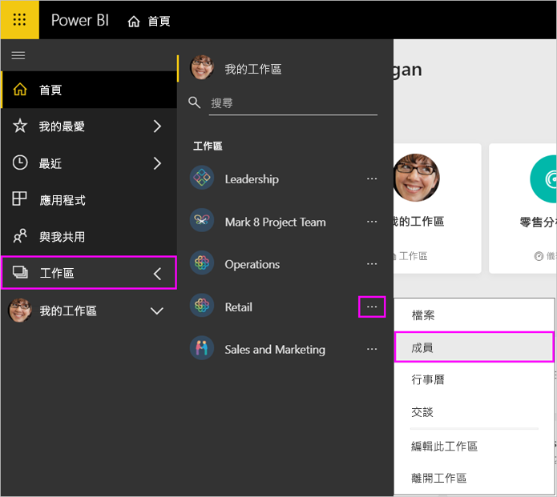
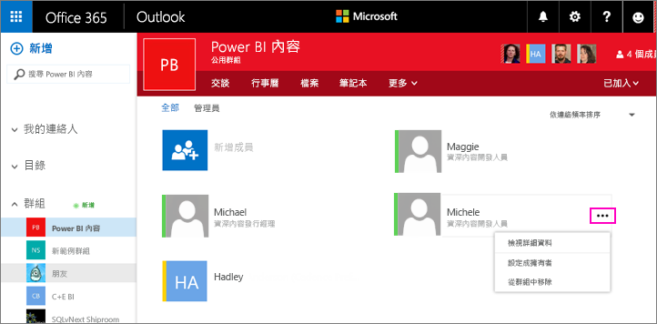

# 在 Power BI 和 Office 365 中管理工作區

身為 [Power BI 或 Office 365 中工作區](service-create-distribute-apps.md)的建立者或系統管理員，您可以在 Power BI 中管理工作區的一些層面。 您在 Office 365 中管理的其他層面。

> [!NOTE]
> 新工作區體驗會變更 Power BI 工作區與 Office 365 群組之間的關聯性。 每次建立其中一個新的工作區時，您都不會自動建立 Office 365 群組。 了解如何[建立新的工作區](service-create-the-new-workspaces.md)。

在 **Power BI** 中，您可以：

* 新增或移除工作區成員，包括將工作區成員設為系統管理員。
* 編輯工作區名稱。
* 刪除工作區。

在 **Office 365** 中，您可以：

* 新增或移除工作區的群組成員，包括將成員設為擁有者。
* 編輯群組名稱、影像、描述和其他設定。
* 查看群組電子郵件地址。
* 刪除群組。

您需要 [Power BI Pro 授權](service-features-license-type.md)才能成為工作區的系統管理員或成員。 您的應用程式使用者也需要 Power BI Pro 授權，除非您的工作區是位於 Power BI Premium 容量中。 如需詳細資訊，請參閱[什麼是 Power BI Premium？](service-premium-what-is.md)。

## 在 Power BI 中編輯工作區

1. 在 Power BI 服務中，選取 [工作區]  旁邊的箭頭 > 選取工作區名稱旁邊的 [更多選項]  (…) > [編輯此工作區]  。

   

   > [!NOTE]
   > 只有在您是工作區的系統管理員時，您才會看到 [編輯此工作區]  。

1. 您可在此重新命名工作區、新增或移除成員，或刪除工作區。

   ![[編輯工作區] 對話方塊](media/service-manage-app-workspace-in-power-bi-and-office-365/power-bi-app-edit-workspace.png)

1. 選取 [儲存]  或 [取消]  。

## 在 Office 365 中編輯 Power BI 工作區屬性

您也可以直接在 Office 365 Outlook 中編輯工作區的層面。

### 編輯工作區群組的成員

1. 在 Power BI 服務中，選取 [工作區]  旁邊的箭頭 > 選取工作區名稱旁邊的 [更多選項]  (…) > [成員]  。

   

   這會開啟工作區的 Office 365 Outlook 群組檢視。 您可能需要登入公司帳戶。

1. 選取小組成員名稱旁邊的角色，將該人員設為 [成員]  或 [擁有者]  。 選取 [X]  以從群組中移除該人員。

   

### 新增影像並設定其他工作區屬性

當從工作區散發應用程式時，您在此處所新增影像便會是您應用程式的影像。 請參閱＜建立新工作區＞  一文中的[將影像新增至 Office 365 工作區](service-create-workspaces.md#add-an-image-to-your-office-365-workspace-optional)。

1. 在工作區的 Office 365 Outlook 檢視中，前往 [關於]  索引標籤並選取 [編輯]  。

    
1. 您可以編輯群組相關通知的名稱、描述和語言。 您也可以在這裡新增影像並設定其他屬性。

   ![[編輯群組] 對話方塊](media/service-manage-app-workspace-in-power-bi-and-office-365/pbi_editgrpo365dialog.png)

1. 選取 [儲存]  或 [捨棄]  。

## 後續步驟

* [使用 Power BI 發佈應用程式](service-create-distribute-apps.md)

* 有其他問題嗎？ [試試 Power BI 社群](https://community.powerbi.com/)
