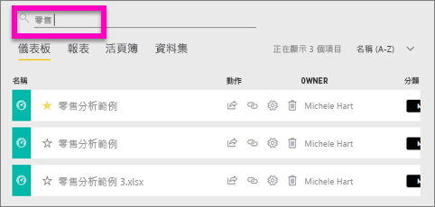
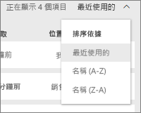
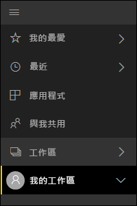

# 瀏覽：搜尋、尋找和排序 Power BI 服務中的內容
有許多方法可以瀏覽 Power BI 服務中的內容。 工作區中的內容會依類型加以組織：儀表板、報告、活頁簿和資料集。  而內容也會依使用情況加以組織：我的最愛、最近、應用程式、與我共用及精選。 這些通往您的內容的不同路徑，可讓您在 Power BI 服務中快速找出您所需的內容。  

>[!NOTE] 
>本文適用於 Power BI 服務 (app.powerbi.com)，不適用於 Power BI Desktop。

## 在工作區內瀏覽

Power BI 服務會依類型來劃分您的工作區內容：儀表板、報告、活頁簿和資料集。 當您選取工作區時，您將會看到此組織方式。 在此範例中，應用程式工作區名為「銷售與行銷應用程式範例」，其中包含 2 個儀表板、6 份報告、1 個活頁簿，以及 5 個資料集。

________________________________________

## 工作區中的搜尋和排序
工作區有四個內容索引標籤︰[儀表板]、[報表]、[活頁簿] 和 [資料集]。  所有這些索引標籤都包含一個搜尋欄位和一個排序按鈕。  當您開始使用 Power BI 服務時，可能不覺得這些有用，因為一個索引標籤只有一或兩個項目。不過，經過一段時間之後，您可能會有冗長的內容清單。  使用搜尋和排序，輕鬆地找出您需要的內容。

![[儀表板] 索引標籤](media/service-navigation-search-filter-sort/power-bi-search-sort2.png)

* 輸入搜尋字詞，以在目前畫面上找到相符項目。
  
   
* 選取 [排序] 按鈕，以顯示目前頁面的選項。 這些選項是依名稱或擁有者進行排序。
  
   

## 使用左導覽列進行瀏覽
左側瀏覽窗格會透過一些方法將您的內容分類，因此甚至可以更快速且更輕鬆地找到您所需的內容。  

[我的工作區] 中是您建立供自己使用的內容、[應用程式工作區] 中是您建立並與群組共用的內容、[與我共用] 中是與您共用的內容，而 [最近] 中有您最後檢視的內容。

此外，您可以將內容標記為[我的最愛](service-dashboard-favorite.md)和[精選](service-dashboard-featured.md)。 挑選您預期最常檢視的一個儀表板，並將它設為 [精選] 儀表板。 每次開啟 Power BI 服務時，這都會是先顯示的儀表板。 您有一些經常瀏覽的儀表板和應用程式嗎？ 將它們設為「我的最愛」，即一律可在左導覽列中看到它們。

![[我的最愛] 飛出視窗](media/service-navigation-search-filter-sort/power-bi-favorite-flyout.png).

## 考量與疑難排解
* 對於資料集，擁有者無法使用 [排序依據]。

## 後續步驟
[Power BI - 基本概念](service-basic-concepts.md)

有其他問題嗎？ [試試 Power BI 社群](http://community.powerbi.com/)