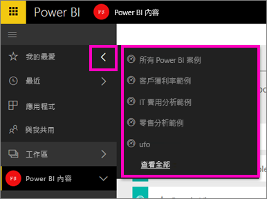
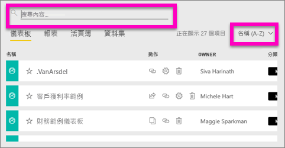

# 搜尋和排序 Power BI 中的內容
Power BI 自動化組織、使用者標記、搜尋和排序的組合可讓您快速在 Power BI 服務中找出您的需求。

## Power BI 如何協助您巡覽內容
Power BI 服務可透過數種方式組織內容。  首先，它將您的內容分成儀表板、報表、活頁簿和資料集。 您將在許多 Power BI 畫面上看到此組織。 接下來，Power BI 服務會透過一些方法來分類內容，因此甚至可以更快速且更輕鬆地找到您的需求。 請查看左側導覽。

[我的工作區] 中是您建立供自己使用的內容、[應用程式工作區] 中是您建立並與群組共用的內容、您想要快速存取的內容儲存在 [我的最愛] 中、[與我共用] 中是與您共用的內容，而 [最近] 中也有您最後檢視的內容。

如需詳細資訊，請參閱[如何組織 Power BI 服務中的內容](service-basic-concepts.md)。

> **注意**：組織內容的另一種方式是挑選您預期最常檢視的一個儀表板，並將它設為 [精選] 儀表板。 每次開啟 Power BI 服務時，這都會是先顯示的儀表板。 若要深入了解，請參閱[精選儀表板](service-dashboard-featured.md)。
> 
> 

## 最愛的儀表板和應用程式
您有一些經常瀏覽的儀表板和應用程式嗎？ [將它們設為「我的最愛」](service-dashboard-favorite.md)，即一律可在左側導覽列中看到它們。

.

[Power BI 服務中的我的最愛](service-dashboard-favorite.md)一文中詳述如何使用我的最愛。

## 工作區中的搜尋和排序
工作區有四個內容索引標籤︰[儀表板]、[報表]、[活頁簿] 和 [資料集]。  所有這些索引標籤都包含一個搜尋欄位和一個排序按鈕。  當您開始使用 Power BI 服務時，可能不覺得這些有用，因為一個索引標籤只有一或兩個項目。不過，經過一段時間之後，您可能會有冗長的內容清單。  使用搜尋和排序，輕鬆地找出您需要的內容。

* 輸入搜尋字詞，以在目前畫面上找到相符項目。
  
   
* 選取 [排序] 按鈕，以顯示目前頁面的選項。 這些選項是依名稱或擁有者進行排序。
  
   

## 考量與疑難排解
* 對於資料集，擁有者無法使用 [排序依據]。

## 後續步驟
[Power BI - 基本概念](service-basic-concepts.md)

有其他問題嗎？ [試試 Power BI 社群](http://community.powerbi.com/)

