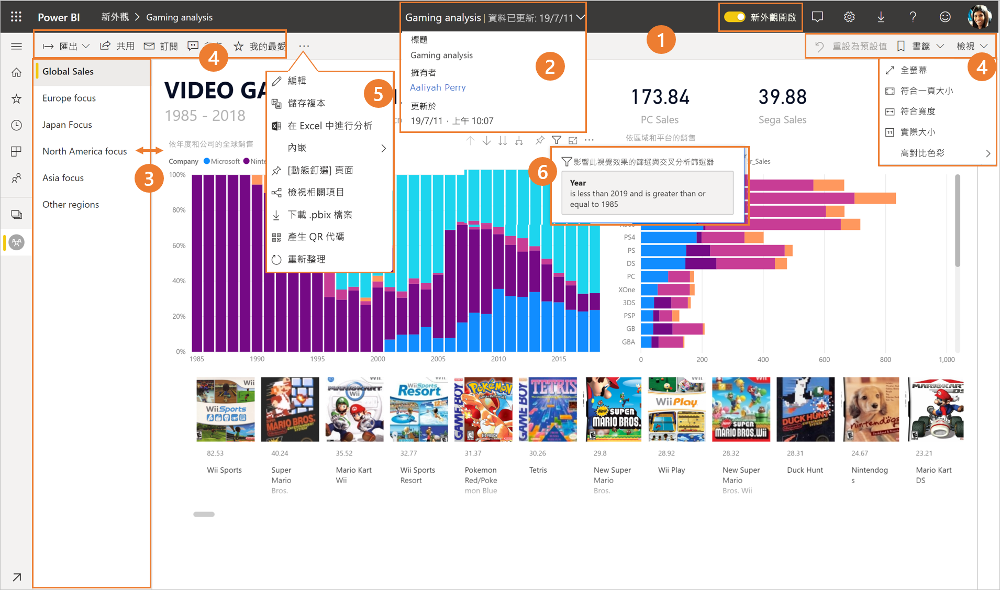
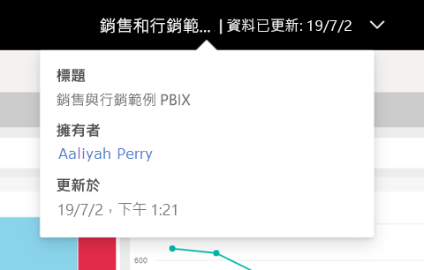
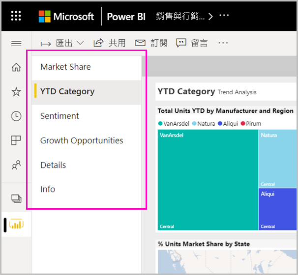
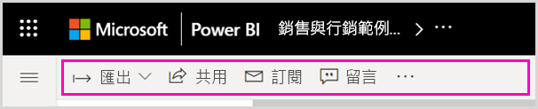

# Power BI 服務的「新外觀」

Power BI 服務 (app.powerbi.com) 有新的外觀，可讓您更輕鬆地檢視報表並與其互動。 新外觀更簡潔，而且建構在您熟悉的其他 Microsoft 產品基礎之上。 在 Power BI 服務中，我們藉由切換至較淺的色彩主題並更新圖示，讓報表內容成為主要焦點。 

要尋找 **Power BI Desktop** 中新外觀的相關資訊嗎？ 請參閱[使用 Power BI Desktop 中已更新的功能區](desktop-ribbon.md)。

以下概述新外觀中的變更項目。 如需詳細資料，請參閱編號章節：

在找特定的動作嗎？ 請參閱[「新外觀」：動作跑到哪裡了？](service-new-look-where-actions.md)

## 變更的快速導覽

這個動畫示範報表在執行時的外觀變化。

## 1.選擇使用新外觀

任何 Power BI 服務使用者都可以選擇使用新外觀。 只要將 [新外觀關閉]  滑動到 [新外觀開啟]  即可。

如果您需要回復舊外觀，只要將其滑動回到 [關閉]   即可。 如果您沒有看到此項目，請選取右上角的省略符號功能表。

## 2.檢視報表詳細資料 

請直接在頂端橫幅中快速查看詳細資料，例如上次重新整理日期和連絡人資訊。  開啟功能表可檢視報表的其他詳細資料。 您甚至可以傳送電子郵件給報表擁有者。

## 3.頁面的垂直清單 
報表頁面名稱現在會在垂直窗格的清單中。 它們很明顯、難以錯過，且類似於 Word 和 PowerPoint 中的導覽。 您可以調整垂直窗格的大小，藉以增加或減少報表區域的其餘部分。

## 4.簡化的動作列 

頂端的更新動作列提供了最相關命令，對於報表取用者來說非常重要。 您可以更輕鬆地匯出、訂閱、與其他人共同作業，並透過篩選和書籤深入探索。

## 5.報表命令在哪裡？

我們不會從舊外觀中移除任何功能。 您可以展開動作列中的省略符號 (... 功能表)，以尋找其他命令，例如 [編輯]、[儲存複本] 等。 此外，您也可以從內容清單存取使用計量。

### [檔案] 功能表動作在哪裡？

正在尋找 [檔案]  功能表動作嗎？ 以前位於 [檔案]  功能表上的動作，現在也會在 [更多選項]  (...) 功能表上。 

![新外觀中的 [檔案] 功能表](media/service-new-look/power-bi-file-menu-new-look.gif)

## 6.新的篩選體驗

根據預設，新外觀提供了最近的更新，例如檢視套用的篩選和新增篩選窗格。 即使您的報表設計工具尚未升級至新的篩選體驗，您還是會看到新的篩選窗格。

## 儀表板的「新外觀」體驗 

儀表板也有一個簡化的動作列，如同報表和應用程式，可提供一致的體驗，同時保留功能差異。 以下是儀表板動作的逐步解說。
 

## 編輯模式沒有變更 

我們將撰寫體驗保持為類似桌面的撰寫體驗。 新外觀變更僅適用於閱讀檢視。

## 後續步驟

- [使用 Power BI Desktop 中已更新的功能區](desktop-ribbon.md)
- [加入工作區「新外觀」](collaborate-share/service-workspaces-new-look.md)
- [取用者適用的 Power BI](consumer/end-user-consumer.md)
