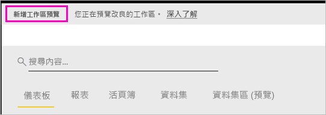

# 在 Power BI 的新工作區 (預覽) 中組織工作

工作區是要與同事共同作業來建立儀表板和報表集合的地方。 然後，您可以將這些集合組合成「應用程式」，並將其散發給整個組織或是特定人員或群組。 Power BI 正在引進新的工作區體驗作為預覽。 

使用新的工作區預覽，您現在可以：

- 將工作區角色指派給使用者群組：安全性群組、通訊群組清單、Office 365 群組，以及個人。
- 在 Power BI 中建立工作區，而不建立 Office 365 群組。
- 使用更精細的工作區角色，在工作區中進行更有彈性的權限管理。

了解如何[建立其中一個新的工作區](service-create-the-new-workspaces.md)。
 
當您建立其中一個新工作區時，不會建立基礎的相關聯 Office 365 群組。 所有工作區管理都是在 Power BI 中進行，而不是 Office 365。 您仍然可以將 Office 365 群組新增至工作區，繼續透過 Office 365 群組管理使用者對內容的存取權。 不過，您可以額外使用安全性群組、通訊群組清單，並直接在 Power BI 內新增個人，這樣提供一種彈性的方式讓您管理工作區存取。 因為工作區系統管理員現在在 Power BI 中，Power BI 系統管理員會決定組織中的誰可以建立工作區。 在管理入口網站的 [工作區設定] 中，管理員可讓組織中的所有人或不讓任何人建立工作區。 他們也可以限制只有特定安全性群組的成員才能建立。

![管理入口網站中的 [工作區設定]](media/service-new-workspaces/power-bi-workspace-admin-settings.png)

深入了解 [Power BI 管理入口網站](service-admin-portal.md)。

## 推出新的工作區

在預覽期間，新舊工作區可以並排共存，您可以建立任一個工作區。 當新工作區的預覽結束，並且正式推出這些工作區時，舊的工作區仍然可以存在一段時間。 您將無法建立它們，而且必須準備將您的工作區移轉到新的工作區基礎結構。 別擔心，您有幾個月的時間來完成移轉。

## 新工作區中的角色

請在新的工作區中，將使用者群組或個人新增為成員、參與者或系統管理員。 使用者群組中的每個人都會取得您已定義的角色。 如果個人在多個使用者群組中，他們會取得角色所提供的最高層級權限。  如需不同角色的說明，請參閱本文稍後的[新工作區中的角色](#roles-in-the-new-workspaces)。

新增至工作區的每個人都必須有 Power BI Pro 授權。 在工作區中，這些使用者皆可在儀表板和報表上共同作業，以準備發佈給更多對象，甚至整個組織。 如果您想要將內容散發給組織內的其他人，則可以將 Power BI Pro 授權指派給這些使用者，或將工作區置於 Power BI Premium 容量中。

角色可讓您管理誰可以在工作區中做什麼，因此小組可以共同作業。 新的工作區可讓您將角色指派給個人和使用者群組：安全性群組、Office 365 群組，以及通訊群組清單。 

當您將角色指派給使用者群組時，群組中的個人可以存取內容。 如果巢狀處理使用者群組，則所有包含的使用者都具有權限。 在數個使用者群組中具有不同角色的使用者，會獲得授與他們的最高層級權限。 

新的工作區提供三種角色：系統管理員、成員和參與者。

**系統管理員可以：**

- 更新和刪除工作區。 
- 新增/移除人員，包括其他系統管理員。
- 執行成員可執行的所有項目。

**成員可以：** 

- 新增具有較低權限的成員或其他人。
- 發佈和更新應用程式。
- 共用項目或共用應用程式。
- 允許其他人再次共用項目。
- 執行參與者可執行的所有項目。

**參與者可以：** 

- 建立、編輯和刪除工作區中的內容。 
- 將報表發佈至工作區、刪除內容。
- 無法為新使用者提供內容存取權。 他們無法共用新的內容，但可以與已共用工作區、項目或應用程式的其他人共用。 
- 無法修改群組的成員。
 
我們將在服務中建置要求存取工作流程；因此，無權存取的使用者可以要求它。 儀表板、報表和應用程式目前有要求存取工作流程。

## 將舊工作區轉換成新工作區

在預覽期間，您無法將舊工作區自動轉換成新工作區。 不過，您可以建立新工作區，並將內容發佈到新的位置。 

當新的工作區正式推出 (GA) 時，可以選擇自動移轉舊的工作區。 在 GA 後的某個時間點，您必須將其移轉。

## Power BI 應用程式常見問題集

### 新工作區與目前工作區有何不同？

我們使用新的工作區重新設計了一些功能。 以下是預覽中可預期為永久性的變更。 

* 與目前的工作區不同，建立工作區並不會在 Office 365 中建立對應實體。 (您仍然可以為 Office 365 群組指派角色，藉以將其新增至工作區)。 
* 在目前的工作區中，您只能將個人新增至成員和系統管理員清單。 在新的工作區中，您可以將多個 AD 安全性群組、通訊群組清單或 Office 365 群組新增至這些清單，以便能夠更輕鬆地進行使用者管理。 
- 您可以從目前的工作區建立組織內容套件。 但無法從新的工作區建立組織內容套件。
- 您可以從目前的工作區取用組織內容套件。 但無法從新的工作區取用組織內容套件。
- 在預覽期間，新的工作區尚未啟用某些功能。 如需詳細資料，請參閱下一節：[規劃的新工作區功能](service-new-workspaces.md#planned-new-workspace-preview-features)。

## 規劃的新工作區預覽功能

當我們推出預覽時，我們仍在開發一些其他的新工作區預覽功能，但尚未提供這些功能：

- 沒有 [離開工作區] 按鈕。
- 尚未支援使用計量。
- Premium 的運作方式：您可以在 Premium 容量中指派和建立工作區，但若要在容量之間移動工作區，請移至工作區的設定。
- 尚未支援 SharePoint Web 組件內嵌。
- Office 365 群組在 [取得資料/檔案] 中沒有 [OneDrive] 按鈕。

## 運作方式不同的工作區功能

某些功能在新工作區的運作方式不同於目前工作區。 根據我們從客戶收到的意見反應，這些差異是刻意設計的，可啟用更彈性方法，以便與工作區共同作業：

- 成員可以或無法再次共用：取代為「參與者」角色
- 唯讀工作區：無需將工作區的唯讀存取權授與使用者，您可以將使用者指派給即將推出的「檢視者」角色，這會允許工作區中內容的類似唯讀存取權。

## 已知問題

因為這項功能處於預覽階段，所以您應該要注意一些限制。 以下是已知問題，且修正程式正在開發中：

- 新增為電子郵件訂用帳戶收件者的免費使用者或使用者群組可能不會收到電子郵件，但他們應該收到電子郵件。 當其中一個新工作區位於 Premium 容量中，但建立訂用帳戶之使用者的「我的工作區」不在 Premium 容量中時，就會發生此問題。 如果 [我的工作區] 是在 Premium 容量中，則免費使用者和使用者群組將會收到電子郵件。
- 工作區從 Premium 容量移到共用容量之後，在某些情況下，免費使用者和使用者群組將會繼續收到電子郵件，但他們不應該收到電子郵件。 建立訂用帳戶的使用者若其 [我的工作區] 是在 Premium 容量中時，就會發生此問題。

## 後續步驟
* [在 Power BI 中建立新的工作區 (預覽)](service-create-the-new-workspaces.md)
* [建立目前的工作區](service-create-workspaces.md)
* [在 Power BI 中安裝和使用應用程式](service-create-distribute-apps.md)
* 有問題嗎？ [嘗試在 Power BI 社群提問](http://community.powerbi.com/)
