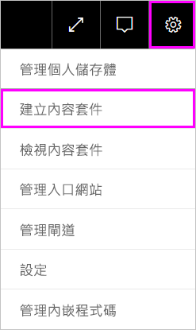
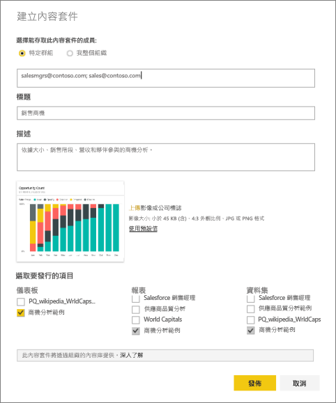
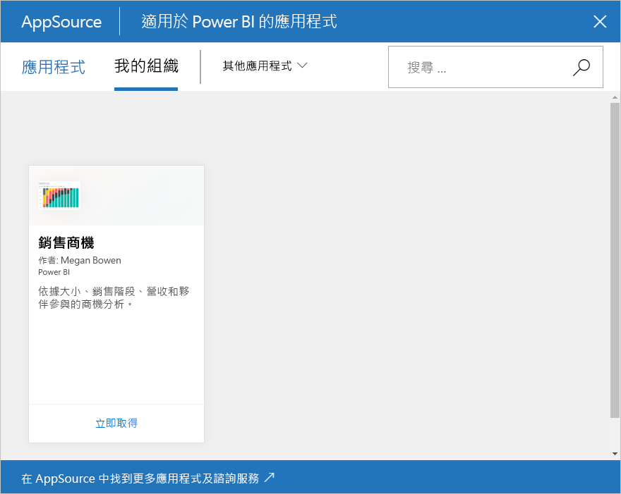

# 建立及發佈 Power BI 組織內容套件 (教學課程)
> [!NOTE]
> 尚未聽過新的「應用程式」嗎？ 應用程式是在 Power BI 中將內容散發給大量對象的新方式。 我們計劃即將淘汰組織內容套件，因此建議您改用應用程式。 深入了解[應用程式](service-install-use-apps.md)。
> 
> 

在本教學課程中，您將建立組織內容套件、提供特定群組的存取權，並將該套件發行至 Power BI 上的組織內容套件庫。

建立內容套件與共用儀表板或對群組中的儀表板共同作業不同。 閱讀[應該如何共同作業和共用儀表板和報表？](service-how-to-collaborate-distribute-dashboards-reports.md)，來為您的情況決定最佳選項。

> [!NOTE]
> 建立組織內容套件需要用到您和同事的 [Power BI Pro 帳戶](https://powerbi.microsoft.com/pricing)。
> 
> 

假設您是 Contoso 發佈經理，而且您正在為新產品上市作準備。  您已建立儀表板與報表，想要與管理產品上市的其他員工共用。 您需要有方法將儀表板及報表作為解決方案封裝，供您的同事使用。 

想要跟著做嗎？ 從 [Power BI 服務](https://powerbi.com) 移至 [取得資料] > [範例] > [商機分析範例] > [連接]，取得自己的複本。 

1. 在左側瀏覽窗格中選取 [ **商機分析範例** ] 儀表板。
2. 從上方導覽列中，選取齒輪圖示  > **建立內容套件**。    
   
3. 在 [建立內容套件]  視窗中，輸入下列資訊。  
   
   請記住，組織內容套件庫最後可能會含有上百個內容套件，發佈給組織或群組。 花點時間來提供內容套件有意義的名稱、新增合適的描述，以及選取適當的對象。  使用的描述必須讓內容套件可輕易透過搜尋尋找。
   
   1.  選取 [特定群組]，輸入完整的個人電子郵件地址、[Office 365 群組](https://support.office.com/article/Create-a-group-in-Office-365-7124dc4c-1de9-40d4-b096-e8add19209e9)、通訊群組或安全性群組。 例如：
      
         salesmgrs@contoso.com; sales@contoso.com
      
      在本教學課程中，請試著使用您自己或群組的電子郵件地址。
   
   2.  將內容套件命名為**銷售商機**。
   
      > [!TIP]
      > 請考慮將儀表板名稱包含在內容套件名稱中。 如此一來，當您的同事連接到您的內容套件之後，就能更輕鬆地找到儀表板。
      > 
      > 
   
   3.  建議：新增**描述**。 這有助於同事更輕鬆地找到所需的內容套件。 除了描述之外，還新增同事可能用來搜尋此內容套件的關鍵字。 另外加上連絡資訊，萬一您的同事有疑問或需要協助時可派上用場。
   
   4.  **上傳映像或標誌**，讓群組成員更輕鬆地尋找內容套件 &#151; 掃描映像的速度會比尋找文字更快。 我們在下面的螢幕擷取畫面中使用商機計數 100% 直條圖磚的映像。
   
   5.  選取 [商機分析範例] 儀表板，將它加入內容套件。  Power BI 會自動加入相關聯的報表和資料集。 如果您要的話，您可以新增其他項目。
   
      > [!NOTE]
      >  只會列出可以編輯的儀表板、報表、資料集和活頁簿。 因此，任何已與您共用的資源不會列在清單中。
      > 
      > 
   
       
   
   6. 如果您有 Excel 活頁簿，這些活頁簿會顯示在 [報表] 下方，並有 Excel 圖示。 您也可以將它們加入內容套件中。
   
     
   
      > [!NOTE]
      > 如果群組的成員無法檢視 Excel 活頁簿，您可能需要[在商務用 OneDrive 中與他們共用活頁簿](https://support.office.com/en-us/article/Share-documents-or-folders-in-Office-365-1fe37332-0f9a-4719-970e-d2578da4941c)。
      > 
      > 
4. 選取 [發佈]  將內容套件加入群組的組織內容套件庫。  
   
   成功發佈之後，您可以看到成功訊息。 
5. 當您的群組成員移至 [取得資料] > [我的組織] 時，他們可點選搜尋方塊並輸入「銷售商機」。
   
    
6. 他們會看到您的內容套件。  
    
   
   > [!TIP]
   > 您的瀏覽器中顯示的 URL 是此內容套件的專屬位址。  想通知同事這個新的內容套件？  您可以將 URL 貼入電子郵件。
   > 
   > 
7. 他們選取 [連接] 後，即可[檢視和使用您的內容套件](service-organizational-content-pack-copy-refresh-access.md)。 

### 後續步驟
* [組織內容套件簡介](service-organizational-content-pack-introduction.md)  
* [管理、更新和刪除組織內容套件](service-organizational-content-pack-manage-update-delete.md)  
* [在 Power BI 中建立群組](service-create-distribute-apps.md)  
* [商務用 OneDrive 是什麼？](https://support.office.com/en-us/article/What-is-OneDrive-for-Business-187f90af-056f-47c0-9656-cc0ddca7fdc2)
* 有其他問題嗎？ [試試 Power BI 社群](http://community.powerbi.com/)

