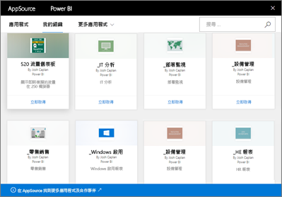

# Power BI 中的組織內容套件簡介
> [!NOTE]
> 您無法在新的工作區體驗預覽中建立組織內容套件或加以安裝。 如果您尚未開始，現在是將您的內容套件升級為應用程式的好時機。 深入了解[新的工作區體驗](service-create-the-new-workspaces.md)。
> 

您有透過電子郵件向小組定期發佈報表嗎？ 您可以改成封裝的儀表板、報表、Excel 活頁簿與資料集，然後將其發行到您的小組作為組織內容套件。 因為建立的內容套件全部都在 AppSource 內，所以您的小組很容易就可以找到。 因為它們是 Power BI 的一部分，所以能使用 Power BI 的所有功能，包括互動式資料瀏覽、新的視覺效果、問與答、與其他資料來源整合、資料重新整理等等。

建立內容套件的方式與在應用程式工作區中，對內容套件共用儀表板或作業的方式不同。 閱讀[應該如何共同作業和共用儀表板和報表？](service-how-to-collaborate-distribute-dashboards-reports.md)，來為您的情況決定最佳選項。 

在 AppSource 中，您可以瀏覽或搜尋發行給整個組織、通訊群組或安全性群組以及[您所屬 Office 365 群組](https://support.office.com/article/Create-a-group-in-Office-365-7124dc4c-1de9-40d4-b096-e8add19209e9)的內容套件。 如果您不是某特定群組的成員，就看不到與該群組分享的內容套件。 所有的群組成員都有相同的權限，可以唯讀存取內容套件資料、報表、活頁簿和儀表板 (除了 SQL Server Analysis Services (SSAS) 資料來源以外，其權限是繼承自資料來源)。

儀表板、報表、Excel 活頁簿均為唯讀，但您可以從複製及使用儀表板與報表入手，開始建立您自己的個人化版本內容套件。

> [!NOTE]
> 僅有當您和同事具有 [Power BI Pro 授權](service-features-license-type.md)時，才能使用組織內容套件。
> 
> 

## 什麼是 *AppSource*？
發行組織內容套件會將其新增至 AppSource。  這個集中式儲存機制讓成員輕鬆瀏覽及探索為他們發行的儀表板、報表和資料集。  

* 若要檢視 AppSource，請選取 [取得資料] > [我的組織] > [取得]。

深入了解[尋找及開啟組織內容套件](consumer/end-user-content-pack.md).

## 組織內容套件的生命週期
任何 Power BI Pro 的使用者都可以建立、發行並存取組織內容套件。 只有內容套件建立者才能修改活頁簿和資料集、排定重新整理，以及刪除。

生命週期看起來像這樣：

1. 在 Power BI Pro 中，Nate 建立了一個內容套件，並將其發行至「行銷」通訊群組中。 因為重新整理設定和資料集要一起繼承，所以只有 Nate 可以變更。
   
   > [!NOTE]
   > 如果 Nate 從他所在的 [Power BI 應用程式工作區](service-create-distribute-apps.md)中建立內容套件，即使他離開群組，Power BI 工作區中的其他人也可以接管擁有權。
   > 
   > 
2. Nate 傳送郵件給通訊群組，告訴他們新內容套件的相關資訊。
3. 「行銷」通訊群組的成員 Jane 在 Power BI Pro 中搜尋並連線到 AppSource 中的這個內容套件。 她拿到的是唯讀複本。  她知道這是唯讀的，因為在左側瀏覽窗格中，儀表板名稱和報表名稱的左邊有共用圖示。 而當她選取儀表板時，鎖定圖示可讓 Jane 知道她正在查看內容套件儀表板。 
4. 假設她決定進行自訂。 她現在擁有自己的報表和儀表板複本。 她的舉動不會影響來源、原始的內容套件或其他通訊群組成員。 她現在使用的是自己的儀表板和報表。
5. Nate 更新了儀表板，隨時準備發佈新版的內容套件。
   
   * 另一個通訊群組成員 Julio 並未自訂原始的內容套件。 新的變更會自動套用至其內容套件的版本。  
   * Jane 並未自訂內容套件。 她會收到新版本的通知。  她可以前往 AppSource 取得已更新的內容套件，而不會遺失她的個人化版本。 她現在有兩個版本：她的個人化版本和更新的內容套件。
6. 假設 Nate 變更安全性設定。 Julio 和 Jane 便不再具有內容的存取權。 或是假設他們已從「行銷」通訊群組中移除。
   
   * Julio 並未自訂原始的內容套件，所以該內容就會自動移除。 
   * Jane 並未自訂內容套件。 下次開啟儀表板的話，原始內容套件中的所有磚都會消失，但她從其他報表 (她仍然擁有使用權限的報表) 釘選的磚仍會出現。 不再提供相關聯的報表和資料集 (且不再出現在她的左側瀏覽窗格中)。
7. 或是 Nate 刪除了內容套件。
   
   * Julio 並未自訂原始的內容套件，所以該內容就會自動移除。 
   * Jane 並未自訂內容套件。 下次開啟儀表板的話，原始內容套件中的所有磚都會消失，但她從其他報表釘選的磚仍會出現。 不再提供相關聯的報表和資料集 (且不再出現在她的左側瀏覽窗格中)。

## 資料安全性
所有通訊群組成員的資料權限都和內容套件建立者一樣。 唯一的例外狀況是 SQL Server Analysis Services (SSAS) 內部部署表格式資料集。 因為報表及儀表板即時連線至內部部署 SSAS 模型，所以會使用每個個別通訊群組成員的認證來判斷其可以存取的資料。

## 後續步驟
* [建立和發佈組織內容套件](service-organizational-content-pack-create-and-publish.md)
* [在 Power BI 中建立和散發應用程式](service-create-distribute-apps.md) 
* [Power BI - 基本概念](consumer/end-user-basic-concepts.md)
* 有其他問題嗎？ [試試 Power BI 社群](http://community.powerbi.com/)

