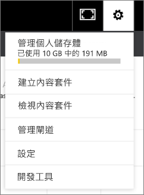

# 管理、更新和刪除組織內容套件
> [!NOTE]
> 尚未聽過新的「應用程式」嗎？ 應用程式是在 Power BI 中將內容散發給大量對象的新方式。 建議使用應用程式，而非組織內容套件或唯讀工作區。 深入了解[應用程式](service-install-use-apps.md)。
> 
> 

您可以將您的儀表板、報表、Excel 活頁簿和資料集封裝為[組織內容套件](service-organizational-content-pack-introduction.md)，並與您的同事共用。 您的同事可以直接加以使用，或是建立自己的複本。

建立內容套件與共用儀表板或對群組中的儀表板共同作業不同。 閱讀[應該如何共同作業和共用儀表板和報表？](service-how-to-collaborate-distribute-dashboards-reports.md)，來為您的情況決定最佳選項。

如果您是內容套件建立者，則只能執行部分組織內容套件工作：

* 重新發佈。
* 限制或擴充內容套件的存取權。
* 設定和變更排程的重新整理。
* 刪除內容套件。

## 修改與重新發佈組織內容套件
若要變更原始內容套件儀表板、報表或 Excel 活頁簿，Power BI 會提示您重新發佈。 此外，您可以內容套件建立者身分，更新您建立原始內容套件時在 [建立內容套件] 視窗中選取的任何選項。 

## 以新的內容重新發佈
當您進行變更並將變更儲存至您併入內容套件的儀表板時，Power BI 會提醒您將其更新，以便其他人可以看到這些變更。 例如，如果您釘選了新的磚，或只是變更了儀表板的名稱。

1. 選取訊息中的 [檢視內容套件]。
   
   
2. 或者選取右上角的齒輪圖示 ，然後選取 **檢視內容套件**.
   
   
   
   請注意警告圖示 。  這可讓您知道，您以某種方式修改了內容套件，且它不再與您發佈的內容套件相符合。
3. 選取 [編輯] 。  
4. 在 [更新內容套件] 視窗進行所有必要的變更，然後選取 [更新]。 [成功] 訊息隨即出現。
   
   * 若是尚未自訂內容套件的群組成員，便會自動套用更新。
   * 若群組成員已自訂此內容套件，就會收到有新版本的通知。  他們可以前往 AppSource 並取得已更新的內容套件，而不會遺失他們的個人化版本。  現在他們有 2 個版本：個人化版本和更新的內容套件。  在個人化的版本中，來自原始內容套件的所有圖格都會消失。  不過仍然會轉譯從其他報表釘選的圖格。    

## 更新對象：擴充或限制存取權
另一種內容套件建立者可進行的修改，就是擴充及限制內容套件的存取權。  或許您已發佈內容套件至許多對象，且決定將存取權限制在較小的群組。  

1. 選取齒輪圖示 ，然後選擇 **檢視內容套件**.
2. 選取 [編輯] 。 
3. 在 [更新內容套件] 視窗進行所有必要的變更，然後選取 [更新]。 例如，刪除在 [特定群組] 欄位中的原始通訊群組，並取代為不同的通訊群組 (具有較少的成員)。
   
   成功訊息隨即出現。
   
   若是不屬於新別名的任何同事：
   
   * 如果群組成員尚未自訂內容套件，將再也無法取得與該內容套件相關聯的儀表板和報表，且該內容套件也不會出現於 [瀏覽] 窗格中。
   * 已自訂了內容套件的群組成員，下次開啟自訂儀表板時，所有來自原始內容套件的磚都會消失。  不過仍然會轉譯從其他報表釘選的圖格。 再也無法取得原始內容套件報表和資料集，該內容套件不會出現於 [瀏覽] 窗格中。   

## 重新整理組織內容套件
您可以內容套件建立者身分來[排程資料集的重新整理](refresh-data.md)。  當您建立並上傳內容套件時，重新整理排程會和資料集同時上傳。 如果您變更重新整理排程，就必須重新發佈內容套件 (請參閱前述)。

## 從 AppSource 刪除組織內容套件
您只能從 AppSource 刪除自己建立的內容套件。 

> [!TIP]
> 您可以[刪除未建立之內容套件的連線](service-organizational-content-pack-disconnect.md)。 這麼做並不會將內容套件自 AppSource 刪除。
> 
> 

1. 若要從 AppSource 中刪除內容套件，請前往您建立該內容套件的應用程式工作區，選取齒輪圖示  並選擇 [檢視內容套件]。
2. 選取 [刪除] \> [刪除]。 
   
   * 如果群組成員尚未自訂內容套件，將會自動移除與該內容套件相關聯的儀表板和報表。 再也無法取得這些儀表板和報表，該內容套件不會出現於 [瀏覽] 窗格中。
   * 已自訂了內容套件的群組成員，下次開啟自訂儀表板時，所有來自原始內容套件的磚都會消失。  不過仍然會轉譯從其他報表釘選的圖格。 再也無法取得原始內容套件報表和資料集，該內容套件不會出現於 [瀏覽] 窗格中。   

## 後續步驟
* [組織內容套件簡介](service-organizational-content-pack-introduction.md)
* [在 Power BI 中建立和散發應用程式](service-create-distribute-apps.md) 
* 有其他問題嗎？ [試試 Power BI 社群](http://community.powerbi.com/)

