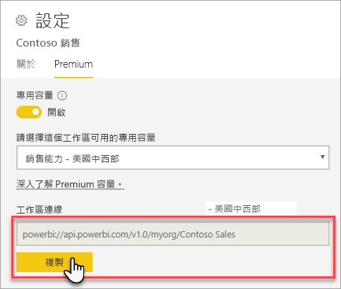

# 使用用戶端應用程式與工具連線至資料集 (預覽)

Power BI Premium 工作區及資料集支援來自 Microsoft 和協力廠商應用程式與工具的「唯讀」  連線。 

> [!NOTE]
> 本文僅旨在介紹對 Power BI Premium 工作區及資料集的唯讀連線能力。 它「並非」  用於提供可程式性、特定工具與應用程式、架構，以及工具區和資料集管理的深入資訊。 此處描述的主題需要對 Analysis Services 表格式模型資料庫架構及管理具有深入了解。

## 通訊協定

Power BI Premium 使用 [XML for Analysis](https://docs.microsoft.com/bi-reference/xmla/xml-for-analysis-xmla-reference) (XMLA) 通訊協定來在用戶端應用程式與管理您工作區及資料集的引擎間進行通訊。 這些通訊是透過通常稱為 XMLA 端點的項目進行。 XMLA 與 Microsoft Analysis Services 引擎所使用的通訊協定相同，其幕後的運作原理是會執行 Power BI 的語意模型、控管、生命週期及資料管理。 

大部分的用戶端應用程式和工具都不會明確地使用 XMLA 端點與引擎通訊。 它們會改為使用用戶端程式庫 (例如 MSOLAP、ADOMD 和 AMO) 作為用戶端應用程式與引擎間的仲介，並只會使用 XMLA 進行通訊。

## 支援工具

這些工具支援對 Power BI Premium 工作區及資料集的唯讀存取：

**SQL Server Management Studio (SSMS)** - 支援 DAX、MDX、XMLA 和 TraceEvent 查詢。 需要版本 18.0。 請在[此處](https://docs.microsoft.com/sql/ssms/download-sql-server-management-studio-ssms)下載。 

**SQL Server Profiler** - 隨附於 SSMS 18.0 (預覽)，這項工具可提供伺服器事件的追蹤和偵錯。 您可以擷取每個事件的相關資料並儲存到檔案或資料表，以供稍後進行分析。 雖然 SQL Server 已經正式淘汰這項工具，但 Profiler 會繼續包含在 SSMS 中，並針對 Analysis Services 以及現在的 Power BI Premium 繼續獲得支援。 若要深入了解，請參閱 [SQL Server Profiler](https://docs.microsoft.com/sql/tools/sql-server-profiler/sql-server-profiler)。

**DAX Studio** - 開放原始碼的社群工具，用來針對 Analysis Services 執行和分析 DAX 查詢。 需要版本 2.8.2 或更新版本。 若要進一步了解，請參閱 [daxstudio.org](https://daxstudio.org/)。

**Excel 樞紐分析表** - 需要 Office 16.0.11326.10000 或更新版本的隨選即用。

**協力廠商** - 包含用戶端資料視覺效果應用程式和工具，可連線、查詢和取用 Power BI Premium 中的資料集。 大多數工具需要 MSOLAP 用戶端程式庫的最新版本，但有些可以使用 ADOMD。

## 用戶端程式庫

用戶端程式庫是用戶端應用程式與工具連線到 Power BI Premium 工作區的必要項目。 Power BI Premium 中也支援用來連線到 Analysis Services 的相同用戶端程式庫。 Microsoft 用戶端應用程式 (例如 Excel、SQL Server Management Studio (SSMS) 和 SQL Server Data Tools (SSDT)) 會安裝三個用戶端程式庫，並隨著一般應用程式更新來更新它們。 在某些情況下 (特別是針對協力廠商應用程式與工具)，您可能需要安裝更新版本的用戶端程式庫。 用戶端程式庫會每月進行更新。 若要深入了解，請參閱[用來連線到 Analysis Services 的用戶端程式庫](https://docs.microsoft.com/azure/analysis-services/analysis-services-data-providers)。

## 連線到 Premium 工作區

您可以連線到指派給 Premium 專用容量的工作區。 指派給專用容量的工作區會具備 URL 格式的連接字串。 

若要取得工作區連接字串，請在 [Premium]  索引標籤的 Power BI [工作區設定]  上，於 [工作區連線]  中，按一下 [複製]  。

工作區連線會使用下列 URL 格式來表示工作區，就好像它是 Analysis Services 伺服器名稱一樣：   
`powerbi://api.powerbi.com/v1.0/[tenant name]/[workspace name]` 

例如：`powerbi://api.powerbi.com/v1.0/contoso.com/Sales Workspace`

### 在 SSMS 中連線

在 [連線到伺服器]   > [伺服器類型]  中，選取 [Analysis Services]  。 在 [伺服器名稱]  中，輸入 URL。 在 [驗證]  中，選取 [具 MFA 支援的 Active Directory - 通用]  ，然後在 [使用者名稱]  中，輸入您的組織使用者識別碼。 

連線時，工作區會顯示為 Analysis Services 伺服器，且工作區中的資料集也會顯示為資料庫。  

### 初始目錄

有些工具 (例如 SQL Server Profiler) 可能需要您指定「初始目錄」  。 在您的工作區中指定資料集 (資料庫)。 在 [連線到伺服器]  中，按一下 [選項]  。 在 [連線屬性]  索引標籤的 [連線到伺服器]  對話方塊上，於 [連線到資料庫]  中，輸入資料集名稱。

### 重複的工作區名稱

連線到與其他工作區具有相同名稱的工作區時，您可能會看到下列錯誤：**無法連線到 powerbi://api.powerbi.com/v1.0/[tenant name]/[workspace name]。**

若要解決這個錯誤，除了工作區名稱外，請另外指定 ObjectIDGuid，您可以從 URL 中的工作區 objectID 複製這個值。 將 objectID 附加到連線 URL。 例如：`powerbi://api.powerbi.com/v1.0/myorg/Contoso Sales - 9d83d204-82a9-4b36-98f2-a40099093830`

### 重複的資料集名稱

連線到相同工作區中與其他資料集具有相同名稱的資料集時，請將資料集的 guid 附加到資料集的名稱。 您可以在連線到 SSMS 中的工作區時取得資料集名稱「和」  guid。 

### 顯示資料集中的延遲

連線到工作區時，新增、刪除和重新命名資料集的變更可能會需要最多 5 分鐘才能顯示。 

### 不支援的資料集

您無法使用 XMLA 端點存取下列資料集。 這些資料集「不會」  出現在 SSMS 的工作區底下或其他工具中： 

- 即時連線至 Analysis Services 模型的資料集。 
- 使用 REST API 推送資料的資料集。
- Excel 活頁簿資料集。 

Power BI 服務中不支援下列資料集：   

- 即時連線至 Power BI 資料集的資料集。

## 稽核記錄 

當用戶端應用程式與工具連線到工作區時，透過 XMLA 端點的存取會記錄在 Power BI 稽核記錄中 **GetWorkspaces** 作業底下。 若要深入了解，請參閱[稽核 Power BI](service-admin-auditing.md)。

## 另請參閱

[Analysis Services 參考](https://docs.microsoft.com/bi-reference/#pivot=home&panel=home-all)   
[SQL Server Management Studio](https://docs.microsoft.com/sql/ssms/sql-server-management-studio-ssms)   
[SQL Server Analysis Services 表格式通訊協定](https://docs.microsoft.com/openspecs/sql_server_protocols/ms-ssas-t/b98ed40e-c27a-4988-ab2d-c9c904fe13cf)   
[動態管理檢視 (DMV)](https://docs.microsoft.com/sql/analysis-services/instances/use-dynamic-management-views-dmvs-to-monitor-analysis-services)   

有其他問題嗎？ [嘗試在 Power BI 社群提問](https://community.powerbi.com/)
