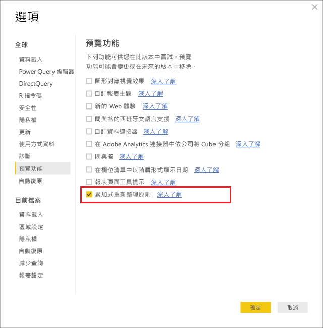
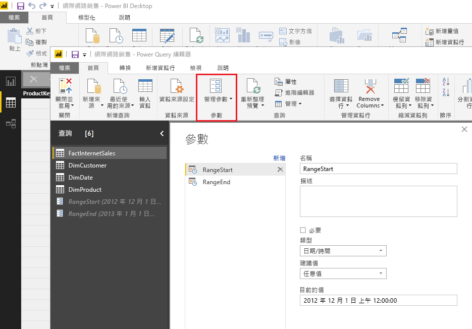
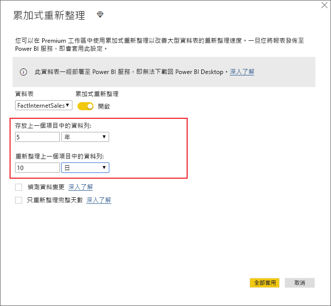
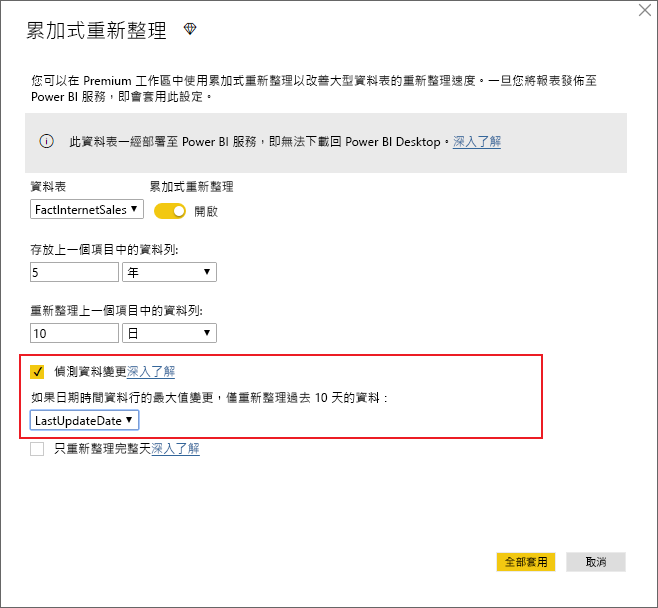
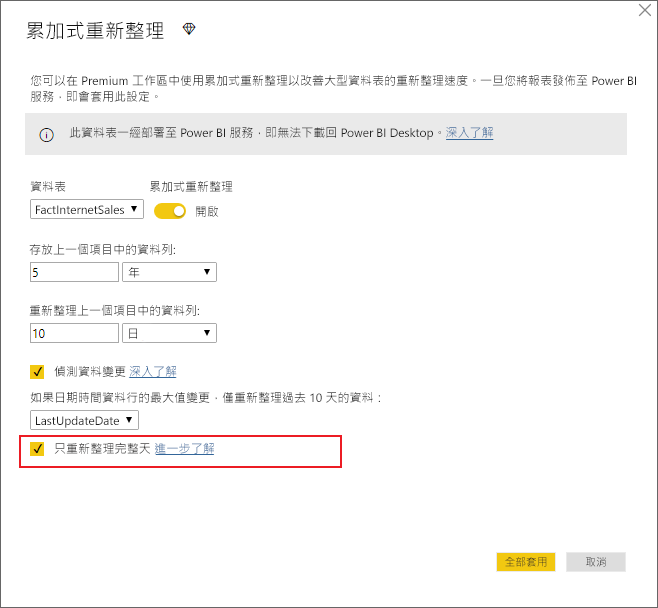
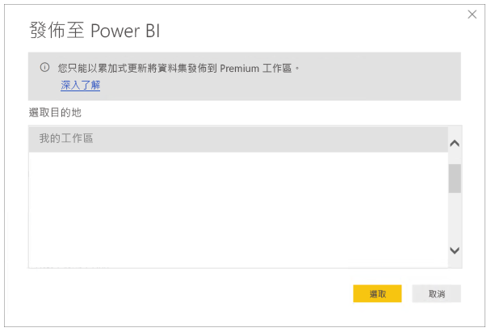

# <a name="incremental-refresh-in-power-bi-premium"></a>Power BI Premium 中的累加式重新整理

累加式重新整理可啟用 Power BI Premium 服務中的極大型資料集，且具有下列優勢：

- **重新整理更為快速。** 只需要重新整理已變更的資料。 例如，只重新整理 10 年資料集的過去 5 天。

- **重新整理更為可靠。** 例如，不需要維護長時間執行的連線，即可變更來源系統。

- **減少資源耗用量。** 要重新整理的資料較少可減少記憶體和其他資源的整體耗用。

## <a name="how-to-use-incremental-refresh"></a>如何使用累加式重新整理

累加式重新整理原則定義於 Power BI Desktop 並在發佈至 Power BI 服務之後套用。

透過在預覽功能中啟用累加式重新整理開始。



### <a name="filter-large-datasets-in-power-bi-desktop"></a>在 Power BI Desktop 中篩選大型資料集

可能有數十億個資料列的大型資料集不一定可以放入 Power BI Desktop 中，因為它一般受限於使用者桌上型電腦上可用的資源。 因此，這類資料集通常是在匯入時進行篩選，以放入 Power BI Desktop 中。 這會持續為是否使用累加式重新整理的情況。

#### <a name="rangestart-and-rangeend-parameters"></a>RangeStart 和 RangeEnd 參數

若要利用 Power BI 服務中的累加式重新整理，需要搭配使用 Power Query 日期/時間參數與保留且區分大小寫名稱 **RangeStart** 和 **RangeEnd** 來完成篩選。

在 Power Query 編輯器中，選取 [管理參數] 定義具有預設值的參數。



定義參數時，您可以選取資料行的 [自訂篩選] 功能表選項，來套用篩選。


確定已篩選資料列，其中，資料行值「晚於或等於」 **RangeStart** 並「早於」 **RangeEnd**。


> [!TIP]
> 參數的資料類型必須是日期/時間時，可以將它們轉換成符合資料來源的要求。 例如，下列 Power Query 函式會轉換日期/時間值，以類似 *yyyymmdd* 格式的整數 Surrogate 索引鍵，而此格式常見於資料倉儲。 篩選步驟可以呼叫函式。
>
> `(x as datetime) => Date.Year(x)*10000 + Date.Month(x)*100 + Date.Day(x)`

從 Power Query 編輯器中，選取 [Close and Apply] \(關閉並套用\)。 您在 Power BI Desktop 中應該有資料集的子集。

> [!NOTE]
> 發佈之後，Power BI 服務會自動覆寫參數值。 不需要在資料集設定中進行設定。

### <a name="define-the-refresh-policy"></a>定義重新整理原則

資料表的操作功能表上會有累加式重新整理，但「即時連線」模型除外。


#### <a name="incremental-refresh-dialog"></a>累加式重新整理對話方塊

即會顯示累加式重新整理對話方塊。 使用切換來啟用對話方塊。


> [!NOTE]
> 如果資料表的 Power Query 運算式未參照具有保留名稱的參數，則會停用切換。

標頭文字說明下列資訊：

-   Premium 容量上的工作區才支援累加式重新整理。 重新整理原則定義於 Power BI Desktop 中；服務中的重新整理作業會套用它們。

-   如果您可以從 Power BI 服務下載包含累加式重新整理原則的 PBIX 檔案，則不會在 Power BI Desktop 中開啟該檔案。 您很快就根本無法下載它。 雖然這可能會在未來受到支援，但請記住這些資料集可能會成長到很大，因此不適合在典型桌上型電腦下載並開啟它們。

#### <a name="refresh-ranges"></a>重新整理範圍

下列範例會定義重新整理原則，以儲存共 5 年的資料，並以累加方式重新整理 10 天的資料。 如果每天重新整理資料集，則會針對每個重新整理作業執行下列項目。

-   新增一天的資料。

-   重新整理 10 天到目前日期為止。

-   移除目前日期之前超過 5 年的日曆年度。 例如，如果目前日期是 2019 年 1 月 1 日，則會移除 2013 年。

Power BI 服務中的第一次重新整理可能需要較長的時間才能匯入全部 5 年。 後續重新整理只需要較短的時間就能完成。



**您可能只需要這些範圍的定義，在此情況下，您可以直接前往下面的發佈步驟。其他下拉式清單是針對進階功能。**

#### <a name="detect-data-changes"></a>偵測資料變更

10 天的累加式重新整理當然會比 5 年的完整重新整理更具效率。 不過，我們甚至可以更具效率。 如果您選取 [偵測資料變更] 核取方塊，則可以選取用來找出並僅重新整理資料已變更之日期的日期/時間資料行。 這假設這類資料行存在於來源系統中，這通常用於稽核用途。 會評估此資料行在累加式範圍之每個週期的最大值。 如果自上次重新整理後尚未進行變更，則不需要重新整理週期。 在範例中，這可能會進一步將累加式重新整理天數從 10 天減少為可能為 2 天。



> [!TIP]
> 目前設計需要持續保存要偵測資料變更的資料行，並將其快取到記憶體。 建議您考慮使用下列其中一種技術，減少基數和記憶體耗用量。
>
> 僅持續保存此資料行在重新整理期間的最大值，可能是使用 Power Query 函式。
>
> 將有效位數減少到重新整理頻率需求可接受的層級。
>
> 我們計劃允許定義自訂查詢，稍後偵測資料變更。 這可以用來避免持續保存資料行值。

#### <a name="only-refresh-complete-periods"></a>只重新整理完整週期

假設您的重新整理排定在每天早上上午 4:00 執行。 如果資料在這 4 小時期間出現在來源系統中，您可能不想要考量它。 某些商務計量 (例如石油和天然氣業的每日桶數) 對於半天不具任何意義。

另一個範例是重新整理財務系統中的資料，而在財務系統中，會在該月的第 12 個日曆日期核准上個月的資料。 您可以將累加式範圍設定為 1 個月，並排定在該月的第 12 天執行重新整理。 舉例來說，核取此選項，即會在 2 月 12 日重新整理 1 月資料。



> [!NOTE]
> 服務中的重新整理作業會在 UTC 時間下執行。 這可以判斷有效日期並影響完整週期。 我們計劃新增覆寫重新整理作業有效日期的能力。

## <a name="publish-to-the-service"></a>發佈至服務

因為累加式重新整理是只有 Premium 才有的功能，所以發佈對話方塊只允許選取 Premium 容量上的工作區。



您現在可以重新整理模型。 第一次重新整理可能需要較長的時間才能匯入歷程資料。 後續重新整理可能更快，因為它們使用累加式重新整理。

## <a name="query-timeouts"></a>查詢逾時

[針對重新整理疑難排解](https://docs.microsoft.com/power-bi/refresh-troubleshooting-refresh-scenarios)一文說明 Power BI 服務中的重新整理作業受限於逾時。 查詢也受限於資料來源的預設逾時。 大多數關聯式來源都允許覆寫 M 運算式中的逾時。 例如，下列運算式使用 [SQL Server 資料存取功能](https://msdn.microsoft.com/query-bi/m/sql-database)將它設定為 2 小時。 原則範圍所定義的每個週期都會提交查詢，以觀察命令逾時設定。

```
let
    Source = Sql.Database("myserver.database.windows.net", "AdventureWorks", [CommandTimeout=#duration(0, 2, 0, 0)]),
    dbo_Fact = Source{[Schema="dbo",Item="FactInternetSales"]}[Data],
    #"Filtered Rows" = Table.SelectRows(dbo_Fact, each [OrderDate] >= RangeStart and [OrderDate] < RangeEnd)
in
    #"Filtered Rows"
```
