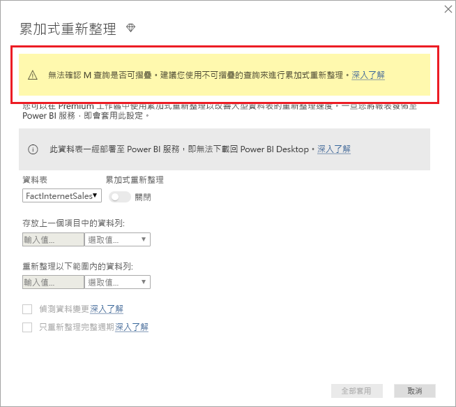

# <a name="incremental-refresh-in-power-bi"></a>Power BI 中的累加式重新整理

累加式重新整理可啟用 Power BI 中的極大型資料集，且具有下列優點：

> [!div class="checklist"]
> * **重新整理會變快** - 只需要重新整理已變更的資料。 例如，只重新整理 10 年資料集的過去 5 天。
> * **重新整理更可靠** - 不需要再維護長時間執行的連線，即可變更來源系統。
> * **減少資源耗用量** - 要重新整理的資料較少可減少記憶體和其他資源的整體耗用。

> [!NOTE]
> 累加式重新整理現在可供 Power BI Pro、Premium 及共用訂用帳戶與資料集使用。 

## <a name="configure-incremental-refresh"></a>設定累加式重新整理

累加式重新整理原則定義於 Power BI Desktop，並在發佈至 Power BI 服務時套用。


### <a name="filter-large-datasets-in-power-bi-desktop"></a>在 Power BI Desktop 中篩選大型資料集

可能有數十億個資料列的大型資料集不一定可以放入 Power BI Desktop 模型中，因為 PBIX 檔案受限於桌上型電腦上可用的記憶體資源。 這類資料集通常是在匯入時進行篩選。 不論是否使用累加式重新整理，這種類型的篩選都適用。 針對累加式重新整理，您會使用 Power Query 日期/時間參數進行篩選。

#### <a name="rangestart-and-rangeend-parameters"></a>RangeStart 和 RangeEnd 參數

針對累加式重新整理，資料集會使用 Power Query 日期/時間參數與保留的區分大小寫名稱 **RangeStart** 和 **RangeEnd** 來進行篩選。 這些參數用來篩選匯入至 Power BI Desktop 的資料，也用來在發佈至 Power BI 服務之後以動態方式將資料分割成範圍。 服務會取代參數值以篩選每個分割區。 不需要在服務中的資料集設定中進行設定。 發佈之後，Power BI 服務會自動覆寫參數值。

若要使用預設值定義參數，請在 [Power Query 編輯器] 中，選取 [管理參數]  。


定義參數時，您可以選取資料行的 [自訂篩選]  功能表選項，來套用篩選。


確定已篩選資料列，其中資料行值「之後或等於」  **RangeStart** 並「早於」  **RangeEnd**。 其他篩選組合可能會導致重複計算資料列數目。


> [!IMPORTANT]
> 確認查詢在 **RangeStart** 或 **RangeEnd** 上具有等號 (=)，而非兩者都有。 如果這兩個參數上都存在等號 (=)，資料列可能會滿足兩個分割的條件，而導致模型中的資料重複。 例如，  
> \#"Filtered Rows" = Table.SelectRows(dbo_Fact, each [OrderDate] **>= RangeStart** and [OrderDate] **<= RangeEnd**) 可能會導致資料重複。

> [!TIP]
> 參數的資料類型必須是日期/時間時，可以將它們轉換成符合資料來源的需求。 例如，下列 Power Query 函式會轉換日期/時間值，以類似 *yyyymmdd* 格式的整數 Surrogate 索引鍵，而此格式常見於資料倉儲。 篩選步驟可以呼叫函式。
>
> `(x as datetime) => Date.Year(x)*10000 + Date.Month(x)*100 + Date.Day(x)`

從 Power Query 編輯器中，選取 [Close and Apply] \(關閉並套用\)  。 您在 Power BI Desktop 中應該有資料集的子集。

#### <a name="filter-date-column-updates"></a>篩選日期資料行更新

日期資料行的篩選條件用於在 Power BI 服務中動態地將資料分割至不同範圍。 累加式重新整理設計目的並不是為了支援在來源系統中更新篩選日期資料行的案例。 更新會被解譯為插入及刪除，而不是實際的更新。 若刪除發生在歷史範圍而非累加式範圍中，系統就不會揀選它。 這可能會因為分割區索引鍵衝突而導致資料重新整理失敗。

#### <a name="query-folding"></a>查詢摺疊

針對重新整理作業提交查詢時，務必將分割區篩選推送到來源系統。 向下推送篩選條件表示資料來源應該支援查詢摺疊功能。 大部分支援 SQL 查詢的資料來源都支援查詢摺疊， 但一般檔案、Blob、Web 和 OData 摘要等資料來源通常不支援。 如果資料來源後端不支援篩選條件，則其無法向下推送。 在此情況下，交互式引擎可在本機補償並套用篩選，這可能需要從資料來源擷取完整的資料集。 這會導致累加式重新整理非常緩慢，而且在使用時，該程序可能會用盡 Power BI 服務或內部部署資料閘道中的資源。

每個資料來源都有不同的查詢摺疊層級支援，因此建議執行驗證，以確認篩選條件邏輯已包含在來源查詢中。 為了簡化起見，Power BI Desktop 會嘗試為您執行這項驗證。 如果無法驗證，則定義累加式重新整理原則時會在累加式重新整理對話方塊中顯示警告。 SQL 基礎資料來源，例如 SQL、Oracle 和 Teradata 可能會依賴這項警告。 其他資料來源可能必須追蹤查詢才能驗證。 如果 Power BI Desktop 無法確認，則會顯示下列警告。 如果您看到此警告而想要檢查是否發生了必要的查詢折疊，則可使用查詢診斷功能，或追蹤來源資料庫所接收的查詢。

 

### <a name="define-the-refresh-policy"></a>定義重新整理原則

資料表的操作功能表上會有累加式重新整理，但「即時連線」模型除外。


#### <a name="incremental-refresh-dialog"></a>累加式重新整理對話方塊

即會顯示累加式重新整理對話方塊。 使用切換來啟用對話方塊。


> [!NOTE]
> 如果資料表的 Power Query 運算式未參照具有保留名稱的參數，則會停用切換。

標頭文字說明下列資訊：

- 重新整理原則定義於 Power BI Desktop 中，且由服務中的重新整理作業套用。

- 如果您可以從 Power BI 服務下載包含累加式重新整理原則的 PBIX 檔案，則無法在 Power BI Desktop 中開啟該檔案。 雖然這可能會在未來受到支援，但請記住這些資料集可能會成長到很大，因此不適合在典型桌上型電腦下載並開啟它們。

#### <a name="refresh-ranges"></a>重新整理範圍

下列範例會定義重新整理原則，用來儲存 5 個完整日曆年度的資料再加上目前年度到目前日期的資料，並以累加方式重新整理 10 天的資料。 第一次重新整理作業會載入歷程記錄資料。 後續的重新整理是累加式，且 (如果排程為每日執行) 會執行下列作業：

- 新增一天的資料。

- 重新整理 10 天到目前日期為止。

- 移除目前日期之前超過 5 年的日曆年度。 例如，如果目前日期是 2019 年 1 月 1 日，則會移除 2013 年。

Power BI 服務中的第一次重新整理可能需要較長的時間才能匯入全部 5 個完整日曆年度。 後續重新整理只需要較短的時間就能完成。


#### <a name="current-date"></a>目前日期

「目前日期」  是以重新整理時的系統日期為基礎。 如果已為 Power BI 服務中的資料集啟用排程重新整理，則在判斷目前日期時，會將指定的時區納入考量。 手動叫用及排程的重新整理都會遵守時區 (如果有的話)。 例如，以指定時區在太平洋時間 (美國和加拿大) 下午 8 點發生的重新整理，將會根據太平洋時間 (而非 GMT) 來判斷目前日期。


> [!NOTE]
> 您可能只需要這些範圍的定義，在此情況下，您可以直接前往下面的發佈步驟。 其他下拉式清單是針對進階功能。

### <a name="advanced-policy-options"></a>進階原則選項

#### <a name="detect-data-changes"></a>偵測資料變更

10 天的累加式重新整理會比 5 年的完整重新整理更具效率。 不過，還可以更好。 如果您選取 [偵測資料變更]  核取方塊，則可以選取用來找出並僅重新整理資料已變更之日期的日期/時間資料行。 這假設這類資料行存在於來源系統中，這通常用於稽核用途。 **這不應該與使用 RangeStart/RangeEnd 參數來分割資料的資料行相同。** 會評估此資料行在累加式範圍之每個週期的最大值。 如果自上次重新整理後尚未進行變更，則不需要重新整理週期。 在範例中，這可能會進一步將累加式重新整理天數從 10 天減少為大約 2 天。


> [!TIP]
> 目前設計需要持續保存要偵測資料變更的資料行，並將其快取到記憶體。 建議您考慮使用下列其中一種技術，減少基數和記憶體耗用量。
>
> 僅持續保存此資料行在重新整理期間的最大值，可能是使用 Power Query 函式。
>
> 將有效位數減少到重新整理頻率需求可接受的層級。
>
> 我們計劃允許定義自訂查詢，稍後偵測資料變更。 這可以用來避免持續保存資料行值。

#### <a name="only-refresh-complete-periods"></a>只重新整理完整週期

假設您的重新整理排定在每天早上上午 4:00 執行。 如果資料在這 4 小時期間出現在來源系統中，您可能不想要考量它。 某些商務計量 (例如石油和天然氣業的每日桶數) 對於半天不具任何意義。

另一個範例是重新整理財務系統中的資料，而在財務系統中，會在該月的第 12 個日曆日期核准上個月的資料。 您可以將累加式範圍設定為 1 個月，並排定在該月的第 12 天執行重新整理。 舉例來說，核取此選項，即會在 2 月 12 日重新整理 1 月資料。


> [!NOTE]
> 服務中的重新整理作業會在 UTC 時間下執行。 這可以判斷有效日期並影響完整週期。 我們計劃新增覆寫重新整理作業有效日期的能力。

## <a name="publish-to-the-service"></a>發佈至服務

您現在可以重新整理模型。 第一次重新整理可能需要較長的時間才能匯入歷程資料。 後續重新整理可能更快，因為它們使用累加式重新整理。

## <a name="query-timeouts"></a>查詢逾時

[針對重新整理疑難排解](https://docs.microsoft.com/power-bi/refresh-troubleshooting-refresh-scenarios)一文說明 Power BI 服務中的重新整理作業受限於逾時。 查詢也受限於資料來源的預設逾時。 大多數關聯式來源都允許覆寫 M 運算式中的逾時。 例如，下列運算式使用 [SQL Server 資料存取功能](https://msdn.microsoft.com/query-bi/m/sql-database)將它設定為 2 小時。 原則範圍所定義的每個週期都會提交查詢，以觀察命令逾時設定。

```powerquery-m
let
    Source = Sql.Database("myserver.database.windows.net", "AdventureWorks", [CommandTimeout=#duration(0, 2, 0, 0)]),
    dbo_Fact = Source{[Schema="dbo",Item="FactInternetSales"]}[Data],
    #"Filtered Rows" = Table.SelectRows(dbo_Fact, each [OrderDate] >= RangeStart and [OrderDate] < RangeEnd)
in
    #"Filtered Rows"
```

## <a name="limitations"></a>限制

目前，針對[複合模型](desktop-composite-models.md)，僅有 SQL Server、Azure SQL Database、SQL 資料倉儲、Oracle 和 Teradata 資料來源支援累加式重新整理。

