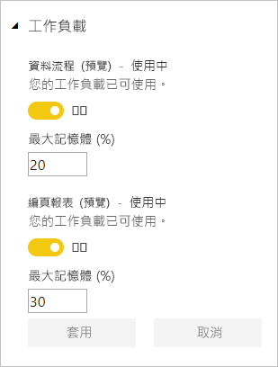
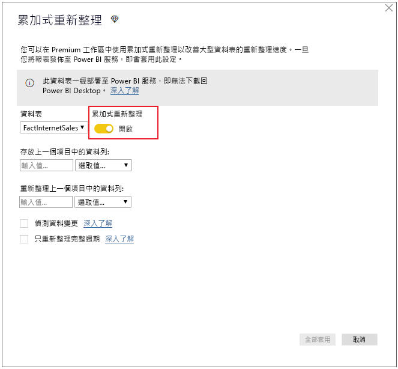
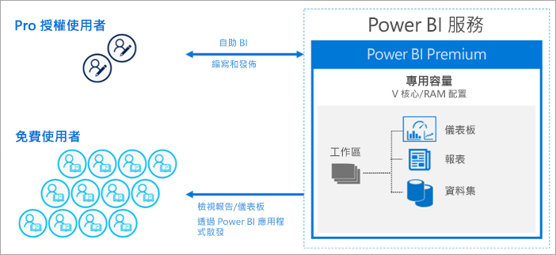

# 什麼是 Power BI Premium？

Power BI Premium 可為組織提供專門用來執行 Power BI 服務的增強資源。 例如：

- 提升規模和效能
- 依容量授權的彈性
- 整合自助與企業 BI
- 使用 Power BI 報表伺服器擴充內部部署 BI
- 依區域 (多地理位置) 的資料落地支援
- 無須購買每個使用者的授權，就可與任何人共用資料

本文不會提供 Power BI Premium 所有功能的深入詳細資訊 - 事實上，它只會稍微提到。 如有需要，請連結到提供更詳細資訊的其他文章。

## 訂閱和授權

Power BI Premium 是兩個 SKU (庫存單位) 系列的可用租用戶層級 Office 365 訂閱：

- **EM** SKU (EM1-EM3) 用於內嵌、需要年度履約承諾，且按月計費。 EM1 和 EM2 SKU 只能透過大量授權方案提供。 您無法直接購買。
- **P** SKU (P1-P3) 用於內嵌和企業功能、需要每月或年度履約承諾、按月計費，且包含在內部部署安裝 Power BI 報表伺服器的授權。

替代方法是購買 **Azure Power BI Embedded** 訂閱，其具有單一 **A** (A1-A6) SKU 系列，僅限用於內嵌和容量測試目的。 所有 SKU 都提供 V 核心來建立容量，但 EM SKU 僅能用於較小的規模內嵌。 具有不到四個 V 核心的 EM1、EM2、A1 和 A2 SKU 不會在專用基礎結構上執行。

雖然本文的焦點是 P SKU，但所述的許多內容也與 A SKU 相關。 相較於 Premium 訂閱 SKU，Azure SKU 不需要時間履約承諾，且按小時計費。 它們提供完整的彈性，允許相應增加、相應減少、暫停、繼續和刪除。 

Azure Power BI Embedded 遠遠超過本文討論範圍，但在＜Premium 功能最佳化＞一文的[測試方法](service-premium-capacity-optimize.md#testing-approaches)一節中描述為實用且經濟實惠選項可用來測試和測量工作負載。 若要深入了解 Azure SKU，請參閱 [Azure Power BI Embedded 文件](https://azure.microsoft.com/services/power-bi-embedded/)。

### 購買

Power BI Premium 訂閱是由管理員在 Microsoft 365 系統管理中心購買。 具體而言，只有 Office 365 全域管理員或計費管理員可以購買 SKU。 購買時，租用戶會收到指派給容量的對應 V 核心數目，稱為「V 核心共用」  。 例如，購買 P3 SKU 可提供租用戶 32 個 V 核心。 若要深入了解，請參閱[如何購買 Power BI Premium](service-admin-premium-purchase.md)。

## 專用容量

透過 Power BI Premium，您可以取得「專用容量」  。 相對於共用容量 (其中工作負載是在與其他客戶共用的計算資源上執行)，專用容量僅供組織使用。 它與專用計算資源一起隔離，為所裝載內容提供可靠且一致的效能。 

工作區存放在容量中。 每個 Power BI 使用者都有個人工作區，稱為**我的工作區**。 可建立額外的工作區來啟用共同作業和部署，這些工作區稱為**應用程式工作區**。 根據預設，工作區 (包括個人工作區) 是在共用容量中建立。 當您具有 Premium 容量時，可將「我的工作區」和「應用程式工作區」指派給 Premium 容量。

### 容量節點

如[訂閱和授權](#subscriptions-and-licensing)一節中所述，有兩個 Power BI Premium SKU 系列：**EM** 和 **P**。所有 Power BI Premium SKU 都會當成容量「節點」  來提供，每個節點代表由處理器、記憶體和儲存體組成的固定數量資源。 除了資源之外，每個 SKU 對於每秒 DirectQuery 和即時連線數目，以及平行模型重新整理數目具有作業限制。

處理是透過在後端與前端之間平均分配的固定數目 V 核心來完成。

**後端 V 核心**負責核心 Power BI 功能，包括查詢處理、快取管理、執行 R 服務、模型重新整理、自然語言處理 (問與答)，以及在伺服器端轉譯報表和影像。 後端 V 核心會獲指派固定數量的記憶體，主要用於裝載模型，也稱為使用中資料集。

**前端 V 核心**負責 Web 服務、儀表板和報表文件管理、存取權限管理、排程、API、上傳和下載，大致上就是與使用者體驗相關的所有作業。

儲存空間會設定為**每個容量節點 100 TB**。

下表描述每個 Premium SKU (及同等大小 A SKU) 的資源和限制：

| 容量節點 | V 核心總數 | 後端 V 核心 | RAM (GB) | 前端 V 核心 | DirectQuery/即時連線 (每秒) | 模型重新整理平行處理原則 |
| --- | --- | --- | --- | --- | --- | --- |
| EM1/A1 | 1 | 0.5 | 2.5 | 0.5 | 3.75 | 1 |
| EM2/A2 | 2 | 1 | 5 | 1 | 7.5 | 2 |
| EM3/A3 | 4 | 2 | 10 | 2 | 15 | 3 |
| P1/A4 | 8 | 4 | 25 | 4 | 30 | 6 |
| P2/A5 | 16 | 8 | 50 | 8 | 60 | 12 |
| P3/A6 | 32 | 16 | 100 | 16 | 120 | 24 |
| | | | | | | |

### 容量工作負載

容量工作負載是提供給使用者的服務。 根據預設，Premium 和 Azure 容量僅支援與執行 Power BI 查詢建立關聯的資料集工作負載。 不可停用資料集工作負載。 可為 [AI (認知服務)](https://powerbi.microsoft.com/blog/easy-access-to-ai-in-power-bi-preview/)、[資料流程](service-dataflows-overview.md#dataflow-capabilities-on-power-bi-premium)和[編頁報表](paginated-reports-save-to-power-bi-service.md)啟用額外的工作負載。 這些工作負載僅在 Premium 訂閱中支援。 

每個額外工作負載都可讓您設定工作負載所能使用的最大記憶體 (以總可用記憶體百分比表示)。 最大記憶體的預設值是由 SKU 決定。 您可以透過只在使用時才啟用這些額外的工作負載，最大限度地提高容量的可用資源。 此外，您可以只在已確定預設設定不符合您的容量資源需求時，才變更記憶體設定。 容量管理員可以使用[管理入口網站](service-admin-portal.md)中的**容量設定**或使用[容量 REST API](https://docs.microsoft.com/rest/api/power-bi/capacities)，為容量啟用和設定工作負載。  

若要深入了解，請參閱[設定 Premium 容量中的工作負載](service-admin-premium-workloads.md)。 

### 容量的運作方式

不論任何時候，Power BI 服務都會在不超過容量限制的情況下充分利用容量資源。

容量作業可分類為「互動式」  或「背景」  。 互動式作業包括轉譯要求及回應使用者互動 (篩選、問與答查詢等)。 一般而言，匯入模型查詢會耗用大量記憶體資源，而查詢 DirectQuery 和即時連線模型會耗用大量 CPU。 背景作業包括資料流程和匯入模型重新整理，以及儀表板查詢快取。

請務必了解互動式作業一律會優先於背景作業，以盡可能確保最佳使用者體驗。 如果資源不足，背景作業會新增至佇列，等到資源釋放後再處理。 Power BI 服務可以在程序中停止背景作業 (例如資料集重新整理)，並將其新增至佇列。

匯入模型必須完整載入至記憶體，才能進行查詢或重新整理。 Power BI 服務管理記憶體使用量的方式，是使用複雜演算法來確保最大限度地提高可用記憶體的使用，因此可能導致過度認可容量：雖然容量可以儲存許多匯入模型 (每個 Premium 容量最多 100 TB)，但當總磁碟儲存體超過支援的記憶體時 (需要額外的記憶體才能查詢和重新整理)，則無法同時全部載入至記憶體。

因此，會根據使用量將匯入模型載入至記憶體及從中移除。 匯入模型會在查詢 (互動式作業) 但不在記憶體時載入，或在需要重新整理 (背景作業) 時載入。

從記憶體移除模型稱為「收回」  。 視模型的大小而定，Power BI 可能會快速執行此作業。 如果容量未發生任何記憶體壓力，則模型會直接載入至記憶體並保留在其中。 不過，當記憶體不足而無法載入模型時，Power BI 服務必須先釋放記憶體。 其釋放記憶體方式是藉由尋找過去三分鐘未使用的模型來偵測哪些模型已成為非使用中 \[[1](#endnote-1)\]，然後收回這些模型。 如果沒有要收回的非使用中模型，Power BI 服務會試圖收回已針對背景作業載入的模型。 最後的手段是在嘗試失敗過了 30 秒後 \[[1](#endnote-1)\]，判定互動式作業失敗。 在此情況下，報表使用者會收到失敗通知及稍後再試一次的建議。 在某些情況下，模型可能會由於服務作業而從記憶體卸載。

請注意，資料集收回是正常且符合預期的行為。 它會透過載入和卸載總大小可能超過可用記憶體的模型，盡可能最大限度地提高記憶體使用量。 這是根據設計而來，且對報表使用者完全透明。 高收回率不一定代表提供給容量的資源不足。 不過，如果查詢或重新整理回應由於高收回率而變慢，則可能會成為問題。

匯入模型的重新整理一律會耗用大量記憶體，因為必須將模型載入至記憶體。 需要額外的記憶體才能處理。 完整重新整理可能會用到模型所需記憶體數量約兩倍。 如此可確保模型即使在處理期間也能進行查詢，因為在重新整理完成且新的模型資料可供使用之前，查詢會傳送到現有的模型。 累加式重新整理需要較少的記憶體且更快完成，因此可大幅降低容量資源的壓力。 對模型進行重新整理也可能會耗費大量 CPU，特別是如果模型具有複雜的 Power Query 轉換，或是具有複雜或以大型資料表為基礎的計算資料表/資料行。

重新整理 (例如查詢) 需要將模型載入至記憶體。 如果記憶體不足，則 Power BI 服務會嘗試收回非使用中的模型；如果不可行 (因為所有模型都在使用中)，則會將重新整理作業排入佇列。 重新整理通常會耗用大量 CPU，查詢更是如此。 因此，並行重新整理數目有容量限制，設定為後端 V 核心數目的 1.5 倍 (無條件進位)。 如果並行重新整理數目太多，則會將排程重新整理排入佇列。 發生這些情況時，重新整理需要更長的時間才能完成。 依需求重新整理 (例如由使用者要求或 API 呼叫觸發的重新整理) 會重試三次 \[[1](#endnote-1)\]。 如果仍然沒有足夠的資源，則重新整理會失敗。

章節附註：   
\[1\] 可能隨時變更。

### 區域支援

建立新容量時，Office 365 全域管理員和 Power BI 服務管理員可以為指派給容量的工作區指定存放區域。 這稱為**多地理位置**。 透過多地理位置，組織可以將內容部署到位於特定區域的資料中心來符合資料落地需求，即使該區域不同於 Office 365 訂閱所在區域也一樣。 若要深入了解，請參閱 [Power BI Premium 的多地理位置支援](service-admin-premium-multi-geo.md)。

### 容量管理

管理 Premium 容量牽涉到建立或刪除容量、指派管理員、指派工作區、設定工作負載、監視，以及進行調整將容量效能最佳化。 

Office 365 全域管理員和 Power BI 服務管理員可以從可用的 V 核心建立 Premium 容量，或修改現有的 Premium 容量。 建立一個容量時，會指定容量大小和地理區域，並指派至少一個容量管理員。 

建立多個容量時，會在[管理入口網站](service-admin-portal.md)中完成大部分的管理工作。

容量管理員可以將工作區指派給容量、管理使用者權限，以及指派其他管理員。 容量管理員也可以設定工作負載、調整記憶體配置，並視需要重新啟動容量，以在容量超載時重設作業。

容量管理員也可以確定容量順暢執行。 他們可以直接在管理入口網站中或使用 Premium 容量計量應用程式來監視容量狀況。

若要深入了解如何建立容量、指派管理員和指派工作區，請參閱[管理 Premium 容量](service-premium-capacity-manage.md)。 若要深入了解角色，請參閱[與 Power BI 相關的管理員角色](service-admin-administering-power-bi-in-your-organization.md#administrator-roles-related-to-power-bi)。

### 監視

監視 Premium 容量可讓管理員了解如何執行容量。 您可以使用管理入口網站和 [Power BI Premium 容量計量應用程式](https://app.powerbi.com/groups/me/getapps/services/capacitymetrics)來監視容量。

在入口網站中監視可讓您快速檢視高階計量，指出過去七天內您容量所產生之負載與使用的資源量。 

**Power BI Premium 容量計量**應用程式提供您容量如何執行的最深入資訊。 此應用程式提供高階儀表板和更詳細的報表。

您可以從應用程式的儀表板，按一下計量儲存格以開啟深入報表。 這些報表提供深入的計量和篩選功能，以向下鑽研為確保容量順暢執行所需的最重要資訊。

若要深入了解監視功能，請參閱[在 Power BI 管理入口網站中監視](service-admin-premium-monitor-portal.md)和[使用 Power BI Premium 容量計量應用程式監視](service-admin-premium-monitor-capacity.md)。

### 將容量最佳化

充分利用容量是確保使用者取得效能且您取得最大 Premium 投資報酬的關鍵。 藉由監視關鍵計量，管理員就可以決定如何為瓶頸進行疑難排解，並採取必要的動作。 若要深入了解，請參閱[將 Premium 容量最佳化](service-premium-capacity-optimize.md)和 [Premium 容量案例](service-premium-capacity-scenarios.md)。

### 容量 REST API

Power BI REST API 包含[容量 API](https://docs.microsoft.com/rest/api/power-bi/capacities) 集合。 管理員可以使用這些 API，以程式設計方式管理 Premium 容量的許多層面，包括啟用和停用工作負載、將工作區指派給容量等。

## 大型資料集

視 SKU 而定，Power BI Premium 支援上傳大小最多為 **10 GB** 的 Power BI Desktop (.pbix) 模型檔案。 載入時，模型可接著發佈到指派給 Premium 容量的工作區。 然後，資料集可以重新整理，最多 **12 GB** 的大小。

### 大小考量

大型模型可能會耗用大量資源。 任何大於 1 GB 的模型至少要有 P1 SKU。 雖然可將大型模型發佈到 A SKU 支援的工作區 (最多到 A3)，但無法重新整理這些模型。

下表描述各種 .pbix 大小的建議 SKU：

   |SKU  |.pbix 大小   |
   |---------|---------|
   |P1    | < 3 GB        |
   |P2    | < 6 GB        |
   |P3、P4、P5    | 最多 10 GB   |

Power BI Embedded A4 SKU 等同於 P1 SKU、A5 = P2 及 A6 = P3。 請注意，將大型模型發行到 A 和 EM SKU，可能會傳回錯誤，且為非專屬於共用容量中模型大小限制的錯誤。 A 和 EM SKU 中，大型模型的重新整理錯誤，很可能指向逾時。 

.pbix 檔案以「高度壓縮狀態」  呈現資料。 載入至記憶體時，資料可能會展開多次，而且從該處，在資料重新整理期間，資料可能會再展開幾次。

排程重新整理大型資料集可能需要很長的時間，且會耗用大量資源。 請務必不要排程太多重疊重新整理。 建議設定[累加式重新整理](service-premium-incremental-refresh.md)，因為其更快速可靠，且耗用較少的資源。

如果自上次使用資料集以來已有一段時間，則大型資料集的初始報表載入可能需要很長的時間。 較長載入之報表的載入列會顯示載入進度。

雖然 Premium 容量中的每個查詢記憶體和時間條件約束較高，但建議您使用篩選和交叉分析篩選器來限制視覺效果只顯示必要項目。

## 累加式重新整理

累加式重新整理是在 Power BI Premium 中擁有和維護大型資料集不可或缺的一部分。 累加式重新整理有許多好處。例如，重新整理會變快，因為只需要重新整理已變更的資料。 重新整理更可靠，因為不需要維護易變資料來源的長時間執行連線。 減少資源耗用量，因為要重新整理的資料較少可減少記憶體和其他資源的整體耗用。 累加式重新整理原則定義於 **Power BI Desktop**，並在發佈到 Premium 容量中的工作區時套用。 

若要深入了解，請參閱 [Power BI Premium 中的累加式重新整理](service-premium-incremental-refresh.md)。

## 編頁報表

P1-P3 和 A4_A6 SKU 支援的編頁報表採用 SQL Server Reporting Services 中的報表定義語言 (RDL) 技術。 雖然採用 RDL 技術，但與 Power BI 報表伺服器不同，這是可供您下載並在內部部署安裝的報告平台，也隨附於 Power BI Premium。 編頁報表的格式設定為適當符合頁面大小以供列印或共用。 資料會以一個資料表顯示，即使資料表跨越多個頁面也一樣。 使用者可以使用免費的 [**Power BI 報表產生器**](https://go.microsoft.com/fwlink/?linkid=2086513) Windows 傳統型應用程式來撰寫編頁報表，並將其發佈到服務。

在 Power BI Premium 中，編頁報表是必須使用管理入口網站為容量啟用的工作負載。 容量管理員可以啟用，然後以容量的整體記憶體資源百分比來指定記憶體數量。 不同於其他類型的工作負載，Premium 會在容量內含空間中執行編頁報表。 無論工作負載是否為作用中，都會使用指定給此空間的最大記憶體。 預設值為 20%。 

若要深入了解，請參閱 [Power BI Premium 中的編頁報表](paginated-reports-report-builder-power-bi.md)。 若要深入了解如何啟用編頁報表工作負載，請參閱[設定工作負載](service-admin-premium-workloads.md)。

## Power BI 報表伺服器
 
隨附於 Power BI Premium 的 Power BI 報表伺服器是具有入口網站的「內部部署」  報表伺服器。 您可以建置內部部署 BI 環境並在組織防火牆之後散發報表。 報表伺服器可讓使用者存取 SQL Server Reporting Services 中豐富的互動式企業報告功能。 使用者可以探索視覺效果資料，並快速找出模式以制訂更好且更快速的決策。 報表伺服器會根據您的條件提供治理。 一旦時機成熟，Power BI 報表伺服器可讓您輕鬆地移轉至雲端，讓您的組織可以充分利用所有的 Power BI Premium 功能。

若要深入了解，請參閱 [Power BI 報表伺服器](report-server/get-started.md)。

## 無限制的內容共用

透過 Premium，不論是組織內或組織外的人員，所有人都無須購買個人授權就能檢視您的 Power BI 內容，包括編頁及互動式報表。 

Premium 讓 Pro 使用者能廣泛散發內容，且檢視內容的收件者並不需要 Pro 授權。 內容建立者需要 Pro 授權。 建立者可以連線到資料來源、建立資料模型，然後建立封裝成工作區應用程式的報表和儀表板。 

若要深入了解，請參閱 [Power BI 授權](service-admin-licensing-organization.md)。

## 工具連線 (預覽)

實際上，Power BI 資料集受到經企業實證的 Microsoft **Analysis Services Vertipaq 引擎**支援。 Analysis Services 透過支援開放標準 XMLA 通訊協定的用戶端程式庫和 API 來提供程式設計功能，以及用戶端應用程式和工具支援。 目前，Power BI Premium 資料集透過 **XMLA 端點**支援來自 Microsoft 和協力廠商用戶端應用程式與工具的「唯讀」  作業。 

Microsoft 工具 (例如 SQL Server Management Studio 和 SQL Server Profiler) 和協力廠商應用程式 (例如 DAX Studio 和資料視覺效果應用程式) 可以連線到 Premium 資料集，並使用 XMLA、DAX、MDX、DMV 和追蹤事件進行查詢。 

若要深入了解，請參閱[使用用戶端應用程式與工具連線至資料集](service-premium-connect-tools.md)。

## 後續步驟

> [!div class="nextstepaction"]
> [管理 Premium 容量](service-premium-capacity-manage.md)

有其他問題嗎？ [嘗試在 Power BI 社群提問](https://community.powerbi.com/)

||||||
