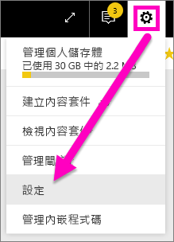
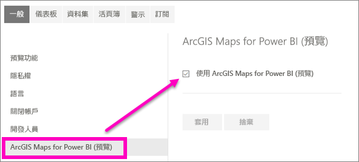

# 加入宣告 Power BI 預覽功能
## 什麼是「預覽功能」？
當我們改進 Power BI 時，會以「預覽功能」的形式發行一些新功能。 您可以開啟或關閉預覽功能，以獲得試用機會。

> [!TIP]
> 有疑問或意見反應嗎？ [請瀏覽 Power BI 社群論壇](http://community.powerbi.com/t5/Navigation-Preview-Forum/bd-p/NavigationPreview)。
> 
> 

## 目前可用的預覽
**ArcGIS Maps for Power BI 預覽**：ArcGIS 地圖與 Power BI 的結合，把在點之外加上地圖的做法帶到了全新境界。
[瀏覽 Power BI 服務及 Power BI Desktop 中由 Esri 提供的 ArcGIS 地圖](power-bi-visualization-arcgis.md)。

## 開啟 (及關閉) 新的 ArcGIS 預覽功能
1. 選取 Power BI 螢幕右上角的齒輪圖示以開啟您的 [設定] 功能表，然後選擇 [設定]。
   
   .
2. 選取 [一般] 索引標籤，然後選擇 [預覽功能]。
   
   
3. 選取 [開啟] 選項按鈕，以試用全新的體驗。 按一下 [套用]。
4. 若要關閉預覽功能，請遵循上述步驟 1-2，並在步驟 3 中，選取 [關閉] > [套用]。

## 後續步驟
[新的 Power BI 導覽體驗](service-the-new-power-bi-experience.md)

有疑問或意見反應嗎？ [請瀏覽 Power BI 社群論壇](http://community.powerbi.com/t5/Navigation-Preview-Forum/bd-p/NavigationPreview)。

