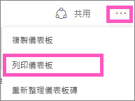
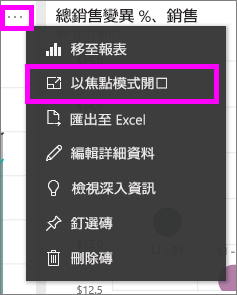
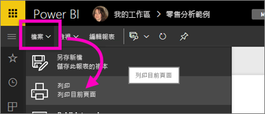

# 從 Power BI 服務列印
從 Power BI 服務列印整個儀表板、儀表板磚、報表頁面或報表視覺效果。 一次只能列印一頁報表 -- 您無法一次列印整份報表。

> [!NOTE]
> 列印僅適用於 Power BI 服務，不適用於 Power BI Desktop。
> 
> 

觀看 Amanda 從她的儀表板和報表進行列印。 然後遵循影片下方的逐步指示親自試試看。

<iframe width="560" height="315" src="https://www.youtube.com/embed/jtlLGRKBvXY" frameborder="0" allowfullscreen></iframe>

## 列印儀表板
1. 開啟您想要列印的儀表板。
2. 在右上角選取省略符號 (...) 並選擇 [列印儀表板]。
   
    
3. 您瀏覽器的 [列印] 視窗會隨即開啟。 選擇設定及列印目的地，然後選取 [列印]。
   
   > [!NOTE]
   > 顯示的列印對話方塊會依據您使用的瀏覽器而有所不同。
   > 
   > 
   
    

## 列印儀表板磚
1. 藉由選取省略符號並且選擇「焦點」圖示 ，[在焦點模式中開啟圖格](service-focus-mode.md)。
   
    
2. 從上方導覽列中選取全螢幕圖示 ，以[全螢幕模式](service-fullscreen-mode.md)開啟磚。
3. 將滑鼠停留在磚上方以顯示 [選項] 功能表。
   
    
4. 選取列印圖示 。     
   
   > [!NOTE]
   > 顯示的列印對話方塊會依據您使用的瀏覽器而有所不同。
   > 
   > 

## 列印報表頁面
一次只能列印一頁報表。

1. 以 [閱讀檢視] 或 [編輯檢視] 開啟報表。
2. 選取 [檔案] > [列印] 即可列印目前報表頁面。
   
    
3. 您瀏覽器的 [列印] 視窗會隨即開啟。
   
   > [!NOTE]
   > 顯示的列印對話方塊會依據您使用的瀏覽器而有所不同。
   > 
   > 

## 列印報表視覺效果
1. [以焦點模式開啟視覺效果](service-focus-mode.md)，方法是將滑鼠游標移至磚上方，並選取右上角的焦點圖示 。
2. 依照上述*列印報表頁面*底下的步驟 2-3。

## 考量與疑難排解
* 問︰我找不到 [列印] 按鈕。    
* 答：如果使用 Power BI Desktop，則不支援列印。  列印僅適用於 Power BI 服務。
* 問︰我無法一次列印所有報表頁面。    
* 答︰是的。 一次只能列印一頁報表。
* 問：我無法列印到 PDF。    
* 答︰如果您已在瀏覽器中設定 PDF 驅動程式，則只會看到此選項。    
* 問︰當我選取 [列印] 時，看到與您在此所示不同的畫面。    
* 答︰[列印] 畫面會因瀏覽器與軟體版本而異。
* 問︰我的列印成品未正確地縮放。  我的儀表板無法容納在此頁面上。 其他縮放和方向問題。    
* 答︰我們無法保證列印的複本會與出現在 Power BI 服務中的正本完全相同。 縮放、邊界、視覺效果詳細資料、方向和大小等項目不是由 Power BI 所控制。 如需這類問題的協助，請參閱特定瀏覽器的文件。      

## 後續步驟
[與同事和其他人共用儀表板與報表](service-share-dashboards.md)

有其他問題嗎？ [試試 Power BI 社群](http://community.powerbi.com/)

