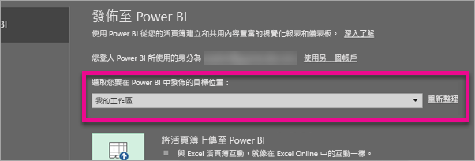

# 從 Excel 2016 發佈至 Power BI
在 Excel 2016 中，您可以將 Excel 活頁簿發佈至 [Power BI](https://powerbi.microsoft.com) 網站，並在此根據活頁簿的資料建立互動性極高的報表和儀表板。 然後，您就可以與組織中的其他人分享深入解析。

在繼續討論前，請記住以下幾點︰

* 您的活頁簿必須先儲存到商務用 OneDrive，才能發佈至 Power BI。
* 您用來登入 Office、商務用 OneDrive 和 Power BI 的帳戶必須是相同的帳戶。
* 您無法發佈空白活頁簿，或是未含任何 Power BI 支援內容的活頁簿。
* 您無法發佈加密或受密碼保護的活頁簿，或是使用資訊保護管理的活頁簿。
* 發佈到 Power BI 需要啟用新式驗證 (預設值)。 如果停用，[檔案] 功能表就無法使用 [發佈] 選項。

## 發佈 Excel 活頁簿
在 Excel 中，選取 [檔案] > [發佈]。

### 本機檔案發佈
從 2017 年 2 月更新開始，Excel 2016 支援發佈本機 Excel 檔案。 您不需要將這些檔案儲存至商務用 OneDrive 或 SharePoint Online。

> [!IMPORTANT]
> 只有具有 Office 365 訂閱的 Excel 2016 才會看到發佈本機檔案的體驗。 Excel 2016 獨立安裝仍會有僅限「發佈」的行為，而需要將 Excel 活頁簿儲存至商務用 OneDrive 或 SharePoint Online。
> 
> 

當您選取 [發佈] 時，您將能夠選取想要發佈的目標工作區。 這可以是您有權存取的個人或群組工作區。

您有兩個關於如何將活頁簿放入 Power BI 的選項。

發佈後，它會在 Power BI 中以複本形式保留，並與本機檔案分開置放。 如果您想要在 Power BI 中更新檔案，您需要重新發佈已更新的版本。 您可以重新整理資料，並設定 Power BI 活頁簿或資料集的排程重新整理。

### 從獨立式 Excel 發佈
如果您的活頁簿尚未儲存到 OneDrive，您必須先儲存到這個位置。 選取 [儲存至雲端]，然後選擇商務用 OneDrive 中的一個位置。

您的活頁簿儲存到 OneDrive 後，當您選取 [發佈] 時，就會有兩個選項可將活頁簿放入 Power BI。

#### 將活頁簿上傳至 Power BI
當您選擇此選項時，您的活頁簿會顯示在 Power BI 中，就像是在 Excel Online 中一樣。 但不同於 Excel Online，您有一些很棒的功能，可協助您將工作表中的項目釘選到儀表板。

您無法編輯在 Power BI 中開啟的活頁簿，但如果您需要進行一些變更，您可以選取 [編輯]，然後選擇在 Excel Online 中編輯活頁簿，或在電腦上以 Excel 開啟活頁簿。 您所做的任何變更都會儲存到 OneDrive 上的活頁簿。

上傳時，不會在 Power BI 中建立任何資料集。 您的活頁簿會顯示在工作區功能窗格的 [報表] 中。 上傳至 Power BI 的活頁簿會有特殊的 Excel 圖示，將其識別為已上傳的 Excel 活頁簿。

如果您只有工作表中的資料，或是有想要在 Power BI 中查看的樞紐分析表和圖表，請選擇此選項。
在 Excel 中從 [發佈至 Power BI] 使用 [上傳]，相當於在瀏覽器中從 Power BI 使用 [取得資料] > [檔案] > [商務用 OneDrive] > [在 Power BI 中連接、管理及檢視 Excel]。

#### 將活頁簿資料匯出至 Power BI
當您選擇此選項時，資料表及/或資料模型中任何支援的資料都會匯出至 Power BI 中的新資料集。 如果您有任何 Power View 工作表，則會在 Power BI 中重新建立為報表。

您可以繼續編輯活頁簿。 當您儲存變更後，這些變更通常會在一小時內與 Power BI 中的資料集同步處理。 如果您需要立即同步處理，您可以再次直接選取 [發佈] 立即匯出變更。 您在報表和儀表板中的任何視覺效果也會更新。

如果您使用 [取得和轉換資料] 或 Power Pivot 將資料載入資料模型，或是您的活頁簿具有想要在 Power BI 中查看的 Power View 工作表及視覺效果，請選擇此選項。

在 Excel 中從 [發佈至 Power BI] 使用 [匯出]，相當於在瀏覽器中從 Power BI 使用 [取得資料] > [檔案] > [商務用 OneDrive] > [將 Excel 資料匯出至 Power BI]。

## 發佈
當您選擇任何一個選項時，Excel 會使用您目前的帳戶登入 Power BI，然後將您的活頁簿發佈至 Power BI 網站。 請注意 Excel 中的狀態列。 它會顯示目前的進度。

完成時，即可直接從 Excel 移至 Power BI。

## 後續步驟
[Power BI 的 Excel 資料](service-excel-workbook-files.md)  
有其他問題嗎？ [試試 Power BI 社群](http://community.powerbi.com/)

