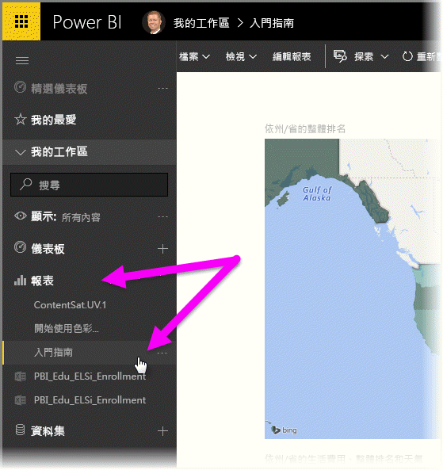
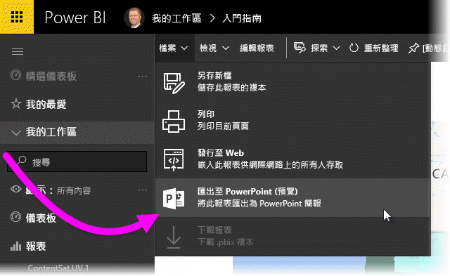
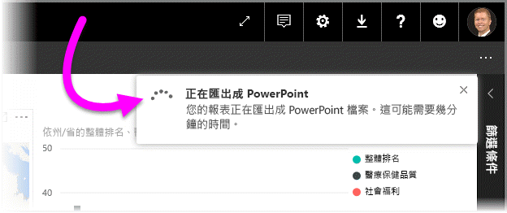
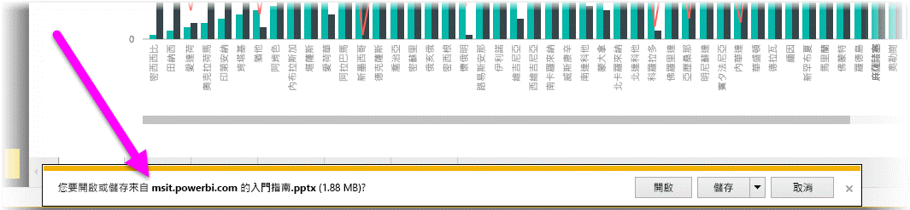
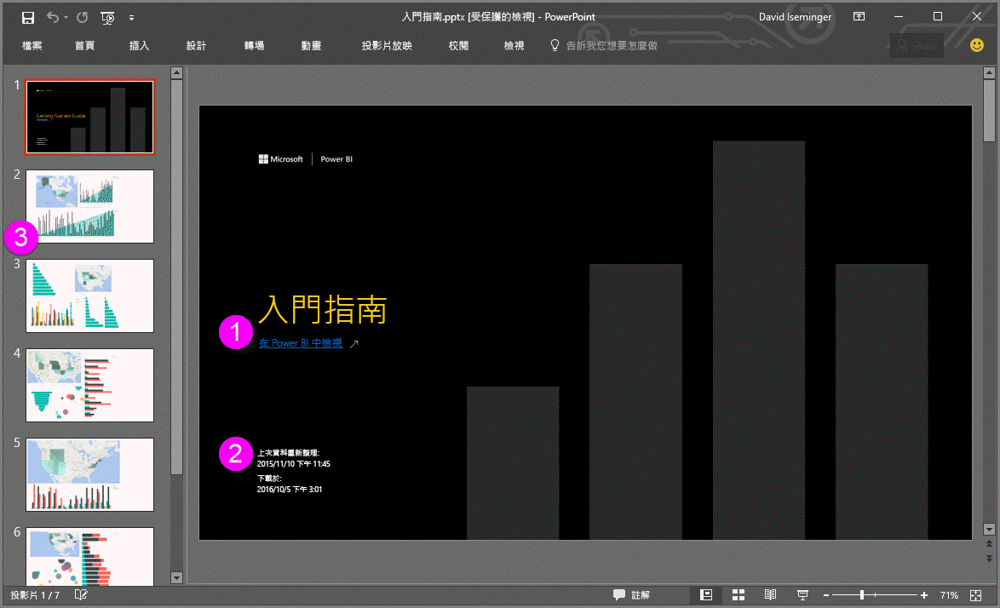
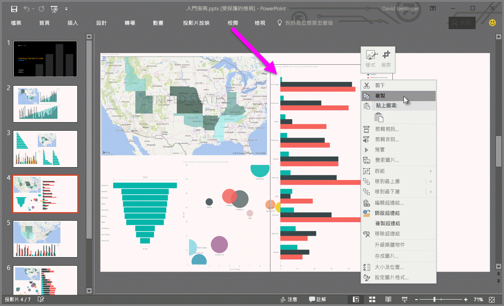

# 從 Power BI 將報表匯出至 PowerPoint (預覽)
有了 Power BI，您現在可以將報表發佈至 **Microsoft PowerPoint**，並根據 Power BI 報表輕鬆地建立投影片組。 當您**匯出至 PowerPoint** 時會發生下列狀況︰

* Power BI 報表中的每個頁面都會變成 PowerPoint 的個別投影片
* Power BI 報表中的每個頁面都會匯出成 PowerPoint 中的單一高解析度影像
* Power BI 報表中的文字方塊會變成 PowerPoint 的可編輯文字方塊
* PowerPoint 中會建立連結至 Power BI 報表的連結

將 **Power BI 報表**匯出到 **PowerPoint** 很簡單。 只要遵循下一節中列出的步驟即可。

## 如何將 Power BI 報表匯出至 PowerPoint
在 Power BI 服務中，選取左導覽窗格的 [報表] 區段以展開該區段，然後選取您的報表使其顯示在畫布上。 如果報表位在 [我的工作區] 區段或 [我的最愛]，您也可以從中選取報表。

當您要匯出至 PowerPoint 的報表顯示在畫布上時，請從 Power BI 服務的功能表列中選取 [檔案] > [匯出至 PowerPoint (預覽)] ，如下圖所示。

您會在 Power BI 服務瀏覽器視窗的右上角，看到報表正匯出至 PowerPoint 的通知橫幅。 這可能需要幾分鐘的時間，而您可以在報表匯出時繼續使用 Power BI 工作。

完成後，通知橫幅隨即變更，讓您知道 Power BI 服務已完成匯出程序。

您可以在瀏覽器顯示下載檔案的位置取得檔案。 在下圖中，是以瀏覽器視窗底部的下載橫幅方式顯示。

就是這麼簡單。 您可以下載檔案、使用 PowerPoint 開啟檔案，然後像您處理任何其他 PowerPoint 簡報一樣修改或加強檔案。

## 查看已匯出的 PowerPoint 檔案
當您開啟 Power BI 匯出的 PowerPoint 檔案時，您會發現一些很棒又實用的元素。 請看下圖，然後查看下方說明其中幾項優異功能的編號項目。

1. 投影片組的第一頁包含您的報表名稱及連結，讓您**在 Power BI 中檢視**作為投影片組基礎的報表。
2. 您也會獲得一些有關報表的實用資訊，包括匯出報表所依據的「上次資料重新整理」，以及「下載於」時間和日期，也就是 Power BI 報表匯出為 PowerPoint 檔案的日期和時間。
3. 每張報表頁面都是一張個別的投影片，如左導覽窗格中所示。

當您瀏覽個別的投影片時，您會發現每個報表頁面都是獨立的影像。

>[!NOTE]
> 每個報表頁面擁有一個視覺效果是新的行為。 先前的行為 (針對每個視覺效果提供獨立的影像) 已不再實作。 
 

您可在此隨意處理 PowerPoint 簡報或任何高解析度影像！

## 限制
使用 [匯出至 PowerPoint] 功能時，需牢記幾項考量與限制。

* 目前不支援 **R 視覺效果**。 任何這類的視覺效果都會作為空白影像匯出至 PowerPoint，並顯示一個錯誤訊息，指出目前並不支援該視覺效果。
* 目前已支援**經認證**的**自訂視覺效果**。 如需認證自訂視覺效果，包括如何使自訂視覺效果獲得認證的詳細資訊，請參閱[認證自訂視覺效果](power-bi-custom-visuals-certified.md)。 任何未經認證的自訂視覺效果目前都不支援，其將會作為空白影像匯出至 PowerPoint，並顯示一個錯誤訊息，指出目前並不支援該視覺效果。
* 支援**認證的自訂視覺效果**。 認證的自訂視覺效果已獲核准可搭配 Power BI 使用，且符合特定的程式碼需求，並已通過嚴格的安全性測試。 您可以[深入了解**認證的自訂視覺效果**](power-bi-custom-visuals-certified.md)。
* 目前無法匯出超過 15 頁的報表。
* 將報表匯出至 PowerPoint 的程序需時數分鐘，請耐心等候。 影響所需時間的因素，包括報表結構及 Power BI 服務目前的負載。
* 如果 Power BI 服務不提供 [匯出至 PowerPoint (預覽)] 功能表項目，有可能是因為租用戶系統管理員停用了此功能。 如需詳細資訊，請連絡您的租用戶系統管理員。
* 背景影像會按圖表的周框區域剪裁。 強烈建議您先移除背景影像，再匯出至 PowerPoint。
* 目前不支援匯出至 PowerPoint 時的**工作階段內互動**，例如反白顯示和篩選、向下鑽研等等。 匯出的 PowerPoint 會顯示原來儲存在報表中的視覺效果。
* PowerPoint 中的頁面一律會以標準的 9:16 大小建立，而不論 Power BI 報表中的原始頁面大小或維度為何。
* Power BI 租用戶網域外部使用者擁有的報表 (例如，組織外部某人所擁有並與您共用的報表) 無法發行至 PowerPoint。
* 如果您與組織外部的某人 (也就是不在您 Power BI 租用戶中的使用者) 共用儀表板，該使用者會無法將與共用儀表板的相關報表匯出至 PowerPoint。 舉例來說，如果您是 aaron@contoso.com，您可以和 david@cohowinery.com 共用。但是 david@cohowinery.com 無發將相關報表匯出至 PowerPoint。
* 如先前所述，每個報表頁面會匯出為 PowerPoint 檔中的單一影像。
* Power BI 服務會使用您的 Power BI 語言設定作為 PowerPoint 的輸出語言。 若要查看或設定語言喜好設定，請選取齒輪圖示  **> [設定] > [一般] > [語言]**。
* 匯出的 PowerPoint 檔案，其封面投影片上的**下載於**時間，會設定為匯出當時您電腦的時區。

## 後續步驟
[使用 Excel 分析](service-analyze-in-excel.md)

[Power BI 的 Excel 資料](service-excel-workbook-files.md)

[讓自訂視覺效果通過認證](power-bi-custom-visuals-certified.md)

