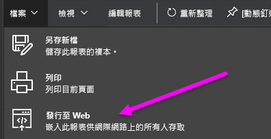
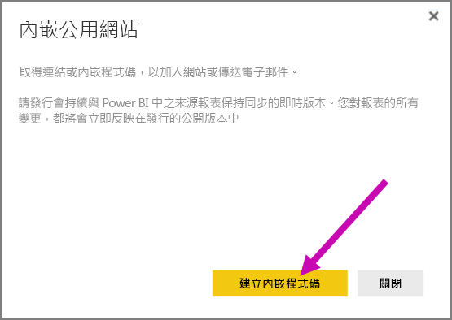
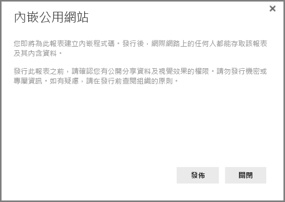
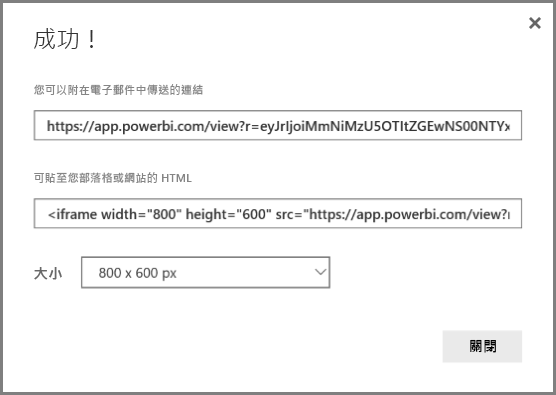
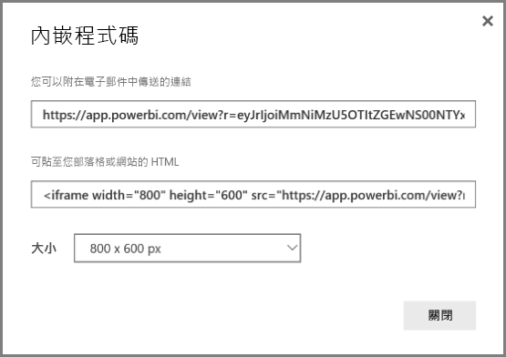
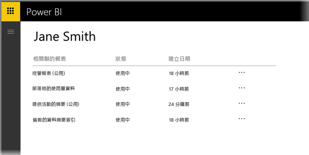

# Power BI 的 [發行至 Web]

透過 Power BI [發行至 Web]，您可以輕鬆地使用任何裝置，線上內嵌互動式 Power BI 視覺效果，例如內嵌至部落格文章、網站，或透過電子郵件、社交媒體傳送。

您也可以輕鬆編輯、更新、重新整理或取消共用已發佈的視覺效果。

> [!WARNING]
> 使用 [發行至 Web] 時，網際網路上的任何人都可以檢視您發佈的報表或視覺效果。 無須驗證即可檢視這些報表。 使用 [發佈至網路] 時，請只針對網際網路上所有人 (未經驗證的一般大眾) 皆可檢視的報表和資料。 這包括報表中所彙總的詳細等級資料。 發行此報表之前，請確認您有公開分享資料及視覺效果的權限。 請勿發行機密或專屬資訊。 如有疑問，請先核查貴組織的原則再發行。

>[!Note]
>若要安全地將您的內容內嵌在內部入口網站或網站，請使用[內嵌](service-embed-secure.md)或[內嵌於 SharePoint Online 中](service-embed-report-spo.md)選項。 這可確保當您的使用者檢視您的內部資料時，所有權限與資料安全性都強制受保護。

## 如何使用 [發佈至網路]

您可以在個人或群組工作區中可編輯的報表使用 [發行至 Web] 功能。  與您共用的報表或依賴資料列層級安全性保護資料的報表，不能使用 [發行至 Web]。 請參閱下面的＜限制＞一節以取得不支援 [發行至 Web] 的完整案例清單。 使用 [發佈至 Wb] 之前，請先檢閱此文章稍早的＜警告＞。

在以下 *短片*中，您可以觀賞這項功能的運作方式。 然後依循下列步驟，自己試試看。

<iframe width="560" height="315" src="https://www.youtube.com/embed/UF9QtqE7s4Y" frameborder="0" allowfullscreen></iframe>

下列步驟說明如何使用 [ **發佈至網路**]。

1. 在您工作區中可編輯報表上，選取 [檔案] **[發行至 Web]**.

   

2. 如以下對話方塊所示，檢閱對話方塊中的內容，選取 [ **建立內嵌程式碼** ]。

   

3. 檢閱以下對話方塊所示的警告，並確認資料是否可以內嵌在公開網站上。 如果可以，請選取 [ **發佈**]。

   

4. 然後會出現一個對話方塊，提供連結，您可以透過電子郵件傳送該連結、內嵌於程式碼 (例如 iFrame)，或直接貼在網頁或部落格上。

   

5. 如果您先前已針對報表建立內嵌程式碼，該程式碼會立即顯示。 每個報表只能建立一個內嵌程式碼。

   

## 檢視模式的秘訣和訣竅

在部落格文章中內嵌內容時，通常需要符合特定螢幕大小。  您可以視需要在 iFrame 標籤內調整高度和寬度，但您可能也需要確保報表符合 iFrame 的特定區域大小，因此編輯報表時，您還必須設定適當的檢視模式。

下表提供檢視模式的相關指南，以及內嵌後的顯示方式。

| 檢視模式 | 內嵌時的外觀 |
| --- | --- |
|  |[調整成一頁] 會使用您報表頁面的高度和寬度。 如果頁面設定為 16:9 或 4:3 的「動態」外觀比例，您的內容就會調整成適合您所提供的 iFrame 大小。 當內嵌在 iFrame 中時，使用 [符合一頁大小] 會造成**上下黑邊**，當內容調整成符合 iFrame 後，iFrame 區域會出現灰色背景。 若要將上下黑邊縮到最小，請正確設定 iFrame 的高度/寬度。 |
|  |[實際大小] 可確保報表維持您在報表頁面上設定的大小。 這會導致 iFrame 中出現捲軸。 設定 iFrame 的高度和寬度以避免出現捲軸。 |
|  |[符合寬度] 可確保內容符合您 iFrame 的水平寬度。 框線仍將顯示，但是內容大小會調整為使用所有的水平空間。 |

## iFrame 高度和寬度的秘訣和訣竅

發佈至網路後，您會收到如下所示的內嵌程式碼：

您噁以手動編輯寬度與高度以確保它的大小適合您正在內嵌它的頁面。

為使調整更臻理想，您可以嘗試在 iFrame 的高度加上 56 像素。 這可適應底端列的目前大小。 如果報表頁面使用動態大小，下表提供一些您可以使用而不會出現上下黑邊的大小。

| 外觀比例 | 大小 | 尺寸 (寬度 x 高度) |
| --- | --- | --- |
| 16:9 |小 |640 x 416 像素 |
| 16:9 |中 |800 x 506 像素 |
| 16:9 |大 |960 x 596 像素 |
| 4:3 |小 |640 x 536 像素 |
| 4:3 |中 |800 x 656 像素 |
| 4:3 |大 |960 x 776 像素 |

## 管理內嵌程式碼

建立 [ **發佈至網路** ] 內嵌程式碼後，您可以從 Power BI 服務的 [ **設定** ] 功能表上管理建立的程式碼。 管理內嵌程式碼時，可以移除目標視覺效果、回報程式碼 (會導致內嵌程式碼無法使用) 或重新取得內嵌程式碼。

1. 若要管理您的 [發行到 Web]  內嵌程式碼，請開啟 [設定]  齒輪，然後選取 [管理內嵌程式碼] 。

   

2. 顯示已建立的內嵌程式碼清單，如下圖所示。

   

3. 針對清單上的每個 [ **發佈至網路** ] 內嵌程式碼，您可以擷取內嵌程式碼，或刪除內嵌程式碼以取消與該報表或視覺效果的所有連結。

   

4. 如果您選取 [刪除]，系統會詢問您是否確定刪除內嵌程式碼。

   

## 報表更新和資料重新整理

建立和共用 [ **發佈至網路** ] 內嵌程式碼後，報表將依據您的變更更新。 不過請務必注意，使用者可能需要一段時間才能看到更新。 報表或視覺效果更新需要大約一小時才會反映在 [發佈至網路] 內嵌程式碼上。

剛開始使用 [ **發佈至網路** ] 取得內嵌程式碼時，內嵌程式碼連結會立即啟用，開啟連結的人都可以檢視內容。  第一次進行 [發佈至網路] 之後，接下來針對 [發佈至網路] 連結的報表或視覺效果進行更新，大約需要一小時使用者才能看到這些項目。

若要深入了解，請參閱本文稍後的＜ **運作方式** ＞一節。 如果需要立即可用的更新，您可以刪除內嵌程式碼，並建立新的內嵌程式碼。

## 資料重新整理

資料重新整理會自動反映在您的內嵌報表或視覺效果中。 大約需要 1 小時，重新整理的資料才會顯示在內嵌程式碼中。 您可以在報表使用的資料集排程上選取 [不重新整理]，停用自動重新整理。  

## 自訂視覺效果

[發行至 Web] 支援自訂視覺效果。 使用 [發佈至網路] 時，與您共用已發佈視覺效果的使用者不需要啟用自訂視覺效果，即可檢視報表。

## 限制

[發行至 Web] 支援絕大部分的資料來源和 Power BI 服務中的報表，但 [發行至 Web] **目前不支援或提供**下列報表：

- 使用資料列層級安全性的報表。
- 使用任何即時連線資料來源的報表，包括裝載於內部部署 的 Analysis Services 表格式、Analysis Service 多維度和 Azure Analysis Services。
- 直接或透過組織內容套件與您共用的報表。
- 位在您非屬編輯成員之群組中的報表。
- [發行至 Web] 報表目前不支援 "R" 視覺效果。
- 從已發行至 Web 之報表中的視覺效果匯出資料
- ArcGIS Maps for Power BI 視覺效果
- 報表包含報表層級 DAX 量值
- 單一登入資料查詢模型
- [安全的機密或專屬資訊](#publish-to-web-from-power-bi)
- 隨著 [內嵌] 選項提供的自動驗證功能無法搭配 Power BI JavaScript API 使用。 針對 Power BI JavaScript API，請使用[使用者擁有資料](developer/embed-sample-for-your-organization.md)方式來內嵌。 深入了解[使用者擁有資料](developer/embed-sample-for-your-organization.md)。

## 租用戶設定

Power BI 系統管理員可以啟用或停用發佈到 web 功能。 他們也可能會限制特定群組的存取。 您以此設定作為基礎建立內嵌程式碼變更的能力。

|功能 |允許整個組織使用 |不允許整個組織使用 |特定安全性群組   |
|---------|---------|---------|---------|
|報告 [檔案] 功能表下的 [發行至 Web]。|針對全部啟用|並非所有人都可看到|只有經授權的使用者或群組才可看到。|
|[設定] 下的 [管理內嵌程式碼]|針對全部啟用|針對全部啟用|針對全部啟用  [刪除]*  選項僅適用於經授權的使用者或群組。 針對全部啟用 [取得驗證碼]* 。|
|系統管理員入口網站內的 [內嵌程式碼]|狀態會反映下列其中一項： * 使用中 * 不支援 * 已封鎖|狀態會顯示 [已停用]|狀態會反映下列其中一項： * 使用中 * 不支援 * 已封鎖  如果使用者未以租用戶設定作為基礎加以授權，狀態會顯示成 [侵害]。|
|現有的已發佈報告|全部已啟用|全部已停用|報告會繼續針對全部項目呈現。|

## 了解內嵌程式碼狀態欄

檢視 [ **發佈至網路** ] 內嵌程式碼的 [ **管理內嵌代碼** ] 頁面時，會看到一個狀態欄。 根據預設，內嵌程式碼的狀態為使用中，但您也可能遇到下列任何狀態。

| 狀態 | 描述 |
| --- | --- |
| **使用中** |網際網路使用者可以檢視報表並與其互動。 |
| **封鎖** |報表內容違反 [Power BI 服務條款](https://powerbi.microsoft.com/terms-of-service)。 已遭 Microsoft 封鎖。 如果您認為內容遭到不當封鎖，請連絡支援人員。 |
| **不支援** |報表的資料集使用資料列層級安全性或其他不受支援的設定。 如需完整清單，請參閱**限制**一節。 |
| [侵害] |內嵌程式碼不屬於定義的租用戶原則。 當內嵌程式碼建立，然後 [發佈到 web 租用戶] 設定變更為排除擁有內嵌程式的碼使用者時，通常就會發生這個情況。 如果已停用租用戶設定，或不再允許使用者建立內嵌程式碼，現有的內嵌程式碼就會顯示 [侵害] 的狀態。 |

## 如何回報 [發佈至網路] 內容的相關問題

若要回報內嵌在網站或部落格的 [ **發佈至網路** ] 內容之相關問題，請使用下方列的 **旗標** 圖示，如下圖所示。 系統會請您傳送電子郵件給 Microsoft 來說明問題。 Microsoft 會根據「Power BI 服務條款」來評估內容，並採取適當行動。

若要回報問題，請選取您可以在 [發佈至網路] 報表下方列上看到的 **旗標** 圖示。

## 授權和定價

您必須是 Microsoft Power BI 使用者才能使用 [ **發佈至網路**]。 報表取用者 (讀者、檢閱者) 不需要是 Power BI 使用者。

## 運作方式 (技術性詳細資料)

使用 [ **發佈至網路**] 建立內嵌程式碼後，任何網路使用者皆可以檢視報表。 報表可以公開取得，因此，您可以預期檢閱者日後透過社交媒體輕鬆共用報表。 使用者直接開啟公用 URL 或在內嵌的網頁或部落格中檢視報表時，Power BI 會快取報表定義和檢視報表所需的查詢結果。 這確保數千名並行使用者可以同時檢視報表，而不會影響效能。

系統會長時間保留快取，所以如果您更新報表定義 (例如變更檢視模式)，或重新整理報表資料，系統需要大約一小時，才會在使用者檢視的報表上反映變更。 因此建議您預先準備要進行的工作，並且只在對設定滿意後再建立 [ **發佈至網路** ] 內嵌程式碼。

## 後續步驟

- [SharePoint Online 報告 Web 組件](service-embed-report-spo.md) 

- [在安全入口網站或網站中內嵌報告](service-embed-secure.md)

有其他問題嗎？ [試試 Power BI 社群](http://community.powerbi.com/)
