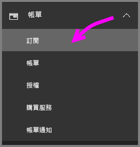
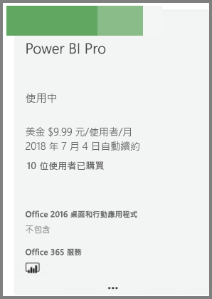

# 購買 Power BI Pro

透過 Power BI Pro，您可以發佈報表、共用儀表板、與同事在工作區中共同作業，以及參與其他相關的活動。 如需 Power BI Pro 如何裨益貴組織的詳細資訊，請參閱[組織的 Power BI Pro](service-power-bi-pro-in-your-organization.md)。

## 透過 Office 365 系統管理中心購買 Power BI Pro

Office IT 系統管理員可以將 Power BI Pro 當作 Office 365 Enterprise E5 訂閱的一部分，或當作個別 Power BI Pro 訂閱購買。 然後，您可以將 Power BI Pro 授權指派給適當的使用者。 如需如何指派授權的詳細資訊，請參閱[在 Office 365 中將授權指派給使用者](https://support.office.com/en-us/article/assign-licenses-to-users-in-office-365-for-business-997596b5-4173-4627-b915-36abac6786dc?ui=en-US&rs=en-US&ad=US)。

如果您是 Office IT 系統管理員，請執行下列步驟來購買 Power BI Pro：

1. 導覽到 [Office 365 系統管理中心](https://portal.office.com/adminportal/home#/homepage)。
2. 在左側瀏覽窗格上，選取 [計費]，然後按一下 [訂閱]。

    

3. 按一下 [訂閱] 頁面右上角的 [新增訂閱]。

    

4. 找出所需的訂閱供應項目：

    在 [企業套件] 下，選取 Office 365 Enterprise E5

    

    在 [其他方案] 下，選取 Power BI Pro

    

5. 將滑鼠停留在所需訂閱的省略符號 (...) 上方，然後選取 [立即購買]。

    

6. 根據您的計費喜好設定，選擇 [按月支付] 或 [支付全年費用]。
7. 在 [How many users do you want?] (您想要多少使用者?) 下，輸入所需的授權數目，然後按一下 [Check out now] (立即結帳) 或 [Add to cart and complete the transaction] (加入購物車並完成交易)。
8. 確認所取得的訂閱現在會列於 [訂閱] 頁面上。

   

> [!NOTE]
> 您可以在初次購買之後新增更多授權。 從 [訂閱] 頁面選取 Power BI Pro 訂閱，然後按一下 [新增/移除授權]。
>

## 價格

如需最新定價資訊，請參閱 [Power BI 定價](https://powerbi.microsoft.com/en-us/pricing/)。

## 後續步驟
[Power BI 的自助式註冊](service-admin-signing-up-for-power-bi-with-a-new-office-365-trial.md)
 
[組織的 Power BI (免費)](service-admin-service-free-in-your-organization.md)
 
[組織的 Power BI Pro](service-power-bi-pro-in-your-organization.md)
 
[Pro 延長試用版啟用](service-extended-pro-trial.md)
 
[指派 Power BI Pro 授權](service-assigning-power-bi-pro-licenses.md)
 
[何謂 Power BI Premium](service-admin-premium-manage.md)
 
[如何購買 Power BI Premium](service-admin-premium-purchase.md)
 
[Power BI Premium 技術白皮書](https://aka.ms/pbipremiumwhitepaper)

有其他問題嗎？ [嘗試在 Power BI 社群提問](https://community.powerbi.com/)