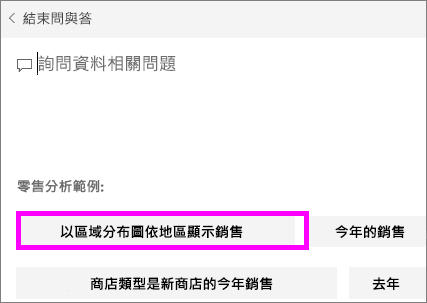
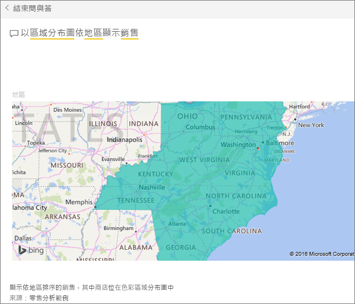

# 建立 Power BI 問與答的精選問題
如果您擁有自己的資料集，則可將自己的精選問題新增至該資料集。  接著，Power BI 問與答會向使用 (取用) 您資料集的同事顯示這些問題。  精選問題可讓您的同事有些概念，知道要針對資料集詢問哪類問題。 您可自行決定要新增什麼精選問題 -- 新增熱門問題、會顯示有趣結果的問題，或難以簡短說明的問題。

觀賞 Will 如何將一些精選問題加入 Power BI 問與答，並接著使用這些精選問題來探索其資料集。 然後遵循影片下方的逐步指示親自試試看。

<iframe width="560" height="315" src="https://www.youtube.com/embed/E1mIAyEXuF4" frameborder="0" allowfullscreen></iframe>

> [!NOTE]
> 問與答精選問題可使用於 [iPad、iPhone 及 iPod Touch 裝置上適用於 iOS 的 Microsoft Power BI 應用程式](mobile-apps-ios-qna.md)和 Power BI Desktop 問與答預覽。 但建立問題僅適用於 Power BI 服務 (app.powerbi.com)。
> 

本文使用[零售分析銷售範例](sample-datasets.md)。

1. 在儀表板上，選取 [問與答] 問題方塊。   您會發現問與答顯示出資料集中出現的詞彙清單，這非常有幫助。
2. 若要新增至此清單，請選取 Power BI 右上角的齒輪圖示。  
   
3. 選取 [設定] &gt; [資料集] &gt; [零售分析範例] &gt; [精選問與答問題]。  
4. 選取 [新增問題] 。
   
   ![[設定] 功能表](media/service-q-and-a-create-featured-questions/power-bi-settings.png)
5. 在文字方塊中輸入您的問題，然後選取 [套用] 。   如果要新增其他問題，您也可以再選取 [新增問題] 。  
   
6. 瀏覽回零售分析範例的 Power BI 儀表板，並將您的游標放在 [問與答] 問題方塊中。   
   
7. 清單中的第一個新精選問題為**依地區銷售額，以地圖表示**。 請加以選取。  
8. 答案會顯示為填滿的地圖視覺效果。  
   

### 後續步驟
[Power BI 中的問與答](power-bi-q-and-a.md)  
[教學課程：Power BI 問與答簡介](power-bi-visualization-introduction-to-q-and-a.md)  
[Power BI - 基本概念](service-basic-concepts.md)  
有其他問題嗎？ [試試 Power BI 社群](http://community.powerbi.com/)

