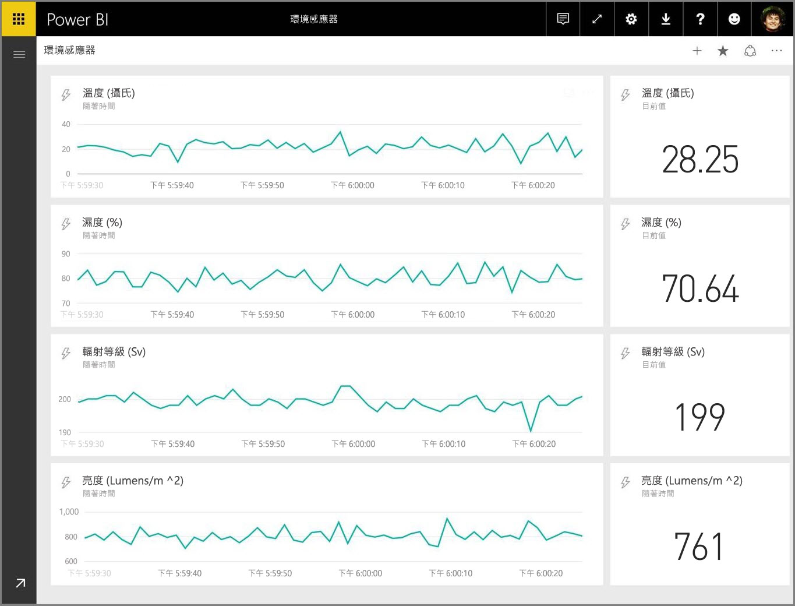
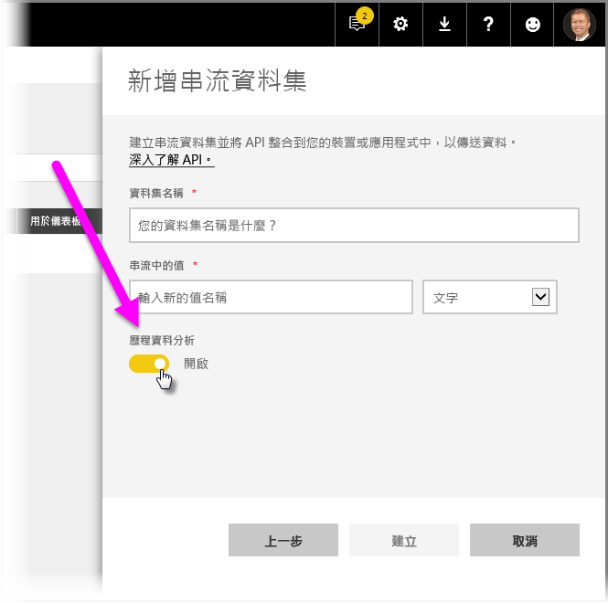
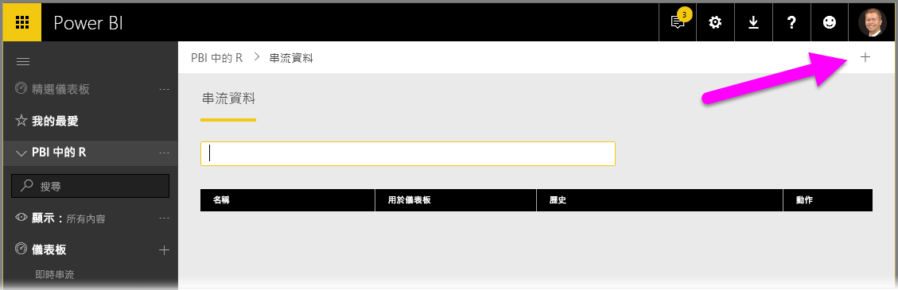
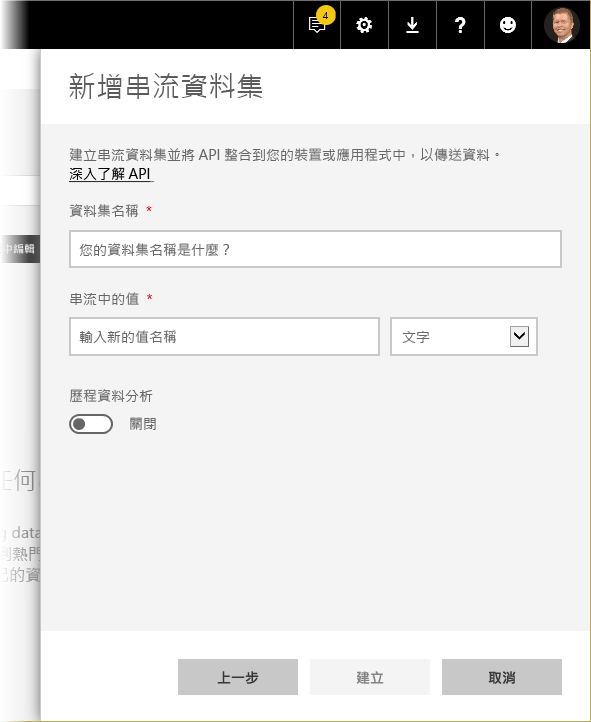

# Power BI 中的即時串流
您可以使用 Power BI 即時串流，即時串流資料及更新儀表板。 您也可以建立可在 Power BI 中建立的任何視覺效果或儀表板，進而顯示及更新即時資料和視覺效果。 串流資料的裝置和來源可以是 Factory 感應器、社交媒體來源、服務使用計量，以及可從中收集或傳送即時資料的任何其他項目。

本文將說明如何在 Power BI 設定即時串流資料集。 但在這之前，請務必了解設計用來顯示於磚 (和儀表板) 中的即時資料集類型，以及這些資料集之間的差異。

## 即時資料集的類型
有三種專為在即時儀表板上顯示而設計的即時資料集︰

* 推送資料集
* 串流資料集
* PubNub 串流資料集

首先，讓我們先了解這些資料集彼此有何不同 (本節)，然後我們會討論如何將資料推送到這些資料集中的各個資料集。

### 推送資料集
使用**推送資料集**，資料會推送到 Power BI 服務。 建立資料集時，Power BI 服務會自動在服務中建立新的資料庫來儲存資料。 因為具有在資料進入時持續儲存資料的基礎資料庫，所以可以使用資料來建立報表。 這些報表及其視覺效果，就像任何其他報表視覺效果一樣，這表示您可以使用所有 Power BI 報表建立功能來建立視覺效果，包括自訂視覺效果、資料警示、釘選儀表板磚等等。

使用推送資料集建立報表之後，其任何視覺效果都可以釘選到儀表板。 在該儀表板上，視覺效果一律會在資料更新時即時更新。 在服務中，每次收到新的資料，儀表板便會觸發磚重新整理。

關於推送資料集的釘選磚有兩項值得注意的考量︰

* 使用 [動態釘選頁面]  選項來釘選整個報表，將「不會」  成自動更新資料。
* 視覺效果釘選到儀表板之後，您可以使用**問與答**，以自然語言提問推送資料集問題。 進行**問與答**查詢之後，您可以將結果產生的視覺效果釘選回儀表板，該儀表板「也會」  即時更新。

### 串流資料集
使用**串流資料集**時，資料也會被發送到 Power BI 服務，不過有一個重要的差異：Power BI 只會將資料儲存到暫時快取，且該快取很快就會到期。 暫存快取只用來顯示具有短暫歷史感的視覺效果，例如具有一小時時間期間的折線圖。

使用**串流資料集**時，「沒有」  基礎資料庫，因此您「無法」  使用從資料流流入的資料來建置報表視覺效果。 因此，您不能使用報表功能，例如篩選、自訂視覺效果和其他報表函式。

視覺化串流資料集的唯一方法是新增一個磚，並使用串流資料集作為**自訂串流資料**資料來源。 以**串流資料集**為基礎的自訂串流磚最適合用於快速顯示即時資料。 將資料推送到 Power BI 服務與更新視覺效果兩者之間的延遲極短，因為資料不需要輸入到資料庫或從資料庫讀取。

實際上，串流資料集和其隨附的串流視覺效果最適合使用的情況為，必須在推送與視覺化資料時將兩者之間的延遲降到最低。 此外，最佳做法是讓資料以可以依現狀視覺化的格式推送，而不需要任何額外的彙總。 依現狀即已就緒的資料範例包括溫度，以及預先計算出的平均值。

### PubNub 串流資料集
使用 **PubNub** 串流資料集，Power BI Web 用戶端會使用 PubNub SDK 讀取現有的 PubNub 資料流，而且 Power BI 服務不會儲存任何資料。

如同**串流資料集**，**PubNub 串流資料集**在 Power BI 沒有基礎資料庫，因此您無法對流入的資料建立報表視覺效果，並且無法利用報表功能，例如篩選、自訂視覺效果等等。 這麼一來，**PubNub 串流資料集**也只能藉由新增磚至儀表板，並設定 PubNub 資料流作為來源的方式來進行視覺化。

以 **PubNub 串流資料集**為基礎的磚最適合用於快速顯示即時資料。 因為 Power BI 直接連接至 PubNub 資料流，所以將資料推送到 Power BI 服務，與更新視覺效果兩者之間的延遲極短。

### 串流資料集矩陣
下列資料表 (或矩陣，如果您喜歡的話) 描述三種類型的即時串流資料集，並列出每一種的功能和限制。

> [!NOTE]
> 請參閱[本文](https://docs.microsoft.com/power-bi/developer/api-rest-api-limitations)，以取得可以推入多少資料的**推送**限制相關資訊。
> 
> 

## 將資料推送到資料集
上一節描述您可以用於即時串流的三種主要即時資料集類型，以及它們的差異。 本節說明如何建立及推送資料到這些資料集。

有三種主要方式可將資料推送至資料集︰

* 使用 Power BI REST API
* 使用串流資料集 UI
* 使用 Azure 串流分析

接著讓我們依序看看每一種方法。

### 使用 Power BI REST API 推送資料
**Power BI REST API** 可用來建立及傳送資料到**推送**資料集和**串流**資料集。 當您使用 Power BI REST API 建立資料集時，<預設模式>  旗標會指定資料集是推送還是或串流。 如果未設定 <預設模式>  旗標，資料集預設為**推送**資料集。

如果 <預設模式>  值設為 *pushStreaming*，則資料集同時為**推送***和***串流**資料集，其提供兩種資料集類型的優點。 

> [!NOTE]
> 使用資料集並將 <預設模式>  旗標設為 pushStreaming  時，如果要求超過**串流**資料集 15 KB 的大小限制，但小於**推送**資料集 16 MB 的大小限制，要求將會成功，而且會在推送資料集中更新資料。 不過，任何串流磚會暫時失敗。

建立資料集之後，使用 REST API，以 [**PostRows** API](https://docs.microsoft.com/rest/api/power-bi/pushdatasets/datasets_postrows) 來推送資料。

會使用 **Azure AD OAuth** 保護 REST API 的所有要求。

### 使用串流資料集 UI 推送資料
在 Power BI 服務中，您可以選取 **API** 方法來建立資料集，如下圖所示。

在建立新的串流資料集時，您可以如下所示選取啟用 [歷史資料分析]  ，這會造成顯著影響。

當 [歷史資料分析]  停用 (它預設為停用) 時，您會建立**串流資料集**，如本文稍早所述。 當 [歷史資料分析]  為「啟用」  時，建立的資料集變成同時為**串流資料集**和**推送資料集**。 這相當於使用 Power BI REST API 來建立資料集，並將其 <預設模式>  設為 *pushStreaming*，如本文稍早所述。

> [!NOTE]
> 對於使用 Power BI 服務 UI 所建立的串流資料集，如之前的段落中所述，不需要 Azure AD 驗證。 在這類的資料集，資料集擁有者會收到具有 rowkey 的 URL，它授權要求者將資料推送到資料集，而不必使用 Azure AD OAuth 持有人權杖。 但是，Azure AD (AAD) 方法仍適用於將資料推送到資料集。
> 
> 

### 使用 Azure 串流分析推送資料
您可以新增 Power BI 作為 **Azure 串流分析** (ASA) 內的輸出，然後即時在 Power BI 服務中視覺化那些資料流。 本節描述有關該程序之發生方式的技術詳細資料。

Azure 串流分析使用 Power BI REST API 建立對 Power BI 的輸出資料流，並將 <預設模式>  設為 *pushStreaming* (請參閱本文稍早的章節，以取得 <預設模式>  的資訊)，這會導致資料集可以利用**推送**和**串流**。 在資料集建立期間，Azure 串流分析也會將 **retentionPolicy* 旗標設為 *basicFIFO*；使用這項設定，支援其推送資料集的資料庫可儲存 200,000 個資料列，而且在達到該限制之後，資料列會以先進先出 (FIFO) 的方式卸除。

> [!CAUTION]
> 如果 Azure 串流分析查詢導致對 Power BI 的輸出非常快速 (例如，每秒一次或兩次)，Azure 串流分析將會把那些輸出批次處理成單一要求。 這可能會導致要求大小超過串流磚限制。 在此情況下，如前一節所述，串流磚便無法轉譯。 在這種情況下，最佳做法是減緩資料輸出至 Power BI 的速率，比方說，不要用每秒最大值，而是將它設定為最大值超過 10 秒。
> 
> 

## 在 Power BI 中設定即時串流資料集
既然我們已介紹了三種主要類型的即時串流資料集，以及將資料推送至資料集的三種主要方式，接下來讓即時串流資料集能在 Power BI 中運作。

若要開始使用即時串流，您需要從下列兩種方式之中選擇其中一種，以在 Power BI 中取用串流資料：

* 具有串流資料視覺效果的**磚**
* 從串流資料建立並在 Power BI 中保存的**資料集**

不論使用哪種選項，您都必須在 Power BI 中設定**串流資料**。 若要執行這項操作，請在您的儀表板 (現有儀表板或新儀表板) 中，選取 [新增磚]  ，然後選取 [自訂串流資料]  。

如果您尚未設定串流資料，別擔心 - 您可以選取 [管理資料]  來開始進行。

在此頁面上，如果您已經建立一個串流資料集，您可以在文字方塊中輸入其端點。 如果您還沒有串流資料集，請選取右上角的加號圖示 ( **+** )，以查看可用來建立串流資料集的選項。

當您按一下 **+** 圖示時，您會看到兩個選項：

下一節將描述這些選項，並深入說明如何從串流資料來源建立串流**磚**或**資料集**，以供稍後用來建立報表。

## 使用您最喜歡的選項來建立串流資料集
有兩種方式能建立可供 Power BI 取用及予以視覺化的即時串流資料摘要：

* 使用即時串流端點的 **Power BI REST API**
* **PubNub**

後續章節將輪流探討每個選項。

### 使用 POWER BI REST API
**Power BI REST API** - Power BI REST API 的最新增強功能是為了讓開發人員更容易使用即時串流所設計。 當您從 [新增串流資料集]  視窗選取 [API]  時，您有幾個選項可讓 Power BI 連接並使用您的端點：

如果您想要讓 Power BI 儲存透過此資料流傳送的資料，請啟用 [歷程資料分析]  ，您將能夠對收集的資料流進行報告和分析。 您也可以[深入了解此 API](https://docs.microsoft.com/rest/api/power-bi/)。

成功建立資料流之後，系統會提供您 REST API URL 端點，您的應用程式可使用 *POST* 要求來呼叫此端點，以將您的資料發送到所建立 Power BI **串流資料**資料集。

進行 *POST* 要求時，您應該確定要求主體符合 Power BI 使用者介面所提供的範例 JSON。 例如，將您的 JSON 物件包裝在陣列中。

### 使用 PubNub
透過 **PubNub** 串流與 Power BI 的整合，您可以使用低度延遲的 **PubNub** 資料流 (或建立新的資料流) 並將其用於 Power BI。 當您選取 [PubNub]  ，再選取 [下一步]  時，您會看到下列視窗：

> [!WARNING]
> 可以使用 PubNub 存取管理員 (PAM) 驗證金鑰來保護 PubNub 通道。 此金鑰將與具有儀表板存取權的所有使用者共用。 您可以[深入了解 PubNub 存取控制](https://www.pubnub.com/docs/web-javascript/pam-security)。
> 
> 

**PubNub** 資料流通常很大量，而且並不一定適合使用其用於儲存和歷程分析的原始格式。 若要使用 Power BI 對 PubNub 資料進行歷程分析，您必須彙總原始 PubNub 資料流並將其傳送至 Power BI。 其中一個做法是使用 [Azure 串流分析](https://azure.microsoft.com/services/stream-analytics/)。

## 在 Power BI 中使用即時串流的範例
以下是 Power BI 即時串流運作方式的快速範例。 您可以依照此範例進行，以親自了解即時串流的價值。

在此範例中，我們使用 **PubNub** 中公開可用的資料流。 以下是步驟：

1. 在 [Power BI 服務]  中，選取儀表板 (或建立新的儀表板)，然後選取 [新增磚]   > [自訂串流資料]  ，再選取 [下一步]  按鈕。
   
   
2. 如果您還沒有串流資料來源，請選取 [管理資料]  連結 ([下一步]  按鈕的正上方)，然後從視窗右上方的連結選取 \[+ Add streaming data] \(+ 新增串流資料)  。 選取 [PubNub]  ，然後選取 [下一步]  。
3. 建立您的資料集名稱，然後將下列值貼到出現的視窗中，再選取 [下一步]  ：
   
   訂閱機碼： 
   
       sub-c-5f1b7c8e-fbee-11e3-aa40-02ee2ddab7fe
   通道： 
   
       pubnub-sensor-network
   
   
4. 在下列視窗中，直接選取預設值 (這會自動填入)，然後選取 [建立]  。
   
   
5. 回到 Power BI 工作區，建立新的儀表板，然後新增磚 (如果需要，請參閱上述步驟)。 當您建立磚並選取 [自訂串流資料]  時，這次會有可以使用的串流資料集。 現在就試試看。 將 [數目]  欄位新增至折線圖，然後新增其他磚，您可能會取得如下所示的即時儀表板：
   
   

現在就利用範例資料集試試看。 接著建立您自己的資料集，並將即時資料串流到 Power BI。

## 問題和回答
以下是 Power BI 中即時串流的一些常見問題以及回答。

#### 可以對推送資料集使用篩選嗎？ 串流資料集呢？
不幸的是，串流資料集不支援篩選。 針對推送資料集，您可以建立報表、篩選報表，然後將篩選過的視覺效果釘選到儀表板。 不過，一旦視覺效果在儀表板上，便沒有辦法變更篩選。

您可以將即時報表磚分別釘選到儀表板，在這種情況下您可以變更篩選。 不過，即時報表磚不會在資料推送進來時即時更新，您必須使用 [詳細]  功能表中的 [重新整理儀表板磚]  選項來手動更新視覺效果。

在使用毫秒有效位數來套用篩選，並推送含 *DateTime* 欄位的資料集時，不支援「等價」  運算子。 不過，大於 (>) 或小於 (<) 運算子可正常運作。

#### 如何查看推送資料集上的最新值？ 串流資料集呢？
串流資料集是設計為顯示最新的資料。 您可以使用 [卡]  串流視覺效果輕鬆地查看最新的數值。 不幸的是，卡並不支援「日期時間」  或「文字」  類型的資料。
針對推送資料集，假設您在結構描述有時間戳記，則可以嘗試使用最後的 N 個篩選來建立報表視覺效果。

#### 我可以在 Power BI Desktop 中連接到推送或串流資料集嗎？
不幸的是，目前無法使用此功能。

#### 就上一個問題，如何對即時資料集執行任何模型？
無法對串流資料集使用模型，因為資料不會永久儲存。 對於推送資料集，您可以使用更新資料集/資料表 REST API 來新增量值和關聯性。 

#### 如何清除推送資料集上的所有值？ 串流資料集呢？
在推送資料集上，您可以使用刪除資料列 REST API 呼叫。 目前沒有任何方法可清除串流資料集的資料，但資料會在一個小時之後自行清除。

#### 設定對 Power BI 的 Azure 串流分析輸出，但我沒看到它出現在 Power BI – 出了什麼問題？
以下是您可用來疑難排解問題的檢查清單︰

1. 重新啟動 Azure 串流分析作業 (串流 GA 版本之前所建立的作業將需要重新啟動)
2. 嘗試在 Azure 串流分析中重新授權 Power BI 連線
3. 您在 Azure 串流分析輸出中指定哪一個工作區？ 在 Power BI 服務中，您簽入該 (相同) 工作區嗎？
4. Azure 串流分析查詢是否明確輸出至 Power BI 輸出？ (使用 INTO 關鍵字)
5. Azure 串流分析作業有資料流過它嗎？ 只有在傳輸資料時，才會建立資料集。
6. 您可以查看 Azure 串流分析記錄檔中是否有任何警告或錯誤嗎？

## 後續步驟
以下是一些可能有助於在 Power BI 中使用即時串流的連結︰

* [Power BI REST API 與即時資料的概觀](https://docs.microsoft.com/rest/api/power-bi/)
* [Azure 串流分析](https://azure.microsoft.com/services/stream-analytics/)

