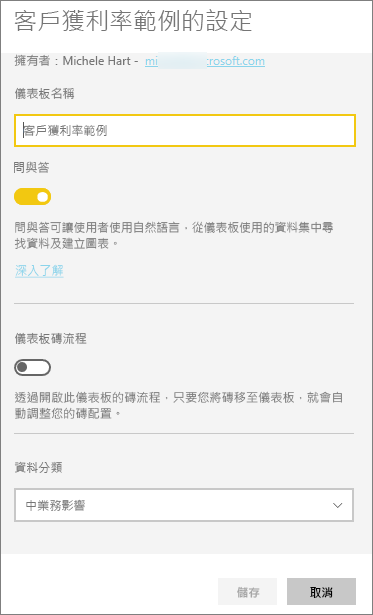

# 重新命名 Power BI 服務中的絶大部分項目
本文會教導您如何重新命名 Power BI 服務中的儀表板、報表、報表頁面、活頁簿、資料集、應用程式和工作區。

**可以變更名稱嗎？**

| 內容區域 | 我是作者或建立者 | 與我共用 |
| --- | --- | --- |
| 工作區中的儀表板 |是 |否 |
| 工作區中的報表 |是 |否 |
| 工作區中的活頁簿 |是 |否 |
| 工作區中的資料集 |是 |否 |
| 應用程式工作區 |是，如果您是擁有者或具有系統管理員權限 |否 |
| 已發佈的應用程式 |如果您具有系統管理員權限，則不是從 [應用程式] 畫面，而是從應用程式工作區變更應用程式名稱，並使用新名稱重新進行發佈。 |否 |
| 應用程式內容 (儀表板、報表、活頁簿、資料集) |如果您具有系統管理員權限，則不是從 [應用程式] 畫面，而是從應用程式工作區重新命名應用程式內容，並使用新名稱重新進行發佈。 |否 |
| [與我共用]  中的內容 |否 |否 |

## 重新命名儀表板、報表或活頁簿
1. 從工作區開始，然後選取 [儀表板]  、[報表]  或 [活頁簿]  索引標籤。將滑鼠游標移至要重新命名的項目上方，然後選取齒輪圖示 。 如果沒有齒輪圖示，您就沒有重新命名的權限。
   
   
2. 在 [設定] 頁面上，輸入新名稱，然後選取 [儲存]  。
   
   

## 重新命名資料集
1. 從工作區開始，然後選取 [資料集]  索引標籤。
   
   ![工作區的 [資料集] 索引標籤](media/service-rename/power-bi-ellipses.png)
2. 將滑鼠游標移至要重新命名的項目上方，並選取省略符號 (...)，然後選擇 [重新命名]  。  
   
      ![選取 [重新命名]](media/service-rename/power-bi-rename-datasets.png)
   
   > [!NOTE]
   > 下拉式清單中的選項將會不同。
   > 
   > 
3. 在 [設定] 頁面上，輸入新名稱，然後選取 [儲存]  。
   
     ![[重新命名] 窗格](media/service-rename/power-bi-rename.png)

## 重新命名應用程式工作區
任何具有系統管理員權限的人員都可以重新命名應用程式工作區。

1. 從您要重新命名的工作區開始。
2. 在右上角選取省略符號 (...)，然後選擇 [編輯工作區]  。 如果您未看到此選項，您就沒有重新命名此工作區的權限。 
   
    ![選取 [編輯工作區]](media/service-rename/power-bi-edit-workspace.png)
3. 輸入新的工作區名稱，然後選取 [儲存]  。
   
   ![[編輯工作區] 窗格](media/service-rename/power-bi-workspace-rename.png)

## 重新命名報表中的頁面
不喜歡 Power BI 報表中的頁面名稱嗎？  要設定新的名稱，只要按一下即可。 您可以在[報表編輯檢視](service-interact-with-a-report-in-editing-view.md)中重新命名頁面。

1. 在[編輯檢視](consumer/end-user-reading-view.md)中開啟報表。
2. 找出 Power BI 視窗底部的報表頁面索引標籤。
   
    
3. 選取索引標籤，開啟您想要重新命名的報表頁面。
4. 在索引標籤上的名稱按兩下以反白顯示。  
   
    
5. 輸入新的報表頁面名稱，然後選取 ENTER。
   
    

## 考量與疑難排解
* 如果要重新命名的項目已與您共用，或已是內容套件的一部分，則您看不到齒輪圖示，因此無法存取 [設定]。
* 在 [資料集]  索引標籤上，如果您看不到省略符號 (...)，請展開瀏覽器視窗。

有其他問題嗎？ [試試 Power BI 社群](http://community.powerbi.com/)

