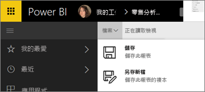

# 在 Power BI 服務和 Power BI Desktop 中儲存報告
變更 Power BI 中的報表之後，您可以儲存、以新的名稱儲存，或只關閉但不儲存變更。 假設您開啟了報表、建立視覺效果，以及將它釘選至儀表板。 如果您現在關閉而不儲存變更，圖格仍會保留在儀表板上，但報表中不會儲存視覺效果。 當您按一下該儀表板上的圖格時，報告隨即開啟，但是報告中不存在視覺效果。

> [!TIP]
> 請留意哪個工作區為使用中狀態，以便找到儲存的報表。 報表會儲存到使用中的工作區。
> 
> 

### 若要儲存報表：
1. 如果您嘗試不巡覽報表，而且報表包含變更，Power BI 將會顯示提示。
   
   
2. 儲存報表的另一種方式是選取 [檔案]  \> [儲存]  或 [另存新檔]  。 如果您是位於[閱讀檢視](consumer/end-user-reading-view.md)，則只會看到 [另存新檔] 選項。 
   
   
3. 如果這是新的報表 (儲存) 或現有報表的新版本 (另存新檔)，請指定它的描述性名稱。  **報告將會新增至使用中工作區**。
   
    

### 後續步驟
深入了解 [Power BI 中的報表](consumer/end-user-reports.md)

[Power BI 服務中的設計工具基本概念](service-basic-concepts.md)

有其他問題嗎？ [試試 Power BI 社群](http://community.powerbi.com/)

