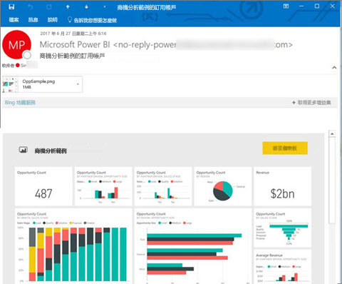
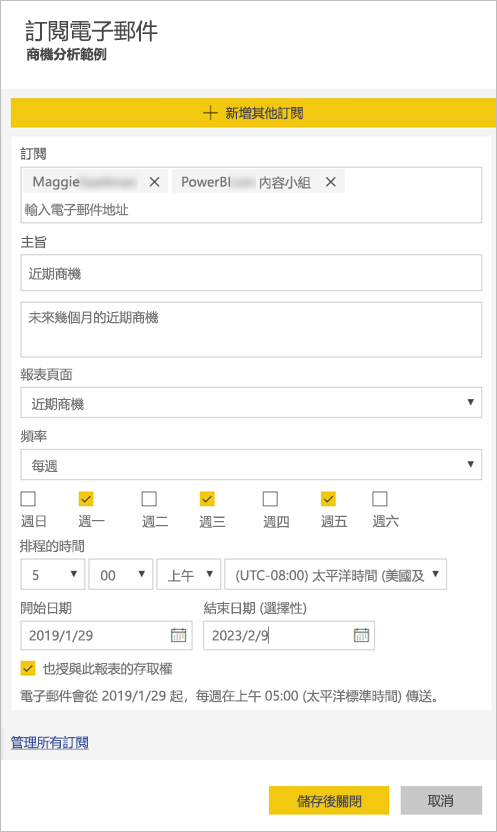

# 為您自己和其他人訂閱 Power BI 服務中的報表或儀表板

您可以為自己和同事訂閱對您來說最重要的報表頁面和儀表板，Power BI 會以電子郵件寄送快照集到您的收件匣。 您要告訴 Power BI 需要收到電子郵件的頻率︰每天、每週，或在初始資料重新整理後一天一次。  如果您選擇每天或每週，則可以選擇您想要執行訂用帳戶的時間。  總之，針對每個報表頁面和儀表板，您每天可以設定最多 24 個不同的訂用帳戶。

 

您只能在 Power BI 服務中建立訂用帳戶。 您會收到一封電子郵件，內含報表頁面或儀表板的快照集，以及用來開啟報表或儀表板的連結。 在安裝 Power BI 應用程式的行動裝置上，選取此連結會啟動 Power BI 應用程式 (而不是在 Power BI 網站上開啟報表或儀表板)。

## 需求
- **建立**訂閱是 Power BI Pro 的功能。
- 您不需要內容 (儀表板或報表) 的編輯權限，即可為您自己建立訂用帳戶，但您必須擁有編輯權限，才能為其他人建立訂用帳戶。 
- 自 2019 年 1 月起，您不再需要設定資料集重新整理，就能執行訂用帳戶。  其執行與任何設定的排程重新整理無關。  

## 訂閱儀表板或報表頁面
不論您是要訂閱儀表板或報表，程序都很相似。 同樣的按鈕可讓您訂閱 Power BI 服務的儀表板與報表。
 
.

1. 開啟儀表板或報表。
2. 從頂端功能表列，選取 [訂閱] 或選取信封圖示 。
   
   

3. 使用黃色的滑桿開啟和關閉訂閱。  將滑桿設定為 [關閉] 並不會刪除訂用帳戶。 若要刪除訂閱，請選取垃圾桶圖示。

4. 您的電子郵件已位在 [訂閱] 方塊中。 您可以在訂用帳戶中新增其他電子郵件地址，但僅限於同一個網域。 若報表或儀表板託管於 [Premium 容量](service-premium.md)中，您就可以使用個人電子郵件地址與群組別名訂閱。 若報表或儀表板並未託管於 Premium 容量中，您可以為其他人訂閱，但他們也必須具有 Power BI Pro 授權。 如需詳細資料，請參閱下方的[考量與疑難排解](#considerations-and-troubleshooting)。 

5. 填寫電子郵件 [主旨] 和 [訊息] 詳細資料。 

5. 為您的訂用帳戶選取 [頻率]：[每天]、[每週]，或 [在資料重新整理後 (每天)]。  若只要在特定日子收到訂用帳戶電子郵件，請選取 [每週]，然後選取您想要接收電子郵件的日子。  例如，如果您只想要在工作日收到訂用帳戶電子郵件，請選取 [每週]，並取消核取 [週六] 和 [週日] 的方塊。  

6. 如果您選擇 [每天] 或 [每週]，則也可以為訂用帳戶選擇 [排程的時間]。  您將於每小時整點，或在 15、30 或 45 分時加以執行。  請選取上午 (AM) 或下午/晚上 (PM)。 您也可以指定時區。

7. 根據預設，訂用帳戶開始日期是您建立訂用帳的日期。 您可以選擇選取結束日期。 如果您未設定結束日期，則結束日期自動設為開始日期的一年後。 您可以在訂用帳戶結束之前，隨時將它變更為未來的任何日期 (最多至 9999 年)。 當訂用帳戶達到結束日期時，即會停止直到您重新啟用為止。 在排程結束日期之前，您會收到通知，詢問您是否要加以延長。    

    在下方的螢幕擷取畫面中，您可以注意到當您在訂閱報表時，實際上是在訂閱報表「頁面」。  若要訂閱報表中的多個頁面，請選取 [新增另一個訂閱] 再選取其他頁面。 
      
     

7. 選取 [儲存並關閉]。 針對您所選取的頻率和時間，這些訂用帳戶會收到儀表板或報表頁面的電子郵件和快照集。 總之，您可以針對每個報表或儀表板建立最多 24 個訂用帳戶，而且可以為每個訂用帳戶提供唯一的收件者、時間和頻率。  所有設定為 [在資料重新整理後] 的儀表板或報表訂用帳戶，仍然只會在第一次排程重新整理之後傳送一封電子郵件。   
      
   > [!TIP]
   > 想要立即看到電子郵件嗎？ 您可以重新整理與儀表板或報表相關的資料集，來觸發電子郵件。 如果您沒有資料集的編輯權限，請要求有這些權限的人為您進行重新整理。 若要查看相關資料集，請選取**檢視相關項目**圖示  以開啟 [相關內容]，然後選取重新整理圖示 。 
   > 
   > 
   
   

## 電子郵件語言

電子郵件和快照集會使用 Power BI 設定中設定的語言 (請參閱 [Power BI 支援的語言與國家/地區](supported-languages-countries-regions.md))。 如果未定義任何語言，Power BI 會使用您目前瀏覽器中地區設定的語言。 若要查看或設定語言喜好設定，請選取齒輪圖示  > [設定] > [一般] > [語言]。 

![[語言] 下拉式清單](media/service-report-subscribe/power-bi-language.png)

## 管理您的訂閱
只有建立訂閱的使用者能夠進行管理。  有兩條路徑可到達管理您訂用帳戶的畫面。  第一種方法是從 [訂閱電子郵件] 對話方塊選取 [管理所有訂閱] (請參考下方的螢幕擷取畫面與上方的步驟 4)。 第二是藉由從頂端功能表列選取 Power BI 齒輪圖示 ，然後選擇 [設定]。

![選取 [設定]](media/service-report-subscribe/power-bi-subscribe-settings.png)

顯示的特定訂用帳戶會取決於哪一個工作區目前為使用中。  若要一次查看所有工作區的所有訂閱，請務必讓 [我的工作區] 為使用中。 如需了解工作區，請參閱 [Power BI 中的工作區](service-create-workspaces.md)。

![查看 [我的工作區] 中的所有訂閱](media/service-report-subscribe/power-bi-subscriptions.png)

如果 Pro 授權過期、擁有者刪除儀表板或報表，或用來建立訂用帳戶的使用者帳戶遭到刪除，則訂用帳戶將會終止。

## 考量與疑難排解
* 針對儀表板電子郵件訂用帳戶，如果有任何磚套用資料列層級安全性 (RLS)，則不會顯示這些磚。  針對報表電子郵件訂用帳戶，如果資料集使用 RLS，則您無法建立訂用帳戶。
* 報表頁面訂閱會繫結至報表頁面的名稱。 如果您訂閱報表頁面，然後將它重新命名，您必須重新建立訂用帳戶。
* 您的組織可能會在 Azure Active Directory 進行某些設定，而這可能會限制在 Power BI 中使用電子郵件訂閱的功能。  這些限制包括但不限於存取資源時的多重要素驗證或 IP 範圍限制。
* 目前，訂閱您自己以外的使用者時，不支援使用即時連線資料集之報表/儀表板的電子郵件訂閱。
* 電子郵件訂用帳戶不支援大部分[自訂視覺效果](power-bi-custom-visuals.md)。  其中一個例外是[「已認證」](power-bi-custom-visuals-certified.md)的自訂視覺效果。  
* 電子郵件訂用帳戶目前不支援 R 支援的自訂視覺效果。  
* 如果有任何儀表板磚套用資料列層級安全性 (RLS)，則不會顯示這些磚。
* 您無法訂閱已套用資料列層級安全性 (RLS) 之報表的其他使用者。
* 電子郵件訂閱傳送時會使用報表的預設篩選器和交叉分析篩選器狀態。 在訂閱之後對預設值所做的所有變更，均不會顯示在電子郵件中。    
* 特別是針對儀表板訂閱，尚不支援某些磚類型。  其中包括：資料流磚、影片磚、自訂 Web 內容磚。     
* 若您與租用戶外部的同事共用儀表板，您無法一併替該位同事建立訂閱。 因此，如果您是 aaron@xyz.com，則可與 anyone@ABC.com 共用，但尚無法為 anyone@ABC.com 訂閱，而他們也無法訂閱共用的內容。      
* 由於電子郵件大小限制，儀表板或報表若含有非常大的影像，訂閱可能會失敗。    
* 如果超過兩個月未瀏覽某些儀表板和報表，Power BI 會自動暫停重新整理與這些儀表板和報表建立關聯的資料集。  不過，如果您新增儀表板或報表的訂閱，即使有段時間未瀏覽也不會暫停。    
* 若您未收到訂閱電子郵件，請確認您的使用者主體名稱 (UPN) 能夠接收電子郵件。 [Power BI 小組正致力於放寬這項需求](https://community.powerbi.com/t5/Issues/No-Mail-from-Cloud-Service/idc-p/205918#M10163)，請隨時留意。 
* 若您的儀表板或報表處於 Premium 容量中，您可以使用群組電子郵件別名進行訂閱，而不必為各同事的電子郵件一一訂閱。 別名會以目前使用中的目錄為準。 

## 後續步驟
* 有其他問題嗎？ [嘗試在 Power BI 社群提問](http://community.powerbi.com/)    
* [閱讀部落格文章](https://powerbi.microsoft.com/blog/introducing-dashboard-email-subscriptions-a-360-degree-view-of-your-business-in-your-inbox-every-day/)

