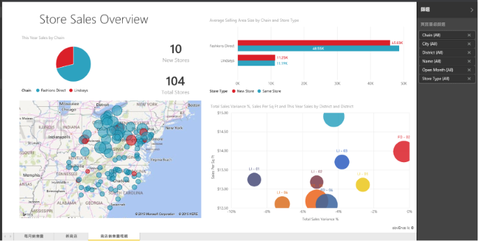

# Power BI 中的報表
## 什麼是 Power BI 報表？
Power BI「報表」是資料集的多面向檢視，以視覺效果顯示該資料集的各種發現與深入資訊。  報表只能有一種視覺效果或有各種視覺效果的頁面。 根據您的工作角色，您可能是「建立」報表的人員，也可能是「取用」或使用報表的人員。

這份報表有 3 個頁面 (或索引標籤)，而且我們目前正在檢視 [銷售門市概觀] 頁面。 此頁面有 6 個不同的視覺效果和一個頁面標題。 視覺效果可以「釘選」到儀表板，而且在選取該釘選視覺效果時，會開啟從中釘選它的報表。

如果您不熟悉 Power BI，請參閱 [Power BI 基本概念](service-basic-concepts.md)以取得良好的基礎。

報表是 Power BI 服務和 Power BI Desktop 的功能。 使用報表的體驗幾乎完全相同。 不過，針對行動裝置，您無法建立報表，但可以[檢視、共用和標註報表](mobile-reports-in-the-mobile-apps.md)。

## 報表的優點
報表是以單一資料集為基礎。 報表中的視覺效果各代表重要的資訊。 而且視覺效果不是靜態的；在深入資料來探索深入資訊以及尋找解答時，您可以新增和移除資料、變更視覺效果類型，以及套用篩選和交叉分析篩選器。 與儀表板類似，但不止如此，報表還高度互動且高度可自訂，而且視覺效果更新會隨著基礎資料變更。

## 儀表板與報表
[儀表板](service-dashboards.md)經常與報表混淆，因為它們也是填滿視覺效果的畫布。 但兩者還是有一些主要差異。  

| **功能** | **儀表板** | **報表** |
| --- | --- | --- |
| 頁面 |一個頁面 |一或多個頁面 |
| 資料來源 |每個儀表板一或多份報表以及一或多個資料集 |每份報表單一資料集 |
| Power BI Desktop 可用 |否 |是，可在 Desktop 中建立及檢視報表 |
| 釘選 |只能將目前儀表板中現有的視覺效果 (磚) 釘選到其他儀表板 |可將視覺效果 (以磚的形式) 釘選到任何儀表板。 可將整個報表頁面釘選到任何儀表板。 |
| 訂閱 |無法訂閱儀表板 |可訂閱報表頁面 |
| 篩選 |無法篩選或配量 |有多種不同方法可篩選、反白顯示及配量 |
| 設定警示 |可以建立警示於達到特定條件時發送電子郵件 |否 |
| 功能 |可將一個儀表板設定為「精選」儀表板 |無法建立精選報表 |
| 自然語言查詢 |可從儀表板使用 |無法從報表使用 |
| 可變更視覺效果類型 |否。 事實上，如果報表擁有者變更報表中的視覺效果類型，儀表板上釘選的視覺效果不會更新。 |是 |
| 可以看到基礎資料集的資料表和欄位 |否。 可以匯出資料，但看不到儀表板本身的資料表和欄位。 |是。 可以看到資料集資料表和欄位以及值。 |
| 可以建立視覺效果 |僅限使用 [新增磚] 在儀表板新增小工具 |可以建立許多不同類型的視覺效果、新增自訂視覺效果、編輯視覺效果，以及更多的編輯權限。 |
| 自訂 |可以使用視覺效果 (磚) 執行作業，如移動和排列、調整大小、新增連結、重新命名、刪除和全螢幕顯示。 但是，資料和視覺效果本身都是唯讀的。 |在 [閱讀檢視] 中您可以發佈、內嵌、篩選、匯出、下載為 .pbix、檢視相關內容、產生 QR 代碼、在 Excel 中進行分析等等。  在 [編輯檢視] 中，您可以執行目前述及的所有作業及其他更多。 |

## 報表「建立者」和報表「取用者」
根據您的角色，您可能是建立報表供自己使用或與同事共用的人員。 您想要了解如何建立和共用報表。 或者，您可能是接收其他人之報表的人員。 您想要了解如何熟悉報表並與之互動。

以下是依角色協助您開始的一些主題。

### 如果您要建立並共用報表
* 請從 [Power BI 服務導覽](service-basic-concepts.md)開始，了解可在何處找到報表和報表工具。
* 導覽[報表編輯器](service-the-report-editor-take-a-tour.md)。
* 了解如何[從資料集建立報表](service-report-create-new.md)。
* [了解如何使用視覺效果、頁面和報表層級篩選](power-bi-how-to-report-filter.md)
* 探索所有可以[與同事共用報表](service-share-dashboards.md)的不同方式。

### 如果您要接收並取用報表
* 請從 [Power BI 服務導覽](service-basic-concepts.md)開始，了解可在何處找到報表和報表工具。
* 了解如何[開啟報表](service-report-open.md)以及[閱讀檢視](service-reading-view-and-editing-view.md)中可用的所有互動。
* 使用其中一個的[範例](sample-tutorial-connect-to-the-samples.md)導覽來熟悉報表。  
* 不再需要報表了嗎？ 您可以[移除它](service-delete.md)。
* 若要查看報表正在使用的資料集，以及哪些儀表板具有從報表釘選的磚，請[檢視相關內容](service-related-content.md)。

> [!TIP]
> 如果這裡找不到您要的內容，請使用左側＜目錄＞來瀏覽所有「報表」主題。
> 
> 

## 後續步驟
[開始使用 Power BI](service-get-started.md) 

[Power BI - 基本概念](service-basic-concepts.md)

有其他問題嗎？ [試試 Power BI 社群](http://community.powerbi.com/)

