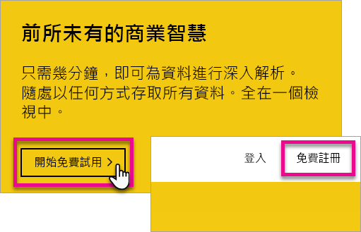
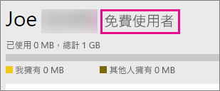
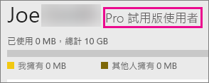

# 以個人身分註冊 Power BI
了解如何註冊 Power BI，並開始利用它來滿足您的個人報告和視覺效果需求。

Power BI 可以是您的個人報告和視覺效果工具，也可以當作群組專案、部門或整個公司的分析和決策引擎。

本文將引導您選擇如何註冊及開始使用 Power BI 服務。 如需 Power BI 免費版與 Pro 版之間差異的資訊，請參閱 [Power BI 免費版與 Pro 版的比較](service-free-vs-pro.md)。

## 您有一些選項。
以個人身分來說，您有一些選項可註冊及開始使用 Power BI。 您可以選擇免費註冊，也可以購買 Power BI Pro 訂用帳戶。 如果您註冊免費帳戶，一旦服務生效，您可以參加 Power BI Pro 的免費 60 天試用版。

如果您所屬的現有組織使用 Office 365，您仍然可以申請免費帳戶。 您的 IT 系統管理員也有一些選項可購買 Power BI Pro 並指派授權。 如需 IT 系統管理員有哪些選項可用的詳細資訊，請參閱[購買 Power BI Pro](service-admin-purchasing-power-bi-pro.md)。

> [!NOTE]
> 如果您在組織中，個人註冊可能會停用。 如果您收到的錯誤指出已停用註冊，則請連絡 IT 部門以取得詳細資訊。

## 註冊有什麼條件？

註冊 Power BI 必須使用工作電子郵件地址。 您無法使用個人的電子郵件註冊 Power BI。

### 可以藉由哪些電子郵件地址使用 Power BI？
Power BI 會要求您使用公司或學校的電子郵件地址來註冊。 您無法使用消費者電子郵件服務或電信商提供的電子郵件地址註冊 Power BI。 其中包括 outlook.com、hotmail.com、gmail.com 等等。

如果您嘗試以個人電子郵件地址登入，就會收到訊息，指出您必須使用工作或學校電子郵件地址。

> [!NOTE]
> 您可以使用 .gov 或 .mil 地址註冊 Power BI。 如需相關資訊，請參閱[在 Power BI 服務中註冊美國政府組織](https://docs.microsoft.com/en-us/power-bi/service-govus-signup)。
>

> [!NOTE]
> 登入之後，您可以[邀請來賓使用者](https://docs.microsoft.com/en-us/azure/active-directory/active-directory-b2b-what-is-azure-ad-b2b)，使用任何電子郵件地址 (包括個人帳戶) 檢閱您的 Power BI 租用戶內容。
>

## 您需要哪一項？
您可以檢閱每個授權類型隨附的功能，以判斷您需要何種選項。 免費使用者可取得服務的大部分功能，但不包括共用和共同作業功能。 Power BI Pro 使用者可以利用服務中的所有功能，但不是免費。 如果您不需要共用任何內容，則「免費」可能適合您。 請至 [Power BI 定價頁面](https://powerbi.microsoft.com//pricing/)深入了解。

本文其餘部分將探討如何註冊每個選項。

## 以個人身分註冊 Power BI (免費)
註冊 Power BI 最快的方式，就是註冊 Power BI (免費) 帳戶。 不需為此帳戶支付費用，而且此帳戶可讓您使用本服務中提供的多種功能。

> [!NOTE]
> 如果收到我們已經認識您的訊息，請嘗試瀏覽至 https://app.powerbi.com 並登入。
> 
> 

若要註冊 Power BI，您可以執行下列步驟。

1. 瀏覽至 [powerbi.com](https://powerbi.microsoft.com)。
2. 選取 [免費開始] 或 [免費註冊]。

    
3. 在開始使用頁面中，選取 Power BI 底下的 [免費試用 >]。

    
4. 輸入您要用來註冊的電子郵件地址，然後選取 [註冊]。 請確定您的電子郵件地址允許用於註冊。 如需您可使用之電子郵件地址的詳細資訊，請參閱 [Power BI 可以使用哪些電子郵件地址](#what-email-address-can-be-used-with-power-bi)。

    
5. 您會收到請您檢查電子郵件的訊息。

    
6. 選取電子郵件中的連結，以驗證您的電子郵件地址， 將讓您回到註冊流程。 您可能需要提供一些關於您自己的額外資訊。
7. 您將會被重新導向至 https://app.powerbi.com，然後您可以免費使用者身分開始使用 Power BI。

### 此服務的外觀
當您在服務內時，您可以確認您有免費帳戶，方法是前往**齒輪**圖示，然後選取 [管理個人儲存體]。

### 如果您已經屬於現有的組織，該怎麼做？
如果您的帳戶屬於現有的組織，您會收到訊息，要求您要使用該帳戶登入。 選取 [繼續]，然後以您的 Office 365 登入資訊登入。

然後，您會看到訊息，要求您選取 [開始]。

## 服務內的 Power BI Pro 60 天試用
當您已註冊免費帳戶之後，可以選擇免費試用 Pro 版 60 天。 在試用期間您將可存取所有的 Pro 功能。 Power BI Pro 有 Power BI 免費版本的所有功能，還有其他共用和共同作業功能。 如需詳細資訊，請參閱 [Power BI 定價](https://powerbi.microsoft.com/pricing)。 若要嘗試 Power BI Pro 的 60 天免費試用版，請登入 Power BI，然後嘗試 Power BI Pro 的功能：

* [建立應用程式工作區](service-create-distribute-apps.md)
* [共用儀表板](service-share-dashboards.md)

當您嘗試任何一項功能時，系統會提示您開始使用免費試用版。 您也可以前往齒輪圖示，並選取 [管理個人儲存體]，選擇使用該功能。 然後選取右邊的 [免費試用專業版]。

接著，您可以選取 [開始試用]。

>[!NOTE]
>利用此產品中 Power BI Pro 試用版的使用者不會在 Office 365 管理入口網站顯示為 Power BI Pro 試用版的使用者 (它們顯示為 Power BI 免費版使用者)。 不過在 Power BI [管理儲存體]  頁面中會顯示為 Power BI Pro 試用版使用者。

>[!NOTE]
>如果您是 IT 系統管理員，想要取得並部署 Power BI 試用版授權至組織中的多個使用者，而不需要讓個別使用者個別接受試用版條款，您可以註冊 [Power BI Pro 訂閱試用版](https://portal.office.com/Signup/MainSignup15.aspx?OfferId=d59682f3-3e3b-4686-9c00-7c7c1c736085&dl=POWER_BI_PRO)。 您必須是 Office 365 全域或帳單的系統管理員，否則要建立新的租用戶以註冊系統管理員試用版。 如需詳細資訊，請參閱[購買 Power BI Pro](service-admin-purchasing-power-bi-pro.md)。
> 
> [!NOTE]
> 隨著 Power BI Premium 上市及 Power BI 免費版供應項目在 2017 年 6 月 1 所做的變更，您可能符合 Pro 延長試用版的資格。 如需詳細資訊，請參閱 [Pro 延長試用版啟用](service-extended-pro-trial.md)。
> 
> 

### 此服務的外觀
當您在服務內時，可以確認您有 Pro 試用帳戶，方法是前往<strong>齒輪*圖示，然後選取 [管理個人儲存體]**</strong>。

## 如果您想要完整的 Power BI Pro，該怎麼做？
無法以個人身分取得 Power BI Pro 授權。 您必須連絡 IT 系統管理員來購買和指派授權給您的帳戶。 如需詳細資訊，請參閱[購買 Power BI Pro](service-admin-purchasing-power-bi-pro.md)。

## 疑難排解
在大多數情況下，可以由上列的簡單自助式註冊程序來登錄 Power BI。 不過，可能有幾種原因讓您無法完成自助式註冊。  下表將摘要列出一些您可能無法完成註冊的最常見原因，以及可以解決這些問題的方法。

|                                                                                                                                                                                                                          **徵兆 / 錯誤訊息**                                                                                                                                                                                                                           |                                                                                                                                                                                                                                                                                                                                                **原因和因應措施**                                                                                                                                                                                                                                                                                                                                                |
|--------------------------------------------------------------------------------------------------------------------------------------------------------------------------------------------------------------------------------------------------------------------------------------------------------------------------------------------------------------------------------------------------------------------------------------------------------------------------------|------------------------------------------------------------------------------------------------------------------------------------------------------------------------------------------------------------------------------------------------------------------------------------------------------------------------------------------------------------------------------------------------------------------------------------------------------------------------------------------------------------------------------------------------------------------------------------------------------------------------------------------------------------------------------------------------------------------------|
| <strong>個人電子郵件地址 (例如 nancy@gmail.com)</strong> 您在註冊期間接收的訊息如下︰    *您輸入的地址為個人電子郵件地址：請輸入您的公司電子郵件地址，讓我們可以安全地儲存貴公司的資料。*    或    *這似乎是個人電子郵件地址。請輸入您的公司地址，以便我們可以將您與公司內的其他人連接。而且別擔心。我們不會向任何人洩漏您的地址。* |                          Power BI 不支援消費者電子郵件服務或電信提供者所提供的電子郵件地址。    若要完成註冊，請嘗試再次使用公司或學校指派給您的電子郵件地址。    如果您仍然無法註冊，但是可以完成更進階的安裝程序，您可以[註冊新的 Office 365 試用訂閱和使用該電子郵件地址來註冊](service-admin-signing-up-for-power-bi-with-a-new-office-365-trial.md)。    邀請使用者帳戶成為 [Azure B2B 來賓](https://docs.microsoft.com/en-us/azure/active-directory/active-directory-b2b-what-is-azure-ad-b2b)。                           |
|            **自助式註冊已停用** 您在註冊期間接收的訊息如下︰    *我們無法完成您的註冊。您的 IT 部門已經關閉 Microsoft Power BI 註冊。請與他們連絡來完成註冊。*    或    *這似乎是個人電子郵件地址。請輸入您的公司地址，以便我們可以將您與公司內的其他人連接。而且別擔心。我們不會向任何人洩漏您的地址。*             |                             貴組織的 IT 系統管理員已停用 Power BI 的自助式註冊。    若要完成註冊，請連絡您的 IT 系統管理員，並要求他們遵循本頁面中的指示，以允許現有使用者註冊 Power BI，並允許新使用者加入現有的租用戶。    如果您透過合作夥伴註冊 Office 365，可能也會遇到這個問題。 [深入了解](service-admin-syndication-partner.md)    [組織的 Power BI](https://support.office.com/en-ca/article/Power-BI-in-your-Organization-d7941332-8aec-4e5e-87e8-92073ce73dc5#BKMK_HowCanIAllowO365Tenant)                              |
|                                                                                          **電子郵件地址不是 Office 365 ID** 您在註冊期間接收的訊息如下︰    *我們在 contoso.com 找不到您。您在公司或學校使用不同的 ID 嗎？  請嘗試以該 ID 登入，如果沒有作用，請連絡您的 IT 部門。*                                                                                           | 貴組織用來登入 Office 365 和其他 Microsoft 服務的 ID 與您的電子郵件地址不同。  例如，您的電子郵件地址可能是 Nancy.Smith@contoso.com，但您的 ID 是 nancys@contoso.com。    若要完成註冊，請使用貴組織指派給您、用於登入 Office 365 或其他 Microsoft 服務的 ID。  如果您不知道這個 ID 是什麼，請連絡您的 IT 系統管理員。    如果您仍然無法註冊，但是可以完成更進階的安裝程序，您可以[註冊新的 Office 365 試用訂閱和使用該電子郵件地址來註冊](service-admin-signing-up-for-power-bi-with-a-new-office-365-trial.md)。 |

## 後續步驟
[組織的 Power BI (免費)](service-admin-service-free-in-your-organization.md)  
[購買 Power BI Pro](service-admin-purchasing-power-bi-pro.md)  
[個人使用者適用的 Power BI 服務合約](https://powerbi.microsoft.com/terms-of-service/)  
[何謂 Power BI Premium](service-premium.md)  
[Power BI Premium 技術白皮書](https://aka.ms/pbipremiumwhitepaper)  

有其他問題嗎？ [嘗試在 Power BI 社群提問](http://community.powerbi.com/)

