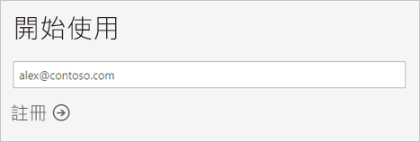
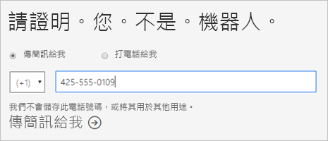
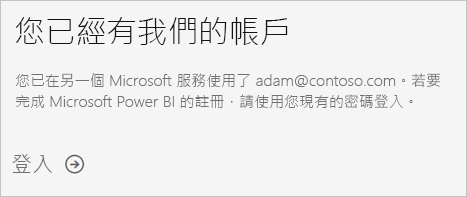
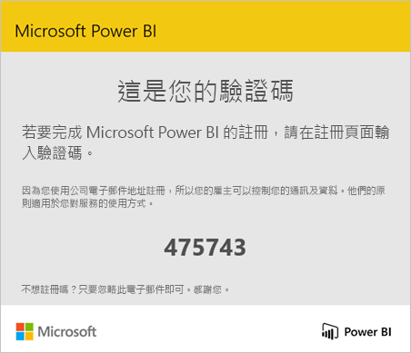
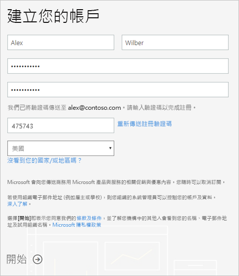
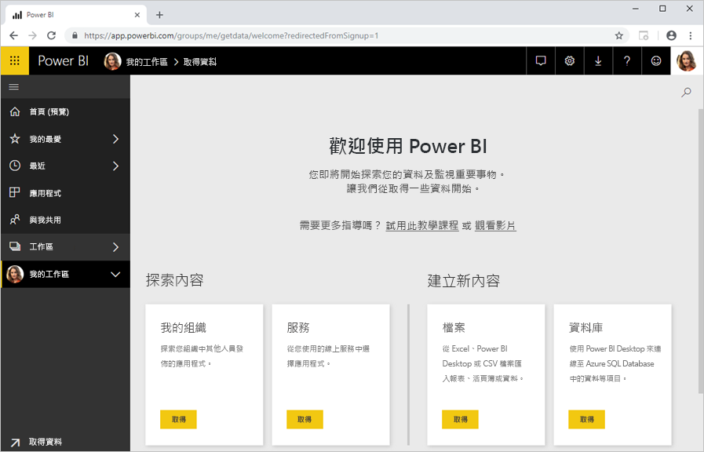

# 以個人身分註冊 Power BI

Power BI 可以是您的個人報告和視覺效果工具，也可以當作群組專案、部門或整個公司的分析和決策引擎。 本文說明如何以個人身分註冊 Power BI 試用版。 如果您是 Power BI 系統管理員，請參閱[組織中的 Power BI 授權](service-admin-licensing-organization.md)。

## 支援的電子郵件地址

在開始註冊程序之前，請務必了解您可在 Power BI 中使用的電子郵件地址類型：

* Power BI 會要求您使用公司或學校的電子郵件地址來註冊。 您無法使用消費者電子郵件服務或電信商提供的電子郵件地址進行註冊。 其中包括 outlook.com、hotmail.com、gmail.com 等等。

* 登入之後，您可以[邀請來賓使用者](https://docs.microsoft.com/azure/active-directory/active-directory-b2b-what-is-azure-ad-b2b)，使用任何電子郵件地址 (包括個人帳戶) 查看您的 Power BI 內容。

* 您可以使用 .gov 或 .mil 地址註冊 Power BI ，但這需要不同的程序。 如需詳細資訊，請參閱[在 Power BI 服務中註冊美國政府組織](service-govus-signup.md)。

## 註冊試用版

請遵循下列步驟來註冊 Power BI Pro 試用版。 若要了解此試用版到期時的選項，請參閱下一節：[試用版到期](#trial-expiration)。

1. 移至 Power BI 中的[註冊頁面](https://app.powerbi.com/signupredirect?pbi_source=web)。

1. 輸入您的電子郵件地址，然後選取 [註冊]。

    

1. 如果您收到類似下列內容的訊息時，請選擇此選項以接收驗證碼，然後繼續此程序的下一個步驟。

    

    如果您收到類似下列內容的訊息，請完成步驟來登入並使用 Power BI。

    

1. 輸入您收到的代碼，然後選取 [註冊]。

    

1. 檢查您的電子郵件是否有如下所示的訊息。

    

1. 在下一個畫面中，輸入您的資訊和電子郵件中的驗證碼。 選取區域，並檢閱從此畫面連結的原則，然後選取 [啟動]。

    

1. 接著帶您前往 https://app.powerbi.com，您就可以開始使用 Power BI。

    

## 試用版到期

當 Power BI Pro 試用版到期時，您的授權會變更為 Power BI (免費) 授權。 當發生這種情況時，您無法再存取需要 Power BI Pro 授權的功能。 如需詳細資訊，請參閱[依授權類型排列的功能](service-features-license-type.md)。

如果 Power BI (免費) 授權已足夠，則不需要執行任何動作。 如果您想要利用 Power BI Pro 的功能，請連絡您的 IT 系統管理員以取得購買 Power BI Pro 授權的相關資訊。

## 針對註冊程序進行疑難排解

在大部分情況下，您可以依照先前所述的程序來註冊 Power BI。 也就是說，有些問題可能會讓您無法註冊。 我們將在下表中討論這些問題和因應措施。

|                                                                                                                                                                                                                          **徵兆 / 錯誤訊息**                                                                                                                                                                                                                           |                                                                                                                                                                                                                                                                                                                                                **原因和因應措施**                                                                                                                                                                                                                                                                                                                                                |
|--------------------------------------------------------------------------------------------------------------------------------------------------------------------------------------------------------------------------------------------------------------------------------------------------------------------------------------------------------------------------------------------------------------------------------------------------------------------------------|------------------------------------------------------------------------------------------------------------------------------------------------------------------------------------------------------------------------------------------------------------------------------------------------------------------------------------------------------------------------------------------------------------------------------------------------------------------------------------------------------------------------------------------------------------------------------------------------------------------------------------------------------------------------------------------------------------------------|
| <strong>個人電子郵件地址 (例如 nancy@gmail.com)</strong> 您在註冊期間接收的訊息如下︰    *您輸入的地址為個人電子郵件地址：請輸入您的公司電子郵件地址，讓我們可以安全地儲存貴公司的資料。*    或    *這似乎是個人電子郵件地址。請輸入您的公司地址，以便我們可以將您與公司內的其他人連接。而且別擔心。我們不會向任何人洩漏您的地址。* |                          Power BI 不支援消費者電子郵件服務或電信提供者所提供的電子郵件地址。    若要完成註冊，請嘗試再次使用公司或學校指派給您的電子郵件地址。    如果您仍然無法註冊，但是可以完成更進階的安裝程序，您可以[註冊新的 Office 365 試用訂閱和使用該電子郵件地址來註冊](service-admin-signing-up-for-power-bi-with-a-new-office-365-trial.md)。    您也可以讓現有使用者[邀請您作為來賓](service-admin-azure-ad-b2b.md)。                           |
|            **自助式註冊已停用** 您在註冊期間接收的訊息如下︰    *我們無法完成您的註冊。您的 IT 部門已經關閉 Microsoft Power BI 註冊。請與他們連絡來完成註冊。*    或    *這似乎是個人電子郵件地址。請輸入您的公司地址，以便我們可以將您與公司內的其他人連接。而且別擔心。我們不會向任何人洩漏您的地址。*             |                             貴組織的 IT 系統管理員已停用 Power BI 的自助式註冊。    若要完成註冊，請連絡您的 IT 系統管理員並要求他們[遵循指示來啟用註冊](service-admin-licensing-organization.md#enable-or-disable-individual-user-sign-up-in-azure-active-directory)。    如果您[透過合作夥伴註冊 Office 365](service-admin-syndication-partner.md)，可能也會遇到這個問題。 |
|                                                                                          **電子郵件地址不是 Office 365 ID** 您在註冊期間接收的訊息如下︰    *我們在 contoso.com 找不到您。您在公司或學校使用不同的 ID 嗎？  請嘗試以該 ID 登入，如果沒有作用，請連絡您的 IT 部門。*                                                                                           | 貴組織用來登入 Office 365 和其他 Microsoft 服務的 ID 與您的電子郵件地址不同。  例如，您的電子郵件地址可能是 Nancy.Smith@contoso.com，但您的 ID 是 nancys@contoso.com。    若要完成註冊，請使用貴組織指派給您、用於登入 Office 365 或其他 Microsoft 服務的 ID。  如果您不知道這個 ID 是什麼，請連絡您的 IT 系統管理員。    如果您仍然無法註冊，但是可以完成更進階的安裝程序，您可以[註冊新的 Office 365 試用訂閱和使用該電子郵件地址來註冊](service-admin-signing-up-for-power-bi-with-a-new-office-365-trial.md)。 |
|  |  |

## 後續步驟

[購買 Power BI Pro](service-admin-purchasing-power-bi-pro.md)  
[個人使用者適用的 Power BI 服務合約](https://powerbi.microsoft.com/terms-of-service/)  

有其他問題嗎？ [嘗試在 Power BI 社群提問](http://community.powerbi.com/)