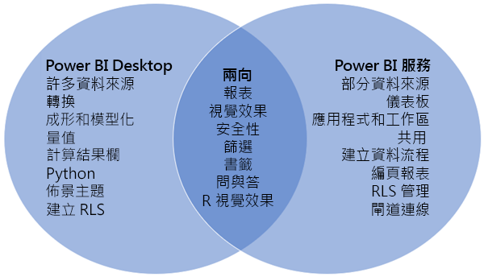
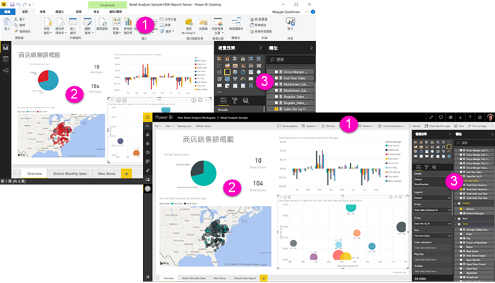

# Power BI Desktop 與 Power BI 服務的比較

在比較 Power BI Desktop 與 Power BI 服務的文氏圖表中，中間區域顯示兩者重疊的情形。 您可以在 Power BI Desktop 或服務中執行某些工作。 文氏圖表兩側顯示應用程式和服務的唯一功能。  

**Power BI Desktop** 是您在本機電腦上為免費應用程式安裝的完整資料分析和報表建立工具。 其中包含查詢編輯器，您可以在其中連接到許多不同的資料來源，並將它們合併 (通常稱為「模型化」) 成為一個資料模型。 然後，您可以根據該資料模型來設計報表。 [Power BI Desktop 使用者入門指南](desktop-getting-started.md)會逐步介紹此程序。

**Power BI 服務**是雲端式服務。 它支援小組與組織的輕量型報表編輯和共同作業。 您也可以連線到 Power BI 服務中的資料來源，但模型化會受到限制。 

大部分商業智慧專案的報表設計師都使用 **Power BI Desktop** 來建立報表，然後使用 **Power BI 服務**將其報表散發給其他人。

## 報表編輯

在應用程式和服務中，您可以建置和編輯「報表」  。 報表可以有一或多個頁面，以及視覺效果與視覺效果的集合。 您可以新增書籤、按鈕、篩選和鑽研，以增強您報表中的導覽。

Power BI Desktop 和服務中的報表編輯器很類似。 它們由三個區段組成：  

1. 上方導覽列，在 Power BI Desktop 和服務中不同    
2. 報表畫布     
3. [欄位]  、[視覺效果]  和 [篩選]  窗格

這段影片中顯示 Power BI Desktop 中的報表編輯器。 

<iframe width="560" height="315" src="https://www.youtube.com/embed/IkJda4O7oGs" frameborder="0" allowfullscreen></iframe>

## Power BI 服務中的作業

### 共同作業

建立報表之後，您可以將它們儲存到 [Power BI 服務]  中的「工作區」  ，您和同事可以在該處共同作業。 您在那些報表之上建置「儀表板」  。 然後，您可以與組織內外的報表取用者共用這些儀表板和報表。 報表取用者會在 Power BI 服務的「讀取檢視」  而非「編輯檢視」中檢視它們。 他們無法存取報表建立者可用的所有功能。  您也可以共用資料集，並讓其他人從中建置自己的報表。 深入了解 [Power BI 服務中的共同作業](service-new-workspaces.md)。

### 使用資料流程的自助資料準備

資料流程可協助組織整合來自不同來源的資料，並為模型化做好準備。 分析師可以使用熟悉的自助工具，輕鬆地建立資料流程。 分析師可以使用資料流程，藉由定義資料來源連接、ETL 邏輯、重新整理排程及更多項目，來內嵌、轉換、整合及擴充巨量資料。 深入了解[使用資料流程的自助資料準備](service-dataflows-overview.md)。

## 後續步驟

[Power BI Desktop 是什麼？](desktop-what-is-desktop.md)

在 Power BI 服務中[建立報表](service-report-create-new.md)

[報表設計師的基本概念](service-basic-concepts.md)

有其他問題嗎？ [試試 Power BI 社群](http://community.powerbi.com/)

