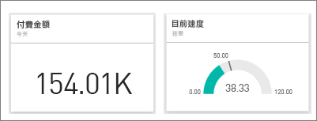
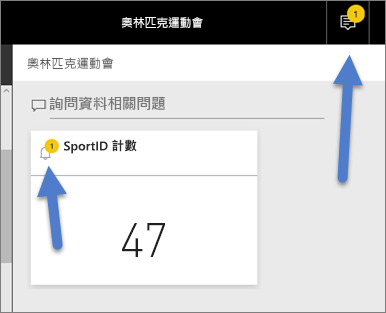
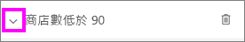

# Power BI 服務中的資料警示
設定警示，以在儀表板中的資料變更時超出您所設定的限制時通知您。 

如果您擁有 Power BI Pro 授權，或已從 [Premium容量](service-premium-what-is.md)與您共用儀表板，則可以設定圖格的警示。 只可在從報告視覺效果釘選的圖格上，為量測計、KPI 和卡片設定警示。 可以對從報表釘選到儀表板的串流資料集上所建立的視覺效果，設定警示，但不可對使用 [新增磚]   >  [自訂串流資料]  直接於儀表板上建立的串流磚，設定警示。 

即使將儀表板分享給他人共用，仍只有您才能查看您所設定的警示。 資料警示會在平台之間完全同步處理；請在 [ Power BI 行動裝置應用程式](consumer/mobile/mobile-set-data-alerts-in-the-mobile-apps.md)和 Power BI 服務中設定和檢視資料警示。 其不適用於 Power BI Desktop。 警示還可以[透過 Microsoft Flow 進行自動化及整合](https://flow.microsoft.com) - [動手試試看](service-flow-integration.md)。

> [!WARNING]
> 資料驅動的警示通知會提供資料的相關資訊。 如果您在行動裝置上檢視 Power BI 資料，而該裝置遭竊，建議您使用 Power BI 服務關閉所有資料驅動的警示規則。
> 
> 

## 在 Power BI 服務中設定資料警示
觀看 Amanda 在她的儀表板上將某些警示新增至磚。 然後遵循影片下方的逐步指示親自試試看。

<iframe width="560" height="315" src="https://www.youtube.com/embed/JbL2-HJ8clE" frameborder="0" allowfullscreen></iframe>

此範例使用零售版 Analysis 範例儀表板。

1. 啟動儀表板。 選取儀表板量測計、KPI 或卡片磚中的省略符號。
   
   ![[商店數總計] 磚](media/service-set-data-alerts/powerbi-card.png)
2. 選取鈴鐺圖示 ，以為 [商店數總計]  新增一或多個警示。
   
1. 若要開始，請選取 [+ 新增警示規則]  ，確定已將滑桿設為 [開啟]  ，並為您的警示提供標題。 磚可幫助您輕鬆地辨識警示。
   
   ![[管理警示] 視窗](media/service-set-data-alerts/powerbi-alert-title.png)
4. 向下捲動並輸入警示的詳細資料。  在此範例中，我們要建立警示，在商店數總計超過 100 家時通知我們。 警示會出現在我們的通知中心內。 我們也同樣設定讓 Power BI 傳送電子郵件給我們。
   
   ![在 [管理警示] 視窗中設定 [臨界值]](media/service-set-data-alerts/power-bi-set-alert-details.png)
5. 選取 [儲存]  。

## 接收警示
當正在追蹤的資料達到您所設定的其中一個臨界值時，會出現一些連鎖反應。 首先，Power BI 會檢查自傳送上個警示之後的經過時間，是否已超過 1 小時或 24 小時 (取決於您選取的選項)。 只要資料超過臨界值，您就會收到警示。

接下來，Power BI 會傳送警示到您的通知中心，並選擇性寄送電子郵件。 每個警示都包含資料的直接連結。 選取連結可以查看相關的磚，您可以在其中探索、共用以及深入了解。  

1. 您如有設定傳送電子郵件警示，將會在收件匣中看到類似如下所述的狀況。
   
   
2. Power BI 會在您的**通知中心**新增一則訊息，並將新的警示圖示加入適用的磚 。
   
   
3. 若要查看警示詳細資料，請開啟您的通知中心。
   
    
   
   > [!NOTE]
   > 警示只對重新整理的資料有作用。 當資料重新整理時，Power BI 會檢查該資料有無設定警示。 若資料已達警示臨界值，便會觸發警示。
   > 
   > 

## 管理警示
有許多方式可以管理您的警示：從儀表板的圖格本身、從 Power BI 的 [設定] 功能表、在 [iPhone 的 Power BI 行動裝置應用程式](consumer/mobile/mobile-set-data-alerts-in-the-mobile-apps.md)或 [Windows 10 的 Power BI 行動裝置應用程式](consumer/mobile/mobile-set-data-alerts-in-the-mobile-apps.md)個別的圖格上。

### 從磚本身
1. 當您需要變更或移除磚的警示時，請選取鈴鐺圖示 ，以重新開啟 [管理警示]  視窗。 您為該磚設定的所有警示皆會顯示。
   
    ![[管理警示] 視窗](media/service-set-data-alerts/powerbi-see-alerts.png).
2. 若要修改警示，請選取警示名稱左側的箭號。
   
    .
3. 若要刪除警示，請選取警示名稱右側的垃圾桶。
   
      

### 從 Power BI 的 [設定] 功能表
1. 從 Power BI 功能表列選取齒輪圖示。
   
    .
2. 選取 [設定]  下的 [警示]  。
   
    ![[設定] 視窗的 [警示] 索引標籤](media/service-set-data-alerts/powerbi-alert-settings.png)
3. 您可以在此處開啟及關閉警示、開啟 [管理警示]  視窗執行變更，或是刪除警示。

## 提示與疑難排解
* 目前警示對於具有日期/時間量值的 Bing 磚或卡片磚無效。
* 警示只適用於數值資料類型。
* 警示只對重新整理的資料有作用。 警示對靜態資料毫無作用。
* 如果已建置了 KPI/卡片/量測計報表視覺效果，然後又將該視覺效果釘選至儀表板，則警示只會對串流資料集產生作用。

## 後續步驟
[建立包含資料警示的 Microsoft Flow](service-flow-integration.md)    
[在行動裝置上設定資料警示](consumer/mobile/mobile-set-data-alerts-in-the-mobile-apps.md)    
[Power BI 是什麼？](power-bi-overview.md)    
有其他問題嗎？ [嘗試在 Power BI 社群提問](http://community.powerbi.com/)

